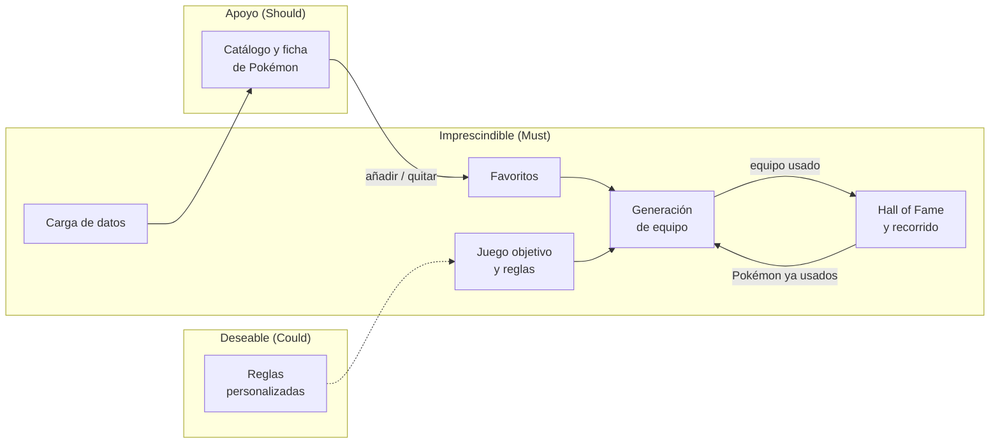

# Documento de Diseño Funcional (DDF)

Describe **qué** hace la aplicación, sin entrar en **cómo** se implementa (eso corresponde al
[DDT](../02-ddt/index.md)). Es la fuente de verdad de los requisitos funcionales (**RF-XX**) y de
las reglas de negocio (**RN-XX**).

| Versión | Fecha | Cambios |
|---------|-------|---------|
| 0.1 | 2026-10-02 | Versión inicial: alcance, requisitos RF-01 a RF-14 y reglas RN-01 a RN-10. |
| 0.2 | 2026-10-03 | Catálogo de reglas de la primera versión (RN-11 a RN-17, en borrador). El *Hall of Fame* pasa a Must por el recorrido (RN-16). RN-08 y RN-10 se amplían. |

## Propósito

Ayudar a elegir un equipo de 6 Pokémon con el que completar un juego concreto. El usuario
indica qué Pokémon le gustan y con qué criterios quiere elegir, y la aplicación propone el
equipo que mejor cumple esos criterios.

## Alcance

**Dentro del alcance**:

- Mantener una lista de Pokémon favoritos, que son los candidatos a formar el equipo.
- Configurar el juego objetivo y las reglas de elección.
- Generar un equipo de 6 a partir de los favoritos, el juego y las reglas. Si no es posible,
  mostrar un equipo incompleto con sugerencias para completarlo.
- Consultar el catálogo de Pokémon y la ficha básica de cada uno.
- Cargar y actualizar los datos de los Pokémon desde fuentes externas.
- Registrar los equipos con los que se ha completado un juego (*Hall of Fame*).

**Fuera del alcance** (por ahora):

- Combate competitivo: equipos para formatos de Showdown, EV/IV, objetos o estrategias.
- Varios usuarios, cuentas o autenticación: la aplicación es personal y de un solo usuario.
- Juegos que no sean de la saga principal (spin-offs, Pokémon GO, TCG…).

**Fuera del alcance de este documento**:

- Cómo se implementa la búsqueda del mejor equipo y qué datos se guardan de cada Pokémon y
  juego. Se tratan en el [DDT](../02-ddt/index.md).

## Actores

| Actor | Descripción |
|-------|-------------|
| Usuario | Persona que usa la aplicación: gestiona favoritos y reglas, genera equipos y registra su *Hall of Fame*. |
| Administrador | El mismo usuario cuando carga o actualiza los datos. Se separa porque es una tarea técnica y poco frecuente. |

## Visión general

## Glosario

Especie
:   Pokémon identificado por su número de la Pokédex nacional (p. ej., Bulbasaur, #0001).

Forma
:   Variante de una especie con datos propios: formas regionales (Vulpix de Alola), megaevoluciones,
    etc. Solo las formas regionales cuentan como Pokémon distintos ([RN-05](reglas-negocio.md#rn-05)).

Forma regional
:   Variante de una especie propia de una región (Alola, Galar, Hisui, Paldea), con otro tipo y
    otras estadísticas. A todos los efectos es un Pokémon distinto
    ([RN-05](reglas-negocio.md#rn-05)).

Línea evolutiva
:   Conjunto de especies relacionadas por evolución (Bulbasaur → Ivysaur → Venusaur).

Mecanismo de evolución
:   Condición para evolucionar: subir de nivel, usar una piedra, intercambio, amistad, etc.
    Puede cambiar de un juego a otro ([RN-10](reglas-negocio.md#rn-10)).

Evolución tediosa
:   Evolución que exige algo más que subir de nivel, usar un objeto o tener amistad:
    intercambio, belleza, un lugar concreto, la hora del día, etc. Penaliza, pero no descarta
    ([RN-15](reglas-negocio.md#rn-15)).

Tipo primario
:   Primer tipo de un Pokémon con dos tipos, o su único tipo. Por ejemplo, Dragonite es
    Dragón/Volador: su tipo primario es Dragón ([RN-13](reglas-negocio.md#rn-13)).

Legendario y singular
:   Pokémon especiales según la clasificación oficial, como Mewtwo (legendario) o Mew
    (singular). Los pseudolegendarios, como Dragonite, no lo son ([RN-11](reglas-negocio.md#rn-11)).

Generación
:   Etapa de la saga principal que agrupa varios juegos. Los Pokémon de una generación son los
    que aparecen en alguno de sus juegos (p. ej., la 1.ª generación incluye Rojo, Azul y
    Amarillo, con 151 Pokémon).

Juego objetivo
:   Juego de la saga principal que se quiere completar (p. ej., Pokémon Amarillo). Pertenece a
    una generación. Ambos determinan los candidatos ([RN-03](reglas-negocio.md#rn-03)).

Completar un juego
:   Vencer al Campeón de la Liga Pokémon y entrar en el *Hall of Fame* del juego.

Favoritos
:   Lista única de Pokémon que el usuario considera elegibles para formar el equipo, común a
    todos los juegos. Cada favorito es una forma concreta y la evolución hasta la que se quiere
    llegar; las preevoluciones van implícitas ([RN-09](reglas-negocio.md#rn-09)).

Existir en un juego
:   Un Pokémon existe en un juego si se puede tener en él, aunque no se pueda atrapar allí
    (p. ej., porque se consigue por intercambio, evolución o transferencia).

Candidatos
:   Favoritos que existen en la generación y en el juego objetivo.

Candidatos válidos
:   Candidatos que además pasan el resto de filtros por candidato (legendarios, recorrido).
    Entre ellos se elige el equipo.

Combate clave
:   Combate obligatorio que marca la dificultad de un juego: líderes de gimnasio o sus
    equivalentes, Alto Mando, Campeón y jefes del equipo malvado
    ([RN-17](reglas-negocio.md#rn-17)).

Catálogo de reglas
:   Conjunto de reglas predefinidas en la aplicación. El usuario las configura, pero no crea
    reglas nuevas ([RF-14](requisitos-funcionales.md#rf-14)).

Regla dura
:   Condición obligatoria. Un candidato o equipo que no la cumple se descarta. Las de
    **presencia** obligan a incluir un Pokémon con ciertas características.

Regla blanda
:   Criterio que puntúa a un equipo. Cada regla blanda tiene un peso configurable.

Hall of Fame
:   Registro de los equipos con los que el usuario ha completado un juego.

Recorrido
:   Los juegos completados por el usuario, en el orden en que los completó, con su equipo.
    Determina qué Pokémon quedan excluidos en el siguiente juego
    ([RN-16](reglas-negocio.md#rn-16)).

## Contenido

- [Requisitos funcionales](requisitos-funcionales.md) (**RF-XX**).
- [Reglas de negocio](reglas-negocio.md) (**RN-XX**).
- [Cuestiones funcionales](cuestiones-abiertas.md) (**CA-XX**): decisiones abiertas, tomadas
  y aplazadas.

## Convenciones

- Los identificadores `RF-XX`, `RN-XX` y `CA-XX` son estables: no se reutilizan aunque el
  elemento se elimine. Si se elimina, se marca como *Retirado* en lugar de borrarlo.
- Prioridad de los requisitos según MoSCoW:
    - **Must**: imprescindible.
    - **Should**: importante.
    - **Could**: deseable.
    - **Won't**: descartado por ahora.
- Estado de las reglas de negocio: **Borrador**, **Vigente** o **Retirado**.
- Cada regla se cita en los tests que la verifican (`@pytest.mark.rn("RN-XX")`) y en los
  issues, PR y commits que la implementan o modifican.
