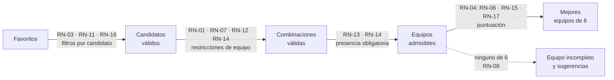

# Reglas de negocio

Cada regla tiene un identificador `RN-XX` estable que se cita en tests
(`@pytest.mark.rn("RN-XX")`), issues, PR y commits.

La aplicación trabaja con un **catálogo de reglas predefinido y estático**: el usuario activa o
desactiva las reglas y ajusta los pesos de las blandas, pero no crea reglas nuevas ni cambia sus
parámetros ([RF-14](requisitos-funcionales.md#rf-14)). Una regla nueva se documenta aquí antes
de implementarla.

## Catálogo

| ID | Regla | Tipo | Configurable | Estado |
|----|-------|------|--------------|--------|
| [RN-01](#rn-01) | El equipo tiene 6 Pokémon | Dura | No | Vigente |
| [RN-02](#rn-02) | Solo se eligen Pokémon favoritos | Dura | No | Vigente |
| [RN-03](#rn-03) | Solo se eligen Pokémon de la generación y del juego objetivo | Dura | No | Vigente |
| [RN-04](#rn-04) | Se eligen los equipos con mayor puntuación ponderada | Mecanismo | Pesos | Vigente |
| [RN-05](#rn-05) | Cada forma regional es un Pokémon distinto | Dura | No | Vigente |
| [RN-06](#rn-06) | Penalizar varias formas de la misma especie | Blanda | Activable y peso | Vigente |
| [RN-07](#rn-07) | Sin líneas evolutivas repetidas | Dura | Activable | Vigente |
| [RN-08](#rn-08) | Equipo incompleto y sugerencias cuando no se llega a 6 | Mecanismo | No | Vigente |
| [RN-09](#rn-09) | Cada favorito marca hasta qué evolución se quiere llegar | Dura | No | Vigente |
| [RN-10](#rn-10) | Se usan los datos tal como son en el juego objetivo | Mecanismo | No | Vigente |
| [RN-11](#rn-11) | Sin legendarios ni singulares | Dura | Activable | Borrador |
| [RN-12](#rn-12) | Sin tipos repetidos en el equipo | Dura | Activable | Borrador |
| [RN-13](#rn-13) | Dragonite obligatorio o, si no, un Pokémon de tipo primario Dragón | Dura (presencia) | Activable | Borrador |
| [RN-14](#rn-14) | Una evolución de Eevee obligatoria, y solo una | Dura (presencia) | Activable | Borrador |
| [RN-15](#rn-15) | Penalizar evoluciones tediosas | Blanda | Activable y peso | Borrador |
| [RN-16](#rn-16) | Excluir Pokémon ya usados según el recorrido | Dura | Activable | Borrador |
| [RN-17](#rn-17) | Primar los tipos más eficaces frente a los combates clave del juego | Blanda | Activable y peso | Borrador |

Estados posibles:

- **Borrador**: pendiente de validar.
- **Vigente**: validada.
- **Retirado**: ya no se aplica.

Las reglas duras son de dos clases:

- **De exclusión**: descartan candidatos o combinaciones de candidatos (p. ej.,
  [RN-11](#rn-11) o [RN-12](#rn-12)).
- **De presencia**: obligan a que el equipo incluya un Pokémon con ciertas características
  ([RN-13](#rn-13), [RN-14](#rn-14)). Tienen prioridad sobre el tamaño del equipo: antes que
  un equipo de 6 que no las cumpla, se muestra un equipo incompleto que sí las cumple
  ([RN-08](#rn-08)).

## Proceso de generación

Las reglas se aplican en este orden:

1. Se parte de la lista de favoritos ([RN-02](#rn-02)). Cada favorito es la evolución hasta la
   que se quiere llegar ([RN-09](#rn-09)).
2. **Filtros por candidato**. Se descartan los favoritos que:
    1. No existen en la generación ni en el juego objetivo ([RN-03](#rn-03)).
    2. Son legendarios o singulares ([RN-11](#rn-11)).
    3. Están excluidos por el recorrido del usuario ([RN-16](#rn-16)).

    Los que quedan son los **candidatos válidos**. Cada descarte guarda su motivo
    ([RF-10](requisitos-funcionales.md#rf-10)).
3. **Restricciones de equipo**. Solo se forman equipos de como máximo 6 miembros
   ([RN-01](#rn-01)) que cumplen las reglas de exclusión entre miembros: sin líneas evolutivas
   repetidas ([RN-07](#rn-07)), sin tipos repetidos ([RN-12](#rn-12)) y con una sola evolución
   de Eevee ([RN-14](#rn-14)).
4. **Presencia obligatoria**. De esos equipos, solo valen los que cumplen las reglas de
   presencia activas ([RN-13](#rn-13), [RN-14](#rn-14)).
5. **Puntuación**. Entre los equipos de 6 que cumplen todo lo anterior, se eligen los de mayor
   puntuación ([RN-04](#rn-04)) según las reglas blandas activas ([RN-06](#rn-06),
   [RN-15](#rn-15), [RN-17](#rn-17)). Los tipos, la tabla de eficacias y los métodos de
   evolución son los del juego objetivo ([RN-10](#rn-10)).
6. Si no hay ningún equipo de 6, se explica el motivo y se muestra el equipo incompleto más
   grande con sugerencias para completarlo ([RN-08](#rn-08)).

## Reglas estructurales

Siempre están activas.

### RN-01 · El equipo tiene 6 Pokémon { #rn-01 }

- **Tipo**: dura
- **Descripción**: el equipo generado tiene exactamente 6 Pokémon. Si no se puede formar, se
  aplica [RN-08](#rn-08).

### RN-02 · Solo se eligen Pokémon favoritos { #rn-02 }

- **Tipo**: dura
- **Descripción**: todos los miembros del equipo pertenecen a la lista de favoritos del usuario.
  Solo hay una lista de favoritos, común a todos los juegos.
- **Excepción**: cuando el equipo no se puede completar, [RN-08](#rn-08) sugiere Pokémon que no
  son favoritos. Se muestran como sugerencias, no como miembros del equipo.

### RN-03 · Solo se eligen Pokémon de la generación y del juego objetivo { #rn-03 }

- **Tipo**: dura
- **Descripción**: es el primer filtro sobre los favoritos y se aplica en dos niveles:
    1. **Generación**: solo pasan los Pokémon que aparecen en alguno de los juegos de la
       generación del juego objetivo.
    2. **Juego**: de ellos, solo pasan los que existen en el juego objetivo. Un Pokémon existe
       en un juego si se puede tener en él, aunque no se pueda atrapar allí y haya que
       conseguirlo por intercambio, evolución o transferencia.
- **Ejemplos**:
    - Si el juego objetivo es Pokémon Amarillo (1.ª generación), Koffing es candidato. No se
      puede atrapar en Amarillo, pero existe en el juego. Chikorita no es candidato, porque
      aparece en la 2.ª generación.
    - Si el juego objetivo es Pokémon Espada (8.ª generación), Growlithe de Hisui no es
      candidato. Pasa el filtro de generación, porque aparece en Leyendas Pokémon: Arceus,
      pero no existe en Espada.
    - La disponibilidad se mira por forma y por la evolución que figura en favoritos
      ([RN-09](#rn-09)). Si Marowak de Alola no se puede conseguir en el juego objetivo, se
      descarta aunque Cubone sí esté disponible. Que su preevolución esté disponible no basta.
- **Nota**: el nivel de juego ya implica el de generación. Los dos niveles se mantienen porque
  permiten explicar mejor por qué se descarta un Pokémon ([RF-10](requisitos-funcionales.md#rf-10)).

### RN-05 · Cada forma regional es un Pokémon distinto { #rn-05 }

- **Tipo**: dura
- **Descripción**: una forma regional y la forma original son Pokémon distintos a todos los
  efectos: en el catálogo, en favoritos y en la generación del equipo. El algoritmo nunca
  sustituye una forma por otra. Para querer una forma concreta, hay que añadirla a favoritos
  con su nombre completo, p. ej., «Marowak de Alola» o «Raichu de Alola».
- **Formas que no se tienen en cuenta**: las que cambian de forma dinámica dentro del juego,
  como las megaevoluciones, Gigamax o los cambios de forma de Rotom o Deoxys. Se usa siempre la
  forma base.
- **Ejemplos**:
    - Si en favoritos está Vulpix, no se puede recomendar Vulpix de Alola, aunque esté
      disponible.
    - Si en favoritos está Zigzagoon de Galar, no se puede recomendar Zigzagoon.
    - Si en favoritos está Marowak de Alola, solo es candidato cuando esa forma concreta existe
      en el juego objetivo ([RN-03](#rn-03)).

### RN-09 · Cada favorito marca hasta qué evolución se quiere llegar { #rn-09 }

- **Tipo**: dura
- **Descripción**: en favoritos no se añade una línea evolutiva entera, sino la evolución hasta
  la que se quiere llegar. Esa evolución es la que se evalúa para formar el equipo:
    - Las **preevoluciones** van implícitas. Se entiende que formarán parte del equipo mientras
      se llega a la evolución indicada, así que no hace falta añadirlas.
    - Las **evoluciones posteriores** nunca se proponen, salvo que también estén en favoritos.
- **Ejemplos**:
    - El usuario añade Butterfree, no Caterpie ni Metapod. Caterpie y Metapod se dan por
      incluidos hasta llegar a Butterfree, que es el Pokémon que se evalúa.
    - El usuario añade Rhydon, pero no Rhyperior. El equipo puede incluir a Rhydon, evaluado con
      sus propios datos, pero nunca a Rhyperior.
- **Nota**: varios favoritos de la misma línea evolutiva se combinan según [RN-07](#rn-07),
  [RN-12](#rn-12) y [RN-14](#rn-14) ([CA-16](cuestiones-abiertas.md#resueltas)).

## Reglas configurables

El usuario las activa o desactiva y ajusta los pesos de las blandas
([RF-06](requisitos-funcionales.md#rf-06), [RF-07](requisitos-funcionales.md#rf-07)). Sus
parámetros son fijos.

### RN-06 · Penalizar varias formas de la misma especie { #rn-06 }

- **Tipo**: blanda
- **Descripción**: puntúa en contra que el equipo incluya varias formas de la misma especie,
  como Vulpix y Vulpix de Alola. No las descarta, porque las formas suelen tener tipos
  distintos y pueden aportar al equipo. Por eso se recomienda darle un peso pequeño.
- **Puntuación**: 1 si no hay dos miembros de la misma especie; 0 en caso contrario.
- **Nota**: el equipo nunca contiene dos veces el mismo Pokémon, porque se forma con favoritos
  distintos ([RN-02](#rn-02)).

### RN-07 · Sin líneas evolutivas repetidas { #rn-07 }

- **Tipo**: dura, activable
- **Descripción**: si está activa, el equipo no puede incluir dos miembros de la misma línea
  evolutiva. Por ejemplo, Jolteon y Vaporeon, o Rhydon y Rhyperior.

### RN-11 · Sin legendarios ni singulares { #rn-11 }

- **Tipo**: dura, activable
- **Descripción**: si está activa, se descartan los Pokémon legendarios y singulares (también
  llamados míticos), como Mewtwo, Lugia o Mew.
- **Ejemplos**:
    - Zapdos y Mew no son candidatos.
    - Dragonite sí lo es: es un pseudolegendario, no un legendario.
- **Nota**: qué Pokémon cuentan como legendarios o singulares está pendiente de
  [CA-22](cuestiones-abiertas.md#abiertas).

### RN-12 · Sin tipos repetidos en el equipo { #rn-12 }

- **Tipo**: dura, activable
- **Descripción**: si está activa, ningún tipo aparece en más de un miembro del equipo, ni como
  tipo primario ni como secundario. Cada tipo del juego objetivo se usa como mucho una vez.
- **Ejemplos**:
    - Charizard (Fuego/Volador) y Pidgeot (Normal/Volador) no pueden estar juntos, porque
      comparten el tipo Volador.
    - Gengar (Fantasma/Veneno) y Nidoking (Veneno/Tierra) no pueden estar juntos, porque
      comparten el tipo Veneno.
    - Vaporeon (Agua) y Jolteon (Eléctrico) no comparten tipo. Si no pueden estar juntos es por
      [RN-14](#rn-14).
- **Nota**: los tipos son los del juego objetivo ([RN-10](#rn-10)). Por ejemplo, en la 1.ª
  generación Magnemite es solo Eléctrico, así que no ocupa el tipo Acero.

### RN-13 · Dragonite obligatorio o, si no, un Pokémon de tipo primario Dragón { #rn-13 }

- **Tipo**: dura de presencia, activable
- **Descripción**: si está activa, el equipo incluye a Dragonite siempre que sea un candidato
  válido. Si no lo es, el equipo incluye otro candidato válido cuyo **tipo primario** sea
  Dragón en el juego objetivo. Se aplica el primer nivel que se pueda cumplir:
    1. Dragonite es un candidato válido: forma parte del equipo.
    2. Si no, hay algún candidato válido de tipo primario Dragón: uno de ellos forma parte del
       equipo. Cuál se decide por puntuación ([RN-04](#rn-04)).
    3. Si no, hay Pokémon de tipo primario Dragón en el juego objetivo, pero no entre los
       candidatos válidos: se reserva un hueco y se sugieren esos Pokémon ([RN-08](#rn-08)).
    4. Si tampoco hay ninguno en el juego objetivo, la regla no se puede cumplir. Se genera el
       equipo sin ella y se explica el motivo.
- **Prioridad**: si incluir a Dragonite, o a un Pokémon de tipo primario Dragón, impide formar
  un equipo de 6, se muestra el equipo incompleto que lo incluye ([RN-08](#rn-08)) en lugar de
  un equipo de 6 sin él ([CA-19](cuestiones-abiertas.md#resueltas)).
- **Ejemplos**:
    - Con Kingdra (Agua/Dragón) y Garchomp (Dragón/Tierra) como candidatos y sin Dragonite,
      Garchomp cumple la regla y Kingdra no, porque su tipo primario es Agua.
    - Dragonite nunca queda excluido por el recorrido ([RN-16](#rn-16)).
- **Nota**: Dragonite tiene que estar en favoritos para ser candidato ([RN-02](#rn-02)). Ver
  [CA-23](cuestiones-abiertas.md#abiertas).

### RN-14 · Una evolución de Eevee obligatoria, y solo una { #rn-14 }

- **Tipo**: dura de presencia, activable
- **Descripción**: si está activa, el equipo incluye **exactamente una** evolución de Eevee
  (Vaporeon, Jolteon, Flareon, Espeon, Umbreon, Leafeon, Glaceon o Sylveon). En cuanto el
  algoritmo elige una, las demás quedan descartadas para ese equipo. Eevee sin evolucionar no
  cuenta como evolución de Eevee.
- **Niveles**: como en [RN-13](#rn-13):
    1. Hay alguna evolución de Eevee entre los candidatos válidos: una de ellas forma parte del
       equipo. Cuál se decide por puntuación ([RN-04](#rn-04)).
    2. Si no, alguna existe en el juego objetivo: se reserva un hueco y se sugieren
       ([RN-08](#rn-08)).
    3. Si tampoco, la regla no se puede cumplir y se explica el motivo.
- **Prioridad**: igual que en [RN-13](#rn-13), tiene prioridad sobre el tamaño del equipo.
- **Ejemplo**: en Pokémon Amarillo, con Vaporeon, Jolteon y Flareon en favoritos, el equipo
  incluye una sola de ellas: la que dé mayor puntuación al equipo.

### RN-15 · Penalizar evoluciones tediosas { #rn-15 }

- **Tipo**: blanda
- **Descripción**: puntúa en contra los miembros que necesitan una **evolución tediosa** para
  llegar a la evolución de favoritos ([RN-09](#rn-09)). No los descarta. Se revisan todos los
  pasos desde la forma inicial de la línea, con los métodos de evolución del juego objetivo
  ([RN-10](#rn-10)).
- **Métodos tediosos** ([CA-20](cuestiones-abiertas.md#resueltas)):
    - Intercambio, con o sin objeto, o por un Pokémon concreto (Machoke → Machamp, Karrablast
      → Escavalier).
    - Subir una característica de concurso, como la belleza (Feebas → Milotic en la 3.ª y la
      4.ª generación).
    - Subir de nivel en un lugar concreto (Magneton → Magnezone hasta la 7.ª generación).
    - Caminar un número de pasos o hacer acciones repetidas (Pawmo → Pawmot).
    - Comparar estadísticas (Tyrogue → Hitmonlee, Hitmonchan o Hitmontop).
    - Hora del día, con o sin objeto equipado (Sneasel → Weavile).
    - Llevar en el equipo un Pokémon, o un tipo, concreto (Mantyke → Mantine, Pancham →
      Pangoro).
    - Conocer un movimiento que el Pokémon **no** aprende subiendo de nivel, de modo que hay que
      enseñárselo con MT, tutor o recordador (si lo aprende solo por nivel, no es tedioso).
    - Otros requisitos poco habituales: clima, girar la consola, golpes críticos, daño recibido,
      etc.
- **Métodos no tediosos**: subir de nivel, amistad o cariño, usar una piedra u otro objeto, y
  conocer un movimiento que el Pokémon aprende solo subiendo de nivel.
- **Puntuación**: `1 − (miembros con alguna evolución tediosa / miembros del equipo)`.
- **Ejemplos**:
    - Gengar puntúa en contra, porque Haunter evoluciona por intercambio.
    - Raichu no puntúa en contra, porque evoluciona con la Piedra Trueno.
    - Milotic puntúa en contra en Pokémon Esmeralda (belleza), pero en Pokémon Negro evoluciona
      por intercambio con Escama Bella, que también es tedioso.

### RN-16 · Excluir Pokémon ya usados según el recorrido { #rn-16 }

- **Tipo**: dura, activable
- **Descripción**: si está activa, se descartan los Pokémon usados en los equipos del
  **recorrido** del usuario, es decir, de los juegos completados registrados en el *Hall of
  Fame* ([RF-12](requisitos-funcionales.md#rf-12)), en su orden. Para un juego objetivo se
  excluyen los miembros de:
    1. El equipo del **último juego completado**, sea de la generación que sea. El siguiente
       juego que se juega se considera la «generación siguiente», aunque no lo sea por número.
    2. Los equipos de **todos los juegos completados de la misma generación** que el juego
       objetivo. La generación de un juego es la de su lanzamiento: Pokémon Verde Hoja es de la
       3.ª generación, no de la 1.ª.
- **Qué se excluye**: la línea evolutiva del Pokémon usado, en la misma forma
  ([RN-05](#rn-05)), no solo esa evolución concreta ([CA-18](cuestiones-abiertas.md#resueltas)).
  En las líneas que se ramifican, como la de Eevee, solo se excluye la rama del Pokémon usado:
  sus preevoluciones y sus evoluciones posteriores ([CA-21](cuestiones-abiertas.md#abiertas)).
- **Excepción**: Dragonite nunca queda excluido ([RN-13](#rn-13)).
- **Ejemplos** (cada flecha es el siguiente juego completado):
    - Verde Hoja (3.ª) → Rojo Fuego (3.ª): se excluye el equipo de Verde Hoja.
    - Verde Hoja (3.ª) → Platino (4.ª): se excluye el equipo de Verde Hoja.
    - Verde Hoja → Platino → HeartGold (4.ª): se excluye el equipo de Platino, pero no el de
      Verde Hoja.
    - Verde Hoja (3.ª) → Blanco (5.ª) → Esmeralda (3.ª): se excluyen el equipo de Blanco
      (último juego) y el de Verde Hoja (misma generación).
    - Escarlata (9.ª) → Escudo (8.ª): se excluye el equipo de Escarlata.
    - Si en Verde Hoja se usaron Dragonite, Vaporeon, Gengar, Raichu, Charizard y Rhyhorn, en
      Rojo Fuego quedan excluidos Eevee y Vaporeon, la línea de Gastly, la de Pichu, la de
      Charmander y la de Rhyhorn. Dragonite sigue siendo candidato, y también Jolteon, que
      está en otra rama de la línea de Eevee.
- **Nota**: el recorrido es el registrado en el *Hall of Fame*. Si el usuario modifica el
  equipo al registrarlo, cuenta el equipo registrado, no el generado.

### RN-17 · Primar los tipos más eficaces frente a los combates clave del juego { #rn-17 }

- **Tipo**: blanda. Es el criterio principal de puntuación, así que se recomienda darle el peso
  más alto.
- **Descripción**: puntúa a favor que los tipos del equipo sean eficaces frente a los
  **combates clave** del juego objetivo: líderes de gimnasio o sus equivalentes, Alto Mando,
  Campeón y jefes del equipo malvado. Se usan solo los tipos de los miembros y de los Pokémon
  rivales, con la tabla de eficacias del juego objetivo ([RN-10](#rn-10)). No se tienen en
  cuenta movimientos, niveles ni estadísticas.
- **Puntuación** (propuesta, [CA-24](cuestiones-abiertas.md#abiertas)): para cada Pokémon rival
  de los combates clave se miran dos aspectos:
    - **Ataque**: algún miembro del equipo tiene un tipo que es superefectivo (×2 o más) contra
      él.
    - **Defensa**: algún miembro del equipo resiste (×0,5 o menos) al menos uno de los tipos
      del rival y no es débil (×2 o más) a ninguno.

  La puntuación de cada rival es la media de los dos aspectos (0, 0,5 o 1). La de cada combate
  es la media de sus rivales, y la de la regla es la media de todos los combates, de modo que
  cada combate pesa lo mismo.
- **Ejemplo**: en Pokémon Amarillo, contra Brock (Geodude y Onix, Roca/Tierra), un miembro de
  tipo Agua cubre el ataque (×4). Uno de tipo Lucha cubre la defensa: resiste Roca y no es
  débil a Tierra.

## Mecanismos

### RN-04 · Se eligen los equipos con mayor puntuación ponderada { #rn-04 }

- **Tipo**: mecanismo de puntuación
- **Descripción**: cada regla blanda activa da a un equipo una puntuación normalizada entre 0
  y 1, que se multiplica por el peso de la regla. La puntuación del equipo es la suma de esas
  aportaciones. Entre los equipos que cumplen todas las reglas duras, se recomiendan los que
  tienen la puntuación más alta. Si hay empate, se recomiendan todos los empatados.
- **Fórmula**: `P(equipo) = Σ peso(r) · s(r, equipo)` para cada regla blanda activa `r`,
  con `s(r, equipo)` entre 0 y 1.
- **Nota**: la escala de pesos y los valores por defecto están en
  [CA-05](cuestiones-abiertas.md#abiertas).

### RN-08 · Equipo incompleto y sugerencias cuando no se llega a 6 { #rn-08 }

- **Tipo**: mecanismo
- **Descripción**: el equipo se completa siempre con favoritos. Si no se pueden reunir 6
  favoritos que cumplan todas las reglas duras, incluidas las de presencia
  ([RN-13](#rn-13), [RN-14](#rn-14)), la aplicación:
    1. Explica por qué no se llega a 6.
    2. Muestra el **equipo incompleto** con el mayor número posible de favoritos que cumpla
       todas las reglas duras. Las de presencia tienen prioridad sobre el tamaño: si una regla
       de presencia solo se puede cumplir con un Pokémon que no es favorito, se le reserva un
       hueco. Entre los equipos de ese tamaño, se eligen los de mayor puntuación
       ([RN-04](#rn-04)).
    3. Sugiere **Pokémon que no son favoritos** para completar los huecos. Las sugerencias
       existen en el juego objetivo ([RN-03](#rn-03)), cumplen las reglas duras activas junto
       con el equipo incompleto y se ordenan por lo que aportarían a la puntuación. Un hueco
       reservado por una regla de presencia solo admite sugerencias que la cumplan.
- **Ejemplos**:
    - Si solo 4 favoritos son candidatos válidos para Pokémon Amarillo, se muestra el equipo de
      esos 4 y, para los 2 huecos libres, una lista de Pokémon de Amarillo que encajan con las
      reglas activas.
    - Si incluir a Dragonite solo permite un equipo de 5 por [RN-12](#rn-12), se muestra ese
      equipo de 5 con Dragonite y sugerencias para el sexto, aunque sin Dragonite se pudiera
      formar un equipo de 6.

### RN-10 · Se usan los datos tal como son en el juego objetivo { #rn-10 }

- **Tipo**: mecanismo
- **Descripción**: los tipos de cada Pokémon, la tabla de eficacias de tipos y los métodos de
  evolución son los del juego objetivo, no los actuales. Afecta a todas las reglas que usan
  tipos o evoluciones.
- **Ejemplos**:
    - Clefairy es de tipo Normal hasta la 5.ª generación y de tipo Hada desde la 6.ª. En un
      juego de la 1.ª generación se evalúa como Normal.
    - Magnemite es de tipo Eléctrico en la 1.ª generación y Eléctrico/Acero desde la 2.ª.
    - El tipo Hada no existe antes de la 6.ª generación, así que no cuenta para la cobertura.
    - Magneton evoluciona en un lugar concreto hasta la 7.ª generación y con la Piedra Trueno
      desde la 8.ª ([RN-15](#rn-15)).

## Reglas candidatas

Ideas para el catálogo de reglas, aún **sin número**. Cada una recibirá su `RN-XX` cuando se
decida incluirla.

| Idea | Tipo probable | Notas |
|------|---------------|-------|
| Excluir el inicial | Dura (opcional) | |
| Pocas debilidades compartidas | Blanda | Con [RN-12](#rn-12) activa pierde sentido, porque los miembros no comparten tipos. La defensa de [RN-17](#rn-17) cubre parte de la idea. |
| Disponibilidad temprana | Blanda | Choca con [RN-03](#rn-03), que no mira dónde se atrapa cada Pokémon. Habría que descartarla o cargar ese dato aparte. |
| Estadísticas base | Blanda | Suma o media de estadísticas base de la evolución favorita (RN-09). |
