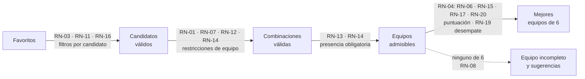

# Reglas de negocio

Cada regla tiene un identificador `RN-XX` estable que se cita en tests
(`@pytest.mark.rn("RN-XX")`), issues, PR y commits.

La aplicación trabaja con un **catálogo de reglas predefinido y estático**: el usuario activa o
desactiva las reglas y ajusta los pesos de las blandas, pero no crea reglas nuevas ni cambia sus
parámetros ([RF-14](requisitos-funcionales.md#rf-14)). Una regla nueva se documenta aquí antes
de implementarla.

Las reglas parten de la [forma de jugar](index.md#forma-de-jugar): el equipo se cría en otro
juego y se transfiere al juego objetivo en su etapa inicial.

## Catálogo

| ID | Regla | Tipo | Configurable | Estado |
|----|-------|------|--------------|--------|
| [RN-01](#rn-01) | El equipo tiene 6 Pokémon | Dura | No | Vigente |
| [RN-02](#rn-02) | Solo se eligen Pokémon favoritos | Dura | No | Vigente |
| [RN-03](#rn-03) | Solo se eligen Pokémon de la generación y del juego objetivo | Dura | No | Vigente |
| [RN-04](#rn-04) | Se eligen los equipos con mayor puntuación ponderada | Mecanismo | Pesos | Vigente |
| [RN-05](#rn-05) | Cada forma regional es un Pokémon distinto | Dura | No | Vigente |
| [RN-06](#rn-06) | Penalizar varias formas de la misma especie | Blanda | Activable y peso | Vigente |
| [RN-07](#rn-07) | Sin líneas evolutivas repetidas | Dura | Activable | Vigente |
| [RN-08](#rn-08) | Equipo incompleto y sugerencias cuando no se llega a 6 | Mecanismo | No | Vigente |
| [RN-09](#rn-09) | Cada favorito marca hasta qué evolución se quiere llegar | Dura | No | Vigente |
| [RN-10](#rn-10) | Se usan los datos tal como son en el juego objetivo | Mecanismo | No | Vigente |
| [RN-11](#rn-11) | Solo Pokémon que se pueden obtener por crianza | Dura | Activable | Vigente |
| [RN-12](#rn-12) | Sin tipos repetidos en el equipo | Dura | Activable | Vigente |
| [RN-13](#rn-13) | Dragonite obligatorio o, si no, un Pokémon de tipo primario Dragón | Dura (presencia) | Activable | Vigente |
| [RN-14](#rn-14) | Una evolución de Eevee obligatoria, y solo una | Dura (presencia) | Activable | Vigente |
| [RN-15](#rn-15) | Penalizar evoluciones tediosas | Blanda | Activable y peso | Vigente |
| [RN-16](#rn-16) | Excluir Pokémon ya usados según el recorrido | Dura | Activable | Vigente |
| [RN-17](#rn-17) | Primar los tipos más eficaces frente a los combates clave del juego | Blanda | Activable y peso | Vigente |
| [RN-18](#rn-18) | Los datos sin verificar los confirma el usuario | Mecanismo | No | Vigente |
| [RN-19](#rn-19) | A igual puntuación, se prefieren los Pokémon con dos tipos | Mecanismo | No | Vigente |
| [RN-20](#rn-20) | Penalizar las evoluciones aleatorias | Blanda | Activable y peso | Vigente |

Estados posibles:

- **Borrador**: pendiente de validar.
- **Vigente**: validada.
- **Retirado**: ya no se aplica.

Las reglas duras son de dos clases:

- **De exclusión**: descartan candidatos o combinaciones de candidatos (p. ej.,
  [RN-11](#rn-11) o [RN-12](#rn-12)).
- **De presencia**: obligan a que el equipo incluya un Pokémon con ciertas características
  ([RN-13](#rn-13), [RN-14](#rn-14)). Tienen prioridad sobre el tamaño del equipo: antes que
  un equipo de 6 que no las cumpla, se muestra un equipo incompleto que sí las cumple
  ([RN-08](#rn-08)).

## Proceso de generación

Antes de empezar, el usuario ha confirmado los datos sin verificar del juego objetivo y de sus
favoritos ([RN-18](#rn-18)). Después, las reglas se aplican en este orden:

1. Se parte de la lista de favoritos ([RN-02](#rn-02)). Cada favorito es la evolución hasta la
   que se quiere llegar ([RN-09](#rn-09)).
2. **Filtros por candidato**. Se descartan los favoritos que:
    1. No existen en la generación ni en el juego objetivo ([RN-03](#rn-03)).
    2. No se pueden obtener por crianza, como los legendarios o los singulares
       ([RN-11](#rn-11)).
    3. Están excluidos por el recorrido del usuario ([RN-16](#rn-16)).

    Los que quedan son los **candidatos válidos**. Cada descarte guarda su motivo
    ([RF-10](requisitos-funcionales.md#rf-10)).
3. **Restricciones de equipo**. Solo se forman equipos de como máximo 6 miembros
   ([RN-01](#rn-01)) que cumplen las reglas de exclusión entre miembros: sin líneas evolutivas
   repetidas ([RN-07](#rn-07)), sin tipos repetidos ([RN-12](#rn-12)) y con una sola evolución
   de Eevee ([RN-14](#rn-14)).
4. **Presencia obligatoria**. De esos equipos, solo valen los que cumplen las reglas de
   presencia activas ([RN-13](#rn-13), [RN-14](#rn-14)).
5. **Puntuación**. Entre los equipos de 6 que cumplen todo lo anterior, se eligen los de mayor
   puntuación ([RN-04](#rn-04)) según las reglas blandas activas ([RN-06](#rn-06),
   [RN-15](#rn-15), [RN-17](#rn-17), [RN-20](#rn-20)). Los empates se resuelven prefiriendo a los Pokémon con
   dos tipos ([RN-19](#rn-19)). Los tipos, la tabla de eficacias y los métodos de evolución
   son los del juego objetivo ([RN-10](#rn-10)).
6. Si no hay ningún equipo de 6, se explica el motivo y se muestra el equipo incompleto más
   grande con sugerencias para completarlo ([RN-08](#rn-08)).

## Reglas estructurales

Siempre están activas.

### RN-01 · El equipo tiene 6 Pokémon { #rn-01 }

- **Tipo**: dura
- **Descripción**: el equipo generado tiene exactamente 6 Pokémon. Si no se puede formar, se
  aplica [RN-08](#rn-08).

### RN-02 · Solo se eligen Pokémon favoritos { #rn-02 }

- **Tipo**: dura
- **Descripción**: todos los miembros del equipo pertenecen a la lista de favoritos del usuario.
  Solo hay una lista de favoritos, común a todos los juegos.
- **Excepción**: cuando el equipo no se puede completar, [RN-08](#rn-08) sugiere Pokémon que no
  son favoritos. Se muestran como sugerencias, no como miembros del equipo.

### RN-03 · Solo se eligen Pokémon de la generación y del juego objetivo { #rn-03 }

- **Tipo**: dura
- **Descripción**: es el primer filtro sobre los favoritos y se aplica en tres niveles:
    1. **Generación**: solo pasan los Pokémon que aparecen en alguno de los juegos de la
       generación del juego objetivo.
    2. **Juego**: de ellos, solo pasan los que existen en el juego objetivo. Un Pokémon existe
       en un juego si se puede tener en él, aunque no se pueda atrapar allí y haya que
       conseguirlo por intercambio, evolución o transferencia.
    3. **Llegada**: de ellos, solo pasan aquellos cuya etapa de entrada (la que nace del huevo,
       [CA-25](cuestiones-abiertas.md#resueltas)) puede llegar al juego objetivo y evolucionar
       hasta la evolución de favoritos **antes de completarlo**
       ([CA-28](cuestiones-abiertas.md#abiertas)).
- **Ejemplos**:
    - Si el juego objetivo es Pokémon Rojo Fuego (3.ª generación), Vulpix es candidato. No se
      puede atrapar en Rojo Fuego, porque es exclusivo de Verde Hoja, pero existe en el juego.
    - Si el juego objetivo es Pokémon Oro (2.ª generación), Treecko no es candidato, porque
      aparece en la 3.ª generación.
    - Si el juego objetivo es Pokémon Espada (8.ª generación), Growlithe de Hisui no es
      candidato. Pasa el filtro de generación, porque aparece en Leyendas Pokémon: Arceus,
      pero no existe en Espada.
    - La disponibilidad se mira por forma y por la evolución que figura en favoritos
      ([RN-09](#rn-09)). Si Marowak de Alola no se puede conseguir en el juego objetivo, se
      descarta aunque Cubone sí esté disponible. Que su preevolución esté disponible no basta.
    - En Rojo Fuego, antes de la Pokédex Nacional, no se pueden recibir por intercambio
      Pokémon de fuera de la Pokédex de Kanto. Raichu no es candidato, porque de un huevo de
      su línea nace Pichu, que no puede llegar al juego. Crobat tampoco, porque Golbat no
      puede evolucionar a Crobat antes de la Pokédex Nacional (pendiente de
      [CA-28](cuestiones-abiertas.md#abiertas)).
- **Nota**: el nivel de juego ya implica el de generación. Los niveles se mantienen separados
  porque permiten explicar mejor por qué se descarta un Pokémon
  ([RF-10](requisitos-funcionales.md#rf-10)).
- **Nota**: que no se pueda atrapar no importa, porque todo el equipo llega al juego objetivo
  por transferencia tras criarlo en otro juego ([forma de jugar](index.md#forma-de-jugar)).

### RN-05 · Cada forma regional es un Pokémon distinto { #rn-05 }

- **Tipo**: dura
- **Descripción**: una forma regional y la forma original son Pokémon distintos a todos los
  efectos: en el catálogo, en favoritos y en la generación del equipo. El algoritmo nunca
  sustituye una forma por otra. Para querer una forma concreta, hay que añadirla a favoritos
  con su nombre completo, p. ej., «Marowak de Alola» o «Raichu de Alola».
- **Formas que no se tienen en cuenta**: las que cambian de forma dinámica dentro del juego,
  como las megaevoluciones, Gigamax o los cambios de forma de Rotom o Deoxys. Se usa siempre la
  forma base.
- **Ejemplos**:
    - Si en favoritos está Vulpix, no se puede recomendar Vulpix de Alola, aunque esté
      disponible.
    - Si en favoritos está Zigzagoon de Galar, no se puede recomendar Zigzagoon.
    - Si en favoritos está Marowak de Alola, solo es candidato cuando esa forma concreta existe
      en el juego objetivo ([RN-03](#rn-03)).

### RN-09 · Cada favorito marca hasta qué evolución se quiere llegar { #rn-09 }

- **Tipo**: dura
- **Descripción**: en favoritos no se añade una línea evolutiva entera, sino la evolución hasta
  la que se quiere llegar. Esa evolución es la que se evalúa para formar el equipo:
    - Las **preevoluciones** van implícitas. Se entiende que formarán parte del equipo mientras
      se llega a la evolución indicada, así que no hace falta añadirlas.
    - Las **evoluciones posteriores** nunca se proponen, salvo que también estén en favoritos.
- **Ejemplos**:
    - El usuario añade Butterfree, no Caterpie ni Metapod. Caterpie y Metapod se dan por
      incluidos hasta llegar a Butterfree, que es el Pokémon que se evalúa.
    - El usuario añade Rhydon, pero no Rhyperior. El equipo puede incluir a Rhydon, evaluado con
      sus propios datos, pero nunca a Rhyperior.
- **Nota**: varios favoritos de la misma línea evolutiva se combinan según [RN-07](#rn-07),
  [RN-12](#rn-12) y [RN-14](#rn-14) ([CA-16](cuestiones-abiertas.md#resueltas)).

## Reglas configurables

El usuario las activa o desactiva y ajusta los pesos de las blandas
([RF-06](requisitos-funcionales.md#rf-06), [RF-07](requisitos-funcionales.md#rf-07)). Sus
parámetros son fijos.

### RN-06 · Penalizar varias formas de la misma especie { #rn-06 }

- **Tipo**: blanda
- **Descripción**: puntúa en contra que el equipo incluya varias formas de la misma especie,
  como Vulpix y Vulpix de Alola. No las descarta, porque las formas suelen tener tipos
  distintos y pueden aportar al equipo. Por eso se recomienda darle un peso pequeño.
- **Puntuación**: 1 si no hay dos miembros de la misma especie; 0 en caso contrario.
- **Nota**: el equipo nunca contiene dos veces el mismo Pokémon, porque se forma con favoritos
  distintos ([RN-02](#rn-02)).

### RN-07 · Sin líneas evolutivas repetidas { #rn-07 }

- **Tipo**: dura, activable
- **Descripción**: si está activa, el equipo no puede incluir dos miembros de la misma línea
  evolutiva. Por ejemplo, Jolteon y Vaporeon, o Rhydon y Rhyperior.

### RN-11 · Solo Pokémon que se pueden obtener por crianza { #rn-11 }

- **Tipo**: dura, activable
- **Descripción**: si está activa, se descartan los Pokémon que no se pueden obtener de un
  huevo, porque el equipo se cría en otro juego ([forma de jugar](index.md#forma-de-jugar)).
  Un Pokémon se puede criar si alguna especie de su línea evolutiva puede poner huevos de los
  que nace esa línea ([CA-22](cuestiones-abiertas.md#resueltas)).
- **Quedan descartados**, entre otros:
    - Legendarios y singulares (también llamados míticos), como Mewtwo, Lugia o Mew.
    - Ultraentes y Pokémon paradójicos, que se asimilan a los legendarios.
    - Otros Pokémon que no se pueden criar, como Ditto o Unown.
- **Ejemplos**:
    - Zapdos y Mew no son candidatos.
    - Dragonite sí lo es: es un pseudolegendario y se cría a partir de Dratini.
    - Pikachu sí lo es, aunque Pichu no pueda criar: de un huevo de Pikachu nace Pichu.

### RN-12 · Sin tipos repetidos en el equipo { #rn-12 }

- **Tipo**: dura, activable
- **Descripción**: si está activa, ningún tipo aparece en más de un miembro del equipo, ni como
  tipo primario ni como secundario. Cada tipo del juego objetivo se usa como mucho una vez.
- **Ejemplos**:
    - Charizard (Fuego/Volador) y Pidgeot (Normal/Volador) no pueden estar juntos, porque
      comparten el tipo Volador.
    - Gengar (Fantasma/Veneno) y Nidoking (Veneno/Tierra) no pueden estar juntos, porque
      comparten el tipo Veneno.
    - Vaporeon (Agua) y Jolteon (Eléctrico) no comparten tipo. Si no pueden estar juntos es por
      [RN-14](#rn-14).
- **Nota**: los tipos son los del juego objetivo ([RN-10](#rn-10)) y los de la evolución que
  figura en favoritos ([RN-09](#rn-09)), no los de la etapa con la que empieza el juego. Por
  ejemplo:
    - Hasta la 5.ª generación Clefairy es Normal, así que no ocupa el tipo Hada.
    - Vaporeon ocupa el tipo Agua, aunque el juego se empiece con Eevee (Normal).
    - Dragonite ocupa Dragón y Volador, aunque el juego se empiece con Dratini (Dragón).

### RN-13 · Dragonite obligatorio o, si no, un Pokémon de tipo primario Dragón { #rn-13 }

- **Tipo**: dura de presencia, activable
- **Descripción**: si está activa, el equipo incluye a Dragonite siempre que sea un candidato
  válido. Si no lo es, el equipo incluye otro candidato válido cuyo **tipo primario** sea
  Dragón en el juego objetivo. Se aplica el primer nivel que se pueda cumplir:
    1. Dragonite es un candidato válido: forma parte del equipo.
    2. Si no, hay algún candidato válido de tipo primario Dragón: uno de ellos forma parte del
       equipo. Cuál se decide por puntuación ([RN-04](#rn-04)).
    3. Si no, hay Pokémon de tipo primario Dragón en el juego objetivo, pero no entre los
       candidatos válidos: se reserva un hueco y se sugieren esos Pokémon ([RN-08](#rn-08)).
    4. Si tampoco hay ninguno en el juego objetivo, la regla no se puede cumplir. Se genera el
       equipo sin ella y se explica el motivo.
- **Prioridad**: si incluir a Dragonite, o a un Pokémon de tipo primario Dragón, impide formar
  un equipo de 6, se muestra el equipo incompleto que lo incluye ([RN-08](#rn-08)) en lugar de
  un equipo de 6 sin él ([CA-19](cuestiones-abiertas.md#resueltas)).
- **Ejemplos**:
    - Con Kingdra (Agua/Dragón) y Garchomp (Dragón/Tierra) como candidatos y sin Dragonite,
      Garchomp cumple la regla y Kingdra no, porque su tipo primario es Agua.
    - La línea de Dragonite (Dratini, Dragonair y Dragonite) nunca queda excluida por el
      recorrido ([RN-16](#rn-16)).
- **Nota**: Dragonite tiene que estar en favoritos para ser candidato ([RN-02](#rn-02),
  [CA-23](cuestiones-abiertas.md#resueltas)).

### RN-14 · Una evolución de Eevee obligatoria, y solo una { #rn-14 }

- **Tipo**: dura de presencia, activable
- **Descripción**: si está activa, el equipo incluye **exactamente una** evolución de Eevee
  (Vaporeon, Jolteon, Flareon, Espeon, Umbreon, Leafeon, Glaceon o Sylveon). En cuanto el
  algoritmo elige una, las demás quedan descartadas para ese equipo. Eevee sin evolucionar no
  cuenta como evolución de Eevee.
- **Tipos**: para el resto de reglas cuenta el tipo de la evolución elegida (Agua para
  Vaporeon, Eléctrico para Jolteon, Fuego para Flareon…), no el de Eevee (Normal), aunque el
  juego se empiece con Eevee ([RN-12](#rn-12)).
- **Niveles**: como en [RN-13](#rn-13):
    1. Hay alguna evolución de Eevee entre los candidatos válidos: una de ellas forma parte del
       equipo. Cuál se decide por puntuación ([RN-04](#rn-04)).
    2. Si no, alguna existe en el juego objetivo: se reserva un hueco y se sugieren
       ([RN-08](#rn-08)).
    3. Si tampoco, la regla no se puede cumplir y se explica el motivo.
- **Prioridad**: igual que en [RN-13](#rn-13), tiene prioridad sobre el tamaño del equipo.
- **Recorrido**: Eevee nunca queda excluido; solo se excluye la evolución que se usó
  ([RN-16](#rn-16)).
- **Ejemplos**:
    - En Pokémon Rojo Fuego, con Vaporeon, Jolteon y Flareon en favoritos, el equipo incluye
      una sola de ellas: la que dé mayor puntuación al equipo.
    - Si en Verde Hoja se usó Vaporeon, en Rojo Fuego se elige entre Jolteon y Flareon.
      Leafeon, Glaceon y Sylveon no existen en Rojo Fuego. Espeon y Umbreon no pueden
      conseguirse antes de completarlo: Eevee no puede evolucionar a ellos antes de la
      Pokédex Nacional, y el juego no tiene ciclo de día y noche ([RN-03](#rn-03),
      [CA-28](cuestiones-abiertas.md#abiertas)).

### RN-15 · Penalizar evoluciones tediosas { #rn-15 }

- **Tipo**: blanda
- **Descripción**: puntúa en contra los miembros que necesitan una **evolución tediosa** para
  llegar a la evolución de favoritos ([RN-09](#rn-09)). No los descarta. Se revisan todos los
  pasos desde la etapa que nace del huevo, que es con la que el Pokémon llega al juego
  objetivo ([CA-25](cuestiones-abiertas.md#resueltas)), con los métodos de evolución de ese juego
  ([RN-10](#rn-10)).
- **Métodos tediosos** ([CA-20](cuestiones-abiertas.md#resueltas)):
    - Intercambio, con o sin objeto, o por un Pokémon concreto (Machoke → Machamp, Karrablast
      → Escavalier).
    - Subir una característica de concurso, como la belleza (Feebas → Milotic en la 3.ª y la
      4.ª generación).
    - Subir de nivel en un lugar concreto (Magneton → Magnezone hasta la 7.ª generación).
    - Caminar un número de pasos o hacer acciones repetidas (Pawmo → Pawmot).
    - Comparar estadísticas (Tyrogue → Hitmonlee, Hitmonchan o Hitmontop).
    - Hora del día, con o sin objeto equipado (Sneasel → Weavile).
    - Llevar en el equipo un Pokémon, o un tipo, concreto (Mantyke → Mantine, Pancham →
      Pangoro).
    - Conocer un movimiento que el Pokémon **no** aprende subiendo de nivel, de modo que hay que
      enseñárselo con MT, tutor o recordador (si lo aprende solo por nivel, no es tedioso).
      Cuenta como no aprendido por nivel el movimiento que la evolución anterior solo tiene
      a nivel 1, porque en la práctica hay que recurrir al recordador
      ([CA-32](cuestiones-abiertas.md#resueltas)).
    - Evoluciones con resultado **aleatorio**, que no se puede elegir (Wurmple → Silcoon o
      Cascoon, según la personalidad). No exigen nada especial, pero pueden dar una evolución
      distinta de la de favoritos y romper el equipo planificado
      ([CA-35](cuestiones-abiertas.md#resueltas)). Además, [RN-20](#rn-20) las penaliza
      aparte, con más fuerza.
    - Otros requisitos poco habituales: clima, girar la consola, golpes críticos, daño recibido,
      etc. Por ejemplo, Nincada → Shedinja, que exige un hueco libre en el equipo y una Poké
      Ball ([CA-35](cuestiones-abiertas.md#resueltas)).
    - Cualquier evolución que **no se puede hacer en el juego objetivo** y obliga a evolucionar
      al Pokémon en otro juego y transferirlo, siempre que la transferencia sea posible antes
      de completar el juego. Si no lo es, el Pokémon no es candidato ([RN-03](#rn-03)).
- **Métodos no tediosos**: subir de nivel, amistad o cariño, usar una piedra u otro objeto, y
  conocer un movimiento que el Pokémon aprende solo subiendo de nivel a partir del nivel 2.
- **Puntuación**: `1 − (miembros con alguna evolución tediosa / miembros del equipo)`.
- **Ejemplos**:
    - Gengar puntúa en contra, porque Haunter evoluciona por intercambio.
    - Raichu no puntúa en contra, porque evoluciona con la Piedra Trueno.
    - Beautifly y Dustox puntúan en contra, porque Wurmple evoluciona al azar en Silcoon o
      Cascoon.
    - Milotic puntúa en contra en Pokémon Esmeralda (belleza), pero en Pokémon Negro evoluciona
      por intercambio con Escama Bella, que también es tedioso.

### RN-16 · Excluir Pokémon ya usados según el recorrido { #rn-16 }

- **Tipo**: dura, activable
- **Descripción**: si está activa, se descartan los Pokémon usados en los equipos del
  **recorrido** del usuario, es decir, de los juegos completados registrados en el *Hall of
  Fame* ([RF-12](requisitos-funcionales.md#rf-12)), en su orden. Para un juego objetivo se
  excluyen los miembros de:
    1. El equipo del **último juego completado**, sea de la generación que sea. El siguiente
       juego que se juega se considera la «generación siguiente», aunque no lo sea por número.
    2. Los equipos de **todos los juegos completados de la misma generación** que el juego
       objetivo. La generación de un juego es la de su lanzamiento: Pokémon Verde Hoja es de la
       3.ª generación, no de la 1.ª.
- **Qué se excluye**: la línea evolutiva del Pokémon usado, en la misma forma
  ([RN-05](#rn-05)), no solo esa evolución concreta ([CA-18](cuestiones-abiertas.md#resueltas)).
- **Excepciones** ([CA-21](cuestiones-abiertas.md#resueltas)):
    - La línea de Dragonite (Dratini, Dragonair y Dragonite) nunca queda excluida
      ([RN-13](#rn-13)).
    - De la línea de Eevee solo se excluye la evolución usada. Eevee y el resto de sus
      evoluciones siguen siendo candidatos ([RN-14](#rn-14)).
- **Ejemplos** (cada flecha es el siguiente juego completado):
    - Verde Hoja (3.ª) → Rojo Fuego (3.ª): se excluye el equipo de Verde Hoja.
    - Verde Hoja (3.ª) → Platino (4.ª): se excluye el equipo de Verde Hoja.
    - Verde Hoja → Platino → HeartGold (4.ª): se excluye el equipo de Platino, pero no el de
      Verde Hoja.
    - Verde Hoja (3.ª) → Blanco (5.ª) → Esmeralda (3.ª): se excluyen el equipo de Blanco
      (último juego) y el de Verde Hoja (misma generación).
    - Escarlata (9.ª) → Escudo (8.ª): se excluye el equipo de Escarlata.
    - Si en Verde Hoja se usaron Dragonite, Vaporeon, Gengar, Raichu, Charizard y Rhyhorn, en
      Rojo Fuego quedan excluidos Vaporeon, la línea de Gastly, la de Pichu, la de Charmander
      y la de Rhyhorn. Dragonite sigue siendo candidato, y también Jolteon y Flareon.
- **Nota**: el recorrido es el registrado en el *Hall of Fame*. Si el usuario modifica el
  equipo al registrarlo, cuenta el equipo registrado, no el generado.

### RN-17 · Primar los tipos más eficaces frente a los combates clave del juego { #rn-17 }

- **Tipo**: blanda. Es el criterio principal de puntuación, así que se recomienda darle el peso
  más alto.
- **Descripción**: puntúa a favor que los tipos del equipo sean eficaces frente a los
  **combates clave** del juego objetivo: líderes de gimnasio o sus equivalentes, Alto Mando,
  Campeón, jefes del equipo malvado y el último combate obligatorio contra el rival
  ([CA-26](cuestiones-abiertas.md#resueltas)).
- **Rival**: solo cuenta su equipo en el último combate obligatorio, sin el Pokémon inicial,
  que depende de la elección del jugador. Si el rival es también el Campeón, como en Rojo
  Fuego, ese combate cuenta una sola vez y también sin su inicial. Se usan solo los tipos de los miembros y de los Pokémon
  rivales, con la tabla de eficacias del juego objetivo ([RN-10](#rn-10)). No se tienen en
  cuenta movimientos, niveles ni estadísticas.
- **Puntuación** ([CA-24](cuestiones-abiertas.md#resueltas)): para cada Pokémon rival
  de los combates clave se miran dos aspectos:
    - **Ataque**: algún miembro del equipo tiene un tipo que es superefectivo (×2 o más) contra
      él.
    - **Defensa**: algún miembro del equipo resiste (×0,5 o menos) al menos uno de los tipos
      del rival y no es débil (×2 o más) a ninguno.

  La puntuación de cada rival es la media de los dos aspectos (0, 0,5 o 1). La de cada combate
  es la media de sus rivales, y la de la regla es la media de todos los combates, de modo que
  cada combate pesa lo mismo.
- **Ejemplo**: en Pokémon Rojo Fuego, contra Brock (Geodude y Onix, Roca/Tierra), un miembro de
  tipo Agua cubre el ataque (×4). Uno de tipo Lucha cubre la defensa: resiste Roca y no es
  débil a Tierra.

### RN-20 · Penalizar las evoluciones aleatorias { #rn-20 }

- **Tipo**: blanda. Se recomienda un peso alto, para que un miembro con evolución aleatoria
  solo se elija si no hay alternativa razonable ([CA-37](cuestiones-abiertas.md#resueltas)).
- **Descripción**: puntúa en contra los miembros que necesitan una **evolución aleatoria**
  para llegar a la evolución de favoritos ([RN-09](#rn-09)): una evolución cuyo resultado no
  puede elegir el jugador. Se revisan los mismos pasos que en [RN-15](#rn-15), desde la etapa
  que nace del huevo y con los métodos del juego objetivo ([RN-10](#rn-10)).
- **Motivo**: el equipo se planifica antes de empezar el juego. Si se cría un Wurmple para
  llegar a Beautifly y evoluciona en Cascoon, se acaba con Dustox y el plan del equipo se
  rompe. Por eso se penaliza mucho más que una evolución tediosa, que se puede completar con
  esfuerzo.
- **Relación con [RN-15](#rn-15)**: las evoluciones aleatorias también son tediosas, así que
  un miembro con evolución aleatoria puntúa en contra en las dos reglas. Las penalizaciones se
  suman.
- **Puntuación**: 1 si ningún miembro necesita una evolución aleatoria; 0 en caso contrario.
- **Ejemplos**:
    - Un equipo con Beautifly o Dustox puntúa 0, porque Wurmple evoluciona al azar en Silcoon
      o Cascoon.
    - Un equipo con Gengar puntúa 1: Haunter evoluciona por intercambio, que es tedioso
      ([RN-15](#rn-15)), pero no aleatorio.
    - Con los pesos por defecto, Beautifly resta 5,5 puntos al equipo (0,5 por RN-15 y 5 por
      RN-20), y Gengar, 0,5.

## Mecanismos

### RN-04 · Se eligen los equipos con mayor puntuación ponderada { #rn-04 }

- **Tipo**: mecanismo de puntuación
- **Descripción**: cada regla blanda activa da a un equipo una puntuación normalizada entre 0
  y 1, que se multiplica por el peso de la regla. La puntuación del equipo es la suma de esas
  aportaciones. Entre los equipos que cumplen todas las reglas duras, se recomiendan los que
  tienen la puntuación más alta. Si hay empate, se desempata con [RN-19](#rn-19) y se
  recomiendan todos los que sigan empatados.
- **Agrupación de empates** ([CA-33](cuestiones-abiertas.md#resueltas)): los equipos empatados
  que solo se diferencian en miembros intercambiables se muestran agrupados. Dos miembros son
  intercambiables si tienen los mismos tipos en el juego objetivo y ambos equipos cumplen
  todas las reglas duras.
    - Ejemplo: Lapras y Cloyster (ambos Agua/Hielo) se pueden agrupar como «Agua/Hielo: Lapras
      o Cloyster».
    - Contraejemplo: Vaporeon y Lapras nunca se agrupan. Si Vaporeon está en el equipo, es la
      evolución de Eevee obligatoria ([RN-14](#rn-14)) y no se puede cambiar por Lapras sin
      romper esa regla. Si la evolución elegida es otra, Vaporeon ya no puede estar en el
      equipo. Además, sus tipos no coinciden (Agua frente a Agua/Hielo).
- **Fórmula**: `P(equipo) = Σ peso(r) · s(r, equipo)` para cada regla blanda activa `r`,
  con `s(r, equipo)` entre 0 y 1.
- **Pesos** ([CA-05](cuestiones-abiertas.md#resueltas)): enteros de 0 a 10. Por defecto,
  [RN-17](#rn-17) = 10, [RN-20](#rn-20) = 5, [RN-15](#rn-15) = 3 y [RN-06](#rn-06) = 1.

### RN-08 · Equipo incompleto y sugerencias cuando no se llega a 6 { #rn-08 }

- **Tipo**: mecanismo
- **Descripción**: el equipo se completa siempre con favoritos. Si no se pueden reunir 6
  favoritos que cumplan todas las reglas duras, incluidas las de presencia
  ([RN-13](#rn-13), [RN-14](#rn-14)), la aplicación:
    1. Explica por qué no se llega a 6.
    2. Muestra el **equipo incompleto** con el mayor número posible de favoritos que cumpla
       todas las reglas duras. Las de presencia tienen prioridad sobre el tamaño: si una regla
       de presencia solo se puede cumplir con un Pokémon que no es favorito, se le reserva un
       hueco. Entre los equipos de ese tamaño, se eligen los de mayor puntuación
       ([RN-04](#rn-04)), con el mismo desempate ([RN-19](#rn-19)).
    3. Sugiere **Pokémon que no son favoritos** para completar los huecos. Las sugerencias
       existen en el juego objetivo ([RN-03](#rn-03)), cumplen las reglas duras activas junto
       con el equipo incompleto y se ordenan por lo que aportarían a la puntuación; a igual
       aportación, primero las de dos tipos ([RN-19](#rn-19)). Un hueco
       reservado por una regla de presencia solo admite sugerencias que la cumplan. Las
       sugerencias que dependen de datos sin confirmar se muestran marcadas como «sin
       verificar» ([RN-18](#rn-18)).
- **Ejemplos**:
    - Si solo 4 favoritos son candidatos válidos para Pokémon Rojo Fuego, se muestra el equipo
      de esos 4 y, para los 2 huecos libres, una lista de Pokémon de Rojo Fuego que encajan con
      las reglas activas.
    - Si incluir a Dragonite solo permite un equipo de 5 por [RN-12](#rn-12), se muestra ese
      equipo de 5 con Dragonite y sugerencias para el sexto, aunque sin Dragonite se pudiera
      formar un equipo de 6.

### RN-10 · Se usan los datos tal como son en el juego objetivo { #rn-10 }

- **Tipo**: mecanismo
- **Descripción**: los tipos de cada Pokémon, la tabla de eficacias de tipos y los métodos de
  evolución son los del juego objetivo, no los actuales. Afecta a todas las reglas que usan
  tipos o evoluciones.
- **Ejemplos**:
    - Clefairy es de tipo Normal hasta la 5.ª generación y de tipo Hada desde la 6.ª. En un
      juego de la 3.ª generación se evalúa como Normal.
    - Magnemite es de tipo Eléctrico en la 1.ª generación y Eléctrico/Acero desde la 2.ª.
    - El tipo Hada no existe antes de la 6.ª generación, así que no cuenta para la cobertura.
    - Magneton evoluciona en un lugar concreto hasta la 7.ª generación y con la Piedra Trueno
      desde la 8.ª ([RN-15](#rn-15)).

### RN-18 · Los datos sin verificar los confirma el usuario { #rn-18 }

- **Tipo**: mecanismo
- **Descripción**: algunos datos no se pueden cargar de forma fiable desde las fuentes
  ([RF-11](requisitos-funcionales.md#rf-11)). Cada dato tiene un **origen**:
    - **Automático**: se ha cargado de una fuente sin ambigüedad.
    - **Inferido**: hay una propuesta, pero sin certeza.
    - **Pendiente**: no hay propuesta.
    - **Confirmado**: el usuario lo ha revisado y aceptado o corregido.
- **Confirmación obligatoria**: antes de generar un equipo, el usuario tiene que confirmar todos
  los datos inferidos o pendientes que intervienen en la generación
  ([RF-15](requisitos-funcionales.md#rf-15), [CA-30](cuestiones-abiertas.md#resueltas)):
    - Los del juego objetivo, como sus mecánicas o sus combates clave.
    - Los de los favoritos que no se han descartado ya con datos automáticos, como si pueden
      llegar al juego antes de completarlo ([RN-03](#rn-03)).
- **Responsabilidad**: los datos confirmados se usan tal cual. Si el usuario confirma un dato
  erróneo, el resultado puede ser inexacto. Es un mal uso de la aplicación, no un error del
  algoritmo.
- **Excepción**: las sugerencias de [RN-08](#rn-08) pueden incluir Pokémon que no son favoritos
  con datos sin confirmar. No se pide confirmarlos; se muestran marcados como «sin verificar»
  ([CA-31](cuestiones-abiertas.md#resueltas)).
- **Ejemplo**: al elegir Pokémon Rojo Fuego, la aplicación propone (dato inferido) que antes de
  completar el juego solo pueden llegar Pokémon de la Pokédex de Kanto. El usuario lo confirma
  y Raichu se descarta, porque de su huevo nace Pichu.

### RN-19 · A igual puntuación, se prefieren los Pokémon con dos tipos { #rn-19 }

- **Tipo**: mecanismo de desempate
- **Descripción**: no suma puntuación; solo actúa cuando hay empate
  ([CA-34](cuestiones-abiertas.md#resueltas)):
    - **Equipos** ([RN-04](#rn-04), [RN-08](#rn-08)): entre los equipos con la misma
      puntuación, se prefieren los que tienen más miembros con dos tipos en el juego objetivo
      ([RN-10](#rn-10)). Si siguen empatados, se recomiendan todos, agrupados según
      [RN-04](#rn-04).
    - **Sugerencias** ([RN-08](#rn-08)): entre las sugerencias que aportarían lo mismo a la
      puntuación, primero las de dos tipos.
- **Ejemplos**:
    - En un equipo que necesita un miembro de tipo Agua, si el equipo con Lapras (Agua/Hielo)
      y el equipo con Blastoise (Agua) tienen la misma puntuación, se recomienda el de Lapras.
    - Si el tipo Hielo de Lapras mejora la cobertura de [RN-17](#rn-17), el equipo de Lapras
      ya gana por puntuación y el desempate no llega a actuar.
    - Lapras y Cloyster (ambos Agua/Hielo) siguen empatados tras el desempate y se muestran
      agrupados ([RN-04](#rn-04)).
    - Azumarill cuenta como Pokémon de un solo tipo (Agua) hasta la 5.ª generación y de dos
      tipos (Agua/Hada) desde la 6.ª ([RN-10](#rn-10)).

## Reglas candidatas

Ideas para el catálogo de reglas, aún **sin número**. Cada una recibirá su `RN-XX` cuando se
decida incluirla.

| Idea | Tipo probable | Notas |
|------|---------------|-------|
| Excluir el inicial | Dura (opcional) | |
| Pocas debilidades compartidas | Blanda | Con [RN-12](#rn-12) activa pierde sentido, porque los miembros no comparten tipos. La defensa de [RN-17](#rn-17) cubre parte de la idea. |
| Estadísticas base | Blanda | Suma o media de estadísticas base de la evolución favorita (RN-09). |
