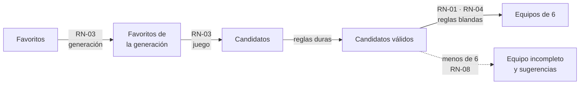

# Reglas de negocio

Cada regla tiene un identificador `RN-XX` estable que se cita en tests
(`@pytest.mark.rn("RN-XX")`), issues, PR y commits.

La aplicación trabaja con un **catálogo de reglas predefinido**: el usuario las activa o
desactiva y ajusta sus pesos y parámetros, pero no crea reglas nuevas
([RF-14](requisitos-funcionales.md#rf-14)). Una regla nueva se documenta aquí antes de
implementarla.

## Catálogo

| ID | Regla | Tipo | Configurable | Estado |
|----|-------|------|--------------|--------|
| [RN-01](#rn-01) | El equipo tiene 6 Pokémon | Dura | No | Vigente |
| [RN-02](#rn-02) | Solo se eligen Pokémon favoritos | Dura | No | Vigente |
| [RN-03](#rn-03) | Solo se eligen Pokémon de la generación y del juego objetivo | Dura | No | Vigente |
| [RN-04](#rn-04) | Se eligen los equipos con mayor puntuación ponderada | Mecanismo | Pesos | Vigente |
| [RN-05](#rn-05) | Cada forma regional es un Pokémon distinto | Dura | No | Vigente |
| [RN-06](#rn-06) | Penalizar varias formas de la misma especie | Blanda | Peso | Vigente |
| [RN-07](#rn-07) | Sin líneas evolutivas repetidas | Dura | Activable | Vigente |
| [RN-08](#rn-08) | Equipo incompleto y sugerencias cuando no se llega a 6 | Mecanismo | No | Vigente |
| [RN-09](#rn-09) | Cada favorito marca hasta qué evolución se quiere llegar | Dura | No | Vigente |
| [RN-10](#rn-10) | Se usan los datos tal como son en el juego objetivo | Mecanismo | No | Vigente |

Estados posibles:

- **Borrador**: pendiente de validar.
- **Vigente**: validada.
- **Retirado**: ya no se aplica.

## Proceso de generación

Las reglas se aplican en este orden:

1. Se parte de la lista de favoritos ([RN-02](#rn-02)). Cada favorito es la evolución hasta la
   que se quiere llegar ([RN-09](#rn-09)).
2. Se filtra por la generación del juego objetivo y después por el propio juego
   ([RN-03](#rn-03)). Se obtienen así los **candidatos**.
3. Se descartan los candidatos que no cumplen las demás reglas duras activas.
4. Entre los equipos de 6 ([RN-01](#rn-01)) que se pueden formar con los candidatos restantes,
   se eligen los de mayor puntuación ([RN-04](#rn-04)). Los tipos y demás datos son los del
   juego objetivo ([RN-10](#rn-10)).
5. Si no se puede formar un equipo de 6, se explica el motivo y se muestra el equipo
   incompleto con sugerencias para completarlo ([RN-08](#rn-08)).

## Reglas estructurales

Siempre están activas.

### RN-01 · El equipo tiene 6 Pokémon { #rn-01 }

- **Tipo**: dura
- **Descripción**: el equipo generado tiene exactamente 6 Pokémon. Si no se puede formar, se
  aplica [RN-08](#rn-08).

### RN-02 · Solo se eligen Pokémon favoritos { #rn-02 }

- **Tipo**: dura
- **Descripción**: todos los miembros del equipo pertenecen a la lista de favoritos del usuario.
  Solo hay una lista de favoritos, común a todos los juegos.
- **Excepción**: cuando el equipo no se puede completar, [RN-08](#rn-08) sugiere Pokémon que no
  son favoritos. Se muestran como sugerencias, no como miembros del equipo.

### RN-03 · Solo se eligen Pokémon de la generación y del juego objetivo { #rn-03 }

- **Tipo**: dura
- **Descripción**: es el primer filtro sobre los favoritos y se aplica en dos niveles:
    1. **Generación**: solo pasan los Pokémon que aparecen en alguno de los juegos de la
       generación del juego objetivo.
    2. **Juego**: de ellos, solo pasan los que existen en el juego objetivo. Un Pokémon existe
       en un juego si se puede tener en él, aunque no se pueda atrapar allí y haya que
       conseguirlo por intercambio, evolución o transferencia.
- **Ejemplos**:
    - Si el juego objetivo es Pokémon Amarillo (1.ª generación), Koffing es candidato. No se
      puede atrapar en Amarillo, pero existe en el juego. Chikorita no es candidato, porque
      aparece en la 2.ª generación.
    - Si el juego objetivo es Pokémon Espada (8.ª generación), Growlithe de Hisui no es
      candidato. Pasa el filtro de generación, porque aparece en Leyendas Pokémon: Arceus,
      pero no existe en Espada.
    - La disponibilidad se mira por forma y por la evolución que figura en favoritos
      ([RN-09](#rn-09)). Si Marowak de Alola no se puede conseguir en el juego objetivo, se
      descarta aunque Cubone sí esté disponible. Que su preevolución esté disponible no basta.
- **Nota**: el nivel de juego ya implica el de generación. Los dos niveles se mantienen porque
  permiten explicar mejor por qué se descarta un Pokémon ([RF-10](requisitos-funcionales.md#rf-10)).

### RN-05 · Cada forma regional es un Pokémon distinto { #rn-05 }

- **Tipo**: dura
- **Descripción**: una forma regional y la forma original son Pokémon distintos a todos los
  efectos: en el catálogo, en favoritos y en la generación del equipo. El algoritmo nunca
  sustituye una forma por otra. Para querer una forma concreta, hay que añadirla a favoritos
  con su nombre completo, p. ej., «Marowak de Alola» o «Raichu de Alola».
- **Formas que no se tienen en cuenta**: las que cambian de forma dinámica dentro del juego,
  como las megaevoluciones, Gigamax o los cambios de forma de Rotom o Deoxys. Se usa siempre la
  forma base.
- **Ejemplos**:
    - Si en favoritos está Vulpix, no se puede recomendar Vulpix de Alola, aunque esté
      disponible.
    - Si en favoritos está Zigzagoon de Galar, no se puede recomendar Zigzagoon.
    - Si en favoritos está Marowak de Alola, solo es candidato cuando esa forma concreta existe
      en el juego objetivo ([RN-03](#rn-03)).

### RN-09 · Cada favorito marca hasta qué evolución se quiere llegar { #rn-09 }

- **Tipo**: dura
- **Descripción**: en favoritos no se añade una línea evolutiva entera, sino la evolución hasta
  la que se quiere llegar. Esa evolución es la que se evalúa para formar el equipo:
    - Las **preevoluciones** van implícitas. Se entiende que formarán parte del equipo mientras
      se llega a la evolución indicada, así que no hace falta añadirlas.
    - Las **evoluciones posteriores** nunca se proponen, salvo que también estén en favoritos.
- **Ejemplos**:
    - El usuario añade Butterfree, no Caterpie ni Metapod. Caterpie y Metapod se dan por
      incluidos hasta llegar a Butterfree, que es el Pokémon que se evalúa.
    - El usuario añade Rhydon, pero no Rhyperior. El equipo puede incluir a Rhydon, evaluado con
      sus propios datos, pero nunca a Rhyperior.
- **Nota**: cómo se combinan varios favoritos de la misma línea evolutiva se decide al
  diseñar las reglas de elección ([CA-16](cuestiones-abiertas.md#aplazadas)).

## Reglas configurables

El usuario las activa o desactiva y ajusta sus pesos o parámetros
([RF-06](requisitos-funcionales.md#rf-06), [RF-07](requisitos-funcionales.md#rf-07)).

### RN-06 · Penalizar varias formas de la misma especie { #rn-06 }

- **Tipo**: blanda
- **Descripción**: puntúa en contra que el equipo incluya varias formas de la misma especie,
  como Vulpix y Vulpix de Alola. No las descarta, porque las formas suelen tener tipos
  distintos y pueden aportar al equipo. Por eso se recomienda darle un peso pequeño.
- **Puntuación**: 1 si no hay dos miembros de la misma especie; 0 en caso contrario.
- **Nota**: el equipo nunca contiene dos veces el mismo Pokémon, porque se forma con favoritos
  distintos ([RN-02](#rn-02)).

### RN-07 · Sin líneas evolutivas repetidas { #rn-07 }

- **Tipo**: dura, activable
- **Descripción**: si está activa, el equipo no puede incluir dos miembros de la misma línea
  evolutiva. Por ejemplo, Jolteon y Vaporeon, o Rhydon y Rhyperior.

## Mecanismos

### RN-04 · Se eligen los equipos con mayor puntuación ponderada { #rn-04 }

- **Tipo**: mecanismo de puntuación
- **Descripción**: cada regla blanda activa da a un equipo una puntuación normalizada entre 0
  y 1, que se multiplica por el peso de la regla. La puntuación del equipo es la suma de esas
  aportaciones. Entre los equipos que cumplen todas las reglas duras, se recomiendan los que
  tienen la puntuación más alta. Si hay empate, se recomiendan todos los empatados.
- **Fórmula**: `P(equipo) = Σ peso(r) · s(r, equipo)` para cada regla blanda activa `r`,
  con `s(r, equipo)` entre 0 y 1.
- **Nota**: la escala de pesos se define junto con el catálogo de reglas
  ([CA-05](cuestiones-abiertas.md#aplazadas)).

### RN-08 · Equipo incompleto y sugerencias cuando no se llega a 6 { #rn-08 }

- **Tipo**: mecanismo
- **Descripción**: el equipo se completa siempre con favoritos. Si no se pueden reunir 6
  favoritos que cumplan las reglas duras, la aplicación:
    1. Explica por qué no se llega a 6.
    2. Muestra el **equipo incompleto** con el mayor número posible de favoritos. Entre los
       equipos de ese tamaño, elige los de mayor puntuación ([RN-04](#rn-04)).
    3. Sugiere **Pokémon que no son favoritos** para completar los huecos. Las sugerencias
       existen en el juego objetivo ([RN-03](#rn-03)), cumplen las reglas duras activas junto
       con el equipo incompleto y se ordenan por lo que aportarían a la puntuación.
- **Ejemplo**: si solo 4 favoritos son candidatos válidos para Pokémon Amarillo, se muestra el
  equipo de esos 4 y, para los 2 huecos libres, una lista de Pokémon de Amarillo que encajan
  con las reglas activas.

### RN-10 · Se usan los datos tal como son en el juego objetivo { #rn-10 }

- **Tipo**: mecanismo
- **Descripción**: los tipos de cada Pokémon y la tabla de eficacias de tipos son los del juego
  objetivo, no los actuales. Afecta a todas las reglas que usan tipos.
- **Ejemplos**:
    - Clefairy es de tipo Normal hasta la 5.ª generación y de tipo Hada desde la 6.ª. En un
      juego de la 1.ª generación se evalúa como Normal.
    - Magnemite es de tipo Eléctrico en la 1.ª generación y Eléctrico/Acero desde la 2.ª.
    - El tipo Hada no existe antes de la 6.ª generación, así que no cuenta para la cobertura.

## Reglas candidatas

Ideas para el catálogo de reglas, aún **sin número**. Su diseño queda fuera de esta versión
del DDF ([CA-10](cuestiones-abiertas.md#aplazadas)). Cada una recibirá su `RN-XX` cuando se
decida incluirla.

| Idea | Tipo probable | Notas |
|------|---------------|-------|
| Excluir legendarios y singulares | Dura (opcional) | Típica en *runs* personales. |
| Excluir Pokémon que evolucionan por intercambio | Dura (opcional) | O solo puntuar en contra. Con RN-09 se miran las evoluciones hasta el favorito. |
| Excluir el inicial | Dura (opcional) | |
| Cobertura ofensiva de tipos | Blanda | Cuántos tipos se cubren con eficacia superior (con los datos de RN-10). |
| Pocas debilidades compartidas | Blanda | Penaliza equipos débiles al mismo tipo. |
| Variedad de tipos | Blanda | Penaliza repetir tipos entre miembros. |
| Disponibilidad temprana | Blanda | Choca con [RN-03](#rn-03), que no mira dónde se atrapa cada Pokémon. Habría que descartarla o cargar ese dato aparte. |
| Estadísticas base | Blanda | Suma o media de estadísticas base de la evolución favorita (RN-09). |
| Fácil de evolucionar | Blanda | Premia evoluciones por nivel antes que por objeto o intercambio. |
