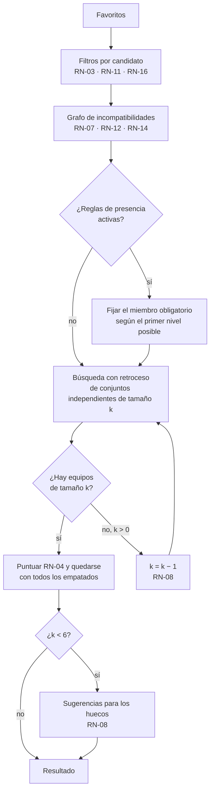

# Algoritmo de generación de equipos

Algoritmo del motor a partir del catálogo de reglas del [DDF](../01-ddf/reglas-negocio.md). La
decisión está registrada en [ADR-0006](../03-adr/0006-algoritmo-busqueda-exacta.md).

## Forma del problema

Las reglas del catálogo se agrupan en tres tipos de restricción, cada uno con su técnica:

| Tipo de restricción | Reglas | Técnica |
|---------------------|--------|---------|
| Sobre cada candidato | RN-03, RN-11, RN-16 | Filtro lineal previo. Cada descarte guarda su motivo (RF-10). Las exclusiones de RN-16 se calculan antes, a partir del recorrido, con las excepciones de Dragonite y Eevee. |
| Entre pares de miembros | RN-07, RN-12, RN-14 (máximo una) | **Grafo de incompatibilidades**: hay una arista entre dos candidatos si comparten tipo, línea evolutiva o ambos son evoluciones de Eevee. Un equipo válido es un conjunto de candidatos sin aristas entre ellos (conjunto independiente). |
| De presencia | RN-13, RN-14 (al menos una) | Niveles de prioridad: se fija primero el miembro obligatorio y se completa el resto del equipo. |

La puntuación (RN-04) no es aditiva por miembro. La cobertura de RN-17 depende de la
combinación, así que se evalúa sobre el equipo completo. Sí se puede precalcular por candidato:

- **RN-17**: dos conjuntos de bits por candidato, sobre la lista de Pokémon rivales del juego:
  a cuáles ataca con superefectividad y frente a cuáles cubre la defensa. La cobertura de un
  equipo es la unión (OR) de los conjuntos de sus miembros.
- **RN-15**: si el candidato tiene alguna evolución tediosa (0 o 1).
- **RN-20**: si el candidato tiene alguna evolución aleatoria (0 o 1).
- **RN-06**: la especie de cada candidato.

## Procedimiento

1. **Filtrar** los favoritos con las reglas por candidato.
2. **Construir el grafo** de incompatibilidades entre los candidatos válidos.
3. **Fijar los miembros de presencia**:
    - RN-13: Dragonite si es candidato válido. Si no, se ramifica sobre cada candidato de tipo
      primario Dragón.
    - RN-14: se ramifica sobre cada evolución de Eevee candidata.
    - Si un nivel no tiene candidatos, se reserva un hueco para sugerencias (RN-08).
4. **Buscar con retroceso** (*backtracking*) todos los conjuntos independientes de tamaño
   `k = 6 − huecos reservados` que contienen los miembros fijados. Los candidatos se recorren
   en un orden canónico (número de la Pokédex nacional y forma) para que el resultado sea
   determinista (RF-08).
5. **Puntuar** cada equipo y quedarse con todos los de puntuación máxima (RN-04). Los equipos
   se comparan por la clave `(puntuación, miembros con dos tipos)`, de modo que el desempate de
   RN-19 se aplica en la misma pasada.
6. Si no hay ningún equipo de tamaño `k`, se prueba con `k − 1` y se añaden **sugerencias**
   para los huecos: Pokémon del juego que no son favoritos, que no tienen aristas con el
   equipo y que cumplen la regla de presencia del hueco, si la hay. Se ordenan por la mejora de
   puntuación que aportan y, a igual mejora, primero los de dos tipos (RN-08, RN-19). Lo que
   siga empatado se ordena por el orden canónico.

## Tamaño de la búsqueda

Sin restricciones entre miembros, con `N` candidatos hay `C(N, 6)` equipos: unos 594 000 con
`N = 30` y unos 50 millones con `N = 60`.

Con [RN-12](../01-ddf/reglas-negocio.md#rn-12) activa, el espacio se reduce mucho. Cada
miembro ocupa uno o dos de los 17 o 18 tipos del juego, y la búsqueda con retroceso poda en
cuanto dos miembros comparten tipo. Los miembros fijados por RN-13 y RN-14 reducen aún más el
problema.

Medición con candidatos sintéticos (17 tipos, un 15 % de líneas compartidas, Dragonite fijado,
3 evoluciones de Eevee y cobertura de RN-17 como conjuntos de bits), en Python puro sin
optimizar:

| Candidatos válidos | Con RN-12 | Sin RN-12 |
|--------------------|-----------|-----------|
| 20 | 250 equipos admisibles, < 0,01 s | 4 650 equipos, 0,01 s |
| 40 | 22 818 equipos, 0,11 s | 168 330 equipos, 0,63 s |
| 60 | 103 810 equipos, 0,58 s | — |
| 120 | 2,5 millones de equipos, 19,5 s | — |

Para los tamaños esperados (decenas de favoritos), la enumeración exhaustiva con poda es
suficiente y exacta.

Si RN-12 está desactivada y hay muchos favoritos, se puede añadir **ramificación y poda**
(*branch and bound*) con una cota superior de la puntuación: por ejemplo, la cobertura de RN-17
que darían los mejores candidatos restantes. La alternativa es formularlo como un problema de
programación lineal entera, que se descartó en
[ADR-0006](../03-adr/0006-algoritmo-busqueda-exacta.md).

## Empates

La puntuación depende sobre todo de los tipos, así que los empates son frecuentes. Se tratan
en dos pasos.

**Desempate** ([RN-19](../01-ddf/reglas-negocio.md#rn-19)): entre los equipos con la
puntuación máxima, se quedan los que tienen más miembros con dos tipos en el juego objetivo.

**Comparación exacta**: las puntuaciones se calculan con fracciones exactas (p. ej.,
`fractions.Fraction`), no con coma flotante. Son sumas de pesos enteros por proporciones, así
que es barato, y evita que dos equipos que empatan difieran en el último decimal y el
desempate no se aplique.

**Agrupación** ([RN-04](../01-ddf/reglas-negocio.md#rn-04),
[CA-33](../01-ddf/cuestiones-abiertas.md#resueltas)): dos candidatos con los mismos tipos
suelen ser intercambiables, así que los equipos que siguen empatados se muestran agrupados:

1. Se toman los equipos que siguen empatados, ya validados con las reglas duras.
2. Se agrupan los que coinciden en todos los miembros salvo en posiciones cuyos candidatos
   tienen los mismos tipos en el juego objetivo (p. ej., Lapras o Cloyster).
3. Como cada equipo del grupo ya es válido, no hace falta comprobar de nuevo las reglas de
   presencia: una evolución de Eevee nunca queda agrupada con un Pokémon que no lo sea, porque
   el equipo resultante no cumpliría [RN-14](../01-ddf/reglas-negocio.md#rn-14) y no estaría
   entre los empatados.

## Pureza del motor

El motor (`core/`) recibe un contexto inmutable con todo lo necesario para un juego objetivo y
no accede a la red ni a la base de datos:

- Candidatos con sus tipos en el juego, línea y rama evolutiva, especie, marcas y clasificación
  de evoluciones.
- Tabla de eficacias de la generación.
- Combates clave y sus Pokémon rivales.
- Configuración de reglas.
- Exclusiones ya calculadas a partir del recorrido.

Esto permite probar con hypothesis propiedades como:

- Todo equipo devuelto cumple las reglas duras activas.
- El resultado es el mismo para la misma entrada.
- La suma de aportaciones coincide con la puntuación (RF-09).
- Ningún equipo admisible tiene más puntuación que los devueltos (comparando con una búsqueda
  por fuerza bruta en casos pequeños).
- Ningún equipo admisible con la misma puntuación tiene más miembros con dos tipos que los
  devueltos (RN-19).
