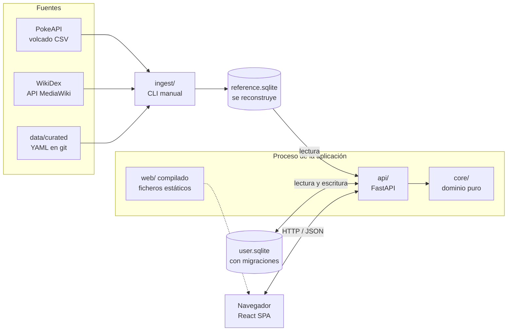
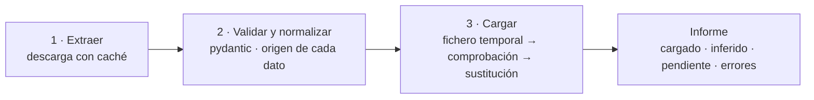
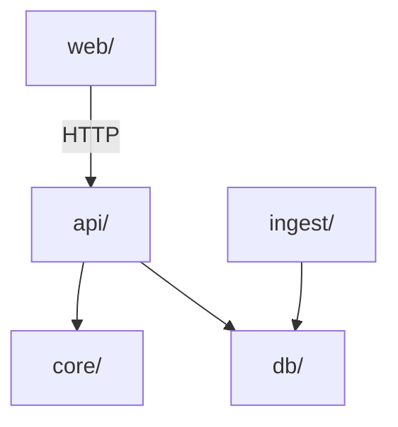
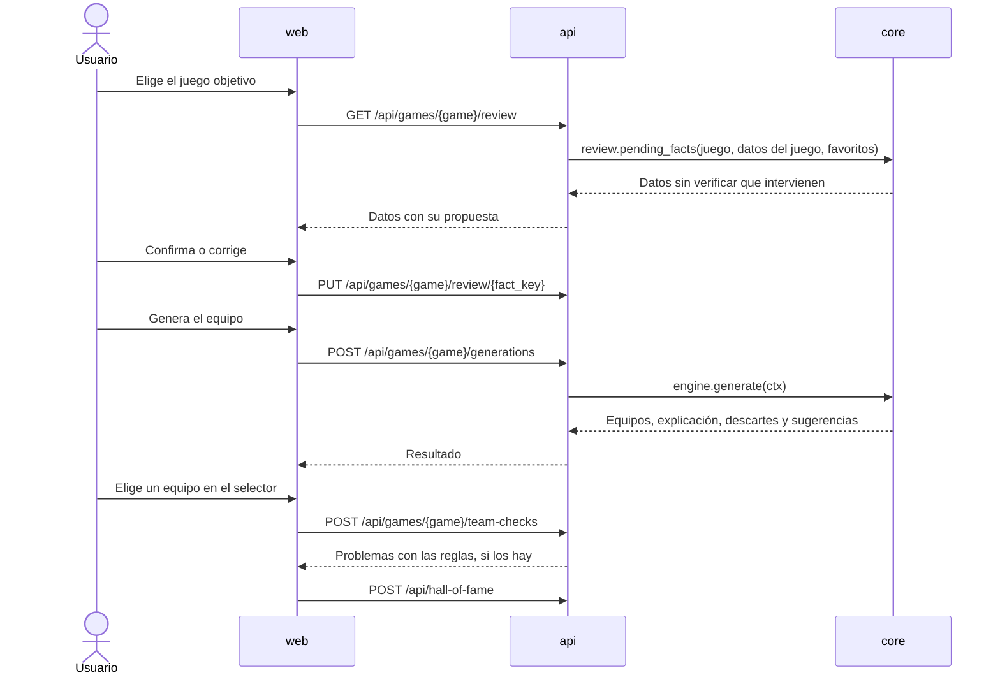

# Arquitectura

Arquitectura de la aplicación a partir del [DDF](../01-ddf/index.md) y de las decisiones
registradas en los [ADR](../03-adr/index.md).

## Visión general

La aplicación es un **monolito modular** con un **núcleo de dominio puro**
([ADR-0002](../03-adr/0002-monolito-modular-nucleo-puro.md)): un solo proceso, dos ficheros
SQLite y una ingesta que se ejecuta aparte, de forma puntual.



## Componentes

### `core/`: dominio puro

Contiene toda la lógica de negocio del [DDF](../01-ddf/reglas-negocio.md). No accede a la red,
a la base de datos ni al sistema de ficheros, y solo depende de la biblioteca estándar. Lo
implementado está en [Motor de reglas](motor.md) y el plan, en
[plan de implementación del motor](plan-motor.md).

| Módulo | Responsabilidad |
|--------|-----------------|
| `domain/` | Modelos inmutables (`dataclass(frozen=True)`): `Candidate`, `Team`, `TypeChart`, `KeyBattle`, `GameContext`, `RuleSettings`… |
| `rules/` | Catálogo estático de reglas, una clase por `RN-XX`, agrupadas por clase de regla (ver abajo). |
| `engine/` | Filtros, grafo de incompatibilidades, búsqueda con retroceso, ordenación, agrupación de empates y sugerencias ([algoritmo](algoritmo-generacion.md)). |
| `journey.py` | Exclusiones del recorrido a partir del *Hall of Fame* ([RN-16](../01-ddf/reglas-negocio.md#rn-16)). |
| `review.py` | Qué datos sin verificar intervienen en una generación ([RN-18](../01-ddf/reglas-negocio.md#rn-18)). |
| `evolution.py` | Clasificación de los métodos de evolución en tediosos o no y en aleatorios o no, y si se pueden hacer en un juego ([RN-15](../01-ddf/reglas-negocio.md#rn-15), [RN-20](../01-ddf/reglas-negocio.md#rn-20)). |
| `breeding.py` | Si una línea se puede criar y qué etapa nace del huevo ([RN-11](../01-ddf/reglas-negocio.md#rn-11), [CA-25](../01-ddf/cuestiones-abiertas.md#resueltas)). |

Cada regla implementa la interfaz de su clase y devuelve su resultado junto con su
identificador. Así salen solos los motivos de descarte
([RF-10](../01-ddf/requisitos-funcionales.md#rf-10)) y la explicación por regla
([RF-09](../01-ddf/requisitos-funcionales.md#rf-09)):

| Clase de regla | Interfaz | Reglas |
|----------------|----------|--------|
| Filtro por candidato | `exclusion(candidate, ctx) -> Discard \| None` | RN-03, RN-11, RN-16 |
| Restricción entre pares | `conflicts(a, b, ctx) -> bool` | RN-07, RN-12, RN-14 (máximo una) |
| Presencia | `tiers(ctx) -> list[Tier]`, niveles por prioridad | RN-13, RN-14 (al menos una) |
| Blanda | `score(team, ctx) -> Fraction` entre 0 y 1 | RN-06, RN-15, RN-17, RN-20 |
| Desempate | `tie_break_key(team, ctx) -> int` | RN-19 |

Las reglas estructurales (RN-01, RN-02, RN-05, RN-09) y los mecanismos (RN-04, RN-08, RN-10,
RN-18) no son clases del catálogo: los implementa el motor o el constructor del contexto.

El catálogo es un registro estático ([CA-10](../01-ddf/cuestiones-abiertas.md#resueltas)).
Activar o desactivar reglas y cambiar pesos ([RF-06](../01-ddf/requisitos-funcionales.md#rf-06),
[RF-07](../01-ddf/requisitos-funcionales.md#rf-07)) es pasar al motor un `RuleSettings`
distinto.

### `db/`: persistencia

Modelos SQLModel de las dos bases de datos
([ADR-0003](../03-adr/0003-dos-bases-de-datos-sqlite.md)). Detalle en el
[modelo de datos](modelo-datos.md).

| Paquete | Base de datos | Quién escribe | Esquema |
|---------|---------------|---------------|---------|
| `db/reference/` | `reference.sqlite` | Solo `ingest/` | Se reconstruye entera en cada carga; sin migraciones. |
| `db/user/` | `user.sqlite` | Solo `api/` | Migraciones con Alembic. |

Los modelos de `db/` nunca entran en `core/`: la capa de aplicación los traduce a modelos de
dominio.

### `ingest/`: carga de datos

CLI (`uv run python -m ingest ...`) que se ejecuta de forma puntual
([RF-11](../01-ddf/requisitos-funcionales.md#rf-11)). Tiene tres fases:



| Fuente | Adaptador | Detalle |
|--------|-----------|---------|
| PokeAPI | `sources/pokeapi/` | Volcado CSV del repositorio de PokeAPI, fijado a un commit ([ADR-0004](../03-adr/0004-pokeapi-volcado-csv.md)). |
| WikiDex | `sources/wikidex/` | API MediaWiki (`action=parse&prop=wikitext`), plantillas `{{Equipo}}` con mwparserfromhell. Caché en disco, una petición por segundo como máximo y `User-Agent` descriptivo. |
| Datos curados | `sources/curated/` | `data/curated/*.yaml`, validados con pydantic ([ADR-0005](../03-adr/0005-datos-curados-yaml.md), [datos curados](datos-curados.md)). |

La fase de carga construye `reference.sqlite` en un fichero temporal, comprueba su
integridad y que las claves que usa `user.sqlite` (favoritos, *Hall of Fame*, confirmaciones)
siguen existiendo, y solo entonces sustituye el fichero anterior. Las de los favoritos y del
*Hall of Fame* rechazan la carga; las de las confirmaciones solo son avisos. Si algo falla, se conserva
la base de datos anterior y el informe explica el motivo. Uso, informe y detalle de la
implementación en [Ingesta de datos](../05-operacion/ingesta.md).

### `api/`: capa de aplicación

FastAPI con tres capas:

| Capa | Responsabilidad |
|------|-----------------|
| `routers/` | HTTP: validación de entrada, códigos de estado y esquemas de respuesta. Detalle en la [API](api.md). |
| `services/` | Casos de uso: montar el `GameContext` a partir de las dos bases de datos, llamar a `core/` y traducir el resultado. |
| `repositories/` | Acceso a `db/` con SQLModel. |

- El `GameContext` de cada juego se guarda en memoria al construirlo, porque los datos de
  referencia no cambian mientras la aplicación está en marcha. Las partes que dependen del
  usuario (favoritos, configuración, recorrido y confirmaciones) se añaden en cada petición.
- La generación es síncrona: tarda menos de un segundo con los tamaños esperados
  ([algoritmo](algoritmo-generacion.md#tamano-de-la-busqueda)).

### `web/`: interfaz

Aplicación de una sola página con React, Vite, TypeScript y Tailwind
([ADR-0001](../03-adr/0001-stack-tecnologico.md)).

- Cliente de la API generado a partir del OpenAPI de FastAPI
  ([ADR-0007](../03-adr/0007-cliente-generado-openapi.md)).
- TanStack Query para el estado que viene del servidor.
- Pantallas: Inicio, Catálogo y ficha, Favoritos, Reglas, **Nuevo juego** (elegir juego →
  revisar datos → generar), Resultado y *Hall of Fame*.
- No implementa reglas de negocio: muestra lo que calcula la API.

Rutas, fases y pruebas en el [plan de la web](plan-web.md).

## Reglas de dependencia



- `core/` no importa nada del proyecto ni bibliotecas de terceros.
- `db/` no importa ningún otro paquete del proyecto.
- `ingest/` solo importa `db/`, y `api/` no importa `ingest/`.

Se comprueban con contratos de `import-linter` y con un test que vigila que `core/` solo use la
biblioteca estándar, en pre-commit y en CI
([ADR-0002](../03-adr/0002-monolito-modular-nucleo-puro.md)). Detalle en la
[estructura del código](estructura-codigo.md#reglas-de-dependencia).

## Flujos principales

### Nuevo juego



El usuario elige uno de los equipos (una alternativa por posición y una sugerencia por hueco)
y se registra en el *Hall of Fame*, o los descarta y no se registra nada
([CA-53](../01-ddf/cuestiones-abiertas.md#resueltas)). Si quedan datos sin confirmar, la
generación responde `409 Conflict` con la lista de datos pendientes ([RF-08](../01-ddf/requisitos-funcionales.md#rf-08),
[RF-15](../01-ddf/requisitos-funcionales.md#rf-15)).

### Ingesta

1. El administrador ejecuta la ingesta desde la terminal, aparte de la aplicación. La API
   nunca la lanza ([ADR-0008](../03-adr/0008-cargas-bloqueadas.md)).
2. Se descargan o se leen de caché las fuentes.
3. Se genera `reference.sqlite` nuevo y se comprueba.
4. Si hay **bloqueos** (algo que la aplicación no sabe tratar), se recogen todos, no se
   sustituye nada y se genera un informe para el arquitecto, que prepara una nueva versión
   ([RF-16](../01-ddf/requisitos-funcionales.md#rf-16)).
5. Si no, se sustituye el anterior. La aplicación lee la base de datos nueva al reiniciarse.
6. Las confirmaciones cuyo valor propuesto ha cambiado dejan de valer y se vuelven a pedir
   ([RN-18](../01-ddf/reglas-negocio.md#rn-18)).

## Despliegue

Uso local y personal:

- Un único proceso `uvicorn` sirve la API en `/api` y el frontend compilado como ficheros
  estáticos.
- Los dos ficheros SQLite están en un directorio de datos configurable.
- Sin autenticación: la aplicación es de un solo usuario
  ([alcance](../01-ddf/index.md#alcance)).

## Estrategia de pruebas

| Capa | Herramientas | Qué se prueba |
|------|--------------|---------------|
| `core/` | pytest, hypothesis | Cada regla con `@pytest.mark.rn("RN-XX")`; propiedades del motor ([algoritmo](algoritmo-generacion.md#pureza-del-motor)). |
| `ingest/` | pytest con ficheros de ejemplo | Normalización de CSV y wikitexto reales guardados como datos de prueba; nunca red en los tests. |
| `api/` | pytest con `TestClient` | Contratos de los endpoints con bases de datos SQLite temporales. |
| `web/` | Vitest, Playwright | Componentes y el flujo de nuevo juego de extremo a extremo. |

## Estructura de directorios

```
core/      domain/, rules/, engine/, journey.py, review.py, evolution.py, breeding.py
db/        reference/ (SQLModel), user/ (SQLModel + migraciones Alembic)
ingest/    sources/ (pokeapi/, curated/, wikidex/), cli.py, scope.py, load.py, checks.py, report.py
api/       routers/, services/, repositories/, main.py
data/      curated/*.yaml (en git), cache/ y *.sqlite (fuera de git)
web/       src/ (pages, components, api/ con el cliente generado)
tests/     core/, ingest/, api/
```
