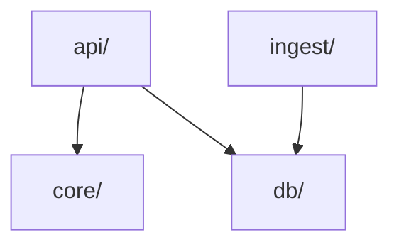

# Estructura del código

Qué hay en cada directorio del repositorio, por qué existe, qué hace y cómo se comprueba que
las dependencias entre paquetes respetan la [arquitectura](arquitectura.md)
([ADR-0002](../03-adr/0002-monolito-modular-nucleo-puro.md)).

Cada directorio de código tiene además un `README.md` breve que remite a esta página, y cada
paquete de Python un *docstring* de módulo en su `__init__.py`.

## Directorios

| Directorio | Qué es | Por qué existe | Qué hace | Estado |
|------------|--------|----------------|----------|--------|
| `core/` | Paquete de Python: dominio puro. | Aislar las reglas de negocio de la infraestructura para probarlas a fondo con hypothesis ([ADR-0002](../03-adr/0002-monolito-modular-nucleo-puro.md)). | Implementa las reglas `RN-XX` y el motor de generación a partir de un `GameContext` inmutable. | Motor completo (fases 1 a 6): dominio, reglas, generación de equipos con sugerencias y agrupación, y revisión de datos ([detalle](motor.md)) |
| `db/` | Paquete de Python: persistencia. | Un único lugar para los modelos de las dos bases de datos ([ADR-0003](../03-adr/0003-dos-bases-de-datos-sqlite.md)). | Define los modelos SQLModel de `reference.sqlite` (`db/reference/`) y `user.sqlite` y las migraciones de esta última. `db/sqlite.py` crea los motores con las claves foráneas activadas. | `reference.sqlite` y `user.sqlite` con sus migraciones implementadas ([detalle](modelo-datos.md#implementacion-de-usersqlite)) |
| `ingest/` | Paquete de Python: CLI de ingesta. | Los datos de referencia vienen de fuentes externas y se cargan de forma puntual ([RF-11](../01-ddf/requisitos-funcionales.md#rf-11)). | Descarga (con caché), valida y normaliza PokeAPI, WikiDex y los datos curados, y construye `reference.sqlite`. | CLI, carga, comprobaciones y fuentes PokeAPI, datos curados y WikiDex implementados ([detalle](../05-operacion/ingesta.md)) |
| `api/` | Paquete de Python: capa de aplicación. | Exponer los casos de uso al frontend por HTTP ([API](api.md)). | Routers de FastAPI, servicios que montan el `GameContext` y llaman a `core/`, y repositorios sobre `db/`. | Arranque, configuración, metadatos, favoritos, reglas, juegos, `GameContext` y revisión de datos ([detalle](../05-operacion/api.md)) |
| `data/` | Datos, no código. | Separar los datos versionados de los generados ([ADR-0005](../03-adr/0005-datos-curados-yaml.md)). | `curated/`: YAML curados a mano, en git. `cache/`, `reports/` y `*.sqlite`: generados, fuera de git. | `curated/` con los datos de Rojo Fuego y Verde Hoja ([detalle](datos-curados.md)) |
| `tests/` | Tests de Python (pytest + hypothesis). | Verificar cada regla y las propiedades del motor ([estrategia de pruebas](arquitectura.md#estrategia-de-pruebas)). | Contiene el guardián de arquitectura (`test_architecture.py`) y los tests de cada paquete en `tests/<paquete>/` (`tests/core/`, `tests/db/` y `tests/ingest/`). Los tests importan módulos de prueba como `tests.core.builders`: mypy calcula los nombres de módulo desde la raíz del repositorio (`explicit_package_bases`). `tests/conftest.py` hace fallar cualquier petición HTTP, porque los tests nunca usan la red; los datos de ejemplo están en `tests/<paquete>/fixtures/`. pytest añade la raíz del repositorio al `sys.path` (`pythonpath` en `pyproject.toml`), porque el proyecto no se instala como paquete. | En uso |
| `web/` | Frontend React + Vite + TypeScript + Tailwind. | Interfaz de la aplicación ([ADR-0001](../03-adr/0001-stack-tecnologico.md)). | Pantallas de catálogo, favoritos, reglas, nuevo juego, resultado y *Hall of Fame*. | Vacío |
| `docs/` | Documentación MkDocs. | Docs-as-code: el diseño se versiona con el código. | DDF, DDT, ADR, manual de usuario y operación. | En uso |

### `data/`

```
data/
  curated/    YAML curados a mano (combates clave, mecánicas de juego…). En git.
  cache/      Respuestas descargadas por la ingesta (WikiDex, volcado de PokeAPI). Fuera de git.
  *.sqlite    reference.sqlite y user.sqlite. Fuera de git.
  reports/    Informes de cada carga en JSON y Markdown. Fuera de git.
```

`data/cache/`, `data/reports/` y `*.sqlite` están en `.gitignore`: se pueden regenerar y no
deben subirse al repositorio. Los informes de carga que importan se registran a mano en
[Informes de carga](../05-operacion/informes-carga/index.md)
([ADR-0008](../03-adr/0008-cargas-bloqueadas.md)).

## Reglas de dependencia

Dependencias permitidas entre paquetes de Python:



Cualquier otra dependencia entre paquetes del proyecto está prohibida, y `core/` no puede usar
bibliotecas de terceros. Se comprueban de dos formas:

### Contratos de import-linter

[import-linter](https://import-linter.readthedocs.io/) analiza los `import` del código y
comprueba los contratos definidos en `pyproject.toml` (sección `[tool.importlinter]`):

| Contrato | Comprueba |
|----------|-----------|
| `core-pure` | `core/` no importa `db/`, `ingest/` ni `api/`. |
| `db-base` | `db/` no importa `core/`, `ingest/` ni `api/`. |
| `ingest-only-db` | `ingest/` no importa `core/` ni `api/`. |
| `api-not-ingest` | `api/` no importa `ingest/`. |

```bash
uv run lint-imports
```

Se ejecuta como hook de pre-commit (al hacer commit de ficheros `.py`) y como paso propio,
*Contratos de dependencia*, en el job de Python de la CI. Si un contrato se rompe, la salida
indica el módulo, el import y la línea, p. ej.:

```text
core no depende de ningún otro paquete del proyecto BROKEN
-   core.engine -> db (l.1)
```

### Guardián de pureza de `core/`

import-linter solo puede prohibir paquetes que se nombran uno a uno. Para garantizar que
`core/` usa **solo la biblioteca estándar**, sea cual sea la biblioteca que se intente usar,
`tests/test_architecture.py` recorre los ficheros de `core/` y falla si alguno importa un
módulo que no está en `sys.stdlib_module_names` ni es el propio `core`. Se ejecuta con el
resto de tests (`uv run pytest`).

## Hooks de pre-commit con el entorno del proyecto

`mypy` y `lint-imports` se ejecutan en pre-commit como hooks **locales** (`uv run …`), con el
entorno del proyecto, en lugar de con un entorno aislado de pre-commit. Así ven todas las
dependencias del código (SQLModel, pydantic…) sin mantener una segunda lista en
`.pre-commit-config.yaml`. En CI se ejecutan como pasos propios del job de Python.

## Añadir un paquete o una dependencia

- **Nuevo paquete de Python de primer nivel**: añadirlo a `root_packages` y a los contratos de
  `[tool.importlinter]`, a `files` de `[tool.mypy]`, a esta página y a la estructura de
  `CLAUDE.md`, con su `README.md` y su *docstring*. Si cambia la arquitectura, con un ADR.
- **Nueva dependencia permitida entre paquetes**: es un cambio de arquitectura. Se registra en
  un ADR y se actualizan los contratos, el diagrama de esta página y la
  [arquitectura](arquitectura.md#reglas-de-dependencia).

## Documentación del código

Todo código o cambio de base de datos se documenta en el mismo PR que lo introduce:

- **Qué es, por qué existe y qué hace** cada paquete o módulo: *docstring* de módulo y, si es
  un paquete o un directorio nuevo, su fila en esta página y su `README.md`.
- **Base de datos**: cada tabla o columna nueva o modificada, en el
  [modelo de datos](modelo-datos.md); cada migración de `user.sqlite`, con su motivo.
- **Diseño técnico**: si el cambio afecta a la arquitectura, el algoritmo, la API o los datos,
  se actualiza la página del DDT correspondiente, o se crea una nueva y se enlaza desde el
  [índice del DDT](index.md).
- **Operación**: los comandos nuevos (ingesta, arranque…), en
  [Operación](../05-operacion/index.md) y en la tabla de comandos de `CLAUDE.md`.
- **Manual de usuario**: cómo se usa cada interfaz (la CLI, la API y la web), orientado a
  tareas, en el [manual de usuario](../04-manual-usuario/index.md). Operación explica cómo
  funciona por dentro; el manual, cómo usarla.
