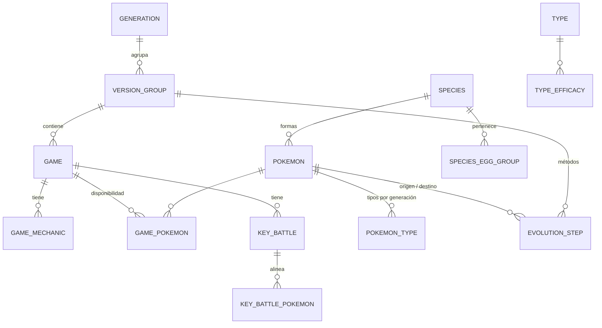
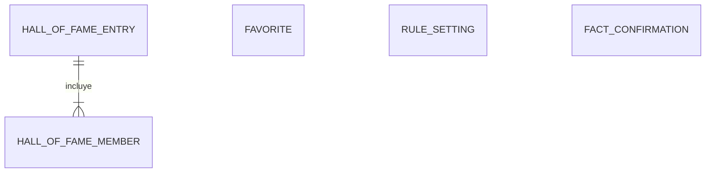

# Modelo de datos

Modelo de las dos bases de datos ([ADR-0003](../03-adr/0003-dos-bases-de-datos-sqlite.md)) y
del contexto que recibe el motor. Se deriva de los
[datos requeridos por las reglas](datos-requeridos.md).

## Principios

- **Dos ficheros SQLite**: `reference.sqlite` (datos de referencia, se reconstruye entera en
  cada ingesta) y `user.sqlite` (datos del usuario, con migraciones).
- **Claves naturales estables**: las tablas se identifican con los identificadores de PokeAPI
  (`vulpix-alola`, `firered`, `firered-leafgreen`, `water`), no con ids numéricos. Así
  `user.sqlite` sigue siendo válida cuando se reconstruye `reference.sqlite`. Los ids
  numéricos del CSV se traducen al cargar ([ADR-0004](../03-adr/0004-pokeapi-volcado-csv.md)).
- **Datos resueltos al cargar**: la ingesta deja los datos listos para cada generación o
  grupo de versiones (tipos, tabla de eficacias, métodos de evolución). Las reglas de negocio
  que los interpretan están en `core/`.
- **Origen de cada dato revisable**: las tablas con datos que pueden no ser fiables tienen las
  columnas `origin` (`automatic`, `inferred` o `pending`) y `fact_key`
  ([RN-18](../01-ddf/reglas-negocio.md#rn-18)).
- **Nombres en español**: se cargan de las tablas de nombres del CSV (idioma `es`).

## Base de datos de referencia (`reference.sqlite`)

Implementada en `db/reference/` ([implementación](#implementacion-de-referencesqlite)). En
las columnas, **PK** es clave primaria, **FK →** clave foránea, **único** una restricción de
unicidad y `?` un valor que puede ser nulo.

### Juegos

Módulo `db/reference/games.py`.

| Tabla | Columnas | Notas |
|-------|----------|-------|
| `generation` | `number` PK, `slug` único | 1 a 9. |
| `version_group` | `slug` PK, `generation` FK → `generation`, `order` único | P. ej., `firered-leafgreen`. `order` es el orden cronológico de PokeAPI y decide qué pasos de evolución se aplican a cada grupo ([plan de carga](plan-carga-datos.md#evoluciones)). |
| `game` | `slug` PK, `name_es`, `version_group` FK, `generation` FK, `release_order`, `has_breeding`, `is_target` | `is_target` es falso en la 1.ª generación y en juegos sin crianza ([CA-29](../01-ddf/cuestiones-abiertas.md#resueltas)). En la primera carga, solo los 5 de la 3.ª generación ([CA-11](../01-ddf/cuestiones-abiertas.md#resueltas)). |
| `game_mechanic` | `game` FK y `mechanic` PK, `value` (sí/no)?, `origin`, `fact_key` único | P. ej., `day_night_cycle`. Datos curados, normalmente inferidos. `value` es nulo solo si `origin` es `pending`. |
| `game_pokemon` | `game` FK y `pokemon` FK PK, `exists_in_game`?, `exists_origin`, `can_arrive`?, `arrival_origin` | Disponibilidad por forma ([RN-03](../01-ddf/reglas-negocio.md#rn-03)). `can_arrive`: si la etapa que nace del huevo puede llegar y evolucionar antes de completar el juego ([CA-28](../01-ddf/cuestiones-abiertas.md#abiertas)). Cada valor es nulo solo si su origen es `pending`. La columna no se llama `exists` porque es palabra reservada de SQL. |

### Pokémon

Módulo `db/reference/pokemon.py`.

| Tabla | Columnas | Notas |
|-------|----------|-------|
| `type` | `slug` PK, `name_es`, `generation` FK | Generación en que aparece. |
| `type_efficacy` | `generation` FK, `attacking` FK → `type` y `defending` FK → `type` PK, `factor` | Ya resuelta con `type_efficacy_past`. `factor` en centésimas: solo 0, 50, 100 o 200. |
| `species` | `slug` PK, `dex_number` único, `name_es`, `generation` FK, `evolves_from`? FK → `species`, `evolution_chain`, `is_baby`, `requires_incense`, `is_legendary`, `is_mythical` | Del CSV `pokemon_species`. `requires_incense` marca los bebés que solo nacen con incienso (Azurill, Wynaut), que se cargan de `data/curated/breeding.yaml` ([CA-36](../01-ddf/cuestiones-abiertas.md#resueltas)). |
| `species_egg_group` | `species` FK y `egg_group` PK | Para [RN-11](../01-ddf/reglas-negocio.md#rn-11). |
| `pokemon` | `slug` PK, `species` FK, `name_es`, `is_default`, `region`? | Solo la forma base y las regionales ([RN-05](../01-ddf/reglas-negocio.md#rn-05)); se descartan las megaevoluciones y las formas de combate. `region` solo en las regionales. |
| `pokemon_type` | `pokemon` FK, `generation` FK y `slot` PK, `type` FK | Una fila por generación y tipo, ya resuelta con `pokemon_types_past`. `slot` 1 es el tipo primario ([RN-13](../01-ddf/reglas-negocio.md#rn-13)); solo 1 o 2. |

### Evoluciones

Módulo `db/reference/evolution.py`.

| Tabla | Columnas | Notas |
|-------|----------|-------|
| `evolution_step` | `id` PK, `version_group` FK, `from_pokemon` FK → `pokemon`, `to_pokemon` FK → `pokemon`, `trigger`, `conditions` (JSON) | Paso aplicable en ese grupo de versiones, ya resuelto a partir del `version_group_id` del CSV, que indica el grupo en que se introdujo la evolución ([plan de carga](plan-carga-datos.md#evoluciones)). `trigger` es el disparador de PokeAPI (`level-up`, `trade`, `use-item`, `shed`…) y `conditions`, un objeto JSON con las condiciones no vacías (amistad, hora del día, objeto, belleza, comparación de estadísticas…), tal como vienen. Puede haber varias filas si hay métodos alternativos, por eso la clave es un `id`. |
| `level_move` | `pokemon`, `version_group`, `move`, `level` | Solo los movimientos que exige alguna evolución (`known_move`), para [RN-15](../01-ddf/reglas-negocio.md#rn-15) y [CA-32](../01-ddf/cuestiones-abiertas.md#resueltas). **No implementada**: no hace falta hasta la 4.ª generación. |

Clasificar un paso como tedioso o aleatorio a partir de su disparador y sus condiciones es una
regla de negocio y se hace en `core/evolution.py`, no en la base de datos. Por eso se guardan
los datos de PokeAPI sin reducirlos a una categoría.

Pendiente (fase 7 del [plan de carga](plan-carga-datos.md#fases)): la categoría de cada
disparador y condición pasa a ser un dato
([CA-42](../01-ddf/cuestiones-abiertas.md#resueltas)):

| Tabla | Columnas | Notas |
|-------|----------|-------|
| `evolution_method` | `kind` (`trigger` o `condition`) y `name` PK, `category`, `reason`?, `requires_mechanic`?, `unless_learnt_by_level` | Desde [`evolution_methods.yaml`](datos-curados.md#evolution_methodsyaml). `core/evolution.py` la recibe en el contexto en lugar de tener la clasificación en el código. |

### Combates clave

Módulo `db/reference/battles.py`.

| Tabla | Columnas | Notas |
|-------|----------|-------|
| `key_battle` | `slug` PK, `game` FK, `category`, `trainer_name`, `order`, `origin`, `fact_key` único, `source_page`?, `source_revision`? | `category`: `gym_leader`, `elite_four`, `champion`, `villain_boss` o `rival_final` ([RN-17](../01-ddf/reglas-negocio.md#rn-17)). `order` es único dentro de cada juego. La lista de combates de cada juego es curada; los equipos salen de WikiDex. `origin` es `automatic` si el equipo se ha leído sin ambigüedad. `source_page` y `source_revision` son la página y la revisión de WikiDex del equipo, para la trazabilidad y la atribución que exige su licencia ([ADR-0004](../03-adr/0004-pokeapi-volcado-csv.md)). |
| `key_battle_pokemon` | `battle` FK y `position` PK, `pokemon` FK, `level`? | Ya sin el inicial del rival ([CA-26](../01-ddf/cuestiones-abiertas.md#resueltas)) y, si el equipo depende del inicial que elige el jugador, solo con los Pokémon comunes a todas las variantes ([CA-38](../01-ddf/cuestiones-abiertas.md#resueltas)). `position` es la del Pokémon en el equipo de WikiDex. |

### Metadatos

Módulo `db/reference/meta.py`.

| Tabla | Columnas | Notas |
|-------|----------|-------|
| `ingest_run` | `id` PK, `started_at`, `finished_at`, `pokeapi_commit`?, `games` (JSON), `summary` (JSON) | Una fila: la carga que generó el fichero. `games` es la lista de juegos cargados y `summary`, el número de filas por tabla. `pokeapi_commit` solo es nulo si la carga no incluye datos de PokeAPI. La API la expone para saber con qué datos se trabaja. |

### Implementación de `reference.sqlite`

Qué hay en `db/` y por qué:

| Fichero | Qué hace |
|---------|----------|
| `db/sqlite.py` | `create_sqlite_engine(path)`: crea el motor de SQLAlchemy de un fichero SQLite y activa `PRAGMA foreign_keys` en cada conexión, porque SQLite no comprueba las claves foráneas si no se le pide. Lo usarán las dos bases de datos. |
| `db/reference/base.py` | `ReferenceModel`, la clase base de todas las tablas, con su propio `MetaData`. Los enums `Origin` y `BattleCategory`, y las ayudas `enum_column` y `origin_check`. |
| `db/reference/__init__.py` | Expone los modelos y `create_reference_schema(engine)`, que crea todas las tablas en una base de datos vacía. |
| `db/reference/games.py`, `pokemon.py`, `evolution.py`, `battles.py`, `meta.py` | Los modelos SQLModel de cada grupo de tablas de esta página. |

Decisiones de implementación:

- **Metadatos separados**: las tablas de `reference.sqlite` cuelgan de `ReferenceModel.metadata`
  y no del `MetaData` global de SQLModel. Así, crear el esquema de una base de datos nunca crea
  las tablas de la otra ([ADR-0003](../03-adr/0003-dos-bases-de-datos-sqlite.md)).
- **Sin migraciones**: el fichero se reconstruye entero en cada carga, así que el esquema se
  crea con `create_reference_schema` y no con Alembic.
- **Enums como texto**: `origin` y `category` se guardan con su valor (`inferred`,
  `gym_leader`), no con el nombre del miembro de Python, porque es el que usan las claves de
  los datos revisables y la API.
- **Integridad en la base de datos**: además de las claves foráneas, restricciones `CHECK`
  impiden guardar datos incoherentes: un valor revisable es nulo **solo** si su origen es
  `pending` (RN-18), `factor` solo admite 0, 50, 100 y 200, y `slot` solo 1 o 2.
- **Orden de inserción**: los modelos declaran claves foráneas pero no relaciones
  (`Relationship`), así que SQLAlchemy no reordena las inserciones. La ingesta guarda todas
  las filas en una sola transacción con las claves foráneas desactivadas y después las
  comprueba con `PRAGMA foreign_key_check`, que dice qué tabla, columna y valor fallan: el
  orden no importa, ni siquiera dentro de una tabla
  ([ingesta](../05-operacion/ingesta.md#que-hace)).
- **JSON**: `conditions`, `games` y `summary` son columnas JSON, porque su contenido es
  variable y nunca se filtra por él en SQL.

Los tests están en `tests/db/test_reference_schema.py`: comprueban que existen las tablas
documentadas, guardan y leen un conjunto mínimo de Rojo Fuego y verifican que se rechazan los
datos incoherentes.

## Base de datos del usuario (`user.sqlite`)

| Tabla | Columnas | Notas |
|-------|----------|-------|
| `favorite` | `pokemon` PK, `added_at` | Forma concreta ([RF-04](../01-ddf/requisitos-funcionales.md#rf-04)). |
| `rule_setting` | `rule_id` PK, `enabled`, `weight` | Solo reglas configurables. `weight` de 0 a 10 en las blandas ([CA-05](../01-ddf/cuestiones-abiertas.md#resueltas)). Si no hay fila, se usan los valores por defecto del catálogo. |
| `hall_of_fame_entry` | `id` PK, `game`, `completed_on`, `sequence`, `notes` | `sequence` es el orden de registro y desempata dos fechas iguales ([RF-12](../01-ddf/requisitos-funcionales.md#rf-12)). |
| `hall_of_fame_member` | `entry`, `position`, `pokemon`, `types` | `types` guarda los tipos que tenía en ese juego, como copia ([CA-07](../01-ddf/cuestiones-abiertas.md#resueltas)). |
| `fact_confirmation` | `fact_key` PK, `game`, `confirmed_value`, `proposed_value_hash`, `confirmed_at` | Si una nueva carga propone un valor con otro hash, la confirmación deja de valer ([RN-18](../01-ddf/reglas-negocio.md#rn-18)). |
| `evolution_method_classification` | `kind` y `name` PK, `category`, `reason`?, `classified_at` | Pendiente. Métodos de evolución que el usuario ha catalogado porque no estaban en los datos curados ([RF-16](../01-ddf/requisitos-funcionales.md#rf-16)). Sobreviven a las recargas; la carga los une a los curados. |

Las columnas que apuntan a `reference.sqlite` (`pokemon`, `game`, `fact_key`) no pueden ser
claves foráneas, porque están en otro fichero. Las comprueba la ingesta antes de sustituir la
base de datos de referencia.

## Datos revisables (`fact_key`)

Cada dato revisable tiene una clave estable con el formato `tipo:juego:sujeto[:atributo]`:

| Tipo | Ejemplo | Tabla |
|------|---------|-------|
| Mecánica del juego | `mechanic:firered:day_night_cycle` | `game_mechanic` |
| Existencia en el juego | `pokemon:sword:growlithe-hisui:exists` | `game_pokemon` |
| Llegada antes de completar | `pokemon:firered:raichu:arrival` | `game_pokemon` |
| Combate clave | `battle:firered:brock` | `key_battle` |

Para generar, el valor de cada dato es el confirmado si existe y sigue siendo válido. Si no lo
es, el dato está sin verificar.

## Contexto del motor (`GameContext`)

Es la única entrada de `core/`. Lo construye `api/services/` a partir de las dos bases de datos:

| Campo | Contenido |
|-------|-----------|
| `game` | Juego, generación y mecánicas resueltas. |
| `type_chart` | Tabla de eficacias de la generación. |
| `favorites` | Candidatos con forma, especie, generación, línea evolutiva con sus etapas y los grupos huevo de toda la línea, tipos ordenados en el juego, pasos de evolución con su método y disponibilidad. El motor decide si se pueden criar y qué etapa nace del huevo ([motor](motor.md)). |
| `pool` | Los demás Pokémon del juego, para las sugerencias de [RN-08](../01-ddf/reglas-negocio.md#rn-08), cada uno marcado como verificado o no ([CA-31](../01-ddf/cuestiones-abiertas.md#resueltas)). |
| `key_battles` | Combates clave con los tipos de cada Pokémon rival. |
| `journey` | Registros del *Hall of Fame* en orden. `core/journey.py` calcula con ellos las exclusiones. |
| `settings` | Reglas activas y pesos. |
| `unverified_facts` | Datos sin verificar que intervienen, para bloquear la generación ([RF-15](../01-ddf/requisitos-funcionales.md#rf-15)). |
