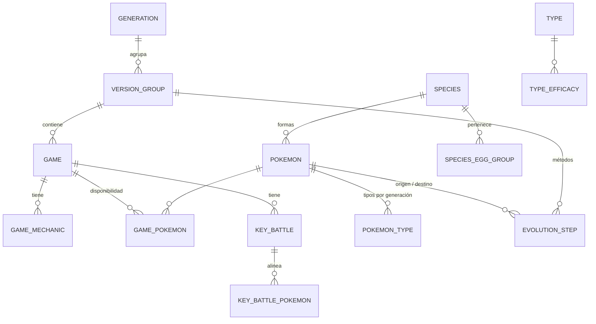
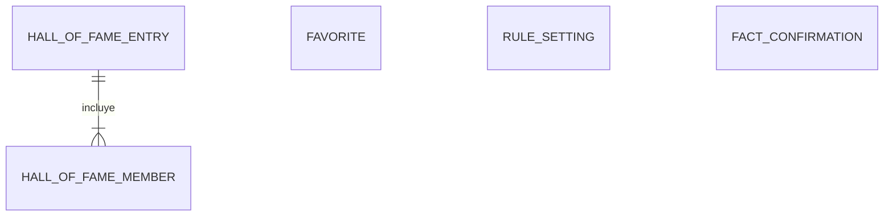

# Modelo de datos

Modelo de las dos bases de datos ([ADR-0003](../03-adr/0003-dos-bases-de-datos-sqlite.md)) y
del contexto que recibe el motor. Se deriva de los
[datos requeridos por las reglas](datos-requeridos.md).

## Principios

- **Dos ficheros SQLite**: `reference.sqlite` (datos de referencia, se reconstruye entera en
  cada ingesta) y `user.sqlite` (datos del usuario, con migraciones).
- **Claves naturales estables**: las tablas se identifican con los identificadores de PokeAPI
  (`vulpix-alola`, `firered`, `firered-leafgreen`, `water`), no con ids numéricos. Así
  `user.sqlite` sigue siendo válida cuando se reconstruye `reference.sqlite`. Los ids
  numéricos del CSV se traducen al cargar ([ADR-0004](../03-adr/0004-pokeapi-volcado-csv.md)).
- **Datos resueltos al cargar**: la ingesta deja los datos listos para cada generación o
  grupo de versiones (tipos, tabla de eficacias, métodos de evolución). Las reglas de negocio
  que los interpretan están en `core/`.
- **Origen de cada dato revisable**: las tablas con datos que pueden no ser fiables tienen las
  columnas `origin` (`automatic`, `inferred` o `pending`) y `fact_key`
  ([RN-18](../01-ddf/reglas-negocio.md#rn-18)).
- **Nombres en español**: se cargan de las tablas de nombres del CSV (idioma `es`).

## Base de datos de referencia (`reference.sqlite`)

### Juegos

| Tabla | Columnas | Notas |
|-------|----------|-------|
| `generation` | `number` PK, `slug` | 1 a 9. |
| `version_group` | `slug` PK, `generation`, `order` | P. ej., `firered-leafgreen`. Los datos de evolución y movimientos van por grupo de versiones. |
| `game` | `slug` PK, `name_es`, `version_group`, `generation`, `release_order`, `has_breeding`, `is_target` | `is_target` es falso en la 1.ª generación y en juegos sin crianza ([CA-29](../01-ddf/cuestiones-abiertas.md#resueltas)). |
| `game_mechanic` | `game`, `mechanic`, `value`, `origin`, `fact_key` | P. ej., `day_night_cycle`. Datos curados, normalmente inferidos. |
| `game_pokemon` | `game`, `pokemon`, `exists`, `exists_origin`, `can_arrive`, `arrival_origin` | Disponibilidad por forma ([RN-03](../01-ddf/reglas-negocio.md#rn-03)). `can_arrive`: si la etapa que nace del huevo puede llegar y evolucionar antes de completar el juego ([CA-28](../01-ddf/cuestiones-abiertas.md#abiertas)). |

### Pokémon

| Tabla | Columnas | Notas |
|-------|----------|-------|
| `species` | `slug` PK, `dex_number`, `name_es`, `generation`, `evolves_from`, `evolution_chain`, `is_baby`, `is_legendary`, `is_mythical` | Del CSV `pokemon_species`. |
| `species_egg_group` | `species`, `egg_group` | Para [RN-11](../01-ddf/reglas-negocio.md#rn-11). |
| `pokemon` | `slug` PK, `species`, `name_es`, `is_default`, `region` | Solo la forma base y las regionales ([RN-05](../01-ddf/reglas-negocio.md#rn-05)); se descartan las megaevoluciones y las formas de combate. |
| `pokemon_type` | `pokemon`, `generation`, `slot`, `type` | Una fila por generación y tipo, ya resuelta con `pokemon_types_past`. `slot` 1 es el tipo primario ([RN-13](../01-ddf/reglas-negocio.md#rn-13)). |
| `type` | `slug` PK, `name_es`, `generation` | Generación en que aparece. |
| `type_efficacy` | `generation`, `attacking`, `defending`, `factor` | Ya resuelta con `type_efficacy_past`. `factor` en centésimas (0, 50, 100, 200). |

### Evoluciones

| Tabla | Columnas | Notas |
|-------|----------|-------|
| `evolution_step` | `version_group`, `from_pokemon`, `to_pokemon`, `trigger`, `conditions` | Paso aplicable en ese grupo de versiones, ya resuelto a partir del `version_group_id` del CSV, que indica el grupo en que se introdujo la evolución ([plan de carga](plan-carga-datos.md#evoluciones)). `trigger` es el disparador de PokeAPI (`level-up`, `trade`, `use-item`, `shed`…) y `conditions`, un JSON con las condiciones no vacías (amistad, hora del día, objeto, belleza, comparación de estadísticas…), tal como vienen. Puede haber varias filas si hay métodos alternativos. |
| `level_move` | `pokemon`, `version_group`, `move`, `level` | Solo los movimientos que exige alguna evolución (`known_move`), para [RN-15](../01-ddf/reglas-negocio.md#rn-15) y [CA-32](../01-ddf/cuestiones-abiertas.md#resueltas). No se crea en la primera carga: no hace falta hasta la 4.ª generación. |

Clasificar un paso como tedioso a partir de su disparador y sus condiciones es una regla de
negocio y se hace en `core/evolution.py`, no en la base de datos. Por eso se guardan los datos
de PokeAPI sin reducirlos a una categoría.

### Combates clave

| Tabla | Columnas | Notas |
|-------|----------|-------|
| `key_battle` | `slug` PK, `game`, `category`, `trainer_name`, `order`, `origin`, `fact_key` | `category`: `gym_leader`, `elite_four`, `champion`, `villain_boss` o `rival_final` ([RN-17](../01-ddf/reglas-negocio.md#rn-17)). La lista de combates de cada juego es curada; los equipos salen de WikiDex. |
| `key_battle_pokemon` | `battle`, `position`, `pokemon`, `level` | Ya sin el inicial del rival ([CA-26](../01-ddf/cuestiones-abiertas.md#resueltas)). |

### Metadatos

| Tabla | Columnas | Notas |
|-------|----------|-------|
| `ingest_run` | `started_at`, `finished_at`, `pokeapi_commit`, `games`, `summary` | Una fila: la carga que generó el fichero. La API la expone para saber con qué datos se trabaja. |

## Base de datos del usuario (`user.sqlite`)

| Tabla | Columnas | Notas |
|-------|----------|-------|
| `favorite` | `pokemon` PK, `added_at` | Forma concreta ([RF-04](../01-ddf/requisitos-funcionales.md#rf-04)). |
| `rule_setting` | `rule_id` PK, `enabled`, `weight` | Solo reglas configurables. `weight` de 0 a 10 en las blandas ([CA-05](../01-ddf/cuestiones-abiertas.md#resueltas)). Si no hay fila, se usan los valores por defecto del catálogo. |
| `hall_of_fame_entry` | `id` PK, `game`, `completed_on`, `sequence`, `notes` | `sequence` es el orden de registro y desempata dos fechas iguales ([RF-12](../01-ddf/requisitos-funcionales.md#rf-12)). |
| `hall_of_fame_member` | `entry`, `position`, `pokemon`, `types` | `types` guarda los tipos que tenía en ese juego, como copia ([CA-07](../01-ddf/cuestiones-abiertas.md#resueltas)). |
| `fact_confirmation` | `fact_key` PK, `game`, `confirmed_value`, `proposed_value_hash`, `confirmed_at` | Si una nueva carga propone un valor con otro hash, la confirmación deja de valer ([RN-18](../01-ddf/reglas-negocio.md#rn-18)). |

Las columnas que apuntan a `reference.sqlite` (`pokemon`, `game`, `fact_key`) no pueden ser
claves foráneas, porque están en otro fichero. Las comprueba la ingesta antes de sustituir la
base de datos de referencia.

## Datos revisables (`fact_key`)

Cada dato revisable tiene una clave estable con el formato `tipo:juego:sujeto[:atributo]`:

| Tipo | Ejemplo | Tabla |
|------|---------|-------|
| Mecánica del juego | `mechanic:firered:day_night_cycle` | `game_mechanic` |
| Existencia en el juego | `pokemon:sword:growlithe-hisui:exists` | `game_pokemon` |
| Llegada antes de completar | `pokemon:firered:raichu:arrival` | `game_pokemon` |
| Combate clave | `battle:firered:brock` | `key_battle` |

Para generar, el valor de cada dato es el confirmado si existe y sigue siendo válido. Si no lo
es, el dato está sin verificar.

## Contexto del motor (`GameContext`)

Es la única entrada de `core/`. Lo construye `api/services/` a partir de las dos bases de datos:

| Campo | Contenido |
|-------|-----------|
| `game` | Juego, generación y mecánicas resueltas. |
| `type_chart` | Tabla de eficacias de la generación. |
| `favorites` | Candidatos con forma, especie, línea y rama evolutiva, tipos ordenados en el juego, si se puede criar, etapa que nace del huevo, pasos de evolución con su método y disponibilidad. |
| `pool` | Los demás Pokémon del juego, para las sugerencias de [RN-08](../01-ddf/reglas-negocio.md#rn-08), cada uno marcado como verificado o no ([CA-31](../01-ddf/cuestiones-abiertas.md#resueltas)). |
| `key_battles` | Combates clave con los tipos de cada Pokémon rival. |
| `journey` | Registros del *Hall of Fame* en orden. `core/journey.py` calcula con ellos las exclusiones. |
| `settings` | Reglas activas y pesos. |
| `unverified_facts` | Datos sin verificar que intervienen, para bloquear la generación ([RF-15](../01-ddf/requisitos-funcionales.md#rf-15)). |
