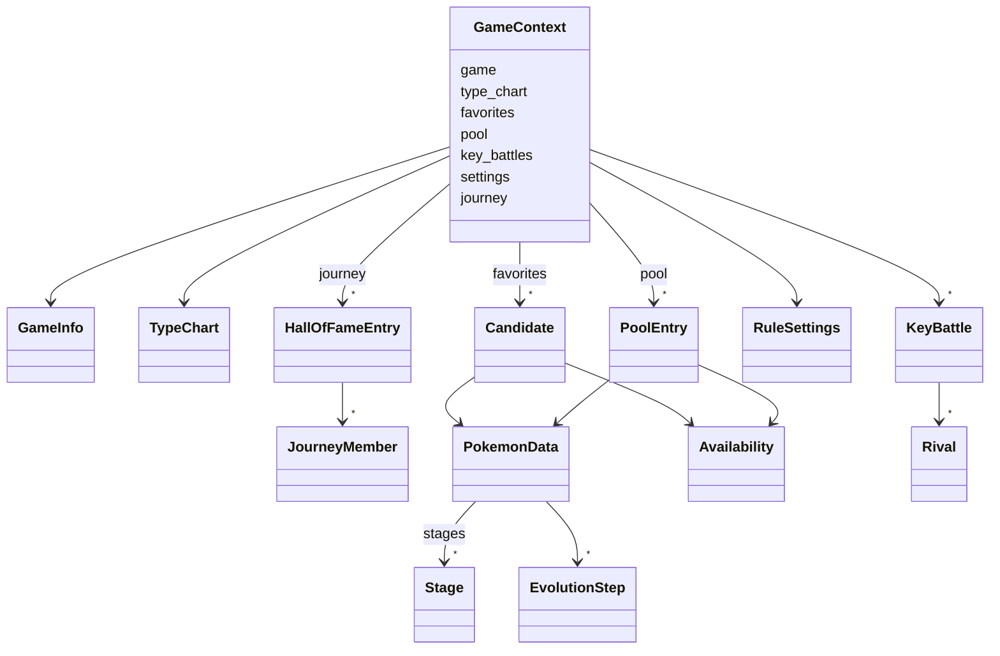

# Motor de reglas (`core/`)

Qué hay implementado en `core/`, el dominio puro que aplica las reglas de negocio y genera los
equipos, y cómo se usa. El plan completo, con las fases y la interpretación de cada regla,
está en el [plan de implementación del motor](plan-motor.md).

!!! note "Estado"
    Fases 1 a 3 de 6: modelos del dominio, tabla de tipos, catálogo de reglas con la
    configuración del usuario, filtros por candidato (RN-03, RN-11 y RN-16), dificultad de
    las evoluciones, reglas blandas (RN-06, RN-15, RN-17 y RN-20) y puntuación con su
    desglose y su desempate (RN-04, RN-19). La búsqueda y las sugerencias llegan en las
    fases 4 a 6.

## Restricciones

- Solo biblioteca estándar y nada de E/S: lo comprueban `import-linter` y
  `tests/test_architecture.py` ([estructura del código](estructura-codigo.md#reglas-de-dependencia)).
- Modelos inmutables (`dataclass(frozen=True)`): el motor no puede modificar su entrada.
- Fracciones exactas (`fractions.Fraction`) para los factores de tipo y las puntuaciones
  ([ADR-0006](../03-adr/0006-algoritmo-busqueda-exacta.md)).
- Los modelos validan su coherencia al crearse y lanzan un error con el motivo en español.

## Modelos del dominio (`core/domain/`)

| Modelo | Fichero | Qué representa |
|--------|---------|----------------|
| `TypeChart` | `types.py` | Tipos de una generación y factor de cada pareja atacante-defensor ([RN-10](../01-ddf/reglas-negocio.md#rn-10)). |
| `PokemonData` | `pokemon.py` | Una forma ([RN-05](../01-ddf/reglas-negocio.md#rn-05)) con la generación en que apareció ([RN-03](../01-ddf/reglas-negocio.md#rn-03)), sus tipos en la generación del juego, su especie, su cadena evolutiva, las etapas desde la primera de su línea hasta ella ([RN-09](../01-ddf/reglas-negocio.md#rn-09)) y los grupos huevo de toda la línea, evoluciones posteriores incluidas ([RN-11](../01-ddf/reglas-negocio.md#rn-11)). |
| `Stage` | `pokemon.py` | Una etapa de la línea: forma, especie y si es un bebé o un bebé de incienso ([CA-25](../01-ddf/cuestiones-abiertas.md#resueltas), [CA-36](../01-ddf/cuestiones-abiertas.md#resueltas)). |
| `EvolutionStep` | `pokemon.py` | Un paso entre dos etapas en el juego objetivo, con el disparador y las condiciones de PokeAPI ([RN-15](../01-ddf/reglas-negocio.md#rn-15), [RN-20](../01-ddf/reglas-negocio.md#rn-20)). |
| `Availability` | `pokemon.py` | Si la forma existe en el juego y puede llegar a tiempo ([RN-03](../01-ddf/reglas-negocio.md#rn-03)), ya confirmado. |
| `Candidate` | `pokemon.py` | Un favorito con su disponibilidad ([RN-02](../01-ddf/reglas-negocio.md#rn-02)). |
| `PoolEntry` | `pokemon.py` | Un Pokémon del juego que no es favorito, para las sugerencias, y si sus datos están verificados ([RN-08](../01-ddf/reglas-negocio.md#rn-08), [CA-31](../01-ddf/cuestiones-abiertas.md#resueltas)). |
| `GameInfo` | `game.py` | Juego objetivo, su generación y las mecánicas que tiene (`day_night_cycle`, `contests`). |
| `KeyBattle`, `Rival` | `game.py` | Combate clave y los tipos de cada Pokémon rival ([RN-17](../01-ddf/reglas-negocio.md#rn-17)). |
| `HallOfFameEntry`, `JourneyMember` | `journey.py` | Un juego completado, su orden en el recorrido y su equipo, con la cadena evolutiva y la región de cada miembro ([RN-16](../01-ddf/reglas-negocio.md#rn-16), [RF-12](../01-ddf/requisitos-funcionales.md#rf-12)). |
| `GameContext` | `context.py` | La única entrada del motor: todo lo anterior más la configuración del usuario y su recorrido. |

`core/domain/lines.py` identifica las líneas que algunas reglas tratan aparte: la de Dragonite
(RN-13, RN-16) y las evoluciones de Eevee que enumera RN-14.

### Tabla de tipos

`TypeChart.from_hundredths(generación, tipos, factores)` crea la tabla a partir de los factores
en centésimas de `reference.sqlite` (0, 50, 100 o 200). Exige un factor para **cada pareja**
de tipos de la generación. `factor(atacante, tipos_del_defensor)` devuelve el producto de los
factores contra cada tipo del defensor, como fracción exacta:

| Ejemplo | Factor |
|---------|--------|
| Agua contra Fuego | 2 |
| Agua contra Roca/Tierra (Geodude, Onix) | 4 |
| Eléctrico contra Agua/Tierra | 0 |
| Fantasma contra Psíquico en la 1.ª generación | 0 |

Preguntar por un tipo que no existe en la generación (Hada en la 3.ª) es un error.

### Validaciones

| Modelo | Comprueba |
|--------|-----------|
| `TypeChart` | Que estén todas las parejas de tipos y que cada factor sea 0, 50, 100 o 200. |
| `PokemonData` | Uno o dos tipos distintos; que la última etapa sea el propio Pokémon; que los pasos de evolución unan exactamente sus etapas consecutivas (puede haber varios pasos para la misma pareja: métodos alternativos). |
| `KeyBattle` | Que tenga al menos un rival. |
| `GameContext` | Que la tabla de tipos sea de la generación del juego, que no haya favoritos repetidos, que ningún favorito esté también en el `pool`, que no haya dos registros del *Hall of Fame* con el mismo orden y que todos los tipos existan en la generación del juego ([RN-10](../01-ddf/reglas-negocio.md#rn-10)). |

Los modelos son *hashables* para poder usarlos en conjuntos, salvo `TypeChart`, `RuleSettings`
y `GameContext`, que contienen diccionarios de solo lectura.

## Catálogo de reglas (`core/rules/catalog.py`)

`CATALOG` es el catálogo estático de [CA-10](../01-ddf/cuestiones-abiertas.md#resueltas): las 20
reglas del DDF con su clase y si son configurables.

| Clase | Reglas | Configurable |
|-------|--------|--------------|
| Dura (`hard`) | RN-01, RN-02, RN-03, RN-05, RN-09 | No |
| Dura (`hard`) | RN-07, RN-11, RN-12, RN-16 | Sí: activar o desactivar |
| Presencia (`presence`) | RN-13, RN-14 | Sí: activar o desactivar |
| Blanda (`soft`) | RN-06 (peso 1), RN-15 (3), RN-17 (10), RN-20 (5) | Sí: activar o desactivar y peso de 0 a 10 |
| Mecanismo (`mechanism`) | RN-04, RN-08, RN-10, RN-18, RN-19 | No |

### Configuración del usuario (`RuleSettings`)

- `RuleSettings.defaults()`: todas las reglas activas
  ([CA-41](../01-ddf/cuestiones-abiertas.md#resueltas)) y los pesos por defecto
  ([CA-05](../01-ddf/cuestiones-abiertas.md#resueltas),
  [CA-37](../01-ddf/cuestiones-abiertas.md#resueltas)).
- `with_changes(enabled={...}, weights={...})`: devuelve una copia con los cambios, sin
  modificar la original. Rechaza con `SettingsError`:
    - desactivar una regla que no es configurable;
    - una regla que no existe;
    - dar peso a una regla que no es blanda;
    - un peso fuera de 0 a 10.
- `is_enabled(regla)`, `weight(regla)` y `active_soft_rules()`, que devuelve las blandas
  activas en el orden del catálogo.

Es lo que guardará `user.sqlite` (`rule_setting`) y lo que la API validará al cambiar una regla
([API](api.md#reglas)).

## Crianza (`core/breeding.py`)

| Función | Qué hace |
|---------|----------|
| `can_be_bred(pokemon)` | Si la línea se puede criar: alguno de sus grupos huevo es distinto de `no-eggs` y `ditto` ([RN-11](../01-ddf/reglas-negocio.md#rn-11)). Pikachu y Pichu se pueden criar, porque los huevos de Pikachu dan Pichu; Mew, Zapdos, Ditto y Unown, no. |
| `egg_stage(pokemon)` | La etapa que nace del huevo y llega al juego: la primera de la línea, salvo un bebé de incienso, que se salta (Azumarill nace como Marill). Un bebé de incienso que es el propio favorito nace como él mismo ([CA-25](../01-ddf/cuestiones-abiertas.md#resueltas), [CA-36](../01-ddf/cuestiones-abiertas.md#resueltas)). |
| `steps_from_egg(pokemon)` | Los pasos de evolución desde esa etapa hasta el favorito, que son los que revisan RN-15 y RN-20 ([evoluciones](#evoluciones-coreevolutionpy)). |

## Recorrido (`core/journey.py`)

| Función | Qué hace |
|---------|----------|
| `affected_entries(recorrido, generación)` | Los registros del *Hall of Fame* cuyos equipos se excluyen en un juego de esa generación: el último juego completado, sea de la generación que sea, y todos los de la misma generación ([CA-17](../01-ddf/cuestiones-abiertas.md#resueltas)). |
| `excluding_entry(pokemon, recorrido, generación)` | El registro y el miembro que excluyen a un Pokémon, o nada. Un miembro excluye su línea evolutiva en la misma forma: misma cadena y misma región ([CA-18](../01-ddf/cuestiones-abiertas.md#resueltas)). Excepciones ([CA-21](../01-ddf/cuestiones-abiertas.md#resueltas)): la línea de Dragonite nunca se excluye, y de la de Eevee solo se excluye la forma usada. |

## Filtros por candidato (`core/rules/candidate.py`)

Se aplican a cada favorito por separado, en este orden. El primero que lo excluye da el
motivo ([RF-10](../01-ddf/requisitos-funcionales.md#rf-10)). Las sugerencias pasarán los mismos
filtros ([CA-40](../01-ddf/cuestiones-abiertas.md#resueltas)).

| Filtro | Regla | Configurable | Descarta si… | Motivo (`reason`) |
|--------|-------|--------------|--------------|-------------------|
| `AvailabilityFilter` | [RN-03](../01-ddf/reglas-negocio.md#rn-03) | No | apareció en una generación posterior a la del juego | `generation` |
| | | | no se puede tener en el juego | `game` |
| | | | no puede llegar y evolucionar antes de completarlo | `arrival` |
| `BreedingFilter` | [RN-11](../01-ddf/reglas-negocio.md#rn-11) | Sí | su línea no se puede criar | `breeding` |
| `JourneyFilter` | [RN-16](../01-ddf/reglas-negocio.md#rn-16) | Sí | su línea se usó en un equipo del recorrido que afecta al juego | `journey` |

Cada descarte (`Discard`) tiene el Pokémon, la regla, el motivo, un texto en español que lo
explica y, si lo decidió un dato que confirmó el usuario, su clave (`fact_key`), para indicar
qué datos confirmados se usaron ([RF-09](../01-ddf/requisitos-funcionales.md#rf-09)). Por
ejemplo:

| Pokémon | Regla | `reason` | `detail` | `fact_key` |
|---------|-------|----------|----------|------------|
| Treecko en Oro | RN-03 | `generation` | Treecko aparece en la 3.ª generación y gold es de la 2.ª | — |
| Raichu en Rojo Fuego | RN-03 | `arrival` | Raichu no puede llegar a firered y evolucionar antes de completarlo | `pokemon:firered:raichu:arrival` |
| Zapdos | RN-11 | `breeding` | Zapdos no se puede criar (grupos huevo de su línea: no-eggs) | — |
| Haunter tras usar Gengar en Verde Hoja | RN-16 | `journey` | Haunter queda excluido porque se usó gengar en leafgreen | — |

`valid_candidates(ctx)` devuelve los candidatos válidos y los descartes, los dos en **orden
canónico**: número de la Pokédex Nacional y, a igualdad, identificador de la forma
([RF-08](../01-ddf/requisitos-funcionales.md#rf-08)). Los textos usan los identificadores de
los juegos; la interfaz los mostrará con su nombre en español.

## Evoluciones (`core/evolution.py`)

Decide si un paso de evolución es tedioso ([RN-15](../01-ddf/reglas-negocio.md#rn-15)),
aleatorio ([RN-20](../01-ddf/reglas-negocio.md#rn-20)) o imposible en el juego objetivo, a
partir del disparador y las condiciones de PokeAPI tal como los guarda la ingesta
([modelo de datos](modelo-datos.md#evoluciones)).

`step_tedium(paso, juego)` devuelve los motivos (`Tedium`) por los que un paso es tedioso, o
ninguno si es fácil:

| Motivo | Disparador o condición de PokeAPI | Ejemplo |
|--------|-----------------------------------|---------|
| `trade` | `trade` (con o sin `held_item` o `trade_species`) | Haunter → Gengar, Onix → Steelix |
| `shed` | `shed` | Nincada → Shedinja |
| `random` | `percentage_chance` o `condition_expression` | Wurmple → Silcoon o Cascoon |
| `stats` | `relative_physical_stats` | Tyrogue → Hitmonlee |
| `time_of_day` | `time_of_day` | Eevee → Espeon |
| `beauty` | `minimum_beauty` | Feebas → Milotic |
| `location` | `location`, `region` | Magneton → Magnezone (4.ª generación) |
| `party` | `party_species`, `party_type` | Mantyke → Mantine (4.ª generación) |
| `move` | `known_move`, `known_move_type` | Piloswine → Mamoswine (4.ª generación) |
| `other` | Cualquier otro disparador o condición, también los desconocidos | Lluvia, girar la consola, golpes críticos |
| `impossible` | `time_of_day` sin `day_night_cycle` o `minimum_beauty` sin `contests` en el juego | Espeon y Milotic en Rojo Fuego |

No son tediosos `level-up` y `use-item` con nivel, amistad, cariño, objeto o un objeto
equipado sin más condiciones. Todo lo que el módulo no conoce cuenta como tedioso, para que
una condición nueva de PokeAPI nunca haga parecer fácil una evolución.

`assess(pokemon, juego)` revisa los pasos desde la etapa que nace del huevo
([CA-25](../01-ddf/cuestiones-abiertas.md#resueltas)) hasta el favorito y devuelve una
`EvolutionAssessment` con los pasos tediosos, en el orden de la línea, y sus motivos:

- `is_tedious`: algún paso es tedioso (RN-15).
- `is_random`: algún paso es aleatorio (RN-20). Un paso aleatorio también es tedioso.

Si una pareja de etapas tiene varios métodos, cuenta el más fácil, porque el jugador lo elige.

Con los datos reales de Rojo Fuego, 21 de los 184 pasos son tediosos: los intercambios, Tyrogue,
Wurmple, Nincada → Shedinja y, por ser imposibles en el juego, Espeon, Umbreon y Milotic.

## Reglas blandas (`core/rules/soft.py`)

Cada regla blanda puntúa un equipo entre 0 y 1 y dice qué miembros cuentan en contra
(`SoftScore`). `SOFT_RULES` las reúne por identificador.

| Clase | Regla | Puntuación |
|-------|-------|------------|
| `SameSpeciesRule` | [RN-06](../01-ddf/reglas-negocio.md#rn-06) | 1 si no hay dos formas de la misma especie; si las hay, 0. |
| `TediousEvolutionRule` | [RN-15](../01-ddf/reglas-negocio.md#rn-15) | `1 − tediosos / miembros`. Un equipo vacío puntúa 1. |
| `KeyBattleCoverageRule` | [RN-17](../01-ddf/reglas-negocio.md#rn-17) | Media de los combates clave; cada combate es la media de sus rivales y cada rival, la media de ataque y defensa. Sin combates clave, 0. |
| `RandomEvolutionRule` | [RN-20](../01-ddf/reglas-negocio.md#rn-20) | 1 si ningún miembro necesita una evolución aleatoria; si alguno la necesita, 0. |

En RN-17, frente a cada Pokémon rival:

- **Ataque**: algún tipo de algún miembro le hace ×2 o más (el factor es el producto contra
  sus dos tipos).
- **Defensa**: algún miembro recibe ×0,5 o menos (inmunidad incluida) de al menos un tipo del
  rival y menos de ×2 de todos.

Ejemplo de Brock (Geodude y Onix, Roca/Tierra): un miembro de tipo Agua cubre el ataque
(×4) y puntúa 1/2. Con uno de tipo Lucha, que resiste Roca y no es débil a Tierra, se cubre
también la defensa y se llega a 1.

## Puntuación (`core/scoring.py`)

`score_team(equipo, ctx)` aplica las reglas blandas activas, en el orden del catálogo, y
devuelve un `TeamScore`:

| Campo | Qué es |
|-------|--------|
| `breakdown` | Una `RuleContribution` por regla activa: peso, puntuación, aportación (`peso · puntuación`) y miembros que cuentan en contra ([RF-09](../01-ddf/requisitos-funcionales.md#rf-09)). Una regla con peso 0 aparece, pero no aporta nada. |
| `total` | La suma de las aportaciones ([RN-04](../01-ddf/reglas-negocio.md#rn-04)), así que el desglose siempre cuadra. |
| `dual_types` | Miembros con dos tipos en el juego objetivo. |
| `ranking_key` | `(total, dual_types)`: mayor es mejor. Primero la puntuación y, a igualdad, más miembros con dos tipos ([RN-19](../01-ddf/reglas-negocio.md#rn-19)). |

Los miembros se ordenan antes de puntuar (`canonical_team`), así que el resultado no depende del
orden en que llegan. Todo es exacto, con `Fraction`
([ADR-0006](../03-adr/0006-algoritmo-busqueda-exacta.md)).

Con los pesos por defecto, en un equipo de 6, Beautifly resta 5,5 puntos (0,5 por RN-15 y 5
por RN-20) y Gengar resta 0,5, como en el ejemplo de RN-20.

## Pruebas

| Fichero | Qué comprueba |
|---------|---------------|
| `tests/core/test_type_chart.py` | Factores contra uno y dos tipos, inmunidades, tablas distintas por generación (RN-10) y tablas incompletas o con factores no válidos. |
| `tests/core/test_catalog.py` | Que el catálogo tenga las 20 reglas, cuáles son configurables, los pesos por defecto (RN-04), que todas empiecen activas (CA-41) y los cambios válidos y no válidos. |
| `tests/core/test_domain.py` | Formas regionales como Pokémon distintos (RN-05), el favorito como evolución con sus etapas (RN-09), validaciones de los modelos y del contexto, y tipos que no existen en la generación (RN-10). |
| `tests/core/test_breeding.py` | Crianza por grupos huevo con los ejemplos de RN-11 (Zapdos, Mew, Ditto, Dragonite, Pikachu y Pichu), etapa que nace del huevo (CA-25) y bebés de incienso (CA-36). |
| `tests/core/test_journey.py` | Qué equipos se excluyen en cada ejemplo del recorrido de RN-16, el equipo de Verde Hoja en Rojo Fuego con las excepciones de Dragonite y Eevee, y que la exclusión es por forma (CA-18). |
| `tests/core/test_evolution.py` | Gengar, Raichu, Milotic, Espeon y Beautifly en Rojo Fuego y en Esmeralda, cada método de CA-20, condiciones desconocidas, métodos alternativos y pasos anteriores a la etapa que nace del huevo (RN-15, RN-20). |
| `tests/core/rules/test_soft.py` | RN-06 (Vulpix y Vulpix de Alola), RN-15, RN-20 y RN-17 con el ejemplo de Brock, el peso de cada combate y de cada rival, y la tabla de tipos de la generación. Que cada regla blanda del catálogo esté implementada. |
| `tests/core/test_scoring.py` | Pesos por defecto en el desglose, el ejemplo de Beautifly y Gengar, reglas desactivadas y con peso 0, desempate de Lapras y Blastoise (RN-19) y, con hypothesis, que el total sea la suma del desglose, esté entre 0 y la suma de pesos y no dependa del orden de los miembros. |
| `tests/core/rules/test_candidate.py` | Los tres niveles de RN-03 (Vulpix, Treecko, Growlithe de Hisui y Raichu), RN-11 y RN-16 con su motivo, las reglas desactivadas, el orden entre filtros y el orden canónico. |

`tests/core/builders.py` tiene constructores de datos de prueba legibles, que usarán todas las
fases: `pokemon("gengar", ("ghost", "poison"), line=("gastly", "haunter"), steps=[...])`,
`type_chart(overrides={("water", "rock"): 200})`, `candidate(...)`, `battle(...)` y
`context(...)`. Cada test solo indica lo que le importa.
