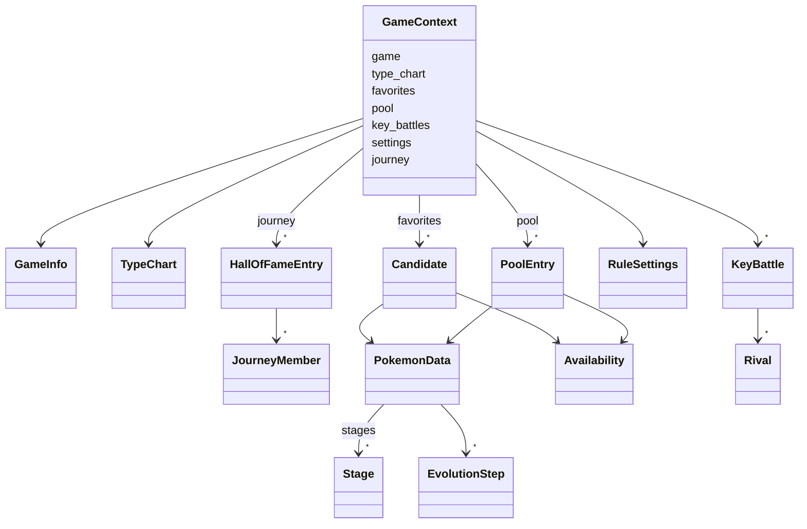

# Motor de reglas (`core/`)

Qué hay implementado en `core/`, el dominio puro que aplica las reglas de negocio y genera los
equipos, y cómo se usa. El plan completo, con las fases y la interpretación de cada regla,
está en el [plan de implementación del motor](plan-motor.md).

!!! note "Estado"
    Motor completo (fases 1 a 6): modelos del dominio, tabla de tipos, catálogo de reglas con
    la configuración del usuario, filtros por candidato, dificultad de las evoluciones, reglas
    blandas y puntuación, reglas de equipo, `generate()` con el equipo incompleto, sus
    sugerencias y la agrupación de empates, y la revisión de los datos sin verificar (RN-18).
    La API construye el `GameContext` desde las bases de datos (fase 3 del
    [plan de la API](plan-api.md#fases)).

## Restricciones

- Solo biblioteca estándar y nada de E/S: lo comprueban `import-linter` y
  `tests/test_architecture.py` ([estructura del código](estructura-codigo.md#reglas-de-dependencia)).
- Modelos inmutables (`dataclass(frozen=True)`): el motor no puede modificar su entrada.
- Fracciones exactas (`fractions.Fraction`) para los factores de tipo y las puntuaciones
  ([ADR-0006](../03-adr/0006-algoritmo-busqueda-exacta.md)).
- Los modelos validan su coherencia al crearse y lanzan un error con el motivo en español.

## Modelos del dominio (`core/domain/`)



| Modelo | Fichero | Qué representa |
|--------|---------|----------------|
| `TypeChart` | `types.py` | Tipos de una generación y factor de cada pareja atacante-defensor ([RN-10](../01-ddf/reglas-negocio.md#rn-10)). |
| `PokemonData` | `pokemon.py` | Una forma ([RN-05](../01-ddf/reglas-negocio.md#rn-05)) con la generación en que apareció ([RN-03](../01-ddf/reglas-negocio.md#rn-03)), sus tipos en la generación del juego, su especie, su cadena evolutiva, las etapas desde la primera de su línea hasta ella ([RN-09](../01-ddf/reglas-negocio.md#rn-09)) y los grupos huevo de toda la línea, evoluciones posteriores incluidas ([RN-11](../01-ddf/reglas-negocio.md#rn-11)). |
| `Stage` | `pokemon.py` | Una etapa de la línea: forma, especie y si es un bebé o un bebé de incienso ([CA-25](../01-ddf/cuestiones-abiertas.md#resueltas), [CA-36](../01-ddf/cuestiones-abiertas.md#resueltas)). |
| `EvolutionStep` | `pokemon.py` | Un paso entre dos etapas en el juego objetivo, con el disparador y las condiciones de PokeAPI ([RN-15](../01-ddf/reglas-negocio.md#rn-15), [RN-20](../01-ddf/reglas-negocio.md#rn-20)). |
| `Availability` | `pokemon.py` | Si la forma existe en el juego y puede llegar a tiempo ([RN-03](../01-ddf/reglas-negocio.md#rn-03)), ya confirmado. |
| `Candidate` | `pokemon.py` | Un favorito con su disponibilidad ([RN-02](../01-ddf/reglas-negocio.md#rn-02)). |
| `PoolEntry` | `pokemon.py` | Un Pokémon del juego que no es favorito, para las sugerencias, y si sus datos están verificados ([RN-08](../01-ddf/reglas-negocio.md#rn-08), [CA-31](../01-ddf/cuestiones-abiertas.md#resueltas)). |
| `GameInfo` | `game.py` | Juego objetivo, su generación, las mecánicas que tiene (`day_night_cycle`, `contests`) y su nombre en español para las explicaciones (`label`, el identificador si no lo tiene). |
| `KeyBattle`, `Rival` | `game.py` | Combate clave y los tipos de cada Pokémon rival ([RN-17](../01-ddf/reglas-negocio.md#rn-17)). |
| `HallOfFameEntry`, `JourneyMember` | `journey.py` | Un juego completado, su orden en el recorrido y su equipo, con la cadena evolutiva y la región de cada miembro ([RN-16](../01-ddf/reglas-negocio.md#rn-16), [RF-12](../01-ddf/requisitos-funcionales.md#rf-12)), y los nombres del juego y de cada miembro para las explicaciones. |
| `GameContext` | `context.py` | La única entrada del motor: todo lo anterior más la configuración del usuario y su recorrido. |

`core/domain/lines.py` identifica las líneas que algunas reglas tratan aparte: la de Dragonite
(RN-13, RN-16) y las evoluciones de Eevee que enumera RN-14.

### Tabla de tipos

`TypeChart.from_hundredths(generación, tipos, factores)` crea la tabla a partir de los factores
en centésimas de `reference.sqlite` (0, 50, 100 o 200). Exige un factor para **cada pareja**
de tipos de la generación. `factor(atacante, tipos_del_defensor)` devuelve el producto de los
factores contra cada tipo del defensor, como fracción exacta:

| Ejemplo | Factor |
|---------|--------|
| Agua contra Fuego | 2 |
| Agua contra Roca/Tierra (Geodude, Onix) | 4 |
| Eléctrico contra Agua/Tierra | 0 |
| Fantasma contra Psíquico en la 1.ª generación | 0 |

Preguntar por un tipo que no existe en la generación (Hada en la 3.ª) es un error.

### Validaciones

| Modelo | Comprueba |
|--------|-----------|
| `TypeChart` | Que estén todas las parejas de tipos y que cada factor sea 0, 50, 100 o 200. |
| `PokemonData` | Uno o dos tipos distintos; que la última etapa sea el propio Pokémon; que los pasos de evolución unan exactamente sus etapas consecutivas (puede haber varios pasos para la misma pareja: métodos alternativos). |
| `KeyBattle` | Que tenga al menos un rival. |
| `GameContext` | Que la tabla de tipos sea de la generación del juego, que no haya favoritos repetidos, que ningún favorito esté también en el `pool`, que no haya dos registros del *Hall of Fame* con el mismo orden y que todos los tipos existan en la generación del juego ([RN-10](../01-ddf/reglas-negocio.md#rn-10)), salvo los de formas de una generación posterior, que no tienen tipos en ella y que RN-03 descarta antes de usarlos. |

Los modelos son *hashables* para poder usarlos en conjuntos, salvo `TypeChart`, `RuleSettings`
y `GameContext`, que contienen diccionarios de solo lectura.

## Catálogo de reglas (`core/rules/catalog.py`)

`CATALOG` es el catálogo estático de [CA-10](../01-ddf/cuestiones-abiertas.md#resueltas): las 20
reglas del DDF con su nombre, una descripción de una frase para la interfaz
([RF-07](../01-ddf/requisitos-funcionales.md#rf-07)), su clase y si son configurables.

| Clase | Reglas | Configurable |
|-------|--------|--------------|
| Dura (`hard`) | RN-01, RN-02, RN-03, RN-05, RN-09 | No |
| Dura (`hard`) | RN-07, RN-11, RN-12, RN-16 | Sí: activar o desactivar |
| Presencia (`presence`) | RN-13, RN-14 | Sí: activar o desactivar |
| Blanda (`soft`) | RN-06 (peso 1), RN-15 (3), RN-17 (10), RN-20 (5) | Sí: activar o desactivar y peso de 0 a 10 |
| Mecanismo (`mechanism`) | RN-04, RN-08, RN-10, RN-18, RN-19 | No |

### Configuración del usuario (`RuleSettings`)

- `RuleSettings.defaults()`: todas las reglas activas
  ([CA-41](../01-ddf/cuestiones-abiertas.md#resueltas)) y los pesos por defecto
  ([CA-05](../01-ddf/cuestiones-abiertas.md#resueltas),
  [CA-37](../01-ddf/cuestiones-abiertas.md#resueltas)).
- `with_changes(enabled={...}, weights={...})`: devuelve una copia con los cambios, sin
  modificar la original. Rechaza con `SettingsError`:
    - desactivar una regla que no es configurable;
    - una regla que no existe;
    - dar peso a una regla que no es blanda;
    - un peso fuera de 0 a 10.
- `is_enabled(regla)`, `weight(regla)` y `active_soft_rules()`, que devuelve las blandas
  activas en el orden del catálogo.

Es lo que guardará `user.sqlite` (`rule_setting`) y lo que la API validará al cambiar una regla
([API](api.md#reglas)).

## Crianza (`core/breeding.py`)

| Función | Qué hace |
|---------|----------|
| `can_be_bred(pokemon)` | Si la línea se puede criar: alguno de sus grupos huevo es distinto de `no-eggs` y `ditto` ([RN-11](../01-ddf/reglas-negocio.md#rn-11)). Pikachu y Pichu se pueden criar, porque los huevos de Pikachu dan Pichu; Mew, Zapdos, Ditto y Unown, no. |
| `egg_stage(pokemon)` | La etapa que nace del huevo y llega al juego: la primera de la línea, salvo un bebé de incienso, que se salta (Azumarill nace como Marill). Un bebé de incienso que es el propio favorito nace como él mismo ([CA-25](../01-ddf/cuestiones-abiertas.md#resueltas), [CA-36](../01-ddf/cuestiones-abiertas.md#resueltas)). |
| `steps_from_egg(pokemon)` | Los pasos de evolución desde esa etapa hasta el favorito, que son los que revisan RN-15 y RN-20 ([evoluciones](#evoluciones-coreevolutionpy)). |

## Recorrido (`core/journey.py`)

| Función | Qué hace |
|---------|----------|
| `affected_entries(recorrido, generación)` | Los registros del *Hall of Fame* cuyos equipos se excluyen en un juego de esa generación: el último juego completado, sea de la generación que sea, y todos los de la misma generación ([CA-17](../01-ddf/cuestiones-abiertas.md#resueltas)). |
| `excluding_entry(pokemon, recorrido, generación)` | El registro y el miembro que excluyen a un Pokémon, o nada. Un miembro excluye su línea evolutiva en la misma forma: misma cadena y misma región ([CA-18](../01-ddf/cuestiones-abiertas.md#resueltas)). Excepciones ([CA-21](../01-ddf/cuestiones-abiertas.md#resueltas)): la línea de Dragonite nunca se excluye, y de la de Eevee solo se excluye la forma usada. |

## Filtros por candidato (`core/rules/candidate.py`)

Se aplican a cada favorito por separado, en este orden. El primero que lo excluye da el
motivo ([RF-10](../01-ddf/requisitos-funcionales.md#rf-10)). Las sugerencias pasarán los mismos
filtros ([CA-40](../01-ddf/cuestiones-abiertas.md#resueltas)).

| Filtro | Regla | Configurable | Descarta si… | Motivo (`reason`) |
|--------|-------|--------------|--------------|-------------------|
| `AvailabilityFilter` | [RN-03](../01-ddf/reglas-negocio.md#rn-03) | No | apareció en una generación posterior a la del juego | `generation` |
| | | | no se puede tener en el juego | `game` |
| | | | no puede llegar y evolucionar antes de completarlo | `arrival` |
| `BreedingFilter` | [RN-11](../01-ddf/reglas-negocio.md#rn-11) | Sí | su línea no se puede criar | `breeding` |
| `JourneyFilter` | [RN-16](../01-ddf/reglas-negocio.md#rn-16) | Sí | su línea se usó en un equipo del recorrido que afecta al juego | `journey` |

Cada descarte (`Discard`) tiene el Pokémon, la regla, el motivo, un texto en español que lo
explica y, si lo decidió un dato que confirmó el usuario, su clave (`fact_key`), para indicar
qué datos confirmados se usaron ([RF-09](../01-ddf/requisitos-funcionales.md#rf-09)). Por
ejemplo:

| Pokémon | Regla | `reason` | `detail` | `fact_key` |
|---------|-------|----------|----------|------------|
| Treecko en Oro | RN-03 | `generation` | Treecko aparece en la 3.ª generación y Oro es de la 2.ª | — |
| Raichu en Rojo Fuego | RN-03 | `arrival` | Raichu no puede llegar a Rojo Fuego y evolucionar antes de completarlo | `pokemon:firered:raichu:arrival` |
| Zapdos | RN-11 | `breeding` | Zapdos no se puede criar (grupos huevo de su línea: no-eggs) | — |
| Haunter tras usar Gengar en Verde Hoja | RN-16 | `journey` | Haunter queda excluido porque se usó Gengar en Verde Hoja | — |

Los textos usan los nombres en español del juego (`GameInfo.name`), del juego del recorrido
(`HallOfFameEntry.game_name`) y del miembro usado (`JourneyMember.name`), que rellena la API. Si
faltan, como en muchos tests, usan los identificadores.

`valid_candidates(ctx)` devuelve los candidatos válidos y los descartes, los dos en **orden
canónico**: número de la Pokédex Nacional y, a igualdad, identificador de la forma
([RF-08](../01-ddf/requisitos-funcionales.md#rf-08)). Los textos usan los identificadores de
los juegos; la interfaz los mostrará con su nombre en español.

## Evoluciones (`core/evolution.py`)

Decide si un paso de evolución es tedioso ([RN-15](../01-ddf/reglas-negocio.md#rn-15)),
aleatorio ([RN-20](../01-ddf/reglas-negocio.md#rn-20)) o imposible en el juego objetivo, a
partir del disparador y las condiciones de PokeAPI tal como los guarda la ingesta
([modelo de datos](modelo-datos.md#evoluciones)).

`step_tedium(paso, juego)` devuelve los motivos (`Tedium`) por los que un paso es tedioso, o
ninguno si es fácil:

| Motivo | Disparador o condición de PokeAPI | Ejemplo |
|--------|-----------------------------------|---------|
| `trade` | `trade` (con o sin `held_item` o `trade_species`) | Haunter → Gengar, Onix → Steelix |
| `shed` | `shed` | Nincada → Shedinja |
| `random` | `percentage_chance` o `condition_expression` | Wurmple → Silcoon o Cascoon |
| `stats` | `relative_physical_stats` | Tyrogue → Hitmonlee |
| `time_of_day` | `time_of_day` | Eevee → Espeon |
| `beauty` | `minimum_beauty` | Feebas → Milotic |
| `location` | `location`, `region` | Magneton → Magnezone (4.ª generación) |
| `party` | `party_species`, `party_type` | Mantyke → Mantine (4.ª generación) |
| `move` | `known_move`, `known_move_type` | Piloswine → Mamoswine (4.ª generación) |
| `other` | Cualquier otro disparador o condición, también los desconocidos | Lluvia, girar la consola, golpes críticos |
| `impossible` | `time_of_day` sin `day_night_cycle` o `minimum_beauty` sin `contests` en el juego | Espeon y Milotic en Rojo Fuego |

No son tediosos `level-up` y `use-item` con nivel, amistad, cariño, objeto o un objeto
equipado sin más condiciones. Todo lo que el módulo no conoce cuenta como tedioso, para que
una condición nueva de PokeAPI nunca haga parecer fácil una evolución.

!!! warning "Provisional hasta la fase 7 del plan de carga"
    Tras revisar esta fase se decidió que la clasificación sea un dato
    ([`evolution_methods.yaml`](datos-curados.md#evolution_methodsyaml)) y que lo que no esté
    catalogado bloquee la carga para que lo catalogue el arquitecto en una nueva versión
    ([CA-42](../01-ddf/cuestiones-abiertas.md#resueltas),
    [CA-47](../01-ddf/cuestiones-abiertas.md#resueltas)). Entonces el motor recibirá la
    clasificación en el contexto y un método sin catalogar será un error. También cambia el
    sexo (`gender_id`), que pasa a no ser tedioso
    ([CA-43](../01-ddf/cuestiones-abiertas.md#resueltas)); hoy cuenta como `other`. Ninguno
    de los dos cambios afecta a las generaciones 1 a 3.

`assess(pokemon, juego)` revisa los pasos desde la etapa que nace del huevo
([CA-25](../01-ddf/cuestiones-abiertas.md#resueltas)) hasta el favorito y devuelve una
`EvolutionAssessment` con los pasos tediosos, en el orden de la línea, y sus motivos:

- `is_tedious`: algún paso es tedioso (RN-15).
- `is_random`: algún paso es aleatorio (RN-20). Un paso aleatorio también es tedioso.

Si una pareja de etapas tiene varios métodos, cuenta el más fácil, porque el jugador lo elige
([CA-44](../01-ddf/cuestiones-abiertas.md#resueltas)).

Con los datos reales de Rojo Fuego, 21 de los 184 pasos son tediosos: los intercambios, Tyrogue,
Wurmple, Nincada → Shedinja y, por ser imposibles en el juego, Espeon, Umbreon y Milotic.

## Reglas blandas (`core/rules/soft.py`)

Cada regla blanda puntúa un equipo entre 0 y 1 y dice qué miembros cuentan en contra
(`SoftScore`). `SOFT_RULES` las reúne por identificador.

La puntuación no es aditiva por miembro, porque RN-17 depende de la combinación. Lo que cada
regla necesita de un miembro se calcula una sola vez, en su **perfil** (`MemberProfile`), y las
reglas puntúan el equipo a partir de los perfiles. Así la búsqueda puede puntuar miles de
equipos sin repetir cálculos ([algoritmo](algoritmo-generacion.md#forma-del-problema)):

| Campo del perfil | Para | Qué es |
|------------------|------|--------|
| `tedious`, `random` | RN-15, RN-20 | Lo que dice `evolution.assess` del miembro. |
| `attack`, `defense` | RN-17 | Conjuntos de bits sobre los Pokémon rivales de todos los combates (`Rivals`): a cuáles ataca con superefectividad y frente a cuáles cubre la defensa. La cobertura de un equipo es la unión de los de sus miembros. |

`Rivals.of(combates)` da un bit a cada aparición de un rival, la máscara de bits de cada combate
y un denominador común, para que RN-17 sume los combates con enteros y cree una sola fracción
por equipo.

| Clase | Regla | Puntuación |
|-------|-------|------------|
| `SameSpeciesRule` | [RN-06](../01-ddf/reglas-negocio.md#rn-06) | 1 si no hay dos formas de la misma especie; si las hay, 0. |
| `TediousEvolutionRule` | [RN-15](../01-ddf/reglas-negocio.md#rn-15) | `1 − tediosos / miembros`. Un equipo vacío puntúa 1. |
| `KeyBattleCoverageRule` | [RN-17](../01-ddf/reglas-negocio.md#rn-17) | Media de los combates clave; cada combate es la media de sus rivales y cada rival, la media de ataque y defensa. Sin combates clave, 0. |
| `RandomEvolutionRule` | [RN-20](../01-ddf/reglas-negocio.md#rn-20) | 1 si ningún miembro necesita una evolución aleatoria; si alguno la necesita, 0. |

En RN-17, frente a cada Pokémon rival:

- **Ataque**: algún tipo de algún miembro le hace ×2 o más (el factor es el producto contra
  sus dos tipos).
- **Defensa**: algún miembro recibe ×0,5 o menos (inmunidad incluida) de al menos un tipo del
  rival y menos de ×2 de todos.

Ejemplo de Brock (Geodude y Onix, Roca/Tierra): un miembro de tipo Agua cubre el ataque
(×4) y puntúa 1/2. Con uno de tipo Lucha, que resiste Roca y no es débil a Tierra, se cubre
también la defensa y se llega a 1.

## Puntuación (`core/scoring.py`)

`score_team(equipo, ctx)` aplica las reglas blandas activas, en el orden del catálogo, y
devuelve un `TeamScore`. Para puntuar muchos equipos del mismo contexto, `Scorer(ctx)` guarda el
perfil de cada miembro: `score(equipo)` devuelve el `TeamScore` y `ranking_key(equipo)` solo la
clave de comparación, sin construir el desglose.

| Campo | Qué es |
|-------|--------|
| `breakdown` | Una `RuleContribution` por regla activa: peso, puntuación, aportación (`peso · puntuación`) y miembros que cuentan en contra ([RF-09](../01-ddf/requisitos-funcionales.md#rf-09)). Una regla con peso 0 aparece, pero no aporta nada. |
| `total` | La suma de las aportaciones ([RN-04](../01-ddf/reglas-negocio.md#rn-04)), así que el desglose siempre cuadra. |
| `dual_types` | Miembros con dos tipos en el juego objetivo. |
| `ranking_key` | `(total, dual_types)`: mayor es mejor. Primero la puntuación y, a igualdad, más miembros con dos tipos ([RN-19](../01-ddf/reglas-negocio.md#rn-19)). |

Los miembros se ordenan antes de puntuar (`canonical_team`), así que el resultado no depende del
orden en que llegan. Todo es exacto, con `Fraction`
([ADR-0006](../03-adr/0006-algoritmo-busqueda-exacta.md)).

Con los pesos por defecto, en un equipo de 6, Beautifly resta 5,5 puntos (0,5 por RN-15 y 5
por RN-20) y Gengar resta 0,5, como en el ejemplo de RN-20.

## Reglas de equipo (`core/rules/team.py`)

### Restricciones entre miembros

Cada una dice si dos candidatos no pueden estar en el mismo equipo (`conflicts(a, b)`). Juntas
forman el grafo de incompatibilidades de la búsqueda.

| Clase | Regla | Dos miembros chocan si… |
|-------|-------|-------------------------|
| `SameLineConstraint` | [RN-07](../01-ddf/reglas-negocio.md#rn-07) | son de la misma cadena de evolución (Jolteon y Vaporeon, Rhydon y Rhyperior). |
| `SharedTypeConstraint` | [RN-12](../01-ddf/reglas-negocio.md#rn-12) | comparten algún tipo en el juego objetivo, como primario o secundario (Charizard y Pidgeot, Gengar y Nidoking). |
| `SingleEeveeEvolutionConstraint` | [RN-14](../01-ddf/reglas-negocio.md#rn-14) | los dos son evoluciones de Eevee. Eevee no cuenta como evolución. |

`active_pair_constraints(settings)` devuelve las activas y `conflict(a, b, restricciones)`, la
primera regla que impide que dos miembros vayan juntos, para explicarlo.

### Reglas de presencia

`requirement(válidos, sugeribles)` resuelve cada regla al primer nivel del DDF que se puede
cumplir y devuelve un `PresenceRequirement` con el nivel, el estado y los Pokémon que la
cumplen (`options`), en orden canónico. Los **sugeribles** son los Pokémon del juego que no
son favoritos y pasan los filtros por candidato ([CA-40](../01-ddf/cuestiones-abiertas.md#resueltas)).

| Regla | Nivel | Estado | `options` |
|-------|-------|--------|-----------|
| [RN-13](../01-ddf/reglas-negocio.md#rn-13) (`DragonPresence`) | 1 | `candidates` | Dragonite, si es candidato válido. |
| | 2 | `candidates` | Los candidatos válidos de tipo primario Dragón (Garchomp sí, Kingdra no). |
| | 3 | `reserved` | Los sugeribles de tipo primario Dragón: se reserva un hueco. |
| | 4 | `unmet` | Ninguno: se genera el equipo sin la regla. |
| [RN-14](../01-ddf/reglas-negocio.md#rn-14) (`EeveePresence`) | 1 | `candidates` | Las evoluciones de Eevee candidatas. |
| | 2 | `reserved` | Las evoluciones de Eevee sugeribles. |
| | 3 | `unmet` | Ninguna. |

Con el estado `candidates`, el equipo tiene que incluir **al menos uno** de `options`. Que
incluya solo uno lo garantizan RN-12 (dos de tipo primario Dragón comparten tipo) y la
restricción de RN-14.

## Comprobación de un equipo elegido (`core/rules/check.py`)

`check_team(ctx, miembros)` comprueba un equipo que elige el usuario en el selector del
resultado ([RF-12](../01-ddf/requisitos-funcionales.md#rf-12),
[CA-53](../01-ddf/cuestiones-abiertas.md#resueltas)): una alternativa por posición y una
sugerencia por hueco. Dos sugerencias de huecos libres encajan cada una con el equipo, pero no
necesariamente entre sí, así que el equipo se comprueba antes de registrarlo. Usa las mismas
funciones que el motor, así que no duplica ninguna regla:

| Comprobación | Reglas | Cómo |
|--------------|--------|------|
| Cada miembro pasa los filtros por candidato | [RN-03](../01-ddf/reglas-negocio.md#rn-03), [RN-11](../01-ddf/reglas-negocio.md#rn-11), [RN-16](../01-ddf/reglas-negocio.md#rn-16) | `first_exclusion`, con el texto del descarte. |
| No hay dos miembros incompatibles | [RN-07](../01-ddf/reglas-negocio.md#rn-07), [RN-12](../01-ddf/reglas-negocio.md#rn-12), [RN-14](../01-ddf/reglas-negocio.md#rn-14) | `conflict` con las restricciones activas, para cada par. |
| Se cumplen las reglas de presencia en el nivel que se aplica | [RN-13](../01-ddf/reglas-negocio.md#rn-13), RN-14 | El equipo incluye uno de los `options` de cada regla `candidates` o `reserved` de `resolved_presence(ctx)`: el mismo nivel que `generate(ctx).presence`, con el desplazamiento de [CA-48](../01-ddf/cuestiones-abiertas.md#resueltas), pero sin buscar los mejores equipos. |

Devuelve un `TeamCheck` con los problemas (`TeamProblem`: regla, miembros afectados y
explicación en español), en ese orden, y los miembros del pool sin verificar
([CA-31](../01-ddf/cuestiones-abiertas.md#resueltas)), que no son un problema. Los miembros
pueden ser favoritos o Pokémon del pool (las sugerencias); si alguno no es ninguna de las dos
cosas, lanza `UnknownMemberError` con sus identificadores. El tamaño del equipo no se
comprueba: uno incompleto puede tener huecos sin sugerencias.

## Motor (`core/engine/`)

`generate(ctx)` devuelve un `GenerationResult`
([algoritmo](algoritmo-generacion.md#procedimiento)):

1. **Filtros por candidato** (`valid_candidates`): candidatos válidos y descartes.
2. **Presencia** (`presence_requirements`): el nivel de RN-13 y RN-14, si están activas. Un
   nivel `reserved` reserva un hueco.
3. **Búsqueda** (`search.teams`): los equipos sin conflictos entre sus miembros que incluyen
   al menos uno de cada `options` con estado `candidates`. Se prueba primero con 6 menos los
   huecos reservados y, si no hay ninguno, con un miembro menos cada vez: la presencia va
   antes que el tamaño ([RN-08](../01-ddf/reglas-negocio.md#rn-08),
   [CA-19](../01-ddf/cuestiones-abiertas.md#resueltas)).
4. **Puntuación** (`search.best_teams` con un `Scorer`): se quedan los de mayor clave
   `(puntuación, miembros con dos tipos)`, es decir, la mejor puntuación con el desempate de
   [RN-19](../01-ddf/reglas-negocio.md#rn-19) ya aplicado. Si siguen empatados, se devuelven
   todos ([RN-04](../01-ddf/reglas-negocio.md#rn-04)).
5. **Huecos** (`Suggester`): si los equipos tienen menos de 6 miembros, sugerencias para sus
   huecos.
6. **Grupos** (`group_teams`): los equipos empatados que solo se diferencian en miembros
   intercambiables.

Si ningún tamaño permite cumplir a la vez RN-13 y RN-14, RN-14 cede (`displace`): pasa a su
nivel siguiente, como si ninguna evolución de Eevee favorita la cumpliera, y se repite la
búsqueda ([CA-48](../01-ddf/cuestiones-abiertas.md#resueltas)). Su `detail` explica qué
candidatos no cabían.

`resolved_presence(ctx)` resuelve la presencia igual, con el mismo bucle de desplazamiento
(`_meet_presence`), pero solo comprueba si **existe** algún equipo de cada tamaño: pide el
primero a la búsqueda, que es perezosa, y no puntúa ninguno. La usa `check_team`, que solo
necesita el nivel de cada regla. Llamar a `generate` para eso costaba una generación completa
por comprobación (37 ms en el escenario de Rojo Fuego frente a menos de 1 ms, #59). Un test
de propiedades comprueba que coincide siempre con `generate(ctx).presence`.

### Búsqueda (`core/engine/search.py`)

Los candidatos se numeran en orden canónico y cada uno tiene un conjunto de bits con los que
choca. La búsqueda con retroceso añade candidatos en orden creciente y poda una rama en
cuanto:

- quedan menos candidatos compatibles que huecos por llenar, o
- un conjunto obligatorio de presencia ya no puede cumplirse con lo elegido ni con lo que queda.

Los equipos salen en orden lexicográfico de sus índices canónicos, así que el resultado solo
depende de la entrada ([RF-08](../01-ddf/requisitos-funcionales.md#rf-08)): el orden de los
favoritos no importa.

### Resultado (`core/engine/result.py`)

| Campo | Qué es |
|-------|--------|
| `status` | `complete` si hay equipos de 6 favoritos; si no, `incomplete` ([RN-08](../01-ddf/reglas-negocio.md#rn-08)). |
| `teams` | Los equipos empatados en cabeza, en orden canónico. Cada `RankedTeam` tiene sus miembros en orden canónico, su `TeamScore` y, si tiene menos de 6, sus huecos (`open_slots`). Con un resultado incompleto, son los equipos con el mayor número posible de favoritos. |
| `groups` | Los mismos equipos agrupados (`TeamGroup`, [CA-33](../01-ddf/cuestiones-abiertas.md#resueltas)). |
| `discards` | Los favoritos descartados por los filtros, con su motivo ([RF-10](../01-ddf/requisitos-funcionales.md#rf-10)). |
| `presence` | El `PresenceRequirement` de cada regla de presencia activa. |
| `valid_candidates` | Los candidatos válidos, en orden canónico. |
| `incomplete_reason` | Si es incompleto: `reserved_slot` (una regla de presencia necesita un Pokémon que no es favorito), `not_enough_candidates` (menos de 6 válidos) o `no_valid_team` (hay 6 o más, pero no 6 que cumplan juntos las reglas). |

Cada hueco (`OpenSlots`) tiene cuántos huecos son (`count`), la regla de presencia que lo
reserva (`rule_id`, o nada si es libre) y sus sugerencias. Cada `Suggestion` tiene el Pokémon,
lo que aportaría a la puntuación (`gain`) y si sus datos están verificados (`verified`).

### Sugerencias (`core/engine/suggestions.py`)

`Suggester` sugiere Pokémon para los huecos de los equipos de un contexto
([RN-08](../01-ddf/reglas-negocio.md#rn-08)):

- **Qué se sugiere**: los Pokémon del juego que no son favoritos y pasan los filtros por
  candidato (`suggestible_entries`, [CA-40](../01-ddf/cuestiones-abiertas.md#resueltas)) y que,
  además, no chocan con ningún miembro del equipo según las restricciones activas.
- **Huecos reservados**: uno por regla de presencia en estado `reserved`. Solo admiten los
  Pokémon de sus `options` que encajan.
- **Huecos libres**: los que faltan hasta 6, juntos en un solo `OpenSlots`. Admiten cualquier
  sugerencia que encaje.
- **Orden**: por lo que aportarían (puntuación del equipo con la sugerencia menos la del equipo
  sin ella), luego las de dos tipos ([RN-19](../01-ddf/reglas-negocio.md#rn-19)) y luego en orden
  canónico. Se devuelven todas ([CA-50](../01-ddf/cuestiones-abiertas.md#resueltas)).
- **Sin verificar**: una sugerencia con datos sin confirmar lleva `verified = False`
  ([CA-31](../01-ddf/cuestiones-abiertas.md#resueltas)).

Las sugerencias de los huecos libres encajan cada una con el equipo, pero no necesariamente
entre ellas: con dos huecos libres, la interfaz debe comprobarlo si el usuario elige dos.

### Agrupación de empates (`core/engine/grouping.py`)

`group_teams(equipos)` agrupa los equipos empatados que solo se diferencian en miembros con
los mismos tipos en el juego objetivo ([CA-33](../01-ddf/cuestiones-abiertas.md#resueltas)):

1. Los equipos con los mismos tipos en cada posición se reúnen. Un equipo con dos miembros de
   los mismos tipos (posible sin RN-12) queda solo.
2. Cada posición (`positions`) tiene las alternativas que la ocupan, por ejemplo
   `(cloyster, lapras)`.
3. El grupo solo se forma si todas las combinaciones de las alternativas son equipos del
   empate. Si alguna no lo es, porque incumpliría una regla dura, sus equipos se muestran por
   separado ([CA-49](../01-ddf/cuestiones-abiertas.md#resueltas)).

Una evolución de Eevee nunca se agrupa con otro Pokémon mientras RN-14 está activa: el equipo
con el otro no la cumpliría y no estaría en el empate. En Rojo Fuego, con las reglas por defecto,
los 3 equipos empatados forman 2 grupos (uno con «Cloyster o Lapras»); sin RN-12, RN-13 ni
RN-14, los 51 empates forman 20.

### Rendimiento

Escenario real de Rojo Fuego (28 candidatos válidos de 30 favoritos, 13 combates clave y 24
Pokémon rivales), en un Mac con Apple Silicon:

| Configuración | Tiempo | Equipos empatados |
|---------------|--------|-------------------|
| Por defecto | 0,04 s | 3 |
| Sin RN-12 | 0,7 s | 6 |
| Sin RN-12, RN-13 ni RN-14 | 5,6 s | 51 |

RN-12 y las reglas de presencia podan la mayor parte de la búsqueda. Sin ellas se recorren
unos 300 000 equipos; si llega a hacer falta, se añadirá ramificación y poda con una cota de la
puntuación ([algoritmo](algoritmo-generacion.md#tamano-de-la-busqueda)).

## Revisión de datos (`core/review.py`)

Antes de generar, el usuario confirma los datos inferidos o pendientes que intervienen
([RN-18](../01-ddf/reglas-negocio.md#rn-18), [RF-15](../01-ddf/requisitos-funcionales.md#rf-15)).
`generate` nunca los recibe: el contexto solo lleva datos confirmados. Por eso la revisión es
una función aparte, que sí conoce el origen de cada dato:

```python
involved_facts(juego, datos_del_juego, favoritos, configuración, recorrido) -> tuple[Fact, ...]
pending_facts(juego, datos_del_juego, favoritos, configuración, recorrido) -> tuple[Fact, ...]
```

| Modelo | Qué es |
|--------|--------|
| `Fact` | Un dato revisable: su clave estable (`fact_key`, [modelo de datos](modelo-datos.md#datos-revisables-fact_key)), su clase (`mechanic`, `key_battle`, `exists` o `arrival`), su origen y su valor (`FactValue`): un booleano o, en un combate clave, la tupla de Pokémon de su equipo en orden. Solo un dato pendiente no tiene valor. |
| `Origin` | `automatic`, `inferred`, `pending` o `confirmed`. Los **conocidos** son los automáticos y los confirmados. |
| `FavoriteFacts` | Un favorito con los datos de su disponibilidad en el juego: si existe y si puede llegar a tiempo ([RN-03](../01-ddf/reglas-negocio.md#rn-03)). |

Devuelve, en este orden:

1. Los datos del juego sin verificar: sus mecánicas y, si [RN-17](../01-ddf/reglas-negocio.md#rn-17)
   está activa, sus combates clave. Las mecánicas se piden siempre, porque RN-15 las usa también
   para puntuar las sugerencias; los combates clave no se usan en ningún otro sitio.
2. Por cada favorito, en orden canónico, su existencia y su llegada si no son conocidas,
   **salvo que ya esté descartado con datos conocidos**. Un favorito está descartado si
   apareció en una generación posterior, si su existencia o su llegada son conocidas y valen
   «no», si su línea no se puede criar ([RN-11](../01-ddf/reglas-negocio.md#rn-11)) o si el
   recorrido lo excluye ([RN-16](../01-ddf/reglas-negocio.md#rn-16)), con esas reglas activas.

| Ejemplo en Rojo Fuego | Qué se pide |
|-----------------------|-------------|
| Raichu, con llegada inferida («no», porque nace como Pichu) | Su llegada. Si el usuario la confirma, se descarta al generar. |
| Raichu, con la llegada ya confirmada | Nada. |
| Zapdos, con llegada inferida | Nada: no se puede criar, así que su llegada no importa. |
| Gengar, tras usarlo en Verde Hoja | Nada: el recorrido lo excluye. |
| Un combate clave inferido, con RN-17 desactivada | Nada: no interviene. |

Si la lista está vacía, se puede generar.

`involved_facts` devuelve los datos que intervienen, sea cual sea su origen, en el mismo orden;
`pending_facts` son los que de ellos no son conocidos. Un favorito ya descartado solo aporta el
dato conocido que lo descarta, si lo hay: si se confirmó que Raichu no puede llegar, aporta su
existencia y su llegada, porque esa confirmación decide el descarte
([RF-09](../01-ddf/requisitos-funcionales.md#rf-09)); Zapdos, que no se puede criar, no aporta
nada. La API usa `involved_facts` para `GET /api/games/{game}/review` (muestra los inferidos y
pendientes con su estado) y `pending_facts` para responder `409` al generar si queda algo
([API](api.md#generacion)).

## Pruebas

Los tests del motor están en `tests/core/`: qué comprueba cada fichero, en su *docstring*, y sus
convenciones (constructores legibles, escenario real de Rojo Fuego y el marcador
`@pytest.mark.rn`), en [`tests/README.md`](https://github.com/AlbertoMercado/pokemon-team-builder/blob/main/tests/README.md#convenciones).
