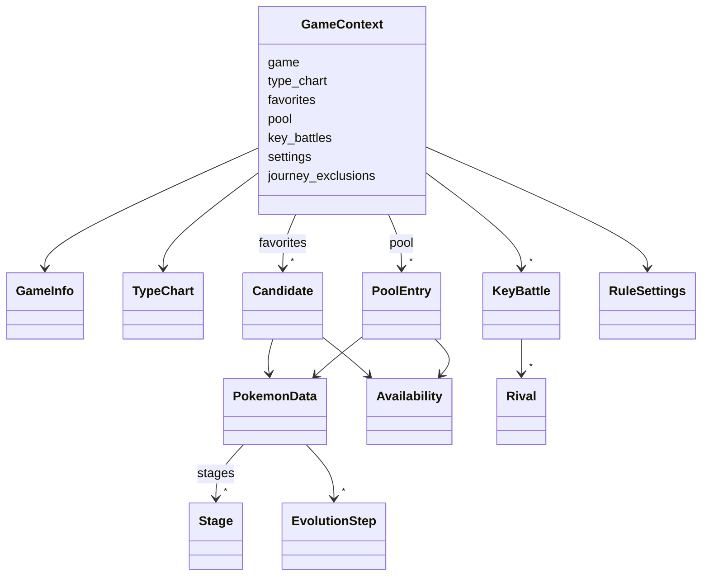

# Motor de reglas (`core/`)

Qué hay implementado en `core/`, el dominio puro que aplica las reglas de negocio y genera los
equipos, y cómo se usa. El plan completo, con las fases y la interpretación de cada regla,
está en el [plan de implementación del motor](plan-motor.md).

!!! note "Estado"
    Fase 1 de 6: modelos del dominio, tabla de tipos y catálogo de reglas con la
    configuración del usuario. Las reglas, la búsqueda y las sugerencias llegan en las fases
    2 a 6.

## Restricciones

- Solo biblioteca estándar y nada de E/S: lo comprueban `import-linter` y
  `tests/test_architecture.py` ([estructura del código](estructura-codigo.md#reglas-de-dependencia)).
- Modelos inmutables (`dataclass(frozen=True)`): el motor no puede modificar su entrada.
- Fracciones exactas (`fractions.Fraction`) para los factores de tipo y las puntuaciones
  ([ADR-0006](../03-adr/0006-algoritmo-busqueda-exacta.md)).
- Los modelos validan su coherencia al crearse y lanzan un error con el motivo en español.

## Modelos del dominio (`core/domain/`)

| Modelo | Fichero | Qué representa |
|--------|---------|----------------|
| `TypeChart` | `types.py` | Tipos de una generación y factor de cada pareja atacante-defensor ([RN-10](../01-ddf/reglas-negocio.md#rn-10)). |
| `PokemonData` | `pokemon.py` | Una forma ([RN-05](../01-ddf/reglas-negocio.md#rn-05)) con sus tipos en la generación del juego, su especie, su cadena evolutiva y las etapas desde la primera de su línea hasta ella ([RN-09](../01-ddf/reglas-negocio.md#rn-09)). |
| `Stage` | `pokemon.py` | Una etapa de la línea: forma, especie, grupos huevo y si es un bebé o un bebé de incienso ([RN-11](../01-ddf/reglas-negocio.md#rn-11), [CA-36](../01-ddf/cuestiones-abiertas.md#resueltas)). |
| `EvolutionStep` | `pokemon.py` | Un paso entre dos etapas en el juego objetivo, con el disparador y las condiciones de PokeAPI ([RN-15](../01-ddf/reglas-negocio.md#rn-15), [RN-20](../01-ddf/reglas-negocio.md#rn-20)). |
| `Availability` | `pokemon.py` | Si la forma existe en el juego y puede llegar a tiempo ([RN-03](../01-ddf/reglas-negocio.md#rn-03)), ya confirmado. |
| `Candidate` | `pokemon.py` | Un favorito con su disponibilidad ([RN-02](../01-ddf/reglas-negocio.md#rn-02)). |
| `PoolEntry` | `pokemon.py` | Un Pokémon del juego que no es favorito, para las sugerencias, y si sus datos están verificados ([RN-08](../01-ddf/reglas-negocio.md#rn-08), [CA-31](../01-ddf/cuestiones-abiertas.md#resueltas)). |
| `GameInfo` | `game.py` | Juego objetivo, su generación y las mecánicas que tiene (`day_night_cycle`, `contests`). |
| `KeyBattle`, `Rival` | `game.py` | Combate clave y los tipos de cada Pokémon rival ([RN-17](../01-ddf/reglas-negocio.md#rn-17)). |
| `GameContext` | `context.py` | La única entrada del motor: todo lo anterior más la configuración y las exclusiones del recorrido ([RN-16](../01-ddf/reglas-negocio.md#rn-16)). |

### Tabla de tipos

`TypeChart.from_hundredths(generación, tipos, factores)` crea la tabla a partir de los factores
en centésimas de `reference.sqlite` (0, 50, 100 o 200). Exige un factor para **cada pareja**
de tipos de la generación. `factor(atacante, tipos_del_defensor)` devuelve el producto de los
factores contra cada tipo del defensor, como fracción exacta:

| Ejemplo | Factor |
|---------|--------|
| Agua contra Fuego | 2 |
| Agua contra Roca/Tierra (Geodude, Onix) | 4 |
| Eléctrico contra Agua/Tierra | 0 |
| Fantasma contra Psíquico en la 1.ª generación | 0 |

Preguntar por un tipo que no existe en la generación (Hada en la 3.ª) es un error.

### Validaciones

| Modelo | Comprueba |
|--------|-----------|
| `TypeChart` | Que estén todas las parejas de tipos y que cada factor sea 0, 50, 100 o 200. |
| `PokemonData` | Uno o dos tipos distintos; que la última etapa sea el propio Pokémon; que los pasos de evolución unan exactamente sus etapas consecutivas (puede haber varios pasos para la misma pareja: métodos alternativos). |
| `KeyBattle` | Que tenga al menos un rival. |
| `GameContext` | Que la tabla de tipos sea de la generación del juego, que no haya favoritos repetidos, que ningún favorito esté también en el `pool` y que todos los tipos existan en la generación del juego ([RN-10](../01-ddf/reglas-negocio.md#rn-10)). |

Los modelos son *hashables* para poder usarlos en conjuntos, salvo `TypeChart`, `RuleSettings`
y `GameContext`, que contienen diccionarios de solo lectura.

## Catálogo de reglas (`core/rules/catalog.py`)

`CATALOG` es el catálogo estático de [CA-10](../01-ddf/cuestiones-abiertas.md#resueltas): las 20
reglas del DDF con su clase y si son configurables.

| Clase | Reglas | Configurable |
|-------|--------|--------------|
| Dura (`hard`) | RN-01, RN-02, RN-03, RN-05, RN-09 | No |
| Dura (`hard`) | RN-07, RN-11, RN-12, RN-16 | Sí: activar o desactivar |
| Presencia (`presence`) | RN-13, RN-14 | Sí: activar o desactivar |
| Blanda (`soft`) | RN-06 (peso 1), RN-15 (3), RN-17 (10), RN-20 (5) | Sí: activar o desactivar y peso de 0 a 10 |
| Mecanismo (`mechanism`) | RN-04, RN-08, RN-10, RN-18, RN-19 | No |

### Configuración del usuario (`RuleSettings`)

- `RuleSettings.defaults()`: todas las reglas activas
  ([CA-41](../01-ddf/cuestiones-abiertas.md#resueltas)) y los pesos por defecto
  ([CA-05](../01-ddf/cuestiones-abiertas.md#resueltas),
  [CA-37](../01-ddf/cuestiones-abiertas.md#resueltas)).
- `with_changes(enabled={...}, weights={...})`: devuelve una copia con los cambios, sin
  modificar la original. Rechaza con `SettingsError`:
    - desactivar una regla que no es configurable;
    - una regla que no existe;
    - dar peso a una regla que no es blanda;
    - un peso fuera de 0 a 10.
- `is_enabled(regla)`, `weight(regla)` y `active_soft_rules()`, que devuelve las blandas
  activas en el orden del catálogo.

Es lo que guardará `user.sqlite` (`rule_setting`) y lo que la API validará al cambiar una regla
([API](api.md#reglas)).

## Pruebas

| Fichero | Qué comprueba |
|---------|---------------|
| `tests/core/test_type_chart.py` | Factores contra uno y dos tipos, inmunidades, tablas distintas por generación (RN-10) y tablas incompletas o con factores no válidos. |
| `tests/core/test_catalog.py` | Que el catálogo tenga las 20 reglas, cuáles son configurables, los pesos por defecto (RN-04), que todas empiecen activas (CA-41) y los cambios válidos y no válidos. |
| `tests/core/test_domain.py` | Formas regionales como Pokémon distintos (RN-05), el favorito como evolución con sus etapas (RN-09), validaciones de los modelos y del contexto, y tipos que no existen en la generación (RN-10). |

`tests/core/builders.py` tiene constructores de datos de prueba legibles, que usarán todas las
fases: `pokemon("gengar", ("ghost", "poison"), line=("gastly", "haunter"), steps=[...])`,
`type_chart(overrides={("water", "rock"): 200})`, `candidate(...)`, `battle(...)` y
`context(...)`. Cada test solo indica lo que le importa.
