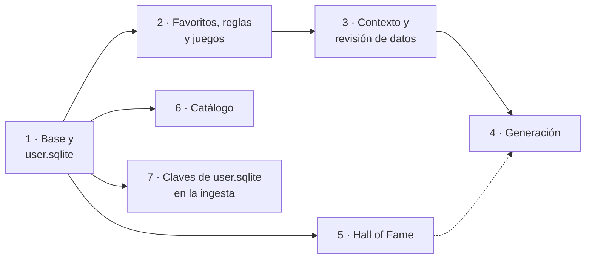

# Plan de implementación de la API (`api/`)

Plan para implementar `api/`, la capa de aplicación HTTP: `user.sqlite`, la construcción del
`GameContext` a partir de las dos bases de datos y los endpoints de la [API](api.md). Parte de
la [arquitectura](arquitectura.md#api-capa-de-aplicacion), del
[modelo de datos](modelo-datos.md), del [motor](motor.md), ya completo, y de los requisitos
del [DDF](../01-ddf/requisitos-funcionales.md).

## Alcance

**Dentro**:

| Bloque | Requisitos y reglas |
|--------|---------------------|
| `user.sqlite` con Alembic: favoritos, configuración de reglas, *Hall of Fame* y confirmaciones | [ADR-0003](../03-adr/0003-dos-bases-de-datos-sqlite.md) |
| Favoritos y reglas | RF-03, RF-04, RF-06, RF-07 |
| Juegos objetivo | RF-05 |
| Construcción del `GameContext` y de los datos revisables con su origen | RN-10, RN-18 |
| Revisión de datos: consultar, confirmar o corregir y aceptar las propuestas | RF-15, RN-18 |
| Generación de equipos | RF-08, RF-09, RF-10 |
| *Hall of Fame* | RF-12, RF-13, RN-16 |
| Catálogo de Pokémon | RF-01, RF-02 |
| Metadatos (versión de la aplicación y de los datos) | — |
| La ingesta comprueba que las claves de `user.sqlite` siguen existiendo | ADR-0003 |

**Fuera**: la web y el cliente generado ([ADR-0007](../03-adr/0007-cliente-generado-openapi.md)),
lanzar la ingesta desde la API ([ADR-0008](../03-adr/0008-cargas-bloqueadas.md)) y la fase 7 de
la carga.

## Principios

- **Tres capas** ([arquitectura](arquitectura.md#api-capa-de-aplicacion)): `routers/` (HTTP,
  validación y códigos de estado), `services/` (casos de uso: construir el contexto, llamar a
  `core/` y traducir el resultado) y `repositories/` (acceso a `db/`). Los routers no tocan la
  base de datos y los repositorios no conocen `core/`.
- **`core/` sigue puro**: la API traduce los modelos de `db/` a los de `core/domain/` y el
  resultado del motor a esquemas de respuesta. Los contratos de `import-linter` no cambian.
- **Sin estado entre peticiones**, salvo la caché de los datos de referencia: la generación es
  un cálculo que no se guarda.
- **Esquemas explícitos**: cada endpoint declara sus modelos pydantic de entrada y salida, para
  que el OpenAPI sea completo y el cliente de la web se genere sin ajustes.
- **Documentado en el mismo PR**: cada fase actualiza la [API](api.md), el
  [modelo de datos](modelo-datos.md), Operación, el **manual de usuario** (guía de la API) y la
  tabla de comandos de `CLAUDE.md`.

## Decisiones tomadas al planificar

- **Puntuaciones como enteros redondeados**
  ([CA-51](../01-ddf/cuestiones-abiertas.md#resueltas)): el motor calcula con fracciones
  exactas, pero la API envía la puntuación de cada equipo, la aportación de cada regla y lo que
  aporta cada sugerencia como **números enteros redondeados**. Para que las aportaciones sigan
  sumando la puntuación total ([RF-09](../01-ddf/requisitos-funcionales.md#rf-09)), se reparten
  con el método del **mayor resto**: se redondea el total y se reparte entre las reglas según
  sus partes enteras y, después, sus restos. La puntuación de cada regla (entre 0 y 1) se envía
  como porcentaje entero. El orden y los empates los decide el motor con los valores exactos,
  así que dos equipos que la API muestra con el mismo número no tienen por qué estar empatados.
- **Combates clave revisables**: el valor de un combate clave es la lista de Pokémon de su
  equipo. El usuario la acepta o la corrige, quitando o añadiendo Pokémon
  ([RF-15](../01-ddf/requisitos-funcionales.md#rf-15)).
- **Orden de las fases**: primero lo necesario para generar equipos con datos reales de
  principio a fin; después el *Hall of Fame*, el catálogo y los metadatos.

## Cómo funciona

### Configuración y arranque

- `api.main:app` crea la aplicación con `create_app(settings)`. Los tests crean la suya con un
  directorio de datos temporal.
- El directorio de datos sale de la variable de entorno `PTB_DATA_DIR` (por defecto, `data`).
  Ahí están `reference.sqlite`, que escribe la ingesta, y `user.sqlite`, que escribe la API.
- Al arrancar se aplican las migraciones pendientes de `user.sqlite` (`alembic upgrade head`)
  y se crea el fichero si no existe. Si falta `reference.sqlite`, la aplicación arranca, pero
  los endpoints que lo necesitan responden `503` con un mensaje que remite a la
  [ingesta](../04-manual-usuario/cargar-datos.md).
- Comando: `uv run uvicorn api.main:app --reload`.

### `user.sqlite`

Las tablas del [modelo de datos](modelo-datos.md#base-de-datos-del-usuario-usersqlite), en
`db/user/` con SQLModel, y sus migraciones con Alembic en `db/user/migrations/`. Ajustes que se
fijan en la fase 1:

| Tabla | Ajuste |
|-------|--------|
| `fact_confirmation` | `confirmed_value` es JSON: un booleano o, para un combate clave, la lista de Pokémon. `proposed_value_hash` es el hash del valor propuesto al confirmar (o de «sin propuesta», si estaba pendiente). |
| `hall_of_fame_member` | `types` es JSON con los tipos que tenía el miembro en el juego. |
| `rule_setting` | Una fila solo para las reglas que el usuario ha cambiado; el resto usa los valores del catálogo. |

### Datos revisables y confirmaciones

Cada dato revisable de `reference.sqlite` (mecánicas, existencia, llegada y combates clave)
se combina con su confirmación:

- Si hay una confirmación y el hash del valor propuesto actual coincide con el guardado, el
  dato es **confirmado** con el valor del usuario.
- Si no la hay, o una nueva carga ha cambiado la propuesta, conserva su origen (automático,
  inferido o pendiente).

Con eso se construyen los `Fact` de `core.review` y se calcula qué datos faltan por confirmar
(`pending_facts`). Para indicar qué datos confirmados se usaron
([RF-09](../01-ddf/requisitos-funcionales.md#rf-09)), `core.review.involved_facts` devuelve
todos los datos que intervienen, sea cual sea su origen.

### Construcción del `GameContext`

`services/context.py` construye el contexto de un juego en dos partes:

| Parte | Contenido | Caché |
|-------|-----------|-------|
| **De referencia** | Juego y generación, tabla de tipos, todas las formas del juego con sus tipos en la generación, etapas, pasos de evolución y grupos huevo, y los combates clave con los tipos de cada rival. | En memoria, por juego, hasta reiniciar la aplicación: los datos de referencia no cambian mientras está en marcha. |
| **Del usuario** | Favoritos (que pasan a `favorites`; el resto de formas, al `pool`), configuración de reglas, *Hall of Fame* (con la cadena y la región de cada miembro, sacadas de la referencia) y confirmaciones aplicadas a mecánicas, disponibilidad y combates clave. | En cada petición. |

En el `pool` de sugerencias, un Pokémon con algún dato sin confirmar va marcado como no
verificado ([CA-31](../01-ddf/cuestiones-abiertas.md#resueltas)). Si el dato es inferido, se
usa la propuesta; si es pendiente, se trata como posible y va marcado.

### Generación

`POST /api/games/{game}/generations`:

1. Construye los datos revisables y llama a `pending_facts`. Si queda alguno, responde `409`
   con la lista.
2. Construye el contexto y llama a `engine.generate`.
3. Traduce el resultado: estado y motivo, grupos con sus posiciones y equipos, desglose con
   enteros (mayor resto), huecos con sus sugerencias, descartes con su motivo, reglas de
   presencia y datos confirmados usados.

El esquema de la respuesta está en la [API](api.md#generacion).

### Decisiones tomadas al implementar la fase 3

- **Valor de un combate clave en `core/`**: `Fact.value` pasa a ser `FactValue`, un booleano o
  una tupla con los Pokémon del equipo en orden. En `user.sqlite` el equipo se guarda como lista
  JSON; la API convierte entre los dos.
- **Los datos automáticos no se revisan**: `PUT` sobre uno responde `409`. Si una carga
  posterior deja automático un dato que el usuario había confirmado, se usa el valor cargado.
- **Se puede confirmar cualquier dato revisable del juego**, intervenga o no en ese momento.
  `accept-proposals`, en cambio, solo acepta los que intervienen.
- **`involved_facts` incluye el dato conocido que descarta un favorito**: si se confirmó que
  Raichu no puede llegar, esa confirmación decide su descarte y la fase 4 la contará entre los
  datos confirmados usados.
- **Formas de una generación posterior**: no tienen tipos en la generación del juego, así que
  conservan los de la generación en que aparecieron y no tienen pasos de evolución. `GameContext`
  no comprueba sus tipos, porque RN-03 las descarta antes de usarlos, y no entran en el `pool`.
- **Etapas en el juego**: la línea empieza en la primera etapa que existe en la generación del
  juego (en Rojo Fuego, Snorlax no tiene a Munchlax, de la 4.ª). La forma de cada etapa anterior
  es aquella de la que salen los pasos de evolución, para que una línea regional siga siendo
  regional, o la forma por defecto de su especie.
- **Valores sin verificar en el contexto**: una propuesta inferida se usa tal cual y un dato
  pendiente se trata como posible (una mecánica pendiente, como ausente). Solo afecta a las
  sugerencias, que van marcadas como no verificadas, porque no se genera mientras quede algún
  dato que intervenga sin confirmar.
- **Caché**: `GameReferences` guarda la parte de referencia de cada juego en
  `app.state.game_references`. Con los datos reales se construye en unos 0,03 s por juego.

### Decisiones tomadas al implementar la fase 4

- **Redondeo**: la puntuación de un equipo se redondea al entero más cercano, con las mitades
  hacia arriba, y es la suma de las aportaciones repartidas por el mayor resto; a igualdad de
  parte decimal, la unidad va a la primera regla del catálogo (`api/services/rounding.py`).
- **`409` con datos**: el `detail` del `409` es un objeto con `message` y `pending`, los mismos
  datos con el mismo formato que la revisión, para que la interfaz pueda llevar al usuario a
  confirmarlos. `ConflictError` admite esos campos extra y el OpenAPI declara el esquema
  (`PendingDataOut`).
- **Datos confirmados usados**: los que devuelve `core.review.involved_facts` con origen
  confirmado. Un descarte solo lleva `fact_key` si lo decidió un dato confirmado; con un dato
  automático, es nulo.
- **Respuesta**: solo `groups`, con los equipos dentro de cada grupo, para no repetir los
  equipos. Los Pokémon de `positions` y de las sugerencias llevan su nombre, su número y sus
  tipos en el juego; los de `members`, solo su identificador. Con los datos reales de Rojo
  Fuego, la generación tarda unos 0,04 s.

### Decisiones tomadas al implementar la fase 5

- **Orden del recorrido**: el `sequence` de `user.sqlite` es el orden de registro. El motor
  recibe como `sequence` la posición en el recorrido, ordenado por fecha y después por orden de
  registro, así que el último registro por fecha es el último juego completado.
- **Cualquier juego cargado** se puede registrar, aunque no sea juego objetivo. Un juego o un
  Pokémon que no existe (o, en el caso del Pokémon, que no existe en la generación del juego)
  es un `422`, porque es un valor del cuerpo de la petición.
- **Equipo de 1 a 6 Pokémon**, en orden, que puede repetir forma. Corregir el juego o el equipo
  vuelve a copiar los tipos; el resto de campos no los toca. `notes: null` borra las notas.
- **Contexto con el recorrido**: la revisión y la generación construyen el recorrido en cada
  petición (`api/services/hall_of_fame.journey`), con la cadena evolutiva y la región de cada
  miembro sacadas de la referencia. Se omiten los registros de juegos y los miembros de formas
  que ya no están cargados; la fase 7 evitará que una carga los deje huérfanos.

### Decisiones tomadas al implementar la fase 6

- **Sin paginación**: con las generaciones 1 a 3 son 386 formas y la lista tarda unos 0,01 s.
  Se revisará al cargar más generaciones.
- **Búsqueda en Python**: el nombre y el identificador se normalizan (minúsculas, sin tildes y
  con espacios en lugar de guiones) para que «nidoran», «Mr Mime» o «flabebe» encuentren lo
  que el usuario espera. SQLite no ignora las tildes por sí mismo.
- **Línea completa**: todas las formas de la cadena evolutiva, ramas incluidas (Eevee y sus
  evoluciones), con su etapa. Las formas regionales de la misma cadena también aparecen; las
  evoluciones dicen qué forma evoluciona en cuál.
- **Mecanismo sin traducir**: se envían el disparador y las condiciones de PokeAPI del grupo de
  versiones más reciente que tiene cada evolución. Convertirlos en texto («nivel 25»,
  «intercambio») es cosa de la interfaz, que ya tendrá que mostrar nombres de objetos.

### Decisiones tomadas al implementar la fase 7

- **Las confirmaciones huérfanas son avisos, no errores**: el plan decía que también
  rechazaban la carga. Pero una confirmación de un dato que ya no existe responde a una
  pregunta que ya no se hace, la API la ignora y no hay forma de borrarla desde la API, así que
  bloquear la carga obligaría a editar `user.sqlite` a mano. Los favoritos y el *Hall of Fame*
  sí la rechazan: son datos del usuario y generar sin ellos cambiaría los equipos sin avisar.
- **Solo lectura**: la ingesta abre `user.sqlite` del mismo directorio de datos solo para
  leerlo; no lo crea ni lo migra. Sin el fichero o sin sus tablas, no comprueba nada.
- **El informe explica qué hacer**: quitar el favorito o corregir el registro y repetir la
  carga, o, si las fuentes han renombrado un identificador, una migración de datos de
  `user.sqlite` ([ADR-0003](../03-adr/0003-dos-bases-de-datos-sqlite.md)). Las listas se
  recortan a 10 claves.
- **Código de salida 1**, como cualquier otro error: no es una carga bloqueada
  ([ADR-0008](../03-adr/0008-cargas-bloqueadas.md)), porque el problema está en los datos del
  usuario, no en las fuentes.

## Fases

Cada fase es un PR con sus tests y su documentación.

La fase 4 funciona sin la 5: sin *Hall of Fame* el recorrido está vacío. Cuando llega la 5, el
contexto incorpora el recorrido (RN-16).

| Fase | Rama | Contenido | Tests |
|------|------|-----------|-------|
| 1 ✅ | `feat/api-base` | Dependencias (`fastapi`, `uvicorn`, `alembic`), configuración, `create_app`, modelos de `db/user/` y migración inicial con todas las tablas, migraciones al arrancar, `503` sin `reference.sqlite`, `GET /api/meta` y la infraestructura de tests. | Arranque con y sin `reference.sqlite`, migraciones sobre una base vacía, `/api/meta`, OpenAPI generado. |
| 2 ✅ | `feat/api-favoritos-reglas` | `GET`, `PUT` y `DELETE` de favoritos; `GET` y `PATCH` de reglas con los errores de `RuleSettings`; `GET /api/games` (juegos objetivo con crianza, RF-05). | Favoritos idempotentes y forma inexistente (`404`); regla no configurable (`409`) y peso fuera de rango (`422`); valores por defecto (CA-41); juegos ofrecidos. |
| 3 ✅ | `feat/api-contexto` | Repositorios de `reference.sqlite`, construcción del contexto y de los datos revisables con sus confirmaciones, caché por juego, función de `core.review` con todos los datos que intervienen, y `GET`/`PUT /review` y `POST /review/accept-proposals`. | El contexto de Rojo Fuego coincide con el del escenario del motor; confirmar, corregir y aceptar propuestas; una confirmación deja de valer si cambia la propuesta; valores no válidos (`422`). |
| 4 ✅ | `feat/api-generacion` | `POST /generations`, esquemas de respuesta, enteros con mayor resto y `409` con datos pendientes. | Generación de Rojo Fuego de principio a fin con datos reales; `409`; las aportaciones suman el total; equipo incompleto con sugerencias. |
| 5 ✅ | `feat/api-hall-of-fame` | CRUD del *Hall of Fame* (RF-12, RF-13) y el recorrido en el contexto (RN-16). | Orden del recorrido por fecha y orden de registro; tipos copiados del juego; validaciones; un equipo registrado excluye su línea al generar. |
| 6 ✅ | `feat/api-catalogo` | `GET /api/pokemon` con filtros y `GET /api/pokemon/{pokemon}` con la línea y el método de cada evolución (RF-01, RF-02). | Búsqueda por nombre, filtro por tipo y por favorito, formas regionales, ficha. |
| 7 ✅ | `feat/ingest-claves-usuario` | La ingesta comprueba, antes de sustituir `reference.sqlite`, que los favoritos, los miembros del *Hall of Fame* y las confirmaciones apuntan a datos que siguen existiendo; si no, la carga falla y lo explica (ADR-0003). | Carga rechazada con una clave que desaparece; carga aceptada sin `user.sqlite`. |

Después de la fase 4 ya se pueden generar equipos de Rojo Fuego y Verde Hoja desde la API con
los datos reales; con la 5, teniendo en cuenta el recorrido.

## Estrategia de pruebas

| Tipo | Qué cubre | Dónde |
|------|-----------|-------|
| **Endpoints** | Cada endpoint con `TestClient`, sobre un directorio de datos temporal: respuestas, códigos de error y esquemas. | `tests/api/` |
| **Datos de referencia de prueba** | Un `reference.sqlite` temporal creado con los modelos de `db/reference/` y constructores legibles, como `tests/core/builders.py`. | `tests/api/factories.py` |
| **Escenario real** | El extracto de Rojo Fuego del motor (`tests/core/fixtures/firered.json`) cargado en un `reference.sqlite` temporal con `write_firered`: el contexto de la API es el del escenario del motor y da los mismos equipos. `Load` cambia el origen o la propuesta de algunos datos. | `tests/api/scenario.py` |
| **Migraciones** | La migración inicial crea exactamente las tablas de los modelos (sin diferencias en la autogeneración de Alembic). | `tests/db/` |

Los tests siguen sin red. `tests/conftest.py` bloquea los transportes de red de `httpx` y de
`httpx2` (el que usa el `TestClient` de FastAPI), pero no el transporte en memoria del
`TestClient`; `tests/test_network_blocked.py` lo comprueba.

## Riesgos

| Riesgo | Mitigación |
|--------|------------|
| Tras una carga, la API sigue usando los datos anteriores: la caché, y las conexiones abiertas al fichero sustituido. | Se documenta que hay que reiniciar la API después de cargar ([manual](../04-manual-usuario/cargar-datos.md)); `/api/meta` muestra con qué carga trabaja. |
| El esquema de `user.sqlite` y la autogeneración de Alembic se desalinean. | Test que compara la migración con los modelos. |
| La respuesta de generación es grande con muchos empates (51 equipos en Rojo Fuego sin RN-12 ni presencia). | Se envían los grupos, que los reducen (20 en ese caso); si hace falta, se limitará en la interfaz. |
| La caché del contexto ocupa memoria con muchos juegos. | Con 5 juegos objetivo es despreciable; se revisará al cargar más generaciones. |
