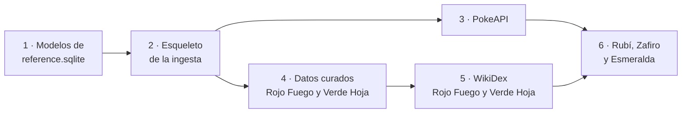

# Plan de la primera carga de datos

Plan para construir la primera versión de `reference.sqlite`, con el alcance decidido en
[CA-11](../01-ddf/cuestiones-abiertas.md#resueltas). Parte de los
[datos requeridos por las reglas](datos-requeridos.md), del [modelo de datos](modelo-datos.md)
y de una revisión del volcado CSV de PokeAPI hecha el 2026-10-04.

## Alcance

| Elemento | Primera carga | Cantidad |
|----------|---------------|----------|
| Especies | 1.ª a 3.ª generación: de #0001 Bulbasaur a #0386 Deoxys | 386 (151 + 100 + 135) |
| Formas (`pokemon`) | Solo la forma por defecto de cada especie | 386 |
| Juegos | Todos los de las generaciones 1 a 3 | 11 juegos en 7 grupos de versiones |
| Juegos objetivo | Los de la 3.ª generación: Rubí, Zafiro, Esmeralda, Rojo Fuego y Verde Hoja | 5 |
| Tipos | Los que existen hasta la 3.ª generación | 15 en la 1.ª, 17 desde la 2.ª |
| Tabla de eficacias | Una por generación | 3 |
| Combates clave | Los de los 5 juegos objetivo | Unos 30 entrenadores en WikiDex |

Decisiones de alcance:

- **Solo formas por defecto**. Las 134 formas no predeterminadas de estas especies son
  megaevoluciones, Gigamax, formas de combate (Castform, Deoxys), variantes de Pikachu o formas
  regionales de generaciones posteriores (Vulpix de Alola, Meowth de Galar…). Ninguna existe en
  los juegos de la 1.ª a la 3.ª generación. Las regionales se cargarán con la generación que las
  introduce ([RN-05](../01-ddf/reglas-negocio.md#rn-05)).
- **Juegos de la 1.ª y la 2.ª generación sin juego objetivo**. Se cargan para que el *Hall of
  Fame* y el recorrido puedan registrarlos ([RN-16](../01-ddf/reglas-negocio.md#rn-16)), con
  sus tipos y su tabla de eficacias ([RF-12](../01-ddf/requisitos-funcionales.md#rf-12)). No se
  cargan sus combates clave.
- **Primero Rojo Fuego y Verde Hoja**. Sus restricciones de llegada ya están investigadas
  ([CA-28](../01-ddf/cuestiones-abiertas.md#abiertas)). Rubí, Zafiro y Esmeralda se completan
  después.
- **Sin movimientos por nivel**. Ninguna evolución de las especies 1 a 386 exige conocer un
  movimiento (eso empieza en la 4.ª generación: Tangrowth, Mamoswine…). La tabla `level_move`
  y el fichero `pokemon_moves.csv` (10,7 MB) se dejan para cuando haga falta.
- **Pokémon Showdown sigue aplazado** ([ADR-0004](../03-adr/0004-pokeapi-volcado-csv.md)).

## Revisión del volcado de PokeAPI

Revisión del último commit de `PokeAPI/pokeapi` (`bc92d3b`, 2026-09-30), que se propone como
commit fijado para la primera carga ([ADR-0004](../03-adr/0004-pokeapi-volcado-csv.md)).

### Ficheros que se usan

| Fichero CSV | Destino | Filtro o transformación |
|-------------|---------|-------------------------|
| `generations.csv` | `generation` | Generaciones 1 a 3. |
| `version_groups.csv`, `versions.csv`, `version_names.csv` | `version_group`, `game` | Grupos 1 a 7. Se excluyen Colosseum y XD (no son de la saga principal). Nombres en español (`local_language_id` 7). |
| `pokemon_species.csv`, `pokemon_species_names.csv` | `species` | `generation_id` ≤ 3. |
| `pokemon.csv` | `pokemon` | Especie ≤ 386 e `is_default` = 1. |
| `pokemon_types.csv`, `pokemon_types_past.csv` | `pokemon_type` | Resueltos por generación (ver abajo). |
| `types.csv`, `type_names.csv` | `type` | `generation_id` ≤ 3. Se excluyen los tipos especiales `unknown` y `shadow`. |
| `type_efficacy.csv`, `type_efficacy_past.csv` | `type_efficacy` | Resueltas por generación (ver abajo). |
| `pokemon_egg_groups.csv`, `egg_groups.csv` | `species_egg_group` | Sin filtro adicional. |
| `pokemon_evolution.csv`, `evolution_triggers.csv` | `evolution_step` | Ver [evoluciones](#evoluciones). |
| `items.csv`, `item_names.csv` | Nombres en `conditions` | Solo los objetos que aparecen en las evoluciones. |
| `pokedexes.csv`, `pokedex_version_groups.csv`, `pokemon_dex_numbers.csv` | Propuestas de llegada | Pokédex de Kanto (151) para Rojo Fuego y Verde Hoja, y de Hoenn (202) para Rubí, Zafiro y Esmeralda. |

Todos los nombres en español de las 386 especies y de los 5 juegos objetivo están en el volcado.

### Cómo se interpretan los datos «antiguos»

- **`pokemon_types_past`**: cada fila indica los tipos que tenía un Pokémon **hasta** la
  generación `generation_id`, incluida. Para la generación `g` se usa la fila con el menor
  `generation_id` ≥ `g`; si no hay ninguna, los tipos actuales. Ejemplos: Clefairy es Normal
  hasta la 5.ª generación y Magnemite es solo Eléctrico en la 1.ª.
- **`type_efficacy_past`**: misma interpretación. En la 3.ª generación, Fantasma y Siniestro
  hacen ×0,5 a Acero (hasta la 5.ª). En la 1.ª, Veneno y Bicho se hacen ×2 mutuamente,
  Fantasma no afecta a Psíquico y Hielo hace ×1 a Fuego.

### Evoluciones

`pokemon_evolution.version_group_id` es el grupo de versiones en el que **se introdujo** esa
evolución, no un intervalo de validez. Por ejemplo, Pichu → Pikachu figura con Oro y Plata
porque Pichu aparece en la 2.ª generación, y Chansey figura con Diamante y Perla por Happiny.
Esto corrige la interpretación anterior del DDT, que decía que un método valía «desde su grupo
de versiones hasta que otro lo sustituye».

Regla para la primera carga: un paso se aplica en un grupo de versiones si su
`version_group_id` tiene un `order` menor o igual y las dos especies están cargadas. En las
generaciones 1 a 3 no hay dos métodos para el mismo paso. Los casos con varios métodos
(Milotic: belleza en Rubí y Zafiro, intercambio con Escama Bella en Negro y Blanco y belleza
de nuevo en Rubí Omega y Zafiro Alfa) se resolverán al cargar la 5.ª generación.

Casos de las especies 1 a 386 hasta Rojo Fuego y Verde Hoja, con la clasificación de
[RN-15](../01-ddf/reglas-negocio.md#rn-15) que les corresponde:

| Disparador y condiciones | Ejemplos | ¿Tediosa? |
|--------------------------|----------|-----------|
| Subir de nivel | Bulbasaur → Ivysaur | No |
| Subir de nivel con amistad | Pichu → Pikachu, Golbat → Crobat, Chansey → Blissey | No |
| Subir de nivel con amistad y hora del día | Eevee → Espeon o Umbreon | Sí (hora del día) |
| Subir de nivel comparando estadísticas | Tyrogue → Hitmonlee, Hitmonchan o Hitmontop | Sí |
| Subir de nivel con belleza | Feebas → Milotic | Sí |
| Usar un objeto | Pikachu → Raichu, Eevee → Vaporeon | No |
| Intercambio, con o sin objeto | Haunter → Gengar, Onix → Steelix, Clamperl → Huntail | Sí |
| Subir de nivel según la personalidad (al azar) | Wurmple → Silcoon o Cascoon | Sí, por ser aleatoria ([CA-35](../01-ddf/cuestiones-abiertas.md#resueltas)) |
| Muda (`shed`) | Nincada → Shedinja | Sí ([CA-35](../01-ddf/cuestiones-abiertas.md#resueltas)) |

La ingesta guarda el disparador y las condiciones tal como vienen. Decidir si un paso es
tedioso lo hace `core/evolution.py` ([modelo de datos](modelo-datos.md#evoluciones)).

### Crianza

- Una línea se puede criar si alguna de sus especies tiene un grupo huevo distinto de
  `no-eggs` y de `ditto` ([RN-11](../01-ddf/reglas-negocio.md#rn-11)). Ejemplo: Nidorina y
  Nidoqueen están en `no-eggs`, pero Nidoran♀ cría y la línea es válida.
- En las generaciones 1 a 3 hay 34 especies en `no-eggs`: los 21 legendarios y singulares,
  los 10 bebés, Unown, Nidorina y Nidoqueen. Ditto es el único del grupo `ditto`.
- La etapa que nace del huevo es la primera de la cadena (`evolves_from_species_id` vacío).
  Azurill y Wynaut solo nacen si un progenitor lleva un incienso; sin él nacen Marill y
  Wobbuffet ([CA-36](../01-ddf/cuestiones-abiertas.md#abiertas)).

### Existencia y llegada

- **Existencia** ([RN-03](../01-ddf/reglas-negocio.md#rn-03)): en la 3.ª generación la Pokédex
  Nacional tiene las 386 especies y todas se pueden tener en cualquiera de los 5 juegos, al
  menos por intercambio. Se carga como dato automático.
- **Llegada antes de completar el juego**
  ([CA-28](../01-ddf/cuestiones-abiertas.md#abiertas)):
    - Rojo Fuego y Verde Hoja: dato **inferido**. Propuesta: la etapa que nace del huevo y la
      evolución de favoritos están en la Pokédex de Kanto y ninguna evolución intermedia es de
      la 2.ª generación ([restricciones comprobadas](datos-requeridos.md#rojo-fuego-y-verde-hoja-comprobado)).
    - Rubí, Zafiro y Esmeralda: dato **pendiente** hasta investigarlo (issue #8). El usuario
      lo confirmará antes de generar ([RN-18](../01-ddf/reglas-negocio.md#rn-18)).

## Datos curados

Ficheros YAML en `data/curated/` ([ADR-0005](../03-adr/0005-datos-curados-yaml.md)). Sus
esquemas se definen y documentan en la fase 4.

| Fichero | Contenido | Origen de los datos |
|---------|-----------|---------------------|
| `pokeapi.yaml` | Commit fijado del volcado de PokeAPI. | — |
| `games.yaml` | Qué juegos son juego objetivo y sus mecánicas: ciclo de día y noche (Rubí, Zafiro y Esmeralda tienen reloj; Rojo Fuego y Verde Hoja, no) y concursos (solo Rubí, Zafiro y Esmeralda). | Inferido |
| `arrival.yaml` | Regla de llegada de cada juego objetivo (Pokédex regional de referencia, evoluciones bloqueadas antes de la Pokédex Nacional). | Inferido o pendiente |
| `key_battles/<juego>.yaml` | Combates clave de cada juego: categoría, entrenador, orden y página de WikiDex. Los equipos se descargan de WikiDex. | Lista curada; equipos automáticos o inferidos |

## WikiDex

- Una petición por página de entrenador (`action=parse&prop=wikitext`), unas 30 en total:
  13 para Rojo Fuego y Verde Hoja (8 líderes, 4 del Alto Mando y el Campeón) y unas 18 para
  Rubí, Zafiro y Esmeralda.
- Caché en `data/cache/wikidex/`, como mucho una petición por segundo y un `User-Agent`
  descriptivo. Una segunda ejecución no hace peticiones.
- Las plantillas `{{Equipo}}` se procesan con mwparserfromhell. Las secciones que no se
  puedan procesar con certeza (variantes según el inicial, revanchas) se cargan como
  inferidas.
- Antes de publicar datos derivados de WikiDex hay que revisar su licencia (CC BY-NC-SA) y
  añadir la atribución ([ADR-0004](../03-adr/0004-pokeapi-volcado-csv.md)).

## Fases

Cada fase es un PR que incluye su documentación
([documentación del código](estructura-codigo.md#documentacion-del-codigo)).

| Fase | Rama | Contenido | Documentación |
|------|------|-----------|---------------|
| 1 | `feat/db-reference` | Modelos SQLModel de las tablas de `reference.sqlite` que usa la primera carga (sin `level_move`). | [Modelo de datos](modelo-datos.md): tablas y columnas definitivas. |
| 2 | `feat/ingest-esqueleto` | CLI `uv run python -m ingest`, informe de la carga, tabla `ingest_run` y sustitución atómica del fichero. | Nueva página de Operación: «Ingesta de datos» (uso, opciones, informe y errores). Tabla de comandos de `CLAUDE.md`. |
| 3 | `feat/ingest-pokeapi` | Descarga de los CSV del commit fijado a `data/cache/pokeapi/<commit>/`, validación de cada fila con pydantic, transformaciones y carga. Tests con extractos reales de los CSV. | Detalle de cada transformación en esta página o en una de la ingesta. |
| 4 | `feat/ingest-curados` | Esquemas pydantic de los YAML y datos de Rojo Fuego y Verde Hoja: juego, mecánicas, llegada y lista de combates clave. | Esquema de cada fichero YAML. |
| 5 | `feat/ingest-wikidex` | Adaptador de WikiDex con caché y límite de peticiones, y equipos de los combates clave de Rojo Fuego y Verde Hoja. Tests con wikitexto real guardado. | Cómo se procesan las plantillas y qué se marca como inferido. |
| 6 | `feat/ingest-hoenn` | Datos curados y combates clave de Rubí, Zafiro y Esmeralda, después de investigar su llegada (issue #8). | Restricciones de llegada en [datos requeridos](datos-requeridos.md#restricciones-de-llegada-por-juego). |

Las fases 1 a 3 no dependen de `core/`, así que se pueden hacer en paralelo con el motor.

## Comprobaciones de la carga

Al terminar, la ingesta comprueba y muestra en su informe:

- 386 especies y 386 formas, con nombre en español.
- 11 juegos y 7 grupos de versiones, con 5 juegos objetivo.
- 17 tipos en la 3.ª generación y una tabla de eficacias completa de 17 × 17 pares.
- Casos conocidos: Clefairy es Normal en la 3.ª generación, Magnemite es Eléctrico/Acero desde
  la 2.ª, Fantasma hace ×0,5 a Acero en la 3.ª, Mewtwo no se puede criar y Pikachu sí, y
  Raichu no llega a Rojo Fuego (propuesta).
- Cada combate clave de Rojo Fuego y Verde Hoja tiene al menos un Pokémon rival y todos sus
  Pokémon son formas cargadas. El equipo de Brock en Rojo Fuego es Geodude y Onix.

## Riesgos

| Riesgo | Mitigación |
|--------|------------|
| El esquema de los CSV cambia al actualizar el commit fijado. | Validación con pydantic de cada fila; el commit solo cambia mediante PR. |
| Las plantillas de WikiDex no son uniformes entre páginas. | Lo que no se pueda procesar con certeza se carga como inferido y lo confirma el usuario (RN-18). |
| Las restricciones de llegada de Rubí, Zafiro y Esmeralda no están investigadas. | Se cargan como pendientes y no bloquean Rojo Fuego ni Verde Hoja. |
