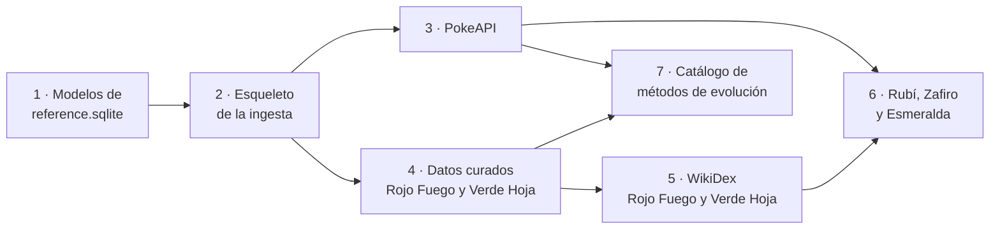

# Plan de la primera carga de datos

Plan para construir la primera versión de `reference.sqlite`, con el alcance decidido en
[CA-11](../01-ddf/cuestiones-abiertas.md#resueltas). Parte de los
[datos requeridos por las reglas](datos-requeridos.md), del [modelo de datos](modelo-datos.md)
y de una revisión del volcado CSV de PokeAPI hecha el 2026-10-04.

## Alcance

| Elemento | Primera carga | Cantidad |
|----------|---------------|----------|
| Especies | 1.ª a 3.ª generación: de #0001 Bulbasaur a #0386 Deoxys | 386 (151 + 100 + 135) |
| Formas (`pokemon`) | Solo la forma por defecto de cada especie | 386 |
| Juegos | Todos los de las generaciones 1 a 3 | 11 juegos en 7 grupos de versiones |
| Juegos objetivo | Los de la 3.ª generación: Rubí, Zafiro, Esmeralda, Rojo Fuego y Verde Hoja | 5 |
| Tipos | Los que existen hasta la 3.ª generación | 15 en la 1.ª, 17 desde la 2.ª |
| Tabla de eficacias | Una por generación | 3 |
| Combates clave | Los de los 5 juegos objetivo | Unos 30 entrenadores en WikiDex |

Decisiones de alcance:

- **Solo formas por defecto**. Las 134 formas no predeterminadas de estas especies son
  megaevoluciones, Gigamax, formas de combate (Castform, Deoxys), variantes de Pikachu o formas
  regionales de generaciones posteriores (Vulpix de Alola, Meowth de Galar…). Ninguna existe en
  los juegos de la 1.ª a la 3.ª generación. Las regionales se cargarán con la generación que las
  introduce ([RN-05](../01-ddf/reglas-negocio.md#rn-05)).
- **Juegos de la 1.ª y la 2.ª generación sin juego objetivo**. Se cargan para que el *Hall of
  Fame* y el recorrido puedan registrarlos ([RN-16](../01-ddf/reglas-negocio.md#rn-16)), con
  sus tipos y su tabla de eficacias ([RF-12](../01-ddf/requisitos-funcionales.md#rf-12)). No se
  cargan sus combates clave.
- **Primero Rojo Fuego y Verde Hoja**. Sus restricciones de llegada ya están investigadas
  ([CA-28](../01-ddf/cuestiones-abiertas.md#abiertas)). Rubí, Zafiro y Esmeralda se completan
  después.
- **Sin movimientos por nivel**. Ninguna evolución de las especies 1 a 386 exige conocer un
  movimiento (eso empieza en la 4.ª generación: Tangrowth, Mamoswine…). La tabla `level_move`
  y el fichero `pokemon_moves.csv` (10,7 MB) se dejan para cuando haga falta.
- **Pokémon Showdown sigue aplazado** ([ADR-0004](../03-adr/0004-pokeapi-volcado-csv.md)).

## Revisión del volcado de PokeAPI

Revisión del último commit de `PokeAPI/pokeapi` (`bc92d3b`, 2026-09-30), que se propone como
commit fijado para la primera carga ([ADR-0004](../03-adr/0004-pokeapi-volcado-csv.md)).

### Ficheros que se usan

| Fichero CSV | Destino | Filtro o transformación |
|-------------|---------|-------------------------|
| `generations.csv` | `generation` | Generaciones 1 a 3. |
| `version_groups.csv`, `versions.csv`, `version_names.csv` | `version_group`, `game` | Grupos 1 a 7. Se excluyen Colosseum y XD (no son de la saga principal) y las versiones solo japonesas (`red-green-japan`, `blue-japan`), que nunca salieron en español. Nombres en español (`local_language_id` 7). `release_order` es el id de la versión en PokeAPI. Son juego objetivo los de la 3.ª generación y tienen crianza desde la 2.ª (`ingest/scope.py`). |
| `pokemon_species.csv`, `pokemon_species_names.csv` | `species` | `generation_id` ≤ 3. Si la preevolución es de una generación posterior (Happiny para Chansey, Budew para Roselia…), `evolves_from` queda vacío: en las generaciones cargadas, la especie es la primera de su línea. |
| `pokemon.csv`, `pokemon_forms.csv` | `pokemon` | Especie ≤ 386 e `is_default` = 1. El nombre en español es el de la especie. La forma por defecto de Deoxys es `deoxys-normal`. |
| `pokemon_types.csv`, `pokemon_types_past.csv` | `pokemon_type` | Resueltos por generación (ver abajo). |
| `types.csv`, `type_names.csv` | `type` | `generation_id` ≤ 3. Se excluyen los tipos especiales `unknown` y `shadow`. |
| `type_efficacy.csv`, `type_efficacy_past.csv` | `type_efficacy` | Resueltas por generación (ver abajo). |
| `pokemon_egg_groups.csv`, `egg_groups.csv` | `species_egg_group` | Sin filtro adicional. |
| `pokemon_evolution.csv`, `evolution_triggers.csv` | `evolution_step` | Ver [evoluciones](#evoluciones). Cualquier columna de condición desconocida con valor hace fallar la carga: hay que revisarla para RN-15 y RN-20 antes de cargarla. |
| `items.csv`, `locations.csv`, `moves.csv`, `regions.csv` | Identificadores en `conditions` | Los ids de objetos, lugares, movimientos y regiones de las condiciones se sustituyen por su identificador (`thunder-stone`, `kings-rock`…). |
| `pokedexes.csv`, `pokemon_dex_numbers.csv` | Propuestas de llegada | La Pokédex regional de la regla de cada juego en `arrival.yaml`: Kanto (151) para Rojo Fuego y Verde Hoja ([datos curados](datos-curados.md#arrivalyaml)). |

Todos los nombres en español de las 386 especies y de los 11 juegos están en el volcado.

Cada fila se valida con un modelo pydantic (`ingest/sources/pokeapi/rows.py`): si falta una
columna o un valor no tiene el tipo esperado, la carga falla en lugar de cargar datos
erróneos.

### Cómo se interpretan los datos «antiguos»

- **`pokemon_types_past`**: cada fila indica los tipos que tenía un Pokémon **hasta** la
  generación `generation_id`, incluida. Para la generación `g` se usa la fila con el menor
  `generation_id` ≥ `g`; si no hay ninguna, los tipos actuales. Ejemplos: Clefairy es Normal
  hasta la 5.ª generación y Magnemite es solo Eléctrico en la 1.ª.
- **`type_efficacy_past`**: misma interpretación. En la 3.ª generación, Fantasma y Siniestro
  hacen ×0,5 a Acero (hasta la 5.ª). En la 1.ª, Veneno y Bicho se hacen ×2 mutuamente,
  Fantasma no afecta a Psíquico y Hielo hace ×1 a Fuego.

### Evoluciones

La columna `is_default` de `pokemon_evolution` marca el método «canónico» actual, no el de cada
juego (p. ej., la fila de Wurmple con su condición aleatoria en Rubí y Zafiro tiene
`is_default` = 0), así que no se usa.

`pokemon_evolution.version_group_id` es el grupo de versiones en el que **se introdujo** esa
evolución, no un intervalo de validez. Por ejemplo, Pichu → Pikachu figura con Oro y Plata
porque Pichu aparece en la 2.ª generación, y Chansey figura con Diamante y Perla por Happiny.
Esto corrige la interpretación anterior del DDT, que decía que un método valía «desde su grupo
de versiones hasta que otro lo sustituye».

Regla para la primera carga: un paso se aplica en un grupo de versiones si su
`version_group_id` tiene un `order` menor o igual y las dos especies están cargadas. En las
generaciones 1 a 3 no hay dos métodos para el mismo paso. Los casos con varios métodos
(Milotic: belleza en Rubí y Zafiro, intercambio con Escama Bella en Negro y Blanco y belleza
de nuevo en Rubí Omega y Zafiro Alfa) se resolverán al cargar la 5.ª generación.

Casos de las especies 1 a 386 hasta Rojo Fuego y Verde Hoja, con la clasificación de
[RN-15](../01-ddf/reglas-negocio.md#rn-15) que les corresponde:

| Disparador y condiciones | Ejemplos | ¿Tediosa? |
|--------------------------|----------|-----------|
| Subir de nivel | Bulbasaur → Ivysaur | No |
| Subir de nivel con amistad | Pichu → Pikachu, Golbat → Crobat, Chansey → Blissey | No |
| Subir de nivel con amistad y hora del día | Eevee → Espeon o Umbreon | Sí (hora del día) |
| Subir de nivel comparando estadísticas | Tyrogue → Hitmonlee, Hitmonchan o Hitmontop | Sí |
| Subir de nivel con belleza | Feebas → Milotic | Sí |
| Usar un objeto | Pikachu → Raichu, Eevee → Vaporeon | No |
| Intercambio, con o sin objeto | Haunter → Gengar, Onix → Steelix, Clamperl → Huntail | Sí |
| Subir de nivel según la personalidad (al azar) | Wurmple → Silcoon o Cascoon | Sí, por ser aleatoria ([CA-35](../01-ddf/cuestiones-abiertas.md#resueltas)); además penaliza en [RN-20](../01-ddf/reglas-negocio.md#rn-20) |
| Muda (`shed`) | Nincada → Shedinja | Sí ([CA-35](../01-ddf/cuestiones-abiertas.md#resueltas)) |

La ingesta guarda el disparador y las condiciones tal como vienen. Decidir si un paso es
tedioso o aleatorio lo hace `core/evolution.py` ([modelo de datos](modelo-datos.md#evoluciones)).
En PokeAPI, las evoluciones aleatorias se reconocen por `percentage_chance` o
`condition_expression`.

### Crianza

- Una línea se puede criar si alguna de sus especies tiene un grupo huevo distinto de
  `no-eggs` y de `ditto` ([RN-11](../01-ddf/reglas-negocio.md#rn-11)). Ejemplo: Nidorina y
  Nidoqueen están en `no-eggs`, pero Nidoran♀ cría y la línea es válida.
- En las generaciones 1 a 3 hay 34 especies en `no-eggs`: los 21 legendarios y singulares,
  los 10 bebés, Unown, Nidorina y Nidoqueen. Ditto es el único del grupo `ditto`.
- La etapa que nace del huevo es la primera de la cadena (`evolves_from_species_id` vacío).
  Azurill y Wynaut solo nacen si un progenitor lleva un incienso; sin él nacen Marill y
  Wobbuffet. Se toma como etapa de entrada la que nace sin incienso (Marill y Wobbuffet). La
  ingesta marca esos bebés con `species.requires_incense` y `core/breeding.py` aplica la
  decisión ([CA-36](../01-ddf/cuestiones-abiertas.md#resueltas)).

### Existencia y llegada

- **Existencia** ([RN-03](../01-ddf/reglas-negocio.md#rn-03)): en la 3.ª generación la Pokédex
  Nacional tiene las 386 especies y todas se pueden tener en cualquiera de los 5 juegos, al
  menos por intercambio. Se carga como dato automático.
- **Llegada antes de completar el juego**
  ([CA-28](../01-ddf/cuestiones-abiertas.md#abiertas)):
    - Rojo Fuego y Verde Hoja: dato **inferido**. Propuesta: la etapa que nace del huevo y la
      evolución de favoritos están en la Pokédex de Kanto y ninguna evolución intermedia es de
      la 2.ª generación ([restricciones comprobadas](datos-requeridos.md#rojo-fuego-y-verde-hoja-comprobado)).
    - Rubí, Zafiro y Esmeralda: dato **pendiente** hasta investigarlo (issue #8). El usuario
      lo confirmará antes de generar ([RN-18](../01-ddf/reglas-negocio.md#rn-18)).

## Datos curados

Ficheros YAML en `data/curated/` ([ADR-0005](../03-adr/0005-datos-curados-yaml.md)). Sus
esquemas, su significado y cómo se cargan están en [Datos curados](datos-curados.md).

| Fichero | Contenido | Origen de los datos |
|---------|-----------|---------------------|
| `pokeapi.yaml` | Commit fijado del volcado de PokeAPI. | — |
| `games.yaml` | Mecánicas de cada juego objetivo: ciclo de día y noche (Rubí, Zafiro y Esmeralda tienen reloj; Rojo Fuego y Verde Hoja, no) y concursos (solo Rubí, Zafiro y Esmeralda). | Inferido |
| `breeding.yaml` | Bebés que solo nacen con incienso (Azurill, Wynaut). Se cargan en `species.requires_incense`; `core/breeding.py` toma entonces la etapa siguiente (Marill, Wobbuffet) como etapa de entrada ([CA-36](../01-ddf/cuestiones-abiertas.md#resueltas)). | Automático |
| `arrival.yaml` | Regla de llegada de cada juego objetivo (Pokédex regional de referencia, evoluciones bloqueadas antes de la Pokédex Nacional). | Inferido o pendiente |
| `key_battles/<grupo-de-versiones>.yaml` | Combates clave de los juegos del grupo: categoría, entrenador, orden y página de WikiDex. Los equipos se descargan de WikiDex. | Lista curada; equipos automáticos o inferidos |

## WikiDex

- Una petición por página de entrenador (`action=parse&prop=wikitext`): 13 para Rojo Fuego y
  Verde Hoja y unas 18 para Rubí, Zafiro y
  Esmeralda.
- Caché permanente en `data/cache/wikidex/`, como mucho una petición por segundo y un
  `User-Agent` descriptivo. Una segunda ejecución no hace peticiones
  ([ingesta](../05-operacion/ingesta.md#wikidex)).
- Las plantillas `{{Equipo}}` se procesan con mwparserfromhell. La lista curada dice en qué
  sección y bajo qué rótulo está cada equipo; las revanchas no se cargan. Del rival se quita
  el inicial y, si hay variantes según el inicial, solo se guardan los Pokémon comunes a
  todas ([datos curados](datos-curados.md#key_battlesyaml)). Lo que no se encuentre hace fallar la
  carga con un mensaje que dice qué falta.
- Licencia CC BY-NC-SA: cada combate guarda la página y la revisión de WikiDex de su equipo,
  para la atribución ([ADR-0004](../03-adr/0004-pokeapi-volcado-csv.md)).

## Fases

Cada fase es un PR que incluye su documentación
([documentación del código](estructura-codigo.md#documentacion-del-codigo)).

| Fase | Rama | Contenido | Documentación |
|------|------|-----------|---------------|
| 1 ✅ | `feat/db-reference` | Modelos SQLModel de las tablas de `reference.sqlite` que usa la primera carga (sin `level_move`). | [Modelo de datos](modelo-datos.md#implementacion-de-referencesqlite): tablas, columnas y decisiones de implementación. |
| 2 ✅ | `feat/ingest-esqueleto` | CLI `uv run python -m ingest`, informe de la carga, tabla `ingest_run` y sustitución atómica del fichero. | Nueva página de Operación: «Ingesta de datos» (uso, opciones, informe y errores). Tabla de comandos de `CLAUDE.md`. |
| 3 ✅ | `feat/ingest-pokeapi` | Descarga de los CSV del commit fijado a `data/cache/pokeapi/<commit>/`, validación de cada fila con pydantic, transformaciones y carga. Tests con extractos reales de los CSV. | Detalle de cada transformación en esta página o en una de la ingesta. |
| 4 ✅ | `feat/ingest-curados` | Esquemas pydantic de los YAML y datos de Rojo Fuego y Verde Hoja: juego, mecánicas, llegada y lista de combates clave. | Esquema de cada fichero YAML. |
| 5 ✅ | `feat/ingest-wikidex` | Adaptador de WikiDex con caché y límite de peticiones, y equipos de los combates clave de Rojo Fuego y Verde Hoja. Tests con wikitexto real guardado. | Cómo se procesan las plantillas y qué se marca como inferido. |
| 6 | `feat/ingest-hoenn` | Datos curados y combates clave de Rubí, Zafiro y Esmeralda, después de investigar su llegada (issue #8). | Restricciones de llegada en [datos requeridos](datos-requeridos.md#restricciones-de-llegada-por-juego). |
| 7 | `feat/catalogo-evoluciones` | [`evolution_methods.yaml`](datos-curados.md#evolution_methodsyaml) con los 18 disparadores y todas las condiciones de PokeAPI, tabla `evolution_method` y `core/evolution.py` leyendo la clasificación del contexto, con el sexo como no tedioso (CA-43). La carga se detiene si encuentra un método sin catalogar (CA-42), una evolución por movimiento sin los movimientos por nivel (CA-45) o un juego objetivo sin combates clave (CA-46), con un informe de lo que falta. Catalogar desde la web (RF-16) llega con la API. | Datos curados, modelo de datos, motor e ingesta (errores e informe). |

Las fases 1 a 3 no dependen de `core/`, así que se pueden hacer en paralelo con el motor.

## Comprobaciones de la carga

Antes de sustituir la base de datos, la ingesta ejecuta estas comprobaciones
(`ingest/checks.py`). Si alguna falla, la carga se rechaza y se conserva la anterior
([ingesta](../05-operacion/ingesta.md#que-hace)).

Implementadas (fase 3):

- **Cantidades**: 3 generaciones, 7 grupos de versiones, 11 juegos, 17 tipos, 386 especies,
  386 formas y 5 × 386 filas de disponibilidad. Tablas de eficacias completas: 15 × 15 pares
  en la 1.ª generación y 17 × 17 en la 2.ª y la 3.ª.
- **Juegos objetivo**: exactamente Rubí, Zafiro, Esmeralda, Rojo Fuego y Verde Hoja.
- **Tipos por generación**: Clefairy es Normal en la 3.ª, Magnemite es solo Eléctrico en la
  1.ª y Eléctrico/Acero en la 2.ª, y Bulbasaur es Planta/Veneno.
- **Eficacias**: Fantasma no afecta a Psíquico en la 1.ª y le hace ×2 en la 3.ª, Fantasma
  hace ×0,5 a Acero en la 3.ª y Veneno hace ×2 a Bicho en la 1.ª.
- **Evoluciones**: Pichu → Pikachu no existe en Rojo y Azul y es por amistad en Oro y Plata;
  Haunter → Gengar es por intercambio; Wurmple → Silcoon es aleatoria; Nincada → Shedinja es
  por muda; Feebas → Milotic es por belleza en Rubí y Zafiro.
- **Crianza**: Mewtwo es legendario y Ditto está en el grupo huevo `ditto`.

Implementadas (fase 4):

- **Datos curados**: 4 mecánicas (2 por juego) y 13 combates clave en cada uno de Rojo Fuego y
  Verde Hoja, de Brock a Azul (eran 15 hasta que CA-39 quitó los dos de Giovanni como jefe
  del Team Rocket).
- **Bebés de incienso**: exactamente Azurill y Wynaut.
- **Propuestas de llegada**: inferidas en Rojo Fuego y Verde Hoja y pendientes en el resto.
  Casos conocidos en Rojo Fuego: llegan Bulbasaur, Vaporeon, Golbat y Chansey, y no llegan
  Pikachu, Raichu, Clefairy, Crobat, Espeon ni Blissey.

Previstas (fase 7), que detienen la carga en lugar de rechazarla sin más, con un informe de lo
que falta:

- **Métodos de evolución sin catalogar**: cada disparador y cada condición de los pasos
  cargados está en `evolution_methods.yaml` o lo ha catalogado el usuario
  ([CA-42](../01-ddf/cuestiones-abiertas.md#resueltas)).
- **Movimientos por nivel**: si algún paso exige conocer un movimiento, tienen que estar
  cargados los movimientos que se aprenden por nivel
  ([CA-45](../01-ddf/cuestiones-abiertas.md#resueltas)).
- **Combates clave**: cada juego objetivo tiene al menos uno
  ([CA-46](../01-ddf/cuestiones-abiertas.md#resueltas)).

Implementadas (fase 5):

- **Equipos de los combates clave**: cada combate de Rojo Fuego y Verde Hoja tiene Pokémon
  (las claves foráneas garantizan que son formas cargadas) y es automático. Giovanni solo
  aparece como líder de gimnasio (CA-39). El equipo de Brock en Rojo Fuego es Geodude y Onix,
  y el del Campeón, Pidgeot, Alakazam y Rhydon (CA-26 y CA-38).

### Resultado de la carga real

Carga del 2026-10-04 con los equipos de WikiDex de la fase 5: las 9 comprobaciones
superadas, 26 combates clave (13 por juego, todos automáticos) y 100 Pokémon rivales, leídos de
13 páginas de WikiDex ([equipos](datos-curados.md#key_battlesyaml)).

Carga con el commit `bc92d3b` y los datos curados de la fase 4: las 9
comprobaciones superadas. Pueden llegar a Rojo Fuego y Verde Hoja 140 Pokémon
([detalle](datos-curados.md#arrivalyaml)).

Carga de la fase 3 (solo PokeAPI): todas las comprobaciones superadas, en menos de
un segundo con la caché llena. 386 especies y formas, 11 juegos, 17 tipos, 803 eficacias
(225 + 289 + 289), 504 grupos huevo, 1131 tipos por forma y generación, 940 pasos de
evolución (72 en cada grupo de la 1.ª generación, 122 en la 2.ª y 184 en la 3.ª: uno por
especie que evoluciona) y 1930 filas de disponibilidad. Informe completo en
[Ingesta de datos](../05-operacion/ingesta.md#informe).

## Riesgos

| Riesgo | Mitigación |
|--------|------------|
| El esquema de los CSV cambia al actualizar el commit fijado. | Validación con pydantic de cada fila; el commit solo cambia mediante PR. |
| Las plantillas de WikiDex no son uniformes entre páginas. | La lista curada dice la sección y el rótulo de cada equipo, y lo que no se encuentre hace fallar la carga con un mensaje que dice qué falta. |
| Las restricciones de llegada de Rubí, Zafiro y Esmeralda no están investigadas. | Se cargan como pendientes y no bloquean Rojo Fuego ni Verde Hoja. |
