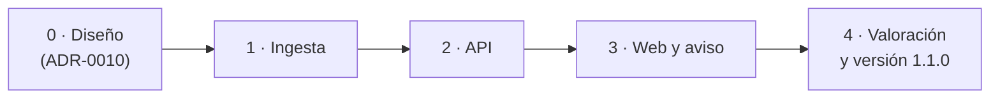

# Plan de las imágenes de los Pokémon

Plan para mostrar la imagen de cada Pokémon en la web
([RF-17](../01-ddf/requisitos-funcionales.md#rf-17)): obtenerla en la ingesta, servirla desde la
API y mostrarla en la web, con el aviso de su titularidad. La decisión de arquitectura está en
[ADR-0010](../03-adr/0010-imagenes-pokemon-cache-local.md). Sigue la issue #49.

## Alcance

**Dentro**:

| Bloque | Requisitos y decisiones |
|--------|-------------------------|
| La ingesta guarda el identificador de PokeAPI de cada forma y descarga su *sprite* con caché | [CA-54](../01-ddf/cuestiones-abiertas.md#resueltas), ADR-0010 |
| La API sirve las imágenes e indica en sus respuestas qué formas tienen imagen | RF-17, ADR-0010 |
| La web muestra la imagen junto al nombre allí donde aparece un Pokémon | RF-17 |
| Aviso de titularidad y procedencia de las imágenes | [CA-56](../01-ddf/cuestiones-abiertas.md#resueltas) |
| Valorar cómo quedan los *sprites* y si la ficha usa una imagen más grande | CA-54 |

**Fuera**:

- Las portadas de los juegos ([RF-18](../01-ddf/requisitos-funcionales.md#rf-18)). Antes hay
  que comprobar si WikiDex las tiene y en qué condiciones
  ([CA-55](../01-ddf/cuestiones-abiertas.md#resueltas)). Se harán después, reutilizando el
  endpoint y el aviso de este plan.
- Los *sprites* de la generación de cada juego (los de Rojo Fuego y Verde Hoja, por ejemplo):
  no existen para las formas regionales y obligarían a guardar una imagen por forma y juego.

## Principios

- **La imagen acompaña al nombre, nunca lo sustituye** (RF-17). En la web es decorativa
  (`alt=""`): el nombre, que está al lado, es lo que leen los lectores de pantalla, y repetirlo
  en el texto alternativo lo leería dos veces.
- **Sin imagen no hay errores**, en ninguna capa: la ingesta lo anota como aviso, la API envía
  `image_url` nula y la web muestra solo el nombre.
- **Nada externo después de la carga**: la web solo pide imágenes a la API, y la API solo las
  lee del directorio de datos.
- **Las imágenes no se versionan ni se redistribuyen** (CA-56): solo viven en la caché local.
- **Documentado en el mismo PR**: cada fase actualiza el DDT, el
  [modelo de datos](modelo-datos.md), Operación y el manual de usuario que le afecten.

## Comprobaciones previas

Hechas el 2026-10-06 sobre el repositorio [PokeAPI/sprites](https://github.com/PokeAPI/sprites),
con el commit `8491ffde1b247e4de574d4bb8e24b7bd9fa876fa` (2026-10-06), el último de `master`:

| Comprobación | Resultado |
|--------------|-----------|
| Ruta del *sprite* por defecto | `sprites/pokemon/{id}.png`, en `https://raw.githubusercontent.com/PokeAPI/sprites/{commit}/sprites/pokemon/{id}.png`. |
| Identificador | El de la **forma** (`id` del CSV `pokemon.csv`), no el número de la Pokédex: Pikachu `25`, Vulpix `37`, Vulpix de Alola `10103`, Raichu de Alola `10100`, Meowth de Galar `10161`. |
| Formato | PNG de 96 × 96 px con paleta, de 0,6 a 1,1 KB: unos 400 KB para las 386 formas cargadas. |
| Forma sin imagen | `404` con un texto plano: hay que comprobar el código de estado y el tipo del fichero. |
| Tamaño del repositorio | Unos 10 GB: se descarga fichero a fichero, nunca el repositorio entero. |
| Imagen grande | `sprites/pokemon/other/official-artwork/{id}.png`, unos 120 KB: candidata para la ficha (fase 4). |
| Caché del servidor | `Cache-Control: max-age=300` y sin cabeceras de límite de peticiones. Aun así, se espacian las peticiones. |
| Licencia | `LICENCE.txt`: las imágenes son *Copyright The Pokémon Company*; el resto del repositorio es CC0. El aviso lo recoge (CA-56). |

## Diseño

### Ingesta

- `data/curated/pokeapi.yaml` añade `sprites_commit`, validado con pydantic como `commit`.
- La fuente de PokeAPI guarda el `id` de cada forma en `pokemon.pokeapi_id`. Hoy lo lee del CSV
  pero no lo conserva.
- Un `SpriteCache`, como `CsvCache`, da la ruta local de cada *sprite* y lo descarga si no
  está, en `<data-dir>/cache/pokeapi-sprites/<commit>/<pokeapi_id>.png`:
    - Con el `User-Agent` de la ingesta y una pausa mínima entre peticiones, como `PageCache`
      de WikiDex.
    - Solo guarda el fichero si la respuesta es `200` y empieza por la firma de PNG. Lo escribe
      en un fichero temporal y lo renombra, para que una carga interrumpida no deje imágenes a
      medias.
    - Con `--offline`, solo usa la caché.
- `pokemon.image` guarda la ruta relativa al directorio de datos
  (`cache/pokeapi-sprites/<commit>/37.png`), o queda nula si no se pudo obtener.
- **Avisos**: el informe dice cuántas formas tienen imagen y cuáles no, agrupadas por motivo.
  Que falten imágenes **no** rechaza la carga.
- `ingest_run` guarda `sprites_commit`, igual que `pokeapi_commit`.

#### Decisiones tomadas al implementar la fase 1

- **Las imágenes son un paso de la carga, no de una fuente**: `build_reference` recibe el
  `SpriteCache` y, con todas las filas ya guardadas, asigna la imagen de cada forma de la tabla
  `pokemon` y añade los avisos al informe. Así no cambia el protocolo `Source` (las fuentes
  siguen entregando solo filas) y cualquier forma tiene imagen, venga de la fuente que venga,
  también las regionales de cargas futuras.
- **Un servidor que no responde detiene las descargas de esa carga**: tras un fallo que no es
  un `404` (sin conexión, tiempo agotado, error del servidor), el resto de formas solo usan la
  caché. Si no, un servidor caído costaría un tiempo de espera de 60 s por cada forma.
- **Peticiones espaciadas 0,2 s**: el CDN de GitHub no publica un límite de peticiones. La
  primera carga de las 386 imágenes tarda unos 2 minutos; las siguientes, sin descargas, un par
  de segundos. En disco ocupan 1,5 MB.
- **Sin imágenes reales en los tests**: guardarlas como *fixtures* sería versionarlas en git,
  que [CA-56](../01-ddf/cuestiones-abiertas.md#resueltas) no permite. Los tests usan un PNG
  mínimo creado en el propio test, y la carga real se ha comprobado a mano: 386 de 386 formas
  con imagen.

### Modelo de datos

Cambios en `reference.sqlite`, que se reconstruye en cada carga, así que no hay migración.
`user.sqlite` no cambia. Se documentan en el [modelo de datos](modelo-datos.md) en la fase 1:

| Tabla | Columnas nuevas | Notas |
|-------|-----------------|-------|
| `pokemon` | `pokeapi_id` único, `image`? | `pokeapi_id` es el `id` de la forma en PokeAPI. `image`, la ruta del *sprite* relativa al directorio de datos; nula si no hay imagen. |
| `ingest_run` | `sprites_commit`? | Nulo si la carga no incluye imágenes. |

### API

- `GET /api/pokemon/{pokemon}/image` devuelve el PNG con `Cache-Control: max-age` de un día:
  la imagen solo cambia con una carga nueva. Devuelve `404` si la forma no existe, no tiene imagen o el
  fichero ya no está en el disco.
    - La ruta sale de `pokemon.image`, nunca de la URL. Antes de abrirla se comprueba que, una
      vez resuelta, queda dentro del directorio de datos.
- `image_url` (texto o nulo) en las respuestas con Pokémon. La web no construye URLs:
    - `CatalogPokemonOut`, y con él la ficha (`PokemonDetailOut`) y la línea evolutiva
      (`LineMemberOut`).
    - `FavoriteOut`.
    - `PokemonOut` de la generación, que cubre las posiciones y las sugerencias.
    - `HallOfFameMemberOut`.
- `GET /api/meta` incluye `sprites_commit` en la versión de los datos.
- Son campos y un endpoint nuevos, compatibles con los clientes actuales: la versión será
  **MENOR** ([versiones](../05-operacion/versiones.md#numeracion)).

#### Decisiones tomadas al implementar la fase 2

- **Un día de caché, sin `304`**: el `FileResponse` de Starlette envía `ETag`, pero no responde
  `304` a las peticiones condicionales. Con imágenes de 1 KB no compensa programarlo: el
  navegador guarda cada una un día (`max-age=86400`) y después la vuelve a descargar.
- **Qué formas tienen imagen**: el catálogo, la ficha, los favoritos y el *Hall of Fame* lo
  leen de la propia fila de cada forma (`PokemonRow.has_image`). La generación trabaja con los
  modelos de `core/`, que no saben nada de imágenes, así que lee una vez el conjunto de formas
  con imagen (`forms_with_image`).
- **Datos de prueba de la web**: los campos nuevos son obligatorios en el contrato, así que los
  datos simulados de los tests de la web (`web/src/test/server.ts`) los incluyen ya, con
  `image_url: null`, hasta la fase 3.
- **Comprobado con los datos reales**: con la carga de la fase 1, el catálogo tarda 9 ms con
  `image_url`, y la imagen de Bulbasaur se sirve en PNG (543 B).

### Web

- Un componente `PokemonSprite`:
    - **Tamaño**: fijo, para que la página no salte al cargar.
    - **Carga**: `loading="lazy"`, porque el catálogo tiene 386 imágenes.
    - **Aspecto**: `image-rendering: pixelated`, para que el pixel art no se vea borroso al
      ampliarlo.
    - **Error**: si la imagen no carga, se oculta.
    - **Accesibilidad**: `alt=""`.
- `PokemonName` lo incluye cuando recibe `imageUrl`. Así lo muestran el catálogo, los
  favoritos, la revisión, el resultado y el editor del equipo.
- Además:
    - **Ficha**: una imagen más grande en la cabecera y en la línea evolutiva.
    - **Equipo y sugerencias**: el selector del equipo (`TeamSelector`).
    - **Hall of Fame**: el equipo de cada registro.
- Un pie en `Layout` con el aviso: «Imágenes de los Pokémon © Nintendo, Creatures, GAME FREAK y
  The Pokémon Company, obtenidas del repositorio de PokeAPI». Es el sitio de la atribución de
  PokeAPI y WikiDex que [ADR-0004](../03-adr/0004-pokeapi-volcado-csv.md#acciones-derivadas)
  tiene pendiente.

#### Decisiones tomadas al implementar la fase 3

- **Tamaños**: 40 px en las listas (catálogo, favoritos, línea evolutiva, sugerencias, selector
  y *Hall of Fame*), 64 px en las posiciones del resultado y 128 px en la cabecera de la ficha.
  `pixelated` evita que el *pixel art* se vea borroso al ampliarlo.
- **Posiciones con alternativas**: la tarjeta de una posición («Cloyster o Lapras») muestra la
  imagen de cada alternativa.
- **Selector del equipo**: las alternativas de cada posición llevan imagen; las sugerencias no,
  porque son opciones de un `<select>`, que no admite imágenes.
- **Revisión de datos**: los equipos de los combates clave siguen solo con nombres. RF-17 no la
  incluye y son Pokémon de los rivales, no del usuario.
- **Aviso**: un pie (`ImageNotice`) en todas las pantallas, con la titularidad de las imágenes y
  la atribución general de PokeAPI y WikiDex. La atribución de la página y la revisión de
  WikiDex de cada combate clave, pendiente en
  [ADR-0004](../03-adr/0004-pokeapi-volcado-csv.md#acciones-derivadas), sigue pendiente.
- **Comprobado con los datos reales** (los favoritos del usuario y la carga de la fase 1):
  ninguna imagen rota en el catálogo, los favoritos (36), la ficha de Eevee, el resultado de
  Rojo Fuego y el *Hall of Fame*; sin desplazamiento horizontal a 390 px de ancho.

#### Para la valoración (fase 4)

Lo observado en las capturas de la fase 3:

- Los *sprites* tienen mucho margen transparente dentro de sus 96 × 96 px: a 40 px, los Pokémon
  pequeños (Marowak, Jolteon, Eevee) se ven diminutos en las listas.
- En la ficha, la imagen de 128 px se ve bien, pero el margen la separa del número y el nombre.
- Opciones: recortar el margen con CSS (`object-fit` con un tamaño mayor y recorte), subir el
  tamaño de las listas a 48-56 px, o usar la ilustración oficial (unos 120 KB cada una) solo en
  la ficha.

## Fases

Cada fase es un PR con sus tests y su documentación.

| Fase | Rama | Contenido | Tests |
|------|------|-----------|-------|
| 0 ✅ | `docs/imagenes-pokemon` | ADR-0010, este plan y las comprobaciones previas. | — |
| 1 ✅ | `feat/ingesta-imagenes` | `sprites_commit`, `pokemon.pokeapi_id` e `image`, `SpriteCache`, imágenes y avisos en el informe, `ingest_run.sprites_commit`. Operación de la ingesta, modelo de datos y puesta en producción (copiar las imágenes con `reference.sqlite`). | Sin red, con un PNG mínimo creado en el test (CA-56): imagen en caché, descarga del commit fijado, `404`, servidor que no responde, fichero que no es PNG, `--offline` con la caché vacía, peticiones espaciadas, `pokeapi_id` de las formas, carga correcta aunque falten imágenes y caché fuera de git. |
| 2 ✅ | `feat/api-imagenes` | Endpoint de la imagen, `image_url` en las respuestas, `sprites_commit` en `/api/meta`, cliente regenerado. API, Operación y manual de la API. | `200` con `image/png` y `Cache-Control`; `404` sin forma, sin imagen o sin fichero; una ruta fuera del directorio de datos no se sirve; `image_url` presente o nula en cada respuesta. |
| 3 ✅ | `feat/web-imagenes` | `PokemonSprite`, imágenes en todas las pantallas de RF-17 y aviso de titularidad. Manual de la web, plan de la web y CHANGELOG. | Vitest: con imagen, sin `image_url`, error de carga y `alt` vacío. E2E: el flujo de nuevo juego sigue funcionando sin imágenes. |
| 4 | `feat/web-imagen-ficha` (si hace falta) | Valorar los *sprites* en la web (CA-54) y, si hace falta, usar una imagen más grande en la ficha, ampliando ADR-0010. Publicar la versión 1.1.0. | Los de la fase 3 para la imagen nueva. |

## Estrategia de pruebas

| Tipo | Qué cubre | Dónde |
|------|-----------|-------|
| **Ingesta** | `SpriteCache` con un descargador falso (como `CsvCache` y `PageCache`) y un PNG mínimo creado en el test, porque las imágenes reales no se versionan (CA-56); la carga completa con imágenes y con imágenes que faltan. | `tests/ingest/test_sprites.py` |
| **API** | El endpoint y `image_url` sobre un directorio de datos temporal con un *sprite* de prueba. | `tests/api/` |
| **Web** | `PokemonSprite` y `PokemonName` con y sin imagen; cada pantalla con `image_url` nula. | `web/src/**/*.test.tsx` |
| **E2E** | El servidor de pruebas no tiene imágenes: el flujo funciona igual. | `web/e2e/` |
| **Git** | Que `data/cache/` sigue fuera de git (`git check-ignore`). | `tests/` |

Los tests siguen sin red: `tests/conftest.py` hace fallar cualquier petición HTTP real.

## Riesgos

| Riesgo | Mitigación |
|--------|------------|
| `raw.githubusercontent.com` limita las peticiones o falla durante la carga. | Caché permanente por commit, pausa entre peticiones y una imagen que falta solo genera un aviso: la siguiente carga descarga solo las que faltan. |
| El repositorio cambia las rutas o reorganiza los ficheros. | Commit fijado. Cambiarlo es un PR que vuelve a hacer las comprobaciones previas. |
| Se suben imágenes a git. | `data/cache/` está en `.gitignore`, con un test que lo comprueba. |
| En producción las formas se ven sin imagen: la [puesta en producción](../05-operacion/puesta-en-produccion.md#4-codigo-web-y-datos) copia `reference.sqlite` desde el ordenador, pero no la caché a la que apunta `pokemon.image`. | La [puesta en producción](../05-operacion/puesta-en-produccion.md#4-codigo-web-y-datos) copia también `cache/pokeapi-sprites/` (1,5 MB) al directorio de datos de la VM. Es la copia del propio usuario en su servidor, no una redistribución (CA-56). Si no se copia, la aplicación funciona igual, sin imágenes. |
| Una forma regional usa el número de la Pokédex y muestra la imagen de la forma base. | La regla es usar siempre `pokeapi_id`, y los tests incluyen Vulpix de Alola. |
| El endpoint sirve un fichero fuera del directorio de datos. | La ruta sale de la base de datos y se comprueba tras resolverla, con un test. |
| Los *sprites* de 96 px, con mucho margen transparente, quedan pequeños en la ficha. | Fase 4: se valora en la web y, si hace falta, se usa la ilustración oficial en la ficha. |
| El catálogo pide 386 imágenes. | `loading="lazy"`, ficheros de 1 KB y `Cache-Control` de un día: el navegador las pide una vez al día. |
