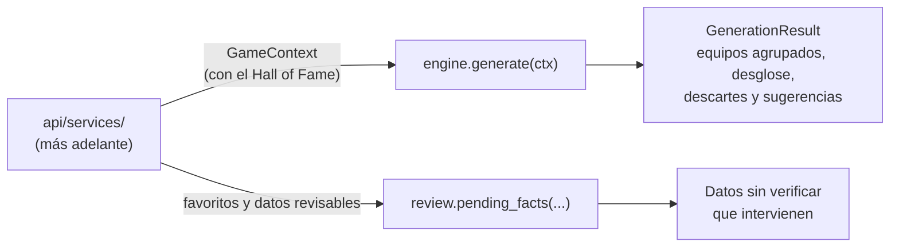
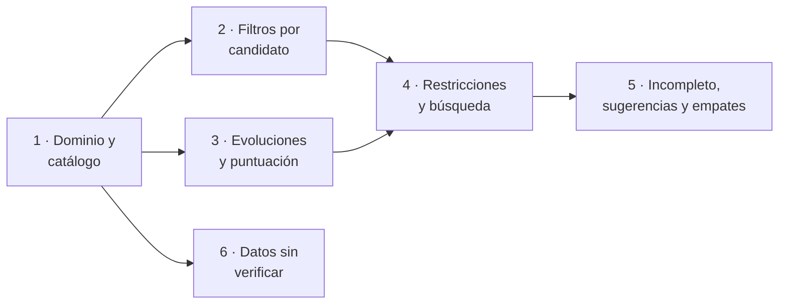

# Plan de implementación del motor (`core/`)

Plan para implementar `core/`, el dominio puro que aplica las reglas de negocio y genera los
equipos. Parte del [catálogo de reglas](../01-ddf/reglas-negocio.md), de la
[arquitectura](arquitectura.md#core-dominio-puro), del
[algoritmo de generación](algoritmo-generacion.md) y del
[contexto del motor](modelo-datos.md#contexto-del-motor-gamecontext).

## Alcance

**Dentro**: todas las reglas del catálogo y los mecanismos del motor.

| Bloque | Reglas y requisitos |
|--------|---------------------|
| Filtros por candidato | RN-03, RN-11, RN-16, con el motivo de cada descarte (RF-10) |
| Restricciones entre miembros | RN-07, RN-12, RN-14 (como mucho una evolución de Eevee) |
| Presencia obligatoria | RN-13, RN-14 (al menos una evolución de Eevee) |
| Puntuación | RN-04 con RN-06, RN-15, RN-17 y RN-20; desglose por regla (RF-09) |
| Desempate y empates | RN-19 y agrupación de equipos intercambiables (CA-33) |
| Equipo incompleto | RN-08 con sugerencias (RF-10) |
| Datos sin verificar | RN-18: qué datos intervienen en una generación (RF-15) |
| Estructurales | RN-01, RN-02, RN-05, RN-09, RN-10, que aplica el propio motor |

**Fuera**: construir el `GameContext` a partir de las bases de datos (lo hará `api/services/`),
`user.sqlite`, la API y la interfaz. `core/` no lee ficheros ni bases de datos: recibe todo
en memoria.

## Principios

- **Puro**: solo biblioteca estándar, sin E/S. Lo comprueban `import-linter` y
  `tests/test_architecture.py` ([estructura del código](estructura-codigo.md#reglas-de-dependencia)).
- **Inmutable**: modelos `dataclass(frozen=True)` con tuplas y `frozenset`, para que el motor
  no pueda modificar su entrada y los resultados sean reproducibles.
- **Exacto y determinista**: puntuaciones con `fractions.Fraction`
  ([ADR-0006](../03-adr/0006-algoritmo-busqueda-exacta.md)) y recorrido de los candidatos en
  orden canónico (número de la Pokédex y forma). Misma entrada, mismo resultado (RF-08).
- **Una clase por regla**: cada `RN-XX` es una clase con su identificador, que implementa la
  interfaz de su clase de regla. Así salen solos los motivos de descarte y el desglose de la
  puntuación ([arquitectura](arquitectura.md#core-dominio-puro)).
- **Trazabilidad**: cada regla tiene sus tests con `@pytest.mark.rn("RN-XX")` y aparece en la
  [tabla de trazabilidad](#trazabilidad-de-las-reglas), que se completa en cada PR.
- **Documentado en el mismo PR**: cada fase actualiza la página del motor y esta tabla
  ([documentación del código](estructura-codigo.md#documentacion-del-codigo)).

## Interfaz pública

Dos funciones, una por caso de uso. Todo lo demás es interno: el recorrido (RN-16) lo calcula
el motor a partir de los registros del *Hall of Fame* que van en el contexto.

| Función | Entrada | Salida | Reglas |
|---------|---------|--------|--------|
| `engine.generate(ctx)` | `GameContext` con todos los datos ya confirmados | `GenerationResult` | RN-01 a RN-17, RN-19, RN-20 |
| `review.pending_facts(...)` | Favoritos, datos del juego y su origen | Datos inferidos o pendientes que intervienen | RN-18 |

`generate` nunca recibe datos sin confirmar: si queda alguno, la API responde `409` antes de
llamarla ([API](api.md#generacion)). Por eso el motor no conoce el origen de los datos; solo
`review` lo usa.

## Modelos del dominio

En `core/domain/`. Los nombres de campo son orientativos y se fijan en la fase 1.

| Modelo | Contenido |
|--------|-----------|
| `PokemonData` | Una forma: identificador, especie, número de Pokédex, nombre, tipos ordenados en la generación del juego, línea evolutiva, región, marcas de legendario y singular, y las etapas desde la que nace del huevo hasta ella, con sus grupos huevo y los pasos de evolución (disparador y condiciones). |
| `Availability` | Si existe en el juego objetivo y si puede llegar antes de completarlo (RN-03). |
| `TypeChart` | Tipos de la generación y factor de cada pareja atacante-defensor. Calcula el factor contra un Pokémon de dos tipos. |
| `KeyBattle` | Combate clave: categoría y tipos de cada Pokémon rival (RN-17). |
| `GameInfo` | Juego, generación y mecánicas (`day_night_cycle`, `contests`). |
| `RuleSettings` | Reglas activas y pesos de las blandas, con los valores por defecto del catálogo (RN-04, CA-05, CA-37). |
| `HallOfFameEntry` | Un juego completado con su orden y su equipo, para el recorrido (RN-16). |
| `GameContext` | Todo lo anterior: juego, tabla de tipos, favoritos con su disponibilidad, Pokémon del juego para sugerencias (`pool`), combates clave, recorrido y configuración. |
| `GenerationResult` | Estado (`complete` o `incomplete`), grupos de equipos empatados con su puntuación y desglose, descartes con su motivo, reglas de presencia que no se pueden cumplir y sugerencias por hueco. |

## Módulos

| Módulo | Responsabilidad | Fase |
|--------|-----------------|------|
| `domain/` | Modelos inmutables de la tabla anterior. | 1 |
| `rules/catalog.py` | Catálogo estático: identificador, tipo, si es configurable, peso por defecto. | 1 |
| `breeding.py` | Si una línea se puede criar y qué etapa nace del huevo (RN-11, CA-25, CA-36). | 2 |
| `journey.py` | Exclusiones del recorrido (RN-16, CA-17, CA-18, CA-21). | 2 |
| `rules/candidate.py` | Filtros por candidato: RN-03, RN-11 y RN-16, con motivo. | 2 |
| `evolution.py` | Si un paso de evolución es tedioso (RN-15), aleatorio (RN-20) o imposible en el juego. | 3 |
| `rules/soft.py` | Reglas blandas RN-06, RN-15, RN-17 y RN-20, con puntuación entre 0 y 1. | 3 |
| `scoring.py` | Puntuación ponderada (RN-04), desglose (RF-09) y clave de desempate (RN-19). | 3 |
| `rules/team.py` | Restricciones entre miembros (RN-07, RN-12, RN-14) y niveles de presencia (RN-13, RN-14). | 4 |
| `engine/search.py` | Grafo de incompatibilidades y búsqueda con retroceso. | 4 |
| `engine/__init__.py` | `generate`: filtros, presencia, búsqueda, puntuación y resultado. | 4 |
| `engine/suggestions.py` | Equipo incompleto y sugerencias (RN-08). | 5 |
| `engine/grouping.py` | Agrupación de equipos empatados intercambiables (CA-33). | 5 |
| `review.py` | Datos sin verificar que intervienen (RN-18). | 6 |

## Cómo se interpreta cada regla

Detalles que el DDF deja implícitos y que la implementación fija. Si alguno no es correcto, se
corrige primero en el DDF.

| Regla | Interpretación |
|-------|----------------|
| RN-03 | Un favorito pasa si existe en el juego (`exists_in_game`) y puede llegar a tiempo (`can_arrive`), ambos ya confirmados. El nivel de generación ya va implícito en el de juego, pero el descarte dice qué nivel falla, para explicarlo mejor. |
| RN-07 | Misma línea evolutiva = misma cadena de evolución de PokeAPI. Las formas regionales comparten cadena con la forma base; no afecta a la primera carga, que no tiene formas regionales. |
| RN-11 | Se puede criar si alguna especie de las etapas tiene un grupo huevo distinto de `no-eggs` y `ditto`. La etapa que nace del huevo es la primera de la línea, salvo los bebés de incienso (CA-36). |
| RN-12 | Dos miembros chocan si comparten algún tipo en la generación del juego, como primario o como secundario. |
| RN-13 | Dragonite se identifica por su forma (`dragonite`). El nivel 2 son los candidatos válidos con tipo primario Dragón; el 3, los Pokémon del juego con tipo primario Dragón que no son candidatos válidos. |
| RN-14 | Evolución de Eevee = cualquier forma de la cadena de Eevee salvo Eevee. Como restricción entre miembros, dos evoluciones de Eevee chocan; como presencia, el equipo necesita una. |
| RN-15 | Un miembro es tedioso si lo es alguno de los pasos desde la etapa que nace del huevo hasta él. Tediosos: intercambio, muda (Shedinja), aleatorio, comparación de estadísticas, hora del día, belleza, lugar, equipo, movimiento no aprendido por nivel, otros raros; y cualquier paso imposible en el juego: hora del día sin `day_night_cycle` o belleza sin `contests`. No tediosos: nivel, amistad, objeto y piedras, objeto equipado y sexo (CA-43). Si una pareja de etapas tiene varios métodos, cuenta el más fácil (CA-44). Los métodos sin catalogar y las evoluciones por movimiento sin datos de `level_move` no llegan al motor: detienen la carga (CA-42, CA-45). Un equipo vacío puntúa 1. |
| RN-16 | Se excluyen las formas de la misma cadena y región que cada miembro de los equipos afectados, salvo la cadena de Dragonite; de la de Eevee, solo la evolución usada. |
| RN-17 | Por cada Pokémon rival: **ataque** = algún miembro tiene un tipo cuyo factor contra el rival (producto de sus tipos) es ×2 o más; **defensa** = algún miembro tiene un factor ×0,5 o menos (inmunidad incluida) frente a al menos un tipo del rival y menos de ×2 frente a todos. La puntuación del rival es la media de los dos; la del combate, la media de sus rivales; la de la regla, la media de los combates. Un juego objetivo siempre tiene combates clave (CA-46). |
| RN-19 | La clave de comparación es `(puntuación, miembros con dos tipos)`. |
| RN-20 | Un miembro es aleatorio si alguno de sus pasos tiene `percentage_chance` o `condition_expression` (Wurmple). Puntúa 0 si hay alguno en el equipo. |

## Decisiones tomadas al planificar

- **[CA-40](../01-ddf/cuestiones-abiertas.md#resueltas)**: las sugerencias de RN-08 pasan los
  mismos filtros por candidato que los favoritos (llegada, crianza y recorrido). Solo se
  diferencian en que no son favoritos.
- **[CA-41](../01-ddf/cuestiones-abiertas.md#resueltas)**: todas las reglas activables están
  activas por defecto, con los pesos de CA-05 y CA-37.

Revisadas tras la fase 3, sobre las interpretaciones que fijó su implementación:

- **[CA-42](../01-ddf/cuestiones-abiertas.md#resueltas)**: un método de evolución sin
  catalogar detiene la carga y lo cataloga el usuario. La clasificación pasa a ser un dato
  ([`evolution_methods.yaml`](datos-curados.md#evolution_methodsyaml)) y el motor la recibe
  en el contexto (fase 7 del [plan de carga](plan-carga-datos.md#fases)).
- **[CA-43](../01-ddf/cuestiones-abiertas.md#resueltas)**: el sexo y el objeto equipado no
  son tediosos. Hoy `core/evolution.py` trata el sexo como tedioso (`other`); se corrige en
  la fase 7. No afecta a las generaciones 1 a 3.
- **[CA-44](../01-ddf/cuestiones-abiertas.md#resueltas)**: con varios métodos, cuenta el más
  fácil. Ya implementado.
- **[CA-45](../01-ddf/cuestiones-abiertas.md#resueltas)**: una evolución por movimiento sin
  los movimientos por nivel detiene la carga.
- **[CA-46](../01-ddf/cuestiones-abiertas.md#resueltas)**: un juego objetivo sin combates
  clave no se carga. Hasta la fase 7, RN-17 puntúa 0 sin combates clave; después, el motor lo
  tratará como un error.

## Estrategia de pruebas

| Tipo | Qué cubre | Dónde |
|------|-----------|-------|
| **Por regla** | Cada regla con sus ejemplos del DDF, con `@pytest.mark.rn("RN-XX")`. | `tests/core/rules/` |
| **Constructores** | Funciones para crear Pokémon, combates y contextos de prueba legibles (`pokemon("gengar", types=("ghost", "poison"), ...)`). | `tests/core/builders.py` |
| **Propiedades (hypothesis)** | Con contextos aleatorios: todo equipo devuelto cumple las reglas duras activas; el resultado es el mismo para la misma entrada; la suma del desglose es la puntuación; ningún equipo admisible supera a los devueltos ni empata con más miembros de dos tipos, comparando con una **búsqueda por fuerza bruta** en casos de hasta 12 candidatos. | `tests/core/test_engine_properties.py` |
| **Escenario real** | Rojo Fuego con datos reales: un extracto en JSON de `reference.sqlite` (los 140 Pokémon que llegan, la tabla de tipos y los 13 combates clave) y una lista de favoritos de ejemplo. Comprueba un resultado razonable y que tarda menos de un segundo. | `tests/core/fixtures/`, con su script de extracción y README |

Como en la ingesta, los tests no usan la red ni la base de datos: el extracto del escenario
real se genera con un script y se guarda en el repositorio.

## Fases

Cada fase es un PR con sus tests y su documentación.

| Fase | Rama | Contenido | Tests |
|------|------|-----------|-------|
| 1 ✅ | `feat/core-dominio` | Modelos de entrada de `core/domain/`, `TypeChart` con el factor contra dos tipos, catálogo de reglas con sus valores por defecto y `RuleSettings`. Nueva página del DDT [Motor de reglas](motor.md). Los modelos de salida (`GenerationResult`) se añaden en las fases que los usan. | Modelos, tabla de tipos (Fantasma contra Psíquico en la 1.ª generación, Agua contra Roca/Tierra ×4) y catálogo. |
| 2 ✅ | `feat/core-filtros` | `breeding.py`, `journey.py` y los filtros RN-03, RN-11 y RN-16 con su motivo de descarte. Ajustes de los modelos: los grupos huevo pasan a ser de toda la línea (Pichu se puede criar), cada forma lleva su generación (para explicar el nivel de RN-03) y el contexto recibe el *Hall of Fame* en lugar de una lista de exclusiones. | Ejemplos de RN-03, RN-11 y RN-16 del DDF, incluidas las excepciones de Dragonite y Eevee. |
| 3 ✅ | `feat/core-puntuacion` | `evolution.py`, las reglas blandas RN-06, RN-15, RN-17 y RN-20, la puntuación ponderada con desglose y la clave de RN-19. | Ejemplos de RN-15 (Gengar, Raichu, Milotic), RN-20 (Wurmple) y RN-17 (Brock); suma del desglose. |
| 4 | `feat/core-busqueda` | Restricciones RN-07, RN-12 y RN-14, niveles de presencia de RN-13 y RN-14, grafo de incompatibilidades, búsqueda con retroceso y `generate` para equipos completos. | Ejemplos de RN-07, RN-12, RN-13 y RN-14; propiedades con hypothesis y fuerza bruta; escenario real de Rojo Fuego. |
| 5 | `feat/core-sugerencias` | Equipo incompleto con huecos reservados por las reglas de presencia, sugerencias que pasan los filtros por candidato y ordenadas (RN-08, RN-19, CA-40) y agrupación de empates (CA-33). | Ejemplos de RN-08 (4 candidatos en Rojo Fuego, Dragonite que deja un equipo de 5) y de CA-33 (Lapras o Cloyster). |
| 6 | `feat/core-revision` | `review.py`: datos inferidos o pendientes que intervienen (RN-18), sin los de favoritos ya descartados con datos automáticos. | Ejemplo de RN-18 (Raichu en Rojo Fuego). |

Después del motor, el siguiente paso es `user.sqlite` y la API, que construyen el
`GameContext` a partir de las dos bases de datos y permiten generar equipos con los datos
reales de extremo a extremo.

## Trazabilidad de las reglas

Se completa en cada fase con el módulo y los tests de cada regla. Detalle de lo implementado en
[Motor de reglas](motor.md).

| Regla | Módulo | Fase | Estado |
|-------|--------|------|--------|
| RN-01 | `engine/` | 4 | Pendiente |
| RN-02 | `engine/` | 4 | Pendiente |
| RN-03 | `rules/candidate.py` | 2 | Hecho (`rules/test_candidate.py`) |
| RN-04 | `rules/catalog.py` (pesos), `scoring.py` | 1, 3 | Hecho (`test_catalog.py`, `test_scoring.py`) |
| RN-05 | `domain/` | 1 | Hecho (`test_domain.py`) |
| RN-06 | `rules/soft.py` | 3 | Hecho (`rules/test_soft.py`) |
| RN-07 | `rules/team.py` | 4 | Pendiente |
| RN-08 | `engine/suggestions.py` | 5 | Pendiente |
| RN-09 | `domain/`, `engine/` | 1, 4 | Modelo hecho (`test_domain.py`); uso en el motor pendiente |
| RN-10 | `domain/` (`TypeChart`, tipos por generación) | 1 | Hecho (`test_type_chart.py`, `test_domain.py`) |
| RN-11 | `breeding.py`, `rules/candidate.py` | 2 | Hecho (`test_breeding.py`, `rules/test_candidate.py`) |
| RN-12 | `rules/team.py` | 4 | Pendiente |
| RN-13 | `rules/team.py` | 4 | Pendiente |
| RN-14 | `rules/team.py` | 4 | Pendiente |
| RN-15 | `evolution.py`, `rules/soft.py` | 3 | Hecho (`test_evolution.py`, `rules/test_soft.py`, `test_scoring.py`) |
| RN-16 | `journey.py`, `rules/candidate.py` | 2 | Hecho (`test_journey.py`, `rules/test_candidate.py`) |
| RN-17 | `rules/soft.py` | 3 | Hecho (`rules/test_soft.py`) |
| RN-18 | `review.py` | 6 | Pendiente |
| RN-19 | `scoring.py`, `engine/suggestions.py` | 3, 5 | Clave de los equipos hecha (`test_scoring.py`); sugerencias pendientes |
| RN-20 | `evolution.py`, `rules/soft.py` | 3 | Hecho (`test_evolution.py`, `rules/test_soft.py`, `test_scoring.py`) |

## Riesgos

| Riesgo | Mitigación |
|--------|------------|
| Demasiados equipos empatados para mostrarlos, porque la puntuación depende sobre todo de los tipos. | Desempate RN-19 y agrupación CA-33. El escenario real de Rojo Fuego medirá cuántos grupos salen; si son demasiados, se plantea en el DDF cómo limitarlos. |
| Búsqueda lenta sin RN-12 y con muchos favoritos (unos 20 s con 120 candidatos). | Con RN-12 activa y los tamaños esperados basta la búsqueda exhaustiva. Si hace falta, ramificación y poda con una cota de la puntuación ([algoritmo](algoritmo-generacion.md#tamano-de-la-busqueda)). |
| Interpretaciones de reglas que no coinciden con lo que se quiere. | Están escritas en [esta tabla](#como-se-interpreta-cada-regla) para revisarlas antes de implementar; los tests usan los ejemplos del DDF. |
