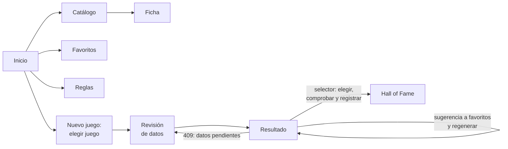
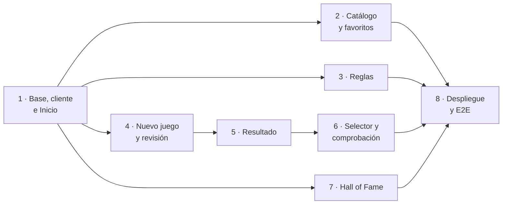

# Plan de implementación de la web (`web/`)

Plan para implementar `web/`, la interfaz de la aplicación: una aplicación de una sola página
con React, Vite, TypeScript y Tailwind ([ADR-0001](../03-adr/0001-stack-tecnologico.md)) sobre
la [API](api.md), ya completa. Parte de la [arquitectura](arquitectura.md#web-interfaz) y de
los requisitos del [DDF](../01-ddf/requisitos-funcionales.md).

## Alcance

**Dentro**:

| Bloque | Requisitos y reglas |
|--------|---------------------|
| Proyecto `web/` con sus herramientas de calidad y su job de CI | [ADR-0001](../03-adr/0001-stack-tecnologico.md) |
| Cliente de la API generado desde el OpenAPI, comprobado en CI | [ADR-0007](../03-adr/0007-cliente-generado-openapi.md) |
| Inicio: estado de los datos y accesos | — |
| Catálogo, ficha y favoritos | RF-01, RF-02, RF-03, RF-04 |
| Reglas | RF-06, RF-07 |
| Nuevo juego: elegir juego, revisar datos y generar | RF-05, RF-15, RF-08 |
| Resultado: equipos, explicación, descartes y sugerencias | RF-08, RF-09, RF-10 |
| Selector del equipo: elegir uno de los generados, comprobarlo y registrarlo, o descartarlos. Incluye la comprobación en `core/` y en la API | RF-10, RF-12, CA-53 |
| *Hall of Fame* | RF-12, RF-13 |
| La API sirve la web compilada: un solo proceso | [Despliegue](arquitectura.md#despliegue) |
| Pruebas de extremo a extremo del flujo de nuevo juego | [Estrategia de pruebas](arquitectura.md#estrategia-de-pruebas) |

**Fuera**: lanzar la carga de datos desde la web
([ADR-0008](../03-adr/0008-cargas-bloqueadas.md)), reglas definidas por el usuario (RF-14,
*Could*), varios usuarios o autenticación ([alcance](../01-ddf/index.md#alcance)) e imágenes
de los Pokémon ([CA-52](../01-ddf/cuestiones-abiertas.md#resueltas)). Las imágenes de los
Pokémon y las portadas de los juegos quedan como mejora posterior
([RF-17](../01-ddf/requisitos-funcionales.md#rf-17),
[RF-18](../01-ddf/requisitos-funcionales.md#rf-18)); las de los Pokémon tienen su
[plan](plan-imagenes.md).

## Principios

- **La web no implementa reglas de negocio**: muestra lo que calcula la API. No decide qué
  equipos son válidos ni los ordena. Cuando el usuario compone un equipo en el selector, es la
  API quien lo comprueba contra las reglas. La web solo valida la forma de lo que envía (por
  ejemplo, de 1 a 6 Pokémon en un registro del *Hall of Fame*); el resto lo valida la API y la
  web muestra su mensaje.
- **Contrato generado**: los tipos y el cliente salen del OpenAPI
  ([ADR-0007](../03-adr/0007-cliente-generado-openapi.md)). Un cambio de la API que rompe la web
  aparece al compilar.
- **Estado del servidor con TanStack Query**: cada recurso tiene su consulta y cada cambio
  invalida las consultas afectadas (añadir un favorito invalida el catálogo, los favoritos y la
  revisión). No hay otro almacén de estado global.
- **Estado de la interfaz en la URL**: el juego elegido, los filtros del catálogo y el paso del
  flujo están en la ruta o en sus parámetros, para poder recargar, volver atrás y enlazar.
- **Accesible y en español**: HTML semántico, uso completo con teclado y textos en español en
  el propio código, sin biblioteca de traducción: la aplicación tiene un solo idioma.
- **Documentado en el mismo PR**: cada fase actualiza el **manual de usuario** (una página
  nueva, «Usar la web»), Operación, este plan y la tabla de comandos de `CLAUDE.md`.

## Decisiones tomadas al planificar

- **Rutas con React Router** (modo declarativo): es lo más conocido, y la aplicación tiene
  pocas pantallas sin carga de datos en la ruta, que ya hace TanStack Query.
- **Sin biblioteca de componentes**: Tailwind y unos pocos componentes propios (botones,
  insignias de tipo, nombre de Pokémon, mensajes de error, diálogos con `<dialog>`). Las
  pantallas son formularios y listas sencillas.
- **Mismo origen, sin CORS**: en desarrollo, el servidor de Vite reenvía `/api` a
  `http://127.0.0.1:8000`; en producción, la API sirve la web compilada (`web/dist`) en `/`, con
  vuelta a `index.html` para las rutas de la aplicación.
- **Nombres y colores de los tipos en la web**: un diccionario de los 18 tipos con su nombre
  en español y su color. Son fijos y la API los envía como identificadores (`fire`).
- **Métodos de evolución en texto**: la ficha recibe el disparador y las condiciones de
  PokeAPI ([API](api.md#catalogo)). La web los convierte en texto («Nivel 25», «Intercambio
  llevando Revestimiento metálico», «Amistad alta, de día») con un diccionario de disparadores,
  condiciones y objetos de evolución de las generaciones cargadas. Lo que no conoce se muestra
  con su identificador de PokeAPI, nunca se oculta. Si se cargan más generaciones y el
  diccionario de objetos crece demasiado, se cargarán sus nombres desde PokeAPI.
- **Puntuaciones tal cual**: la API ya las envía como enteros que suman el total
  ([CA-51](../01-ddf/cuestiones-abiertas.md#resueltas)). La web no recalcula nada.
- **Node 24 LTS y npm**, fijados en `web/.nvmrc` y `package-lock.json`.
- **Cliente generado en git**: `web/src/api/schema.d.ts` se genera con
  `npm run api:generate`, que exporta el OpenAPI de la API sin arrancarla
  (`uv run python -m api.openapi`) y ejecuta `openapi-typescript`. CI lo vuelve a generar y
  falla si hay diferencias.

- **Todos los juegos para el *Hall of Fame***: `GET /api/games` solo daba los juegos objetivo,
  pero se puede registrar cualquier juego cargado. En la fase 7 se añadió `all=true`, con el
  campo `target` en cada juego, en lugar de un endpoint nuevo.

- **Enlaces al DDF en GitHub**: la documentación no se publica como sitio, así que la pantalla de
  reglas enlaza a `docs/01-ddf/reglas-negocio.md` en GitHub (`web/src/lib/docs.ts`). Los
  anclajes de MkDocs (`#rn-09`) no funcionan allí, así que el enlace lleva a la página y cada
  regla muestra su identificador. Si la documentación se publica, basta con cambiar esa URL.

### Decisiones funcionales

Dos decisiones de la interfaz eran funcionales, así que se registraron en el DDF y se
resolvieron al planificar:

- **Sin imágenes de los Pokémon** ([CA-52](../01-ddf/cuestiones-abiertas.md#resueltas)): número,
  nombre y tipos con sus colores. Los datos cargados no tienen imágenes. Quedan para una
  mejora posterior ([RF-17](../01-ddf/requisitos-funcionales.md#rf-17),
  [RF-18](../01-ddf/requisitos-funcionales.md#rf-18)).
- **Selector del equipo** ([CA-53](../01-ddf/cuestiones-abiertas.md#resueltas),
  [RF-12](../01-ddf/requisitos-funcionales.md#rf-12)): en el resultado, el usuario elige uno de
  los equipos (una alternativa por posición cuando hay Pokémon intercambiables y una sugerencia
  por hueco si es incompleto) o los descarta todos. El elegido se registra directamente en el
  *Hall of Fame* para ese juego, con la fecha del día (que puede cambiar), y cuenta para el
  recorrido desde ese momento ([RN-16](../01-ddf/reglas-negocio.md#rn-16)). Si los descarta, no
  se registra nada. Como dos sugerencias de huecos libres pueden no encajar entre sí, antes de
  registrarlo la API comprueba el equipo ([comprobación del equipo](#comprobacion-del-equipo)).

### Comprobación del equipo

La web no sabe qué equipos cumplen las reglas, así que el selector pide a la API que compruebe
el equipo elegido. Es un endpoint con su función en `core/`, añadidos en la fase 6
([motor](motor.md#comprobacion-de-un-equipo-elegido-corerulescheckpy),
[API](api.md#generacion)):

- **`core.rules.check.check_team(ctx, miembros)`**: devuelve los problemas del equipo con las
  reglas activas, cada uno con su regla, los miembros afectados y una explicación en español.
  Comprueba que cada miembro pase los filtros por candidato
  ([RN-03](../01-ddf/reglas-negocio.md#rn-03), [RN-11](../01-ddf/reglas-negocio.md#rn-11),
  [RN-16](../01-ddf/reglas-negocio.md#rn-16)), que no haya dos miembros incompatibles
  ([RN-07](../01-ddf/reglas-negocio.md#rn-07), [RN-12](../01-ddf/reglas-negocio.md#rn-12),
  [RN-14](../01-ddf/reglas-negocio.md#rn-14)) y que se cumplan las reglas de presencia en el
  nivel que se aplica ([RN-13](../01-ddf/reglas-negocio.md#rn-13), RN-14). Usa las mismas
  funciones que el motor, así que no duplica ninguna regla.
- **`POST /api/games/{game}/team-checks`** con `{"members": [...]}` (de 1 a 6 formas): responde
  `{"valid": ..., "problems": [...]}`. Como la generación, responde `409` si quedan datos sin
  confirmar. Un miembro sin verificar (CA-31) no es un problema, pero se indica.

El registro en el *Hall of Fame* no exige que el equipo cumpla las reglas, porque el usuario
puede haber completado el juego con cualquier equipo. La comprobación es del selector: la web
no deja registrar desde él un equipo con problemas y explica cuáles son.

## Pantallas



| Ruta | Pantalla | Qué hace | Requisitos | Endpoints |
|------|----------|----------|------------|-----------|
| `/` | Inicio | Con qué datos trabaja la aplicación, cuántos favoritos hay, el último juego completado y el acceso a **Nuevo juego**. Si no hay datos cargados (`503`), explica cómo cargarlos. | — | `GET /api/meta`, `/api/favorites`, `/api/hall-of-fame` |
| `/pokemon` | Catálogo | Lista con búsqueda (`?q=`), filtro por tipo (`?type=`) y por favoritos (`?favorite=`), y una estrella para añadir o quitar cada uno de favoritos. | RF-01, RF-03 | `GET /api/pokemon`, `PUT`/`DELETE /api/favorites/{pokemon}` |
| `/pokemon/:pokemon` | Ficha | Número, nombre, tipos actuales, línea evolutiva por etapas con el método de cada evolución en texto y la estrella de favorito. Desde la línea se navega a las otras formas. | RF-02, RF-03, RN-09 | `GET /api/pokemon/{pokemon}` |
| `/favoritos` | Favoritos | La lista con su número total, cada uno con sus tipos y un botón para quitarlo. Recuerda que cada favorito es la evolución a la que se quiere llegar. | RF-04 | `GET /api/favorites`, `DELETE` |
| `/reglas` | Reglas | Las reglas agrupadas por clase: las duras y de presencia con un interruptor si son configurables, las blandas con interruptor y peso de 0 a 10, y los mecanismos como información. Cada una con su descripción y un enlace a su regla del DDF. | RF-06, RF-07 | `GET /api/rules`, `PATCH /api/rules/{rule_id}` |
| `/juego` | Nuevo juego | Los juegos objetivo para elegir uno. | RF-05 | `GET /api/games` |
| `/juego/:game/revision` | Revisión de datos | Los datos que hay que confirmar: mecánicas y combates clave del juego y la llegada de cada favorito, con su propuesta. Se acepta todo de una vez o se confirma o corrige uno a uno (sí o no; en un combate clave, su equipo con un buscador de Pokémon). Los desactualizados se señalan. Con todo confirmado, lleva al resultado. | RF-15, RN-18 | `GET /review`, `PUT /review/{fact_key}`, `POST /review/accept-proposals` |
| `/juego/:game/resultado` | Resultado | Genera al entrar y con **Volver a generar**. Muestra el estado y su motivo, cada grupo de equipos con sus posiciones (las alternativas, como «Cloyster o Lapras»), el desglose por regla, los huecos con sus sugerencias (las no verificadas, señaladas) y un botón para añadir cada una a favoritos, los descartes agrupados por motivo, las reglas de presencia y los datos confirmados usados. Si la API responde `409`, lleva a la revisión. El **selector** permite elegir un equipo (una alternativa por posición y una sugerencia por hueco), lo comprueba y, si no tiene problemas, lo registra en el *Hall of Fame* con la fecha y las notas que el usuario indique; o descartar todos. | RF-08, RF-09, RF-10, RF-12, CA-53 | `POST /api/games/{game}/generations`, `POST /api/games/{game}/team-checks`, `POST /api/hall-of-fame` |
| `/hall-of-fame` | Hall of Fame | El recorrido en orden, con el último juego completado señalado y filtro por juego. Registrar a mano un equipo (por ejemplo, de un juego que no es juego objetivo), corregir y eliminar (con confirmación), con un buscador de Pokémon para el equipo. | RF-12, RF-13, RN-16 | `GET`, `POST`, `PATCH`, `DELETE /api/hall-of-fame`, `GET /api/games?all=true` |

En todas las pantallas, una barra de navegación lleva a Catálogo, Favoritos, Reglas, Nuevo
juego y *Hall of Fame*.

### Cómo se muestran los errores

| Respuesta | En la web |
|-----------|-----------|
| `503` | Un aviso en toda la aplicación: no hay datos cargados, con el comando de la [carga](../04-manual-usuario/cargar-datos.md). |
| `409` al generar | Se va a la revisión, que muestra lo pendiente. |
| `404`, `409` y `422` del resto | El mensaje de `detail` junto al formulario o la acción que lo produjo. |
| Error de red | Un aviso de que la API no responde, con el comando para arrancarla. |

## Estructura de `web/`

```
web/
  package.json, package-lock.json, .nvmrc
  vite.config.ts            proxy de /api en desarrollo
  tsconfig.json             strict
  eslint.config.js, .prettierrc
  playwright.config.ts
  index.html
  src/
    main.tsx, App.tsx       arranque, QueryClient y rutas
    api/
      schema.d.ts           generado (openapi-typescript); no se edita
      client.ts             cliente de openapi-fetch y manejo de errores
      queryClient.ts        QueryClient: solo reintenta los fallos de conexión
      types.ts              nombres cortos de los esquemas del contrato
      queries/              una consulta o mutación por recurso, con sus invalidaciones
    pages/                  una por pantalla
    components/             Layout, ApiStatusBanner, TypeBadge, PokemonName, FavoriteButton, PokemonPicker, ErrorMessage…
    lib/
      format.ts             fechas en español
      commands.ts           comandos que la web indica (carga, arranque de la API)
      types.ts              nombres y colores de los tipos
      evolution.ts          métodos de evolución en texto
    test/                   configuración de Vitest, API simulada con MSW y renderApp
  e2e/                      pruebas de Playwright
  README.md
```

`api/openapi.py` (en Python) exporta el OpenAPI de `create_app()` sin arrancar la API, para
generar el cliente. Los tests de Vitest están junto a lo que prueban (`*.test.ts(x)`).

## Fases

Cada fase es un PR con sus tests y su documentación.



| Fase | Rama | Contenido | Tests |
|------|------|-----------|-------|
| 1 ✅ | `feat/web-base` | Proyecto con Vite, React, TypeScript (strict) y Tailwind; ESLint, Prettier y Vitest; `api/openapi.py` y `npm run api:generate`; cliente, `QueryClient`, rutas y `Layout` con la navegación; avisos de `503` y de error de red; **Inicio**. Job **Web** de CI (cliente al día, lint, formato, tipos, tests y compilación). | El cliente generado coincide con el OpenAPI; Inicio con datos, sin datos (`503`) y sin API; navegación. |
| 2 ✅ | `feat/web-catalogo-favoritos` | Catálogo con búsqueda y filtros en la URL, ficha con la línea y los métodos en texto (`lib/evolution.ts`), favoritos y la estrella en las tres pantallas. | Búsqueda y filtros; formas regionales; estrella que actualiza las tres pantallas; texto de cada disparador y condición conocidos y de uno desconocido. |
| 3 ✅ | `feat/web-reglas` | Reglas por clase con interruptores, pesos y errores de la API. | Regla no configurable sin interruptor; cambiar peso y activar; mensaje de un `409`. |
| 4 ✅ | `feat/web-nuevo-juego` | Elegir juego y revisión: aceptar todo, confirmar o corregir uno a uno, equipo de un combate clave con el buscador de Pokémon y datos desactualizados. | Flujo de la revisión con el ejemplo de Raichu (RN-18); combate clave corregido; `422` de un Pokémon que no existe. |
| 5 ✅ | `feat/web-resultado` | Resultado: grupos, desglose, huecos y sugerencias con «Añadir a favoritos», descartes por motivo, presencia, datos confirmados y `409` hacia la revisión. | Equipo completo de Rojo Fuego con el grupo «Cloyster o Lapras»; incompleto con sugerencias sin verificar; añadir una sugerencia y regenerar; `409`. |
| 6 ✅ | `feat/selector-equipo` | `core.rules.check.check_team`, `POST /api/games/{game}/team-checks` y el selector del resultado: elegir alternativas y sugerencias, comprobar, registrar en el *Hall of Fame* o descartar (CA-53). Documentación del motor, la API y el manual. | Motor: cada regla que comprueba, con `@pytest.mark.rn`, y con hypothesis que los equipos que devuelve `generate` no tienen problemas. API: equipo válido, dos sugerencias que chocan por RN-12, regla de presencia sin cumplir, `409`. Web: elegir y registrar, equipo con problemas que no se deja registrar, descartar sin registrar nada. |
| 7 ✅ | `feat/web-hall-of-fame` | Recorrido con el último juego señalado y filtro por juego; registrar a mano, corregir y eliminar. | Orden y último juego; validación de 1 a 6; corregir la fecha reordena; eliminar con confirmación. |
| 8 ✅ | `feat/web-despliegue` | La API sirve `web/dist` en `/` con vuelta a `index.html`; `npm run build` en el flujo de instalación; Playwright con el flujo de nuevo juego de extremo a extremo; job **E2E** de CI. | E2E: favoritos → reglas → nuevo juego en Rojo Fuego → revisión → resultado → elegir el equipo y registrarlo → la siguiente generación excluye lo usado (RN-16). La API sirve la web y no tapa `/api`. |

Después de la fase 6 ya se puede usar la aplicación de principio a fin en desarrollo; con la
8, con un solo proceso.

## Estrategia de pruebas

| Tipo | Qué cubre | Herramientas |
|------|-----------|--------------|
| **Unitarias** | Funciones puras de `lib/` (texto de las evoluciones, tipos) y de `api/` (manejo de errores). | Vitest |
| **Componentes y pantallas** | Cada pantalla con la API simulada: lo que muestra, sus estados (carga, vacío, error) y lo que envía. Las respuestas simuladas usan los tipos generados, así que un cambio del contrato rompe la compilación de los tests. | Vitest, Testing Library, MSW |
| **Extremo a extremo** | El flujo de nuevo juego contra la API real, sobre un directorio de datos temporal creado con el escenario de Rojo Fuego de los tests de la API (`tests/api/scenario.py`), sin red. | Playwright (Chromium) |
| **Contrato** | `schema.d.ts` está al día con el OpenAPI. | CI |

Los tests de Playwright arrancan la API con `PTB_DATA_DIR` apuntando a ese directorio y, desde
la fase 8, la web compilada servida por ella.

## CI

| Job | Desde | Pasos |
|-----|-------|-------|
| **Web** | Fase 1 | `npm ci`; `npm run api:generate` y `git diff --exit-code`; `npm run lint`; `npm run format:check`; `npm run typecheck`; `npm run test`; `npm run build`. |
| **E2E** | Fase 8 | Instala Python y Node, crea los datos de prueba, `npx playwright install chromium` y `npm run test:e2e`. |

Los dos son comprobaciones obligatorias de la protección de `main`, junto con Python,
Documentación y Secretos.

## Riesgos

| Riesgo | Mitigación |
|--------|------------|
| El cliente generado se desincroniza con la API. | CI lo regenera y falla si cambia. |
| Una respuesta de generación grande (con muchos empates o sugerencias) se hace pesada de leer. | Los grupos reducen los equipos; las sugerencias de cada hueco se muestran en una lista desplegable con las primeras visibles ([CA-50](../01-ddf/cuestiones-abiertas.md#resueltas)). |
| Tras una carga nueva, la API trabaja con los datos anteriores hasta reiniciarla. | Inicio muestra la fecha de la carga (`/api/meta`); el manual recuerda reiniciar. |
| El diccionario de métodos de evolución se queda corto con más generaciones. | Lo desconocido se muestra con su identificador; se revisa al cargar cada generación. |
| La interfaz acaba repitiendo reglas de negocio. | Principio de que la web no implementa reglas; las revisiones de los PR lo comprueban. |
