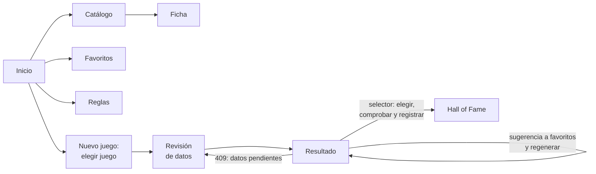

# Diseño de la web

Qué pantallas tiene la web, su ruta, qué hace cada una y qué endpoints usa, y cómo muestra los
errores. Los principios (no implementa reglas de negocio, cliente generado del contrato) están
en la [arquitectura](arquitectura.md#web-interfaz); cómo se usa cada pantalla, en el
[manual](../04-manual-usuario/web.md); cómo se arranca y se prueba, en
[Operación](../05-operacion/web.md); qué hay en `web/`, en su
[`README.md`](https://github.com/AlbertoMercado/pokemon-team-builder/blob/main/web/README.md).

## Pantallas

| Ruta | Pantalla | Qué hace | Requisitos | Endpoints |
|------|----------|----------|------------|-----------|
| `/` | Inicio | Con qué datos trabaja la aplicación, cuántos favoritos hay, el último juego completado y el acceso a **Nuevo juego**. Si no hay datos cargados (`503`), explica cómo cargarlos. | — | `GET /api/meta`, `/api/favorites`, `/api/hall-of-fame` |
| `/pokemon` | Catálogo | Lista con búsqueda (`?q=`), filtro por tipo (`?type=`) y por favoritos (`?favorite=`), y una estrella para añadir o quitar cada uno de favoritos. | RF-01, RF-03 | `GET /api/pokemon`, `PUT`/`DELETE /api/favorites/{pokemon}` |
| `/pokemon/:pokemon` | Ficha | Número, nombre, tipos actuales, línea evolutiva por etapas con el método de cada evolución en texto y la estrella de favorito. Desde la línea se navega a las otras formas. | RF-02, RF-03, RN-09 | `GET /api/pokemon/{pokemon}` |
| `/favoritos` | Favoritos | La lista con su número total, cada uno con sus tipos y un botón para quitarlo. Recuerda que cada favorito es la evolución a la que se quiere llegar. | RF-04 | `GET /api/favorites`, `DELETE` |
| `/reglas` | Reglas | Las reglas agrupadas por clase: las duras y de presencia con un interruptor si son configurables, las blandas con interruptor y peso de 0 a 10, y los mecanismos como información. Cada una con su descripción y un enlace a su regla del DDF. | RF-06, RF-07 | `GET /api/rules`, `PATCH /api/rules/{rule_id}` |
| `/juego` | Nuevo juego | Los juegos objetivo para elegir uno. | RF-05 | `GET /api/games` |
| `/juego/:game/revision` | Revisión de datos | Los datos que hay que confirmar: mecánicas y combates clave del juego y la llegada de cada favorito, con su propuesta. Se acepta todo de una vez o se confirma o corrige uno a uno (sí o no; en un combate clave, su equipo con un buscador de Pokémon). Los desactualizados se señalan. Con todo confirmado, lleva al resultado. | RF-15, RN-18 | `GET /review`, `PUT /review/{fact_key}`, `POST /review/accept-proposals` |
| `/juego/:game/resultado` | Resultado | Genera al entrar y con **Volver a generar**. Muestra el estado y su motivo, cada grupo de equipos con sus posiciones (las alternativas, como «Cloyster o Lapras»), el desglose por regla, los huecos con sus sugerencias (las no verificadas, señaladas) y un botón para añadir cada una a favoritos, los descartes agrupados por motivo, las reglas de presencia y los datos confirmados usados. Si la API responde `409`, lleva a la revisión. El **selector** permite elegir un equipo (una alternativa por posición y una sugerencia por hueco), lo comprueba y, si no tiene problemas, lo registra en el *Hall of Fame* con la fecha y las notas que el usuario indique; o descartar todos. | RF-08, RF-09, RF-10, RF-12, CA-53 | `POST /api/games/{game}/generations`, `POST /api/games/{game}/team-checks`, `POST /api/hall-of-fame` |
| `/hall-of-fame` | Hall of Fame | El recorrido en orden, con el último juego completado señalado y filtro por juego. Registrar a mano un equipo (por ejemplo, de un juego que no es juego objetivo), corregir y eliminar (con confirmación), con un buscador de Pokémon para el equipo. | RF-12, RF-13, RN-16 | `GET`, `POST`, `PATCH`, `DELETE /api/hall-of-fame`, `GET /api/games?all=true` |

En todas las pantallas, una barra de navegación lleva a Catálogo, Favoritos, Reglas, Nuevo
juego y *Hall of Fame*.

### Cómo se muestran los errores

| Respuesta | En la web |
|-----------|-----------|
| `503` | Un aviso en toda la aplicación: no hay datos cargados, con el comando de la [carga](../04-manual-usuario/cargar-datos.md). |
| `409` al generar | Se va a la revisión, que muestra lo pendiente. |
| `404`, `409` y `422` del resto | El mensaje de `detail` junto al formulario o la acción que lo produjo. |
| Error de red | Un aviso de que la API no responde, con el comando para arrancarla. |
