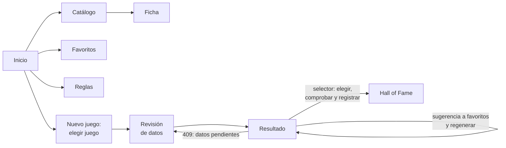

# Diseño de la web

Qué pantallas tiene la web, su ruta, qué hace cada una y qué endpoints usa, y cómo muestra los
errores. Los principios (no implementa reglas de negocio, cliente generado del contrato) están
en la [arquitectura](arquitectura.md#web-interfaz); cómo se usa cada pantalla, en el
[manual](../04-manual-usuario/web.md); cómo se arranca y se prueba, en
[Operación](../05-operacion/web.md); qué hay en `web/`, en su
[`README.md`](https://github.com/AlbertoMercado/pokemon-team-builder/blob/main/web/README.md).

## Pantallas

Qué hace cada pantalla, para quien la usa, está en el [manual](../04-manual-usuario/web.md); aquí, su ruta, qué
requisitos cubre y qué endpoints llama.

| Ruta | Pantalla | Requisitos | Endpoints |
|------|----------|------------|-----------|
| `/` | [Inicio](../04-manual-usuario/web.md#inicio) | — | `GET /api/meta`, `/api/favorites`, `/api/hall-of-fame` |
| `/pokemon` | [Catálogo](../04-manual-usuario/web.md#catalogo) | RF-01, RF-03 | `GET /api/pokemon`, `PUT`/`DELETE /api/favorites/{pokemon}` |
| `/pokemon/:pokemon` | [Ficha](../04-manual-usuario/web.md#ficha) | RF-02, RF-03, RN-09 | `GET /api/pokemon/{pokemon}` |
| `/favoritos` | [Favoritos](../04-manual-usuario/web.md#favoritos) | RF-04 | `GET /api/favorites`, `DELETE` |
| `/reglas` | [Reglas](../04-manual-usuario/web.md#configurar-las-reglas) | RF-06, RF-07 | `GET /api/rules`, `PATCH /api/rules/{rule_id}` |
| `/juego` | [Nuevo juego](../04-manual-usuario/web.md#elegir-el-juego) | RF-05 | `GET /api/games` |
| `/juego/:game/revision` | [Revisión de datos](../04-manual-usuario/web.md#revisar-los-datos) | RF-15, RN-18 | `GET /review`, `PUT /review/{fact_key}`, `POST /review/accept-proposals` |
| `/juego/:game/resultado` | [Resultado](../04-manual-usuario/web.md#ver-el-resultado) y [selector](../04-manual-usuario/web.md#elegir-el-equipo-y-registrarlo) | RF-08, RF-09, RF-10, RF-12, CA-53 | `POST /api/games/{game}/generations`, `POST /api/games/{game}/team-checks`, `POST /api/hall-of-fame` |
| `/hall-of-fame` | [Hall of Fame](../04-manual-usuario/web.md#hall-of-fame) | RF-12, RF-13, RN-16 | `GET`, `POST`, `PATCH`, `DELETE /api/hall-of-fame`, `GET /api/games?all=true` |

Comportamiento común:

- **La dirección guarda el estado**: los filtros del catálogo (`?q=`, `?type=`, `?favorite=`) y
  del *Hall of Fame* (`?game=`) van en la URL, así que se conservan al recargar o volver atrás.
- **El resultado se genera al entrar** y con **Volver a generar**; es una consulta sin estado que
  se repite al cambiar los favoritos o las confirmaciones. Si la API responde `409`, la web lleva
  a la revisión.

En todas las pantallas, una barra de navegación lleva a Catálogo, Favoritos, Reglas, Nuevo
juego y *Hall of Fame*.

### Cómo se muestran los errores

| Respuesta | En la web |
|-----------|-----------|
| `503` | Un aviso en toda la aplicación: no hay datos cargados, con el comando de la [carga](../04-manual-usuario/cargar-datos.md). |
| `409` al generar | Se va a la revisión, que muestra lo pendiente. |
| `404`, `409` y `422` del resto | El mensaje de `detail` junto al formulario o la acción que lo produjo. |
| Error de red | Un aviso de que la API no responde, con el comando para arrancarla. |
