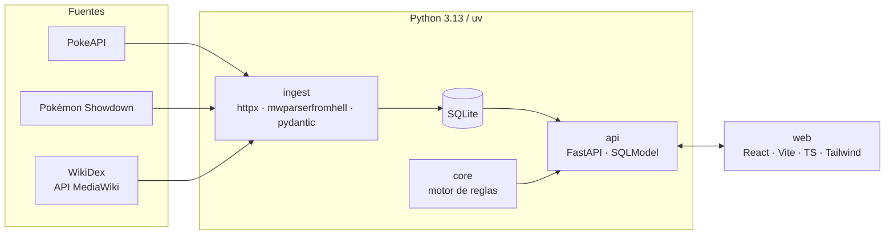

# 0001 · Stack tecnológico

- **Estado**: Aceptado
- **Fecha**: 2026-10-01
- **Decisores**: Alberto Mercado

## Contexto

El proyecto es una aplicación personal y sin ánimo de lucro, mantenida por una sola persona,
que genera equipos de 6 Pokémon a partir de una lista de favoritos, un juego objetivo y reglas
configurables (duras como filtros, blandas como puntuación ponderada).

Necesidades principales:

- Ingerir y normalizar datos de varias fuentes heterogéneas (APIs REST, ficheros de datos y
  wikitexto de una wiki MediaWiki), respetando los límites de uso de cada una.
- Un motor de cálculo testeable de forma exhaustiva, incluido testing basado en propiedades.
- Una interfaz web sencilla para configurar favoritos, juego y reglas.
- Bajo coste operativo: sin servidores de BD ni infraestructura compleja.
- Documentación versionada junto al código.

## Decisión

- **Backend e ingesta**: Python 3.13 gestionado con **uv**.
    - Ingesta: **httpx** (cliente HTTP con soporte async), **mwparserfromhell** (parseo de
      wikitexto) y **pydantic** (validación de los datos de entrada).
    - Motor (`core/`) puro, sin I/O.
    - API: **FastAPI** con **SQLModel** sobre **SQLite**.
- **Frontend**: **React + Vite + TypeScript + Tailwind**.
- **Calidad**: ruff, mypy (strict), pytest, hypothesis, pre-commit y gitleaks en Python;
  ESLint, Prettier, Vitest y Playwright en web.
- **Documentación**: docs-as-code en Markdown con **MkDocs Material** y diagramas **Mermaid**.
- **Fuentes de datos**: **PokeAPI**, datos de **Pokémon Showdown** y **WikiDex** (vía API
  MediaWiki, siempre con caché local y rate limit).

## Alternativas consideradas

### Base de datos: PostgreSQL

- ✅ Más potente y concurrente.
- ❌ Requiere un servidor; innecesario para un uso personal con datos de solo lectura tras la
  ingesta.

### Gestor de entorno: Poetry / pip + venv

- ✅ Ampliamente conocidos.
- ❌ uv es notablemente más rápido y unifica versión de Python, entorno y lockfile.

### Backend: Django

- ✅ Incluye ORM y administración.
- ❌ Más pesado de lo necesario; FastAPI + SQLModel comparte modelos con pydantic y genera
  OpenAPI automáticamente.

### Datos: scraping HTML de WikiDex

- ❌ Frágil ante cambios de maquetación y más costoso para el servidor. La API MediaWiki
  devuelve wikitexto estructurado y permite controlar el ritmo de peticiones.

## Consecuencias

### Positivas

- Un único lenguaje para ingesta, motor y API, con tipado estricto de extremo a extremo.
- Despliegue trivial: un fichero SQLite y un proceso.
- `core/` sin I/O permite tests basados en propiedades con hypothesis.

### Negativas / riesgos

- Dos ecosistemas (Python y Node) con herramientas de calidad separadas.
- Dependencia de fuentes externas cuyos formatos pueden cambiar; mitigado con validación
  pydantic y caché local.
- WikiDex es un proyecto comunitario: hay que respetar sus condiciones de uso y licencia
  (CC BY-NC-SA) y limitar la carga que generamos.

### Acciones derivadas

- [ ] Inicializar el proyecto `web/` con Vite y sus herramientas de calidad.
- [x] Configurar CI en `.github/workflows/`.
- [ ] Definir el modelo de datos en el DDT.
