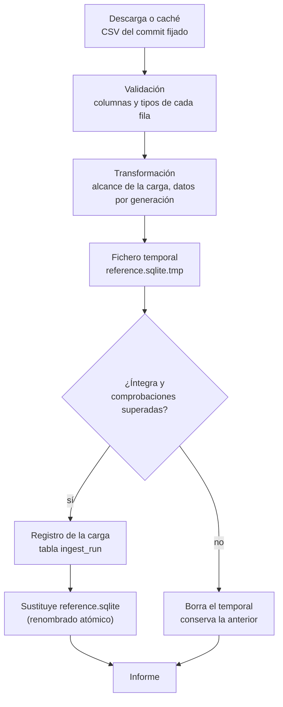

# Ingesta de datos

Cómo se construye `reference.sqlite`, la base de datos de referencia con los Pokémon, los
juegos y los combates clave ([RF-11](../01-ddf/requisitos-funcionales.md#rf-11)). La ingesta
es una tarea del administrador que se ejecuta de forma puntual, no al arrancar la aplicación.

!!! note "Estado"
    Implementadas las fases 2 a 4 del [plan de carga](../02-ddt/plan-carga-datos.md#fases):
    el comando, el informe, la sustitución segura, la fuente **PokeAPI** (especies, formas,
    tipos, eficacias, grupos huevo, evoluciones y juegos) y los
    **[datos curados](../02-ddt/datos-curados.md)** de Rojo Fuego y Verde Hoja (mecánicas,
    bebés de incienso, propuestas de llegada y lista de combates clave). Faltan los equipos
    de los combates clave, que se leen de WikiDex (fase 5): por eso `key_battle_pokemon` está
    vacía y los combates clave quedan pendientes.

## Uso

```bash
uv run python -m ingest                    # escribe data/reference.sqlite
uv run python -m ingest --offline          # sin descargas: solo con la caché
uv run python -m ingest --data-dir otra/   # escribe otra/reference.sqlite y usa otra/cache/
```

| Opción | Por defecto | Qué hace |
|--------|-------------|----------|
| `--data-dir DIR` | `data` | Directorio donde se escriben `reference.sqlite` y la caché de descargas. Se crea si no existe. |
| `--offline` | No | No descarga nada. Si falta algún fichero en la caché, la carga falla. |
| `-h`, `--help` | | Muestra la ayuda. |

| Código de salida | Significado |
|------------------|-------------|
| `0` | Carga completada: `reference.sqlite` se ha sustituido por la nueva. |
| `1` | La carga ha fallado: se conserva la base de datos anterior y el informe explica el motivo. También si un fichero de `data/curated/` no es válido: en ese caso no se llega a cargar nada. |

Después de una carga correcta hay que reiniciar la API para que lea la base de datos nueva.

### Primera ejecución y caché

La primera carga descarga 24 ficheros CSV (unos 900 kB) del repositorio de PokeAPI, del commit
fijado en `data/curated/pokeapi.yaml` ([ADR-0004](../03-adr/0004-pokeapi-volcado-csv.md)).
Se guardan en `<data-dir>/cache/pokeapi/<commit>/` y no se vuelven a descargar nunca: los
ficheros de un commit no cambian. Con la caché llena, la carga tarda menos de un segundo y
se puede repetir con `--offline`.

Las descargas se identifican con un `User-Agent` descriptivo del proyecto. Un fichero se
escribe primero como `.part` y se renombra al terminar, así que una descarga interrumpida
nunca deja un fichero a medias en la caché.

**Actualizar los datos de PokeAPI** es cambiar el commit de `data/curated/pokeapi.yaml`
(siempre el SHA completo, de 40 caracteres) en un PR y volver a ejecutar la ingesta.

## Qué hace



1. **Lectura**: cada fuente lee sus datos. La de PokeAPI descarga los CSV que falten en la
   caché y valida cada fila con pydantic: si falta una columna, un valor no tiene el tipo
   esperado o aparece una condición de evolución desconocida, la carga falla
   ([validación](../02-ddt/plan-carga-datos.md#ficheros-que-se-usan)).
2. **Transformación**: aplica el alcance de la carga (`ingest/scope.py`,
   [CA-11](../01-ddf/cuestiones-abiertas.md#resueltas)) y resuelve los datos de cada
   generación (tipos, eficacias, evoluciones). Las reglas están en el
   [plan de carga](../02-ddt/plan-carga-datos.md#revision-del-volcado-de-pokeapi).
3. **Fichero temporal**: crea `reference.sqlite.tmp` junto al destino, con todas las tablas
   del [modelo de datos](../02-ddt/modelo-datos.md). Si quedaba un temporal de una ejecución
   interrumpida, lo borra antes.
4. **Filas**: guarda las filas de todas las fuentes en una sola transacción, con las claves
   foráneas desactivadas mientras se insertan: así las fuentes pueden entregar las filas en
   cualquier orden.
5. **Integridad**: `PRAGMA integrity_check` y `PRAGMA foreign_key_check`. Cada referencia a
   una fila que no existe se informa con su tabla, su columna y su valor, p. ej.
   `species.evolves_from → species: happiny`. Todas las fuentes tienen que venir del mismo
   commit de PokeAPI.
6. **Comprobaciones de la carga** (`ingest/checks.py`): cantidades esperadas y casos
   conocidos de la primera carga ([detalle](../02-ddt/plan-carga-datos.md#comprobaciones-de-la-carga)).
   Si alguna falla, la carga se rechaza.
7. **Registro**: guarda una fila en `ingest_run` con el inicio y el fin de la carga, el commit
   de PokeAPI, los juegos cargados y el número de filas por tabla.
8. **Sustitución**: renombra el temporal sobre `reference.sqlite` en una sola operación
   atómica. No hay ningún momento en que el fichero esté a medio escribir.
9. **Informe**: lo muestra en la terminal.

Si algo falla en los pasos 1 a 7, se borra el temporal y `reference.sqlite` queda como estaba.

## Informe

Informe real de la carga del 2026-10-04, con el commit `bc92d3b` de PokeAPI y los datos
curados de Rojo Fuego y Verde Hoja:

```text
Carga de data/reference.sqlite
Filas cargadas por tabla:
  generation                3
  species                 386
  type                     17
  version_group             7
  game                     11
  pokemon                 386
  species_egg_group       504
  type_efficacy           803
  evolution_step          940
  game_mechanic             4
  game_pokemon           1930
  key_battle               30
  pokemon_type           1131
  key_battle_pokemon        0
Datos revisables por origen:
  game_mechanic        inferred 4
  game_pokemon         automatic 1930, inferred 772, pending 1158
  key_battle           pending 30
Comprobaciones superadas: 9
Carga completada.
```

- **Filas cargadas por tabla**: en orden de dependencias. No incluye `ingest_run`.
- **Datos revisables por origen**: para cada tabla con columnas de origen, cuántos valores
  son automáticos, inferidos o pendientes. Los inferidos y los pendientes los tendrá que
  confirmar el usuario antes de generar ([RN-18](../01-ddf/reglas-negocio.md#rn-18)). En
  `game_pokemon` hay dos valores por fila: la existencia (automática) y la llegada (inferida
  en Rojo Fuego y Verde Hoja, pendiente en Rubí, Zafiro y Esmeralda). Los combates clave
  quedan pendientes hasta que se carguen sus equipos (fase 5).
- **Comprobaciones superadas**: número de comprobaciones de la carga que se han cumplido.

Ejemplos de cargas fallidas:

```text
Carga de data/reference.sqlite
ERROR: la carga ha fallado; se conserva la base de datos anterior.
  - IntegrityCheckError: 7 referencias a filas que no existen (species.evolves_from → species: bonsly, budew, chingling, happiny, mantyke …)
```

```text
Carga de data/reference.sqlite
ERROR: la carga ha fallado; se conserva la base de datos anterior.
  - Comprobación fallida: species: 50 filas, se esperaban 386
```

## Implementación

Código en `ingest/` ([estructura del código](../02-ddt/estructura-codigo.md)):

| Fichero | Qué hace |
|---------|----------|
| `__main__.py` | Punto de entrada de `python -m ingest`. |
| `cli.py` | Opciones de la línea de comandos y fuentes de una carga completa (`default_sources`). |
| `scope.py` | Alcance de la carga: generaciones cargadas, generaciones con juego objetivo, primera generación con crianza y grupos de versiones excluidos ([CA-11](../01-ddf/cuestiones-abiertas.md#resueltas)). |
| `load.py` | `build_reference(sources, target, checks)`: fichero temporal, filas, integridad, comprobaciones, registro y sustitución. |
| `checks.py` | Comprobaciones de la primera carga: cantidades y casos conocidos. |
| `report.py` | `LoadReport`: recuentos, comprobaciones superadas, errores y texto del informe. |
| `sources/__init__.py` | `Source`, la interfaz de una fuente: `name`, `pokeapi_commit` y `rows()`, que entrega filas ya validadas. |
| `sources/curated/__init__.py` | `read_curated`, que lee y valida los ficheros de `data/curated/`, y `CuratedSource`, la fuente de las mecánicas y los combates clave. |
| `sources/curated/schemas.py` | Un modelo pydantic por fichero curado ([datos curados](../02-ddt/datos-curados.md)). |
| `sources/pokeapi/__init__.py` | `PokeapiCsvSource`, la fuente de PokeAPI. Recibe los datos curados para los bebés de incienso y las propuestas de llegada. |
| `sources/pokeapi/download.py` | `CsvCache`: descarga con caché de los CSV de un commit. |
| `sources/pokeapi/rows.py` | Un modelo pydantic por fichero CSV y `read_rows`, que valida cada fila. |
| `sources/pokeapi/transform.py` | Funciones puras que convierten las filas de PokeAPI en filas de `reference.sqlite`. |

Tests en `tests/ingest/`:

- `test_load.py`: la carga con fuentes en memoria (filas desordenadas, registro, recuento por
  origen, referencias rotas, fuentes que fallan) y el CLI.
- `test_pokeapi.py`: la fuente de PokeAPI sobre un
  [extracto real del volcado](https://github.com/AlbertoMercado/pokemon-team-builder/tree/main/tests/ingest/fixtures/pokeapi)
  con unas 45 especies elegidas por sus casos especiales: caché, validación, juegos, formas,
  crianza, tipos y eficacias por generación, evoluciones y existencia.
- `test_curated.py`: los ficheros curados reales del repositorio, sus esquemas, la fuente
  de datos curados y el error del CLI con un fichero inválido.

Ningún test usa la red: `tests/conftest.py` hace fallar cualquier petición HTTP.

## Pendiente

- **Fuentes**: WikiDex (fase 5), para los equipos de los combates clave.
- **Claves de `user.sqlite`**: cuando exista, la carga comprobará que los favoritos, el *Hall
  of Fame* y las confirmaciones siguen apuntando a datos que existen
  ([arquitectura](../02-ddt/arquitectura.md#ingest-carga-de-datos)).
- **Elegir juegos**: cargar solo algunos juegos objetivo, cuando haya más de una generación.
