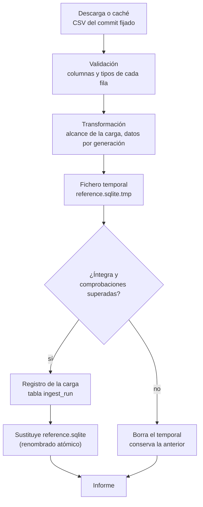
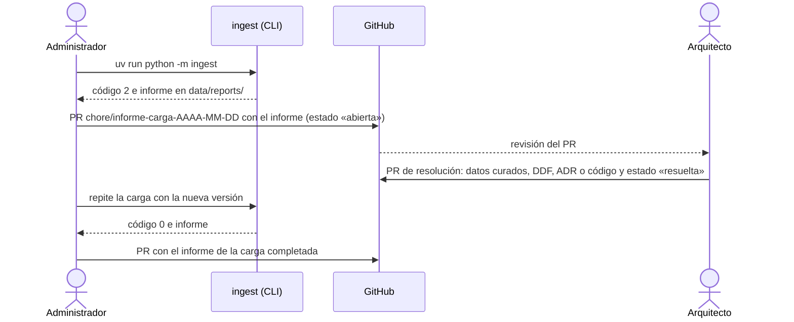

# Ingesta de datos

Cómo se construye `reference.sqlite`, la base de datos de referencia con los Pokémon, los
juegos y los combates clave ([RF-11](../01-ddf/requisitos-funcionales.md#rf-11)). La ingesta
es una tarea del administrador que se ejecuta de forma puntual, no al arrancar la aplicación.

!!! note "Estado"
    Implementadas las fases 2 a 5 del [plan de carga](../02-ddt/plan-carga-datos.md#fases):
    el comando, el informe, la sustitución segura y las tres fuentes: **PokeAPI** (especies,
    formas, tipos, eficacias, grupos huevo, evoluciones y juegos), los
    **[datos curados](../02-ddt/datos-curados.md)** de Rojo Fuego y Verde Hoja y los equipos
    de sus combates clave desde **WikiDex**. Rubí, Zafiro y Esmeralda se completan en la
    fase 6.

## Uso

```bash
uv run python -m ingest                    # escribe data/reference.sqlite
uv run python -m ingest --offline          # sin descargas: solo con la caché
uv run python -m ingest --data-dir otra/   # escribe otra/reference.sqlite y usa otra/cache/
```

| Opción | Por defecto | Qué hace |
|--------|-------------|----------|
| `--data-dir DIR` | `data` | Directorio donde se escriben `reference.sqlite` y la caché de descargas. Se crea si no existe. |
| `--offline` | No | No descarga nada, ni de PokeAPI ni de WikiDex. Si falta algún fichero en la caché, la carga falla. |
| `-h`, `--help` | | Muestra la ayuda. |

| Código de salida | Significado |
|------------------|-------------|
| `0` | Carga completada: `reference.sqlite` se ha sustituido por la nueva. |
| `1` | La carga ha fallado: se conserva la base de datos anterior y el informe explica el motivo. También si un fichero de `data/curated/` no es válido: en ese caso no se llega a cargar nada. |

Después de una carga correcta hay que reiniciar la API para que lea la base de datos nueva.

### Primera ejecución y caché

La primera carga descarga 24 ficheros CSV (unos 900 kB) del repositorio de PokeAPI, del commit
fijado en `data/curated/pokeapi.yaml` ([ADR-0004](../03-adr/0004-pokeapi-volcado-csv.md)).
Se guardan en `<data-dir>/cache/pokeapi/<commit>/` y no se vuelven a descargar nunca: los
ficheros de un commit no cambian. Con la caché llena, la carga tarda menos de un segundo y
se puede repetir con `--offline`.

Las descargas se identifican con un `User-Agent` descriptivo del proyecto. Un fichero se
escribe primero como `.part` y se renombra al terminar, así que una descarga interrumpida
nunca deja un fichero a medias en la caché.

**Actualizar los datos de PokeAPI** es cambiar el commit de `data/curated/pokeapi.yaml`
(siempre el SHA completo, de 40 caracteres) en un PR y volver a ejecutar la ingesta.

### WikiDex

Los equipos de los combates clave se leen de la página de WikiDex de cada entrenador, con su
API MediaWiki (`action=parse&prop=wikitext`). WikiDex es una wiki comunitaria, así que la
ingesta la trata con cuidado:

- **Caché permanente**: cada página se descarga una sola vez y se guarda en
  `<data-dir>/cache/wikidex/<título>.json`, con su revisión. Las siguientes cargas no hacen
  ninguna petición.
- **Límite de peticiones**: como mucho una por segundo. La primera carga de Rojo Fuego y Verde
  Hoja descarga 13 páginas en unos 13 segundos.
- **`User-Agent` descriptivo** del proyecto, como con PokeAPI.

**Actualizar un equipo** (si WikiDex lo corrige): borrar su página de la caché y volver a
ejecutar la ingesta. La revisión usada queda en `key_battle.source_revision`.

**Licencia**: el contenido de WikiDex es [CC BY-NC-SA 3.0](https://creativecommons.org/licenses/by-nc-sa/3.0/deed.es).
La aplicación es sin ánimo de lucro y guarda la página y la revisión de cada equipo para
mostrar la atribución ([ADR-0004](../03-adr/0004-pokeapi-volcado-csv.md)).

## Qué hace



1. **Lectura**: cada fuente lee sus datos. La de PokeAPI descarga los CSV que falten en la
   caché y valida cada fila con pydantic: si falta una columna, un valor no tiene el tipo
   esperado o aparece una condición de evolución desconocida, la carga falla
   ([validación](../02-ddt/plan-carga-datos.md#ficheros-que-se-usan)).
2. **Transformación**: aplica el alcance de la carga (`ingest/scope.py`,
   [CA-11](../01-ddf/cuestiones-abiertas.md#resueltas)) y resuelve los datos de cada
   generación (tipos, eficacias, evoluciones). Las reglas están en el
   [plan de carga](../02-ddt/plan-carga-datos.md#revision-del-volcado-de-pokeapi).
3. **Fichero temporal**: crea `reference.sqlite.tmp` junto al destino, con todas las tablas
   del [modelo de datos](../02-ddt/modelo-datos.md). Si quedaba un temporal de una ejecución
   interrumpida, lo borra antes.
4. **Filas**: guarda las filas de todas las fuentes en una sola transacción, con las claves
   foráneas desactivadas mientras se insertan: así las fuentes pueden entregar las filas en
   cualquier orden.
5. **Integridad**: `PRAGMA integrity_check` y `PRAGMA foreign_key_check`. Cada referencia a
   una fila que no existe se informa con su tabla, su columna y su valor, p. ej.
   `species.evolves_from → species: happiny`. Todas las fuentes tienen que venir del mismo
   commit de PokeAPI.
6. **Comprobaciones de la carga** (`ingest/checks.py`): cantidades esperadas y casos
   conocidos de la primera carga ([detalle](../02-ddt/plan-carga-datos.md#comprobaciones-de-la-carga)).
   Si alguna falla, la carga se rechaza.
7. **Registro**: guarda una fila en `ingest_run` con el inicio y el fin de la carga, el commit
   de PokeAPI, los juegos cargados y el número de filas por tabla.
8. **Sustitución**: renombra el temporal sobre `reference.sqlite` en una sola operación
   atómica. No hay ningún momento en que el fichero esté a medio escribir.
9. **Informe**: lo muestra en la terminal.

Si algo falla en los pasos 1 a 7, se borra el temporal y `reference.sqlite` queda como estaba.

## Informe

Informe real de la carga del 2026-10-04, con el commit `bc92d3b` de PokeAPI, los datos
curados y los equipos de WikiDex de Rojo Fuego y Verde Hoja:

```text
Carga de data/reference.sqlite
Filas cargadas por tabla:
  generation                3
  species                 386
  type                     17
  version_group             7
  game                     11
  pokemon                 386
  species_egg_group       504
  type_efficacy           803
  evolution_step          940
  game_mechanic             4
  game_pokemon           1930
  key_battle               26
  pokemon_type           1131
  key_battle_pokemon      100
Datos revisables por origen:
  game_mechanic        inferred 4
  game_pokemon         automatic 1930, inferred 772, pending 1158
  key_battle           automatic 26
Comprobaciones superadas: 9
Carga completada.
```

- **Filas cargadas por tabla**: en orden de dependencias. No incluye `ingest_run`.
- **Datos revisables por origen**: para cada tabla con columnas de origen, cuántos valores
  son automáticos, inferidos o pendientes. Los inferidos y los pendientes los tendrá que
  confirmar el usuario antes de generar ([RN-18](../01-ddf/reglas-negocio.md#rn-18)). En
  `game_pokemon` hay dos valores por fila: la existencia (automática) y la llegada (inferida
  en Rojo Fuego y Verde Hoja, pendiente en Rubí, Zafiro y Esmeralda). Los combates clave
  son automáticos.
- **Comprobaciones superadas**: número de comprobaciones de la carga que se han cumplido.

Ejemplos de cargas fallidas:

```text
Carga de data/reference.sqlite
ERROR: la carga ha fallado; se conserva la base de datos anterior.
  - IntegrityCheckError: 7 referencias a filas que no existen (species.evolves_from → species: bonsly, budew, chingling, happiny, mantyke …)
```

```text
Carga de data/reference.sqlite
ERROR: la carga ha fallado; se conserva la base de datos anterior.
  - Comprobación fallida: species: 50 filas, se esperaban 386
```

## Carga bloqueada

!!! note "Pendiente de implementar"
    Diseño de la fase 7 del [plan de carga](../02-ddt/plan-carga-datos.md#fases)
    ([ADR-0008](../03-adr/0008-cargas-bloqueadas.md)). Hasta entonces, estos casos son errores
    que cortan la carga.

Una carga queda **bloqueada** cuando encuentra algo que la aplicación no sabe tratar y que no
se puede resolver sin decidir cómo lo interpretan las reglas
([RF-16](../01-ddf/requisitos-funcionales.md#rf-16)). A diferencia de un error, no se corta:
sigue hasta el final para recoger **todos** los bloqueos, no sustituye `reference.sqlite` y
termina con el código de salida **2**.

| Código de salida | Significado | Qué hacer |
|------------------|-------------|-----------|
| 0 | Carga completada. | Nada; si es la primera carga de una versión nueva, registrar el informe. |
| 1 | Error: red, ficheros, validación de filas, integridad o comprobaciones. | Leer el error, corregir y repetir. |
| 2 | Carga bloqueada: hace falta que el arquitecto revise el modelo. | Seguir el [protocolo](#protocolo-de-registro). |

### Bloqueos

| Bloqueo (`kind`) | Cuándo | Qué decide el arquitecto |
|------------------|--------|--------------------------|
| `unknown_evolution_trigger` | Un disparador de evolución que no está en [`evolution_methods.yaml`](../02-ddt/datos-curados.md#evolution_methodsyaml) ([CA-42](../01-ddf/cuestiones-abiertas.md#resueltas)). | Su categoría para RN-15 y RN-20. |
| `unknown_evolution_condition` | Una condición de evolución que no está en ese fichero. | Igual. |
| `missing_level_moves` | Un paso exige conocer un movimiento y no se cargan los movimientos por nivel ([CA-45](../01-ddf/cuestiones-abiertas.md#resueltas)). | Activar la carga de `level_move`. |
| `target_game_without_key_battles` | Un juego objetivo sin combates clave ([CA-46](../01-ddf/cuestiones-abiertas.md#resueltas)). | Completar su lista curada o, si no tiene, cómo puntúa RN-17. |
| `wikidex_team_not_found` | La lista curada de combates no encuentra un equipo en WikiDex. | Corregir la página, la sección o el rótulo en `key_battles/*.yaml`. |

### Informe

La CLI escribe dos ficheros con el mismo nombre en `data/reports/`, que está fuera de git:
`AAAA-MM-DDTHHMMSS-<estado>.json` y `.md`, donde `<estado>` es `completada` o `bloqueada`. El
JSON es la fuente; el Markdown se genera a partir de él para leerlo o pegarlo en un PR.

```json
{
  "format": 1,
  "status": "blocked",
  "started_at": "2026-11-02T10:15:00",
  "finished_at": "2026-11-02T10:16:40",
  "pokeapi_commit": "bc92d3b",
  "games": ["firered", "leafgreen", "ruby", "sapphire", "emerald"],
  "blockers": [
    {
      "kind": "unknown_evolution_trigger",
      "subject": "spin",
      "occurrences": ["milcery → alcremie (sword-shield)"],
      "rules": ["RN-15", "RN-20"],
      "action": "Catalogar el disparador en data/curated/evolution_methods.yaml",
      "template": "spin: {category: ???, reason: ???}"
    }
  ],
  "summary": {"rows": {}, "origins": {}, "checks_passed": 9}
}
```

El Markdown tiene una cabecera (fecha, estado, commit de PokeAPI y juegos), un resumen con
el número de bloqueos de cada tipo y una sección por bloqueo con lo mismo que el JSON y la
plantilla en un bloque de código, lista para copiar. Si la carga se completa, incluye el
informe de siempre (filas, orígenes y comprobaciones).

El informe no lleva rutas absolutas del equipo ni contenido copiado de las fuentes: de
WikiDex solo nombra la página y la sección, por su licencia
([ADR-0004](../03-adr/0004-pokeapi-volcado-csv.md)).

### Protocolo de registro

La CLI **nunca** escribe en git. Los informes se registran después, a mano, en
[Informes de carga](informes-carga/index.md), que es el historial de las cargas que importan.



1. **Carga bloqueada** (código 2). El administrador crea una rama
   `chore/informe-carga-AAAA-MM-DD` desde `main` y:
    1. Copia los dos ficheros a `docs/05-operacion/informes-carga/`, con el nombre
       `AAAA-MM-DD-bloqueada-<commit-de-pokeapi>.md` y `.json`.
    2. Añade una fila a la tabla de [Informes de carga](informes-carga/index.md) con estado
       **abierta**.
    3. Revisa que no haya rutas locales ni datos personales; gitleaks también lo comprueba.
    4. Abre el PR `chore(ingesta): registrar la carga bloqueada del AAAA-MM-DD`, con el
       resumen del informe en la descripción. El PR es el aviso al arquitecto y se fusiona sin
       esperar a la solución, para que el informe quede en `main`.
2. **Resolución**. El arquitecto revisa el informe y prepara uno o varios PR (`fix/`, `feat/`
   o `docs/`) que resuelven los bloqueos: completa los datos curados con las plantillas y,
   si hace falta, cambia el DDF (nuevos `CA-XX`), un ADR o el código. El PR que resuelve el
   último bloqueo cambia el estado de la fila a **resuelta** y enlaza los PR de la solución.
3. **Nueva carga**. Con la nueva versión en `main`, el administrador repite la carga. Si
   vuelve a quedar bloqueada, se registra como un informe nuevo (paso 1).
4. **Carga completada** (código 0). Se registra su informe, con estado **completada**, en un
   PR `chore(ingesta): registrar la carga del AAAA-MM-DD`, si es la que cierra un bloqueo o la
   primera con un commit de PokeAPI o unos juegos distintos. Las cargas que solo repiten la
   anterior no se registran.

## Consultar los datos

`reference.sqlite` es un fichero SQLite normal: se puede abrir con cualquier herramienta de
SQLite, solo para leer. Las tablas y columnas están explicadas en el
[modelo de datos](../02-ddt/modelo-datos.md).

### En el navegador, con Datasette (recomendado)

```bash
uvx datasette data/reference.sqlite
```

Abre <http://127.0.0.1:8001>: todas las tablas con filtros por columna y orden, un recuadro
para escribir consultas SQL y exportación a CSV o JSON. `uvx` ejecuta
[Datasette](https://datasette.io/) aparte, sin instalarlo en el proyecto. Se para con
`Ctrl+C`.

### Con una aplicación de escritorio

- [DB Browser for SQLite](https://sqlitebrowser.org/): `brew install --cask db-browser-for-sqlite`
  y abrir el fichero.
- VS Code, con una extensión de SQLite (p. ej., *SQLite Viewer*): basta con abrir el fichero
  desde el explorador.

### En la terminal, con `sqlite3`

`sqlite3` viene con macOS:

```bash
sqlite3 -header -column data/reference.sqlite
```

`.tables` lista las tablas, `.schema <tabla>` muestra sus columnas y `.quit` sale. Los valores
sí/no se ven como `1` y `0`.

### Consultas de ejemplo

Tipos de unos Pokémon en la 3.ª generación ([RN-10](../01-ddf/reglas-negocio.md#rn-10)):

```sql
SELECT s.dex_number AS num, p.name_es AS nombre, group_concat(t.name_es, '/') AS tipos
FROM pokemon p
JOIN species s ON s.slug = p.species
JOIN pokemon_type pt ON pt.pokemon = p.slug AND pt.generation = 3
JOIN type t ON t.slug = pt.type
WHERE p.slug IN ('bulbasaur', 'clefairy', 'magnemite')
GROUP BY p.slug ORDER BY s.dex_number;
```

```text
num  nombre     tipos
---  ---------  ---------------
  1  Bulbasaur  Planta/Veneno
 35  Clefairy   Normal
 81  Magnemite  Eléctrico/Acero
```

Pokémon que, según la propuesta, no pueden llegar a Rojo Fuego antes de completarlo
([CA-28](../01-ddf/cuestiones-abiertas.md#abiertas)). Son 246: los 11 de Kanto que nacen como
bebé de la 2.ª generación y todos los de la 2.ª y la 3.ª:

```sql
SELECT p.name_es
FROM game_pokemon g JOIN pokemon p ON p.slug = g.pokemon
WHERE g.game = 'firered' AND NOT g.can_arrive;
```

Combates clave de Rojo Fuego con sus equipos ([RN-17](../01-ddf/reglas-negocio.md#rn-17)):

```sql
SELECT b."order", b.trainer_name, group_concat(p.pokemon || ' ' || p.level, ', ') AS equipo
FROM key_battle b JOIN key_battle_pokemon p ON p.battle = b.slug
WHERE b.game = 'firered'
GROUP BY b.slug ORDER BY b."order";
```

```text
order  trainer_name    equipo
-----  --------------  ---------------------------------
    1  Brock           geodude 12, onix 14
    2  Misty           staryu 18, starmie 21
    3  Teniente Surge  voltorb 21, pikachu 18, raichu 24
  …
```

Cómo evolucionan unos Pokémon en Rojo Fuego y Verde Hoja
([RN-15](../01-ddf/reglas-negocio.md#rn-15)):

```sql
SELECT from_pokemon, to_pokemon, trigger, conditions
FROM evolution_step
WHERE version_group = 'firered-leafgreen' AND to_pokemon IN ('gengar', 'slowking', 'raichu');
```

```text
from_pokemon  to_pokemon  trigger   conditions
------------  ----------  --------  ---------------------------------
pikachu       raichu      use-item  {"trigger_item": "thunder-stone"}
haunter       gengar      trade     {}
slowpoke      slowking    trade     {"held_item": "kings-rock"}
```

Datos que tendrá que confirmar el usuario: las mecánicas de un juego
([RN-18](../01-ddf/reglas-negocio.md#rn-18)):

```sql
SELECT fact_key, value, origin FROM game_mechanic WHERE game = 'firered';
```

Con qué datos se construyó el fichero:

```sql
SELECT pokeapi_commit, games, started_at, finished_at FROM ingest_run;
```

## Implementación

Código en `ingest/` ([estructura del código](../02-ddt/estructura-codigo.md)):

| Fichero | Qué hace |
|---------|----------|
| `__main__.py` | Punto de entrada de `python -m ingest`. |
| `cli.py` | Opciones de la línea de comandos y fuentes de una carga completa (`default_sources`). |
| `scope.py` | Alcance de la carga: generaciones cargadas, generaciones con juego objetivo, primera generación con crianza y grupos de versiones excluidos ([CA-11](../01-ddf/cuestiones-abiertas.md#resueltas)). |
| `load.py` | `build_reference(sources, target, checks)`: fichero temporal, filas, integridad, comprobaciones, registro y sustitución. |
| `checks.py` | Comprobaciones de la primera carga: cantidades y casos conocidos. |
| `report.py` | `LoadReport`: recuentos, comprobaciones superadas, errores y texto del informe. |
| `sources/__init__.py` | `Source`, la interfaz de una fuente: `name`, `pokeapi_commit` y `rows()`, que entrega filas ya validadas. |
| `sources/curated/__init__.py` | `read_curated`, que lee y valida los ficheros de `data/curated/`, y `CuratedSource`, la fuente de las mecánicas y los combates clave. |
| `sources/curated/schemas.py` | Un modelo pydantic por fichero curado ([datos curados](../02-ddt/datos-curados.md)). |
| `sources/wikidex/__init__.py` | `WikidexSource`: lee el equipo de cada combate de la lista curada, traduce los nombres, quita el inicial del rival y, si hay variantes, se queda con los Pokémon comunes. |
| `sources/wikidex/fetch.py` | `PageCache`: descarga con caché y límite de peticiones de las páginas de WikiDex. |
| `sources/wikidex/parse.py` | Busca la sección, el rótulo y las plantillas `{{Equipo}}` en el wikitexto. |
| `sources/pokeapi/index.py` | Índice de los Pokémon cargados por su nombre en español, para traducir los nombres de WikiDex. |
| `sources/pokeapi/__init__.py` | `PokeapiCsvSource`, la fuente de PokeAPI. Recibe los datos curados para los bebés de incienso y las propuestas de llegada. |
| `sources/pokeapi/download.py` | `CsvCache`: descarga con caché de los CSV de un commit. |
| `sources/pokeapi/rows.py` | Un modelo pydantic por fichero CSV y `read_rows`, que valida cada fila. |
| `sources/pokeapi/transform.py` | Funciones puras que convierten las filas de PokeAPI en filas de `reference.sqlite`. |

Tests en `tests/ingest/`:

- `test_load.py`: la carga con fuentes en memoria (filas desordenadas, registro, recuento por
  origen, referencias rotas, fuentes que fallan) y el CLI.
- `test_pokeapi.py`: la fuente de PokeAPI sobre un
  [extracto real del volcado](https://github.com/AlbertoMercado/pokemon-team-builder/tree/main/tests/ingest/fixtures/pokeapi)
  con unas 45 especies elegidas por sus casos especiales: caché, validación, juegos, formas,
  crianza, tipos y eficacias por generación, evoluciones y existencia.
- `test_curated.py`: los ficheros curados reales del repositorio, sus esquemas, la fuente
  de datos curados y el error del CLI con un fichero inválido.
- `test_wikidex.py`: la fuente de WikiDex sobre páginas reales recortadas: caché y límite
  de peticiones, respuesta de la API, rótulos, variantes y Pokémon comunes, desambiguación y
  filas de los combates.

Ningún test usa la red: `tests/conftest.py` hace fallar cualquier petición HTTP.

## Pendiente

- **Rubí, Zafiro y Esmeralda** (fase 6): mecánicas, regla de llegada y combates clave.
- **Claves de `user.sqlite`**: cuando exista, la carga comprobará que los favoritos, el *Hall
  of Fame* y las confirmaciones siguen apuntando a datos que existen
  ([arquitectura](../02-ddt/arquitectura.md#ingest-carga-de-datos)).
- **Elegir juegos**: cargar solo algunos juegos objetivo, cuando haya más de una generación.
- **Cargas bloqueadas** (fase 7): bloqueos, informe en JSON y Markdown y código de salida 2
  ([carga bloqueada](#carga-bloqueada)).
