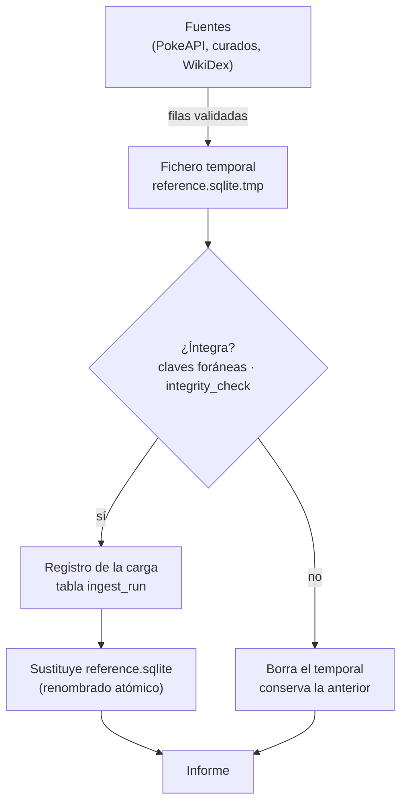

# Ingesta de datos

Cómo se construye `reference.sqlite`, la base de datos de referencia con los Pokémon, los
juegos y los combates clave ([RF-11](../01-ddf/requisitos-funcionales.md#rf-11)). La ingesta
es una tarea del administrador que se ejecuta de forma puntual, no al arrancar la aplicación.

!!! note "Estado"
    El comando, el informe y la sustitución segura de la base de datos están implementados
    (fase 2 del [plan de carga](../02-ddt/plan-carga-datos.md#fases)). Todavía no hay fuentes
    de datos: la carga crea una base de datos con todas las tablas vacías. PokeAPI, los datos
    curados y WikiDex se añaden en las fases 3 a 5.

## Uso

```bash
uv run python -m ingest                    # escribe data/reference.sqlite
uv run python -m ingest --data-dir otra/   # escribe otra/reference.sqlite
```

| Opción | Por defecto | Qué hace |
|--------|-------------|----------|
| `--data-dir DIR` | `data` | Directorio donde se escribe `reference.sqlite`. Se crea si no existe. |
| `-h`, `--help` | | Muestra la ayuda. |

| Código de salida | Significado |
|------------------|-------------|
| `0` | Carga completada: `reference.sqlite` se ha sustituido por la nueva. |
| `1` | La carga ha fallado: se conserva la base de datos anterior y el informe explica el motivo. |

Después de una carga correcta hay que reiniciar la API para que lea la base de datos nueva.

## Qué hace



1. **Fichero temporal**: crea `reference.sqlite.tmp` junto al destino, con todas las tablas
   del [modelo de datos](../02-ddt/modelo-datos.md). Si quedaba un temporal de una ejecución
   interrumpida, lo borra antes.
2. **Filas**: guarda las filas de todas las fuentes en una sola transacción. Las claves
   foráneas se comprueban al confirmar la transacción (`PRAGMA defer_foreign_keys`), así que
   las fuentes pueden entregar las filas en cualquier orden, pero una referencia rota hace
   fallar la carga.
3. **Comprobaciones**: `PRAGMA integrity_check` y `PRAGMA foreign_key_check`. Todas las
   fuentes tienen que venir del mismo commit de PokeAPI.
4. **Registro**: guarda una fila en `ingest_run` con el inicio y el fin de la carga, el commit
   de PokeAPI, los juegos cargados y el número de filas por tabla.
5. **Sustitución**: renombra el temporal sobre `reference.sqlite` en una sola operación
   atómica. No hay ningún momento en que el fichero esté a medio escribir.
6. **Informe**: lo muestra en la terminal.

Si algo falla en los pasos 1 a 4, se borra el temporal y `reference.sqlite` queda como estaba.

## Informe

Ejemplo ilustrativo de una carga correcta (abreviado; las cifras de origen no son de una carga
real):

```text
Carga de data/reference.sqlite
Filas cargadas por tabla:
  generation                3
  species                 386
  ...
Datos revisables por origen:
  game_pokemon         automatic 1930, inferred 151, pending 1779
Carga completada.
```

- **Filas cargadas por tabla**: en orden de dependencias. No incluye `ingest_run`.
- **Datos revisables por origen**: para cada tabla con columnas de origen, cuántos valores
  son automáticos, inferidos o pendientes. Los inferidos y los pendientes los tendrá que
  confirmar el usuario antes de generar ([RN-18](../01-ddf/reglas-negocio.md#rn-18)).

Ejemplo de una carga fallida:

```text
Carga de data/reference.sqlite
ERROR: la carga ha fallado; se conserva la base de datos anterior.
  - IntegrityError: (sqlite3.IntegrityError) FOREIGN KEY constraint failed
```

## Implementación

Código en `ingest/` ([estructura del código](../02-ddt/estructura-codigo.md)):

| Fichero | Qué hace |
|---------|----------|
| `__main__.py` | Punto de entrada de `python -m ingest`. |
| `cli.py` | Opciones de la línea de comandos y lista de fuentes de una carga completa (`default_sources`). |
| `load.py` | `build_reference(sources, target)`: fichero temporal, filas, comprobaciones, registro y sustitución. |
| `report.py` | `LoadReport`: recuentos, errores y texto del informe. |
| `sources/__init__.py` | `Source`, la interfaz de una fuente: `name`, `pokeapi_commit` y `rows()`, que entrega filas ya validadas. |

Los tests están en `tests/ingest/test_load.py`. Usan fuentes en memoria y comprueban que las
filas se pueden entregar desordenadas, que se registra la carga, el recuento por origen y que
una referencia rota o una fuente que falla conservan la base de datos anterior.

## Pendiente

- **Fuentes**: PokeAPI (fase 3), datos curados (fase 4) y WikiDex (fase 5).
- **Claves de `user.sqlite`**: cuando exista, la carga comprobará que los favoritos, el *Hall
  of Fame* y las confirmaciones siguen apuntando a datos que existen
  ([arquitectura](../02-ddt/arquitectura.md#ingest-carga-de-datos)).
- **Elegir juegos**: cargar solo algunos juegos objetivo, cuando haya más de una generación.
