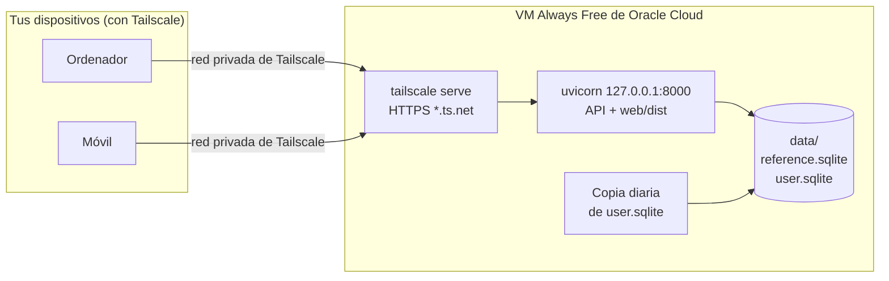

# Puesta en producción y explotación

Cómo tener la aplicación siempre disponible, sin arrancarla en el ordenador, con **coste 0**:
qué opciones hay, cuál se recomienda y cómo instalarla, mantenerla y hacer copias de seguridad.
La decisión está en [ADR-0009](../03-adr/0009-despliegue-vm-gratuita-tailscale.md).

!!! warning "Propuesta"
    La opción está pendiente de elegir ([ADR-0009](../03-adr/0009-despliegue-vm-gratuita-tailscale.md),
    *Propuesto*) y la guía todavía no se ha seguido de principio a fin. Los planes gratuitos se
    revisaron el **2026-10-05** y cambian a menudo: compruébalos antes de empezar.

## Qué necesita la aplicación

| Necesidad | Detalle |
|-----------|---------|
| Un proceso | `uvicorn` sirve la API y la web compilada ([un solo proceso](web.md#un-solo-proceso)). Poca CPU y memoria: un usuario y cálculos de menos de un segundo. |
| Disco persistente | `reference.sqlite` (los datos de los juegos, se puede regenerar con la [ingesta](ingesta.md)) y **`user.sqlite`** (favoritos, reglas, confirmaciones y *Hall of Fame*), que **no se puede regenerar**. Pocos MB en total. |
| Python 3.13 y uv | Para la API. `uv sync --no-dev` instala solo lo necesario para ejecutarla. |
| Node 24 | Solo para compilar la web (`npm run build`). Se compila en el ordenador y se copia `web/dist`, así que el servidor no lo necesita. |
| Acceso privado | La aplicación **no tiene autenticación**: es de un solo usuario. Si se publica en Internet tal cual, cualquiera puede cambiar los datos. |

Cualquier opción debe cumplir: coste 0, disco que sobreviva a reinicios y despliegues, y acceso
solo para el usuario.

## Opciones evaluadas

Revisadas el 2026-10-05.

| Opción | Coste | Disco persistente | Pros | Contras | Veredicto |
|--------|-------|-------------------|------|---------|-----------|
| **Oracle Cloud, VM *Always Free*** (Ampere A1) | 0 | Sí: 200 GB de volúmenes gratis | Hasta 2 OCPU y 12 GB de memoria ARM; región en Madrid; sin límite práctico de tráfico para este uso. | Pide tarjeta. Reclama las instancias inactivas (CPU, red y memoria por debajo del 20 % durante 7 días), salvo con la cuenta en *Pay As You Go*. Puede no haber capacidad de A1 en la región. Los límites se redujeron en 2026. | **Recomendada** |
| **Google Cloud, VM e2-micro *Always Free*** | 0 | Sí: 30 GB estándar | No reclama por inactividad. | Solo en regiones de EE. UU.; 1 GB de memoria; 1 GB de salida de datos al mes; pide cuenta de facturación con tarjeta. | Alternativa |
| **Equipo propio** (Raspberry Pi, ordenador antiguo) | 0 si ya se tiene, más la electricidad | Sí | Sin cuentas en la nube ni tarjeta; los datos en casa. | Comprar el equipo si no se tiene; depende de la luz y la conexión de casa. | Alternativa |
| Render (plan gratuito) | 0 | **No** en el plan gratuito | Despliegue desde GitHub. | Se duerme a los 15 min y tarda en despertar; se pierde `user.sqlite`. | Descartada |
| Fly.io | De pago | De pago | — | Sin plan gratuito para cuentas nuevas (solo una prueba). | Descartada |
| Koyeb | De pago | No en instancias gratuitas | — | Las instancias gratuitas no admiten volúmenes y el plan gratuito desaparece para cuentas nuevas. | Descartada |
| Hugging Face Spaces | 0 | **No**: disco efímero; el persistente es de pago | — | Se pierde `user.sqlite` al reiniciar o pausar. | Descartada |
| Sin servidor (Cloud Run, Vercel, Workers) | 0 | **No** | — | Sistema de ficheros efímero: habría que cambiar SQLite ([ADR-0003](../03-adr/0003-dos-bases-de-datos-sqlite.md)). | Descartada |

### Cómo se accede

| Opción | Coste | Pros | Contras | Veredicto |
|--------|-------|------|---------|-----------|
| **Tailscale** (plan *Personal*) | 0 | Red privada entre tus dispositivos: la aplicación no se expone a Internet. `tailscale serve` le da HTTPS con un nombre `*.ts.net`. Sin dominio ni puertos abiertos. Hasta 6 usuarios y dispositivos ilimitados. | Hay que instalar Tailscale en cada dispositivo (ordenador, móvil). | **Recomendada** |
| Cloudflare Tunnel con Cloudflare Access | El túnel y Access (hasta 50 usuarios) son gratis; **el dominio no** | Acceso desde cualquier navegador, con inicio de sesión. | Exige un dominio gestionado por Cloudflare, con coste anual. | Mejora opcional |
| Publicar el puerto en Internet | 0 | — | Sin autenticación, cualquiera podría cambiar los datos. | **Descartada** |

## Recomendación

**Oracle Cloud *Always Free* + Tailscale**, con la aplicación como servicio de `systemd`:



- Coste 0, siempre encendida, con más recursos de los que necesita y región en Madrid.
- La aplicación escucha solo en `127.0.0.1`: no se abre ningún puerto a Internet.
- No cambia nada del código.

Si Oracle no tiene capacidad de A1 en la región o no se quiere usar, los mismos pasos sirven
para la **VM e2-micro de Google Cloud** o para un **equipo propio** con Linux.

## Instalación

Pasos para una VM con Ubuntu Server 24.04 (en Oracle, la imagen *Canonical Ubuntu* para ARM).
Los comandos se ejecutan en la VM salvo que se indique otra cosa.

### 1. Crear la máquina virtual

1. Crear la cuenta de Oracle Cloud y elegir como **región de casa** la más cercana (Madrid).
   No se puede cambiar después.
2. Crear una instancia con forma **VM.Standard.A1.Flex** (por ejemplo, 1 OCPU y 6 GB de
   memoria, dentro de los límites gratuitos) y la imagen de Ubuntu, con la clave SSH de tu
   ordenador. Usar solo recursos marcados como *Always Free*.
3. Pasar la cuenta a *Pay As You Go* para que no se reclame la instancia por inactividad, y
   crear un **presupuesto con alerta** (por ejemplo, de 1 €) para enterarte de cualquier gasto.

### 2. Tailscale

```bash
curl -fsSL https://tailscale.com/install.sh | sh
sudo tailscale up --ssh          # inicia sesión con tu cuenta; --ssh permite entrar por Tailscale
```

En la consola de Tailscale, activa **MagicDNS** y los **certificados HTTPS**. Instala Tailscale
en tus dispositivos con la misma cuenta. Cuando entres a la VM por Tailscale
(`ssh ubuntu@<nombre-de-la-vm>`), puedes cerrar el puerto 22 en la lista de seguridad de Oracle.

### 3. Sistema y herramientas

```bash
sudo apt update && sudo apt full-upgrade -y
sudo apt install -y git sqlite3 unattended-upgrades   # actualizaciones de seguridad automáticas
sudo useradd --system --create-home --home-dir /opt/ptb --shell /usr/sbin/nologin ptb
sudo mkdir -p /var/lib/pokemon-team-builder/backups
sudo chown -R ptb:ptb /var/lib/pokemon-team-builder
```

Instala [uv](https://docs.astral.sh/uv/reference/installer/) para todo el sistema, de forma que
también lo encuentre el usuario `ptb`:

```bash
curl -LsSf https://astral.sh/uv/install.sh | sudo env UV_INSTALL_DIR=/usr/local/bin sh
```

### 4. Código, web y datos

```bash
sudo -u ptb git clone https://github.com/AlbertoMercado/pokemon-team-builder.git /opt/ptb/app
cd /opt/ptb/app
sudo -u ptb uv sync --locked --no-dev     # Python 3.13 y solo las dependencias de ejecución
```

La web se compila en tu ordenador, que ya tiene Node, y se copia a la VM:

```bash
# En tu ordenador, desde la raíz del proyecto y en la misma versión que la VM
cd web && npm ci && npm run build && cd ..
rsync -a --delete web/dist/ ubuntu@<nombre-de-la-vm>:/tmp/dist/
# En la VM
sudo rsync -a --delete --chown=ptb:ptb /tmp/dist/ /opt/ptb/app/web/dist/
```

`reference.sqlite` se copia desde el ordenador, donde ya está cargado y revisado. Es más rápido
que repetir la ingesta en la VM y evita una carga bloqueada
([ADR-0008](../03-adr/0008-cargas-bloqueadas.md)):

```bash
# En tu ordenador, desde la raíz del proyecto
scp data/reference.sqlite ubuntu@<nombre-de-la-vm>:/tmp/
# En la VM
sudo install -o ptb -g ptb -m 640 /tmp/reference.sqlite /var/lib/pokemon-team-builder/
```

Para llevarte tus favoritos y tu *Hall of Fame*, copia también `data/user.sqlite` de la misma
forma. Si no, la API crea uno nuevo al arrancar.

### 5. Servicio

`/etc/systemd/system/pokemon-team-builder.service`:

```ini
[Unit]
Description=pokemon-team-builder
After=network-online.target
Wants=network-online.target

[Service]
User=ptb
WorkingDirectory=/opt/ptb/app
Environment=PTB_DATA_DIR=/var/lib/pokemon-team-builder
ExecStart=/opt/ptb/app/.venv/bin/uvicorn api.main:app --host 127.0.0.1 --port 8000
Restart=on-failure

[Install]
WantedBy=multi-user.target
```

```bash
sudo systemctl daemon-reload
sudo systemctl enable --now pokemon-team-builder
curl -s http://127.0.0.1:8000/api/meta      # versión de la aplicación y de los datos
```

- Sin `--reload`: es para desarrollo.
- `PTB_WEB_DIR` no hace falta: por defecto es `web/dist`, relativo a `WorkingDirectory`.
- La API aplica las migraciones de `user.sqlite` al arrancar ([migraciones](api.md#migraciones)).

### 6. Acceso con HTTPS

```bash
sudo tailscale serve --bg 8000
tailscale serve status        # muestra la dirección https://<nombre-de-la-vm>.<tu-tailnet>.ts.net
```

`--bg` mantiene la configuración tras los reinicios. Abre esa dirección desde cualquier
dispositivo con Tailscale; en el móvil, puedes añadirla a la pantalla de inicio.

## Copias de seguridad

`user.sqlite` es lo único que no se puede regenerar. Haz una copia diaria con la orden `.backup`
de SQLite, que es segura aunque la aplicación esté escribiendo:

`/etc/systemd/system/ptb-backup.service`:

```ini
[Unit]
Description=Copia de seguridad de user.sqlite

[Service]
Type=oneshot
User=ptb
ExecStart=/bin/sh -c 'sqlite3 /var/lib/pokemon-team-builder/user.sqlite ".backup /var/lib/pokemon-team-builder/backups/user-$(date +%%F).sqlite" && find /var/lib/pokemon-team-builder/backups -name "user-*.sqlite" -mtime +30 -delete'
```

`/etc/systemd/system/ptb-backup.timer`:

```ini
[Unit]
Description=Copia diaria de user.sqlite

[Timer]
OnCalendar=daily
Persistent=true

[Install]
WantedBy=timers.target
```

```bash
sudo systemctl daemon-reload
sudo systemctl enable --now ptb-backup.timer
```

Guarda las copias de los últimos 30 días en la VM. Para tener una **fuera de la VM**, descárgala
de vez en cuando a tu ordenador por Tailscale:

```bash
scp "ubuntu@<nombre-de-la-vm>:/var/lib/pokemon-team-builder/backups/user-*.sqlite" ~/copias-ptb/
```

Para **restaurar**: para el servicio, copia la copia elegida como `user.sqlite` (propietario
`ptb`) y arráncalo de nuevo.

## Actualizar la aplicación

```bash
cd /opt/ptb/app
sudo -u ptb git pull
sudo -u ptb uv sync --locked --no-dev
```

Compila la web en tu ordenador con la misma versión y cópiala como en la
[instalación](#4-codigo-web-y-datos); después, reinicia:

```bash
sudo systemctl restart pokemon-team-builder
```

Si cambian los datos de los juegos, vuelve a copiar `reference.sqlite` desde tu ordenador
después de la [ingesta](ingesta.md) y reinicia el servicio: la API sigue con la carga anterior
hasta reiniciarla ([Arrancar la API](api.md#directorio-de-datos)). Antes de sustituirla, la
ingesta comprueba que tus datos de usuario siguen apuntando a datos que existen.

## Supervisión y problemas

| Qué mirar | Cómo |
|-----------|------|
| ¿Está en marcha? | `systemctl status pokemon-team-builder` y `curl -s http://127.0.0.1:8000/api/meta`. |
| Registros | `journalctl -u pokemon-team-builder -e`. |
| ¿Se hacen las copias? | `systemctl list-timers ptb-backup.timer` y `ls /var/lib/pokemon-team-builder/backups`. |
| ¿Hay gasto en la nube? | La alerta de presupuesto de Oracle. Revisa de vez en cuando que la instancia siga siendo *Always Free*. |

| Síntoma | Causa y solución |
|---------|------------------|
| La dirección `*.ts.net` no carga | El dispositivo no está conectado a Tailscale, o falta `tailscale serve --bg 8000`. |
| Aviso «No hay datos cargados» | Falta `reference.sqlite` en `/var/lib/pokemon-team-builder`. |
| `/` responde `{"detail":"Not Found"}` | Falta `web/dist` en la VM: compílala en tu ordenador, cópiala y reinicia el servicio. |
| Oracle avisa de que va a reclamar la instancia | La cuenta no está en *Pay As You Go*: cámbiala o vuelve a crearla. |

## Riesgos

- **Cambios en los planes gratuitos**: Oracle redujo los límites de A1 en 2026. Si deja de ser
  gratis, los mismos pasos sirven para otra VM o para un equipo propio.
- **Gasto accidental**: con *Pay As You Go*, crear algo que no sea *Always Free* tiene coste.
  La alerta de presupuesto lo avisa.
- **Pérdida de datos**: si se pierde la VM, se pierde lo que no esté en la copia fuera de ella.
- **Seguridad**: la VM solo es accesible por Tailscale, pero hay que mantener el sistema
  actualizado (`unattended-upgrades`).

## Referencias

- [Oracle Cloud: recursos *Always Free*](https://docs.oracle.com/en-us/iaas/Content/FreeTier/freetier_topic-Always_Free_Resources.htm)
- [Google Cloud: niveles gratuitos](https://cloud.google.com/free/docs/free-cloud-features)
- [Render: plan gratuito](https://render.com/docs/free)
- [Fly.io: precios](https://fly.io/docs/about/pricing/)
- [Tailscale: precios](https://tailscale.com/pricing) y [`tailscale serve`](https://tailscale.com/kb/1242/tailscale-serve)
- [Cloudflare Zero Trust: planes](https://www.cloudflare.com/plans/zero-trust-services/)
