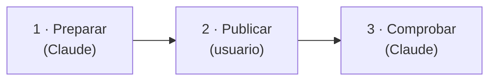

# Versiones

Cómo se numeran las versiones de la aplicación y cómo se publica una nueva. Los cambios de cada
versión están en el [`CHANGELOG.md`](https://github.com/AlbertoMercado/pokemon-team-builder/blob/main/CHANGELOG.md)
y en las [*releases* de GitHub](https://github.com/AlbertoMercado/pokemon-team-builder/releases).

## Numeración

El proyecto sigue [SemVer](https://semver.org/lang/es/) (`MAYOR.MENOR.PARCHE`) desde la
**1.0.0**, la primera versión estable, que ya se usa con datos reales en `user.sqlite`.

| Sube | Cuándo | Ejemplos |
|------|--------|----------|
| **MAYOR** | Un cambio incompatible para quien usa la aplicación. | Quitar o cambiar un endpoint o un campo de la API; un cambio de `user.sqlite` que no se puede migrar sin perder datos; quitar una opción de la CLI de ingesta. |
| **MENOR** | Funcionalidad nueva compatible. | Un endpoint, una pantalla o una regla RN-XX nuevos; un juego objetivo nuevo; una migración de Alembic que conserva los datos. |
| **PARCHE** | Correcciones compatibles. | Un error del motor, de la web o de la ingesta; textos; dependencias de la aplicación ([dependencias](dependencias.md#criterio)). |

Los cambios que solo tocan la documentación o la CI no necesitan versión.

La versión vive en `pyproject.toml` (la lee la API y la devuelve en `GET /api/meta` y en el
OpenAPI) y se repite en `web/package.json`. `uv.lock` y `web/package-lock.json` se actualizan
con ella.

## Publicar una versión

La publicación se reparte entre Claude Code y el usuario. Basta con pedir a Claude que publique
una versión: la skill del proyecto `publicar-version` lo pone a seguir este protocolo, que es su
única fuente.



Si el usuario dice que ya ha ejecutado los comandos de publicación, se pasa directamente a la
fase 3.

### 1. Preparar (Claude)

Todo lo que no publica nada fuera de la rama:

1. **Punto de partida**: `git switch main && git pull` y `git fetch --tags --prune`. El árbol
   tiene que estar limpio; si no, Claude para y pregunta. La última versión es
   `git describe --tags --abbrev=0` (y la de `pyproject.toml`), y los cambios desde entonces,
   `git log --oneline --first-parent <última>..main` y **Sin publicar** del `CHANGELOG.md`. Si no
   hay cambios, no hay versión.
2. **Número**: el que diga el usuario. Si no lo dice, Claude lo deduce con la
   [numeración](#numeracion), explica por qué y espera su confirmación.
3. **Rama `chore/release-X.Y.Z`** y la versión en todos sus sitios:

    ```bash
    # pyproject.toml: version = "X.Y.Z"
    uv lock
    cd web && npm version X.Y.Z --no-git-tag-version   # también package-lock.json
    ```

4. **`CHANGELOG.md`**: pasa lo de **Sin publicar** a `## [X.Y.Z] - AAAA-MM-DD` (fecha de hoy) y
   deja **Sin publicar** vacía. Completa lo que falte con los PR fusionados desde la última
   etiqueta, agrupado en *Añadido*, *Cambiado*, *Corregido*, *Eliminado* y *Pendiente*, citando
   `#PR`, `RF-XX` y `RN-XX`. Si hay que repetir la carga de datos, dilo al principio de la sección.
   En una versión MAYOR, explica qué se rompe y cómo actualizar. Actualiza los enlaces del final
   (`[Sin publicar]` compara desde `vX.Y.Z`; añade `[X.Y.Z]`). La sintaxis de MkDocs
   (`!!! note`) no vale: el CHANGELOG son también las notas de la *release* de GitHub.
5. **Otras apariciones de la versión anterior**: el ejemplo de `GET /api/meta` del
   [manual de la API](../04-manual-usuario/api.md#comprobar-con-que-datos-trabaja) y lo que
   encuentre
   `grep -rn "<anterior>" --exclude-dir={node_modules,.venv,.git,site,data} .`
6. **Comprobaciones locales**: `uv run pytest`, `uv run mypy`, `uv run lint-imports`,
   `uv run mkdocs build --strict` y `uv run pre-commit run --all-files`; si cambia algo de la web,
   también `npm run typecheck` y `npm run test` en `web/`. Si algo falla, se arregla antes de
   seguir.
7. **Commit y PR**: `chore: publicar la versión X.Y.Z`; en la descripción, qué incluye y qué
   falta después de fusionar. Claude espera a la CI (`gh pr checks <n> --watch`): los cinco
   jobs tienen que pasar.
8. **Notas de la *release***: comprueba que el `awk` de la fase 2 extrae justo la sección de la
   versión.

### 2. Publicar (usuario)

Fusionar en `main`, etiquetar y crear la *release* son acciones visibles fuera del ordenador,
así que las ejecuta el usuario; Claude **no** las ejecuta. Le da estos comandos con el PR y la
versión ya sustituidos y con el prefijo `!`, que los ejecuta en la propia sesión, y le pide que
avise al terminar:

```bash
! gh pr merge <n> --merge --delete-branch && git switch main && git pull && git tag -a vX.Y.Z -m "Versión X.Y.Z" && git push origin vX.Y.Z
```

```bash
! awk '/^## \[X.Y.Z\]/{f=1;next} /^## \[|^\[Sin publicar\]:/{f=0} f' CHANGELOG.md > /tmp/notas-X.Y.Z.md && gh release create vX.Y.Z --title "vX.Y.Z" --notes-file /tmp/notas-X.Y.Z.md --latest
```

El `awk` copia a las notas solo la sección de la versión: se detiene en la sección siguiente o
en los enlaces del final.

### 3. Comprobar (Claude)

Cuando el usuario avisa de que ha ejecutado los comandos:

```bash
git fetch --tags --prune
git status -sb                                   # main igual que origin/main
gh pr view <n> --json state,mergeCommit          # MERGED
git cat-file -t vX.Y.Z                           # tag (anotada)
git rev-parse vX.Y.Z^{commit} origin/main        # el mismo commit
git ls-remote --tags origin vX.Y.Z               # está en el remoto
git show vX.Y.Z:pyproject.toml | grep '^version' # X.Y.Z
gh release view vX.Y.Z --json tagName,isDraft,isPrerelease,url,body
gh release list --limit 3                        # vX.Y.Z es Latest
git branch -a | grep release                     # la rama ya no existe
gh run list --branch main --limit 1              # CI del merge; esperar con gh run watch
```

Las notas de la *release* tienen que ser la sección `X.Y.Z` del `CHANGELOG.md` (ni vacías ni las
de otra versión) y la CI de `main` tiene que terminar en verde. Claude lo resume en una tabla
(comprobación → resultado). Si algo está mal, explica cómo corregirlo y, si hace falta un comando
de publicación, se lo da al usuario como en la fase 2. Por último, le recuerda comprobar
`GET /api/meta` en su API y que lo nuevo se anota en **Sin publicar**.

### Entre versiones

Cada PR con cambios para el usuario (`feat`, `fix`, cambios de la API, de `user.sqlite` o de
la CLI) añade una línea en **Sin publicar** del `CHANGELOG.md`. Así la sección de la versión
siguiente sale casi hecha.

## Actualizar a una versión nueva

Antes de actualizar, **haz copia de `data/user.sqlite`**: es la única base de datos que no se
puede regenerar ([arrancar la API](api.md#base-de-datos-del-usuario-usersqlite)). Después:

```bash
git switch main && git pull     # o git checkout vX.Y.Z
uv sync
cd web && npm ci && npm run build
```

Al arrancar, la API aplica las migraciones pendientes de `user.sqlite`. Si el `CHANGELOG.md`
indica que hay que repetir la carga, ejecuta antes la [ingesta](ingesta.md). En el servidor,
sigue la [puesta en producción](puesta-en-produccion.md#actualizar-la-aplicacion).
