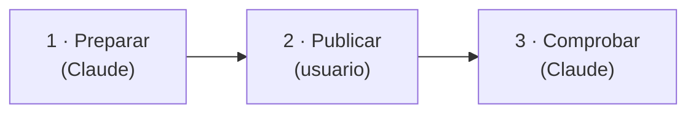

# Versiones

Cómo se numeran las versiones de la aplicación y cómo se publica una nueva. Los cambios de cada
versión están en el [`CHANGELOG.md`](https://github.com/AlbertoMercado/pokemon-team-builder/blob/main/CHANGELOG.md)
y en las [*releases* de GitHub](https://github.com/AlbertoMercado/pokemon-team-builder/releases).

## Numeración

El proyecto sigue [SemVer](https://semver.org/lang/es/) (`MAYOR.MENOR.PARCHE`) desde la
**1.0.0**, la primera versión estable, que ya se usa con datos reales en `user.sqlite`.

| Sube | Cuándo | Ejemplos |
|------|--------|----------|
| **MAYOR** | Un cambio incompatible para quien usa la aplicación. | Quitar o cambiar un endpoint o un campo de la API; un cambio de `user.sqlite` que no se puede migrar sin perder datos; quitar una opción de la CLI de ingesta. |
| **MENOR** | Funcionalidad nueva compatible. | Un endpoint, una pantalla o una regla RN-XX nuevos; un juego objetivo nuevo; una migración de Alembic que conserva los datos. |
| **PARCHE** | Correcciones compatibles. | Un error del motor, de la web o de la ingesta; textos; dependencias. |

Los cambios que solo tocan la documentación o la CI no necesitan versión.

La versión vive en `pyproject.toml` (la lee la API y la devuelve en `GET /api/meta` y en el
OpenAPI) y se repite en `web/package.json`. `uv.lock` y `web/package-lock.json` se actualizan
con ella.

## Publicar una versión

La publicación se reparte entre Claude Code y el usuario. Basta con pedir a Claude que publique
una versión: la skill del proyecto
[`publicar-version`](https://github.com/AlbertoMercado/pokemon-team-builder/blob/main/.claude/skills/publicar-version/SKILL.md)
le dice qué hacer en cada fase.



### 1. Preparar (Claude)

Todo lo que no publica nada fuera de la rama:

1. Parte de `main` al día y sin cambios, y localiza la última etiqueta y los cambios desde
   entonces. Si no hay cambios, no hay versión.
2. Decide el número con la [numeración](#numeracion). Si el usuario no lo ha dicho, Claude lo
   propone, explica por qué y espera su confirmación.
3. Crea la rama `chore/release-X.Y.Z` y sube la versión:

    ```bash
    # pyproject.toml: version = "X.Y.Z"
    uv lock
    cd web && npm version X.Y.Z --no-git-tag-version
    ```

4. En `CHANGELOG.md`, pasa lo de **Sin publicar** a una sección `[X.Y.Z] - AAAA-MM-DD`,
   complétala con los PR fusionados desde la última versión y actualiza los enlaces del final.
5. Actualiza el ejemplo de `GET /api/meta` del [manual de la API](../04-manual-usuario/api.md)
   y cualquier otra aparición de la versión anterior.
6. Pasa las comprobaciones locales (`pytest`, `mypy`, `lint-imports`, `mkdocs build --strict`
   y `pre-commit`).
7. Hace el commit `chore: publicar la versión X.Y.Z`, abre el PR y espera a que pase la CI.

### 2. Publicar (usuario)

Fusionar en `main`, etiquetar y crear la *release* son acciones visibles fuera del ordenador,
así que las ejecuta el usuario. Claude le da los comandos con el PR y la versión ya
sustituidos; con el prefijo `!` se ejecutan en la propia sesión:

```bash
gh pr merge <n> --merge --delete-branch && git switch main && git pull \
  && git tag -a vX.Y.Z -m "Versión X.Y.Z" && git push origin vX.Y.Z
awk '/^## \[X.Y.Z\]/{f=1;next} /^## \[|^\[Sin publicar\]:/{f=0} f' CHANGELOG.md > /tmp/notas-X.Y.Z.md \
  && gh release create vX.Y.Z --title "vX.Y.Z" --notes-file /tmp/notas-X.Y.Z.md --latest
```

El `awk` copia a las notas solo la sección de la versión: se detiene en la sección siguiente o
en los enlaces del final.

### 3. Comprobar (Claude)

Cuando el usuario avisa de que ha ejecutado los comandos, Claude comprueba y resume en una
tabla que:

- El PR está fusionado, la rama borrada y `main` local igual que `origin/main`.
- La etiqueta `vX.Y.Z` es anotada, apunta al último commit de `main`, está en el remoto y su
  `pyproject.toml` tiene la versión `X.Y.Z`.
- La *release* está publicada (ni borrador ni prerelease), es la *Latest* y sus notas son la
  sección `X.Y.Z` del `CHANGELOG.md`.
- La CI de `main` después de fusionar termina en verde.

Si algo falla, explica cómo corregirlo. Por último, recuerda comprobar `GET /api/meta` en la
API.

### Entre versiones

Cada PR con cambios para el usuario (`feat`, `fix`, cambios de la API, de `user.sqlite` o de
la CLI) añade una línea en **Sin publicar** del `CHANGELOG.md`. Así la sección de la versión
siguiente sale casi hecha.

## Actualizar a una versión nueva

Antes de actualizar, **haz copia de `data/user.sqlite`**: es la única base de datos que no se
puede regenerar ([arrancar la API](api.md#base-de-datos-del-usuario-usersqlite)). Después:

```bash
git switch main && git pull     # o git checkout vX.Y.Z
uv sync
cd web && npm ci && npm run build
```

Al arrancar, la API aplica las migraciones pendientes de `user.sqlite`. Si el `CHANGELOG.md`
indica que hay que repetir la carga, ejecuta antes la [ingesta](ingesta.md). En el servidor,
sigue la [puesta en producción](puesta-en-produccion.md#actualizar-la-aplicacion).
