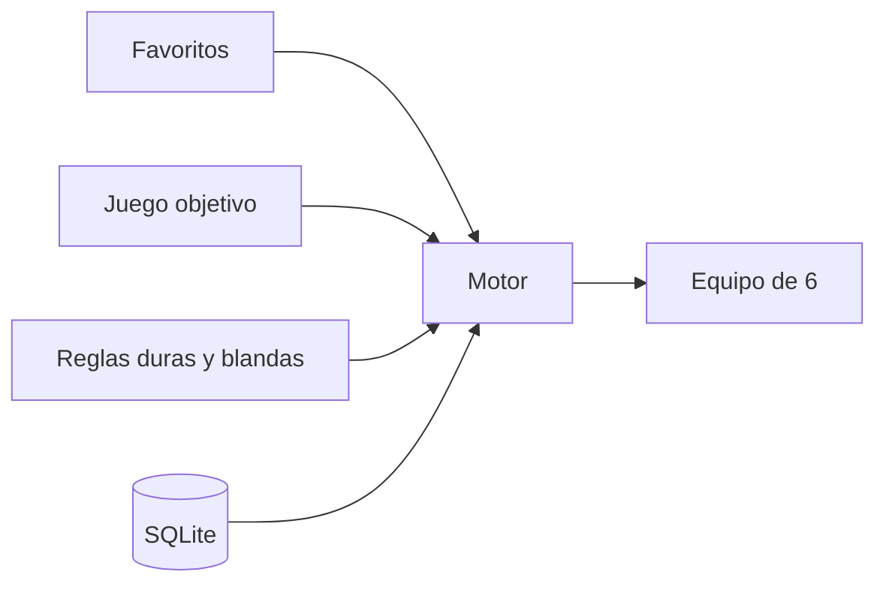

# Pokémon Team Builder

Aplicación personal y sin ánimo de lucro que, a partir de una lista de Pokémon favoritos y un
juego objetivo, genera un equipo de 6 según reglas configurables:

- **Reglas duras**: filtros que descartan candidatos (p. ej., que el Pokémon exista en el juego
  objetivo).
- **Reglas blandas**: criterios con peso que puntúan cada equipo candidato.

## Documentación

- [Diseño funcional (DDF)](01-ddf/index.md)
- [Diseño técnico (DDT)](02-ddt/index.md)
- [Decisiones de arquitectura (ADR)](03-adr/index.md)
- [Manual de usuario](04-manual-usuario/index.md)
- [Operación](05-operacion/index.md)
- [Historial](06-historial/index.md): planes ya ejecutados, que no se mantienen
